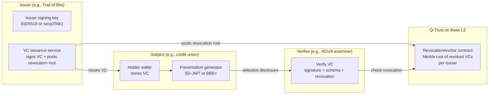
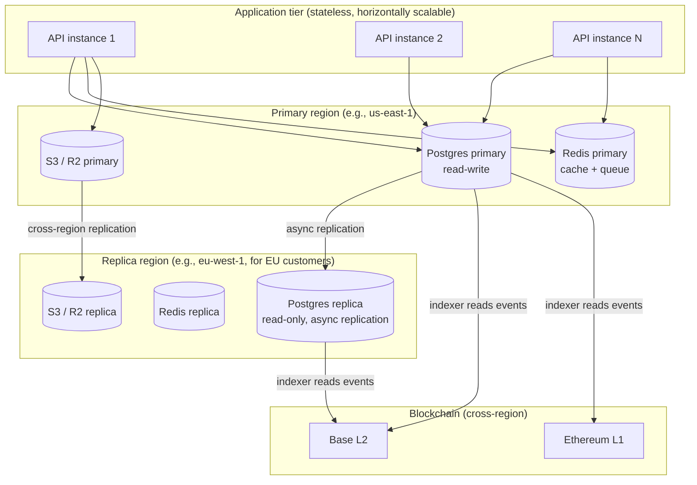
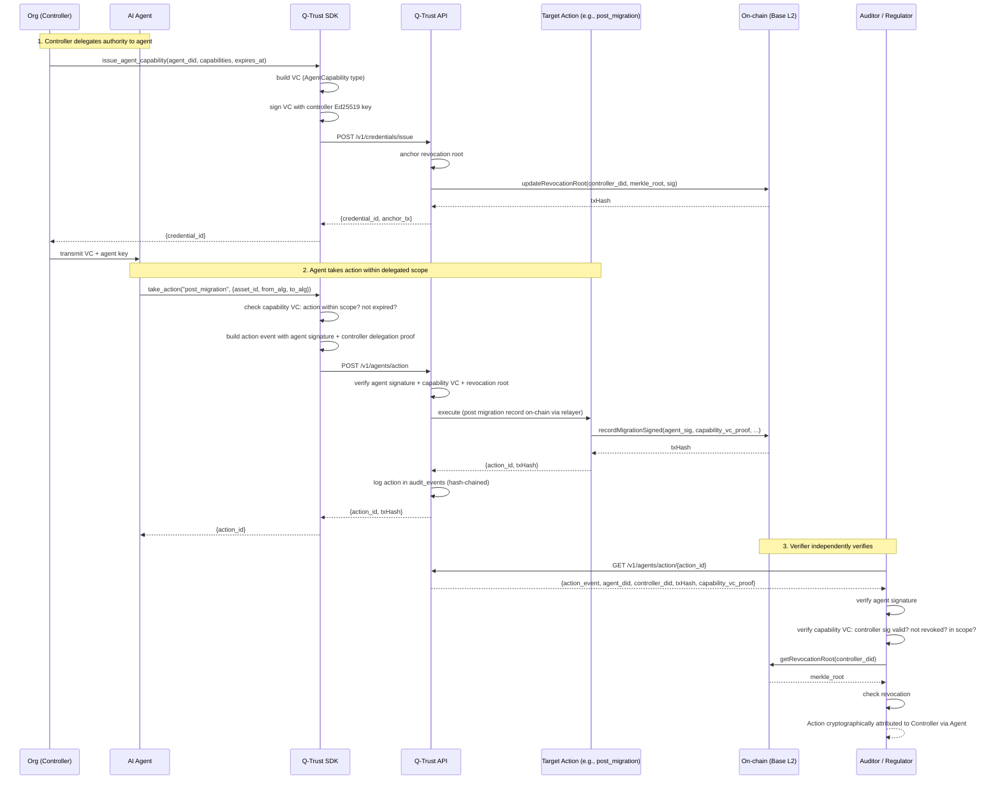
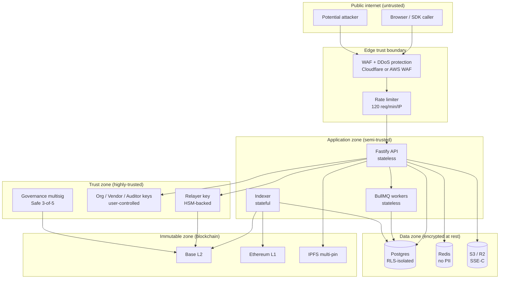
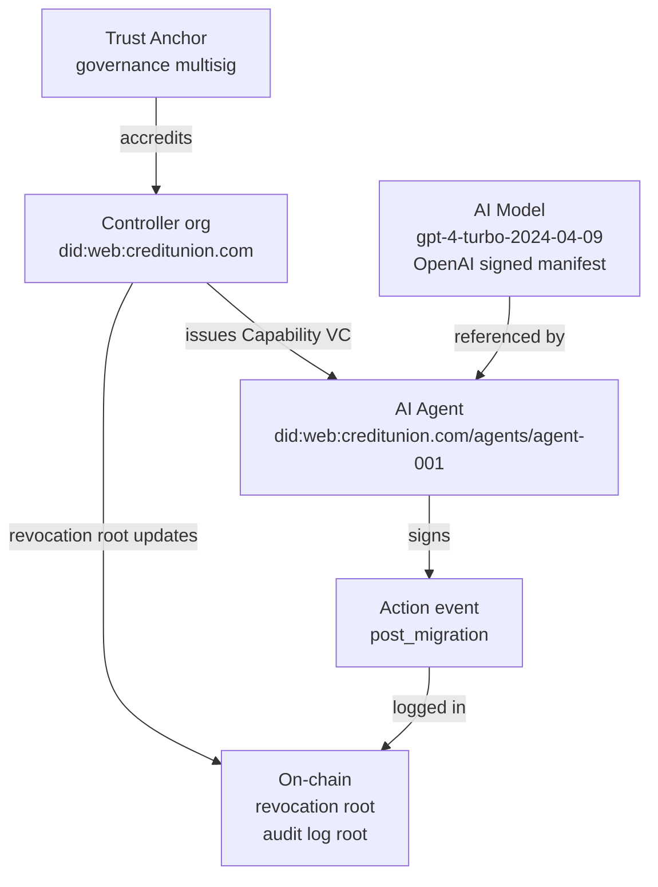
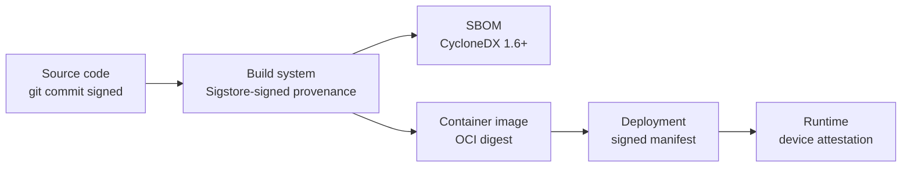
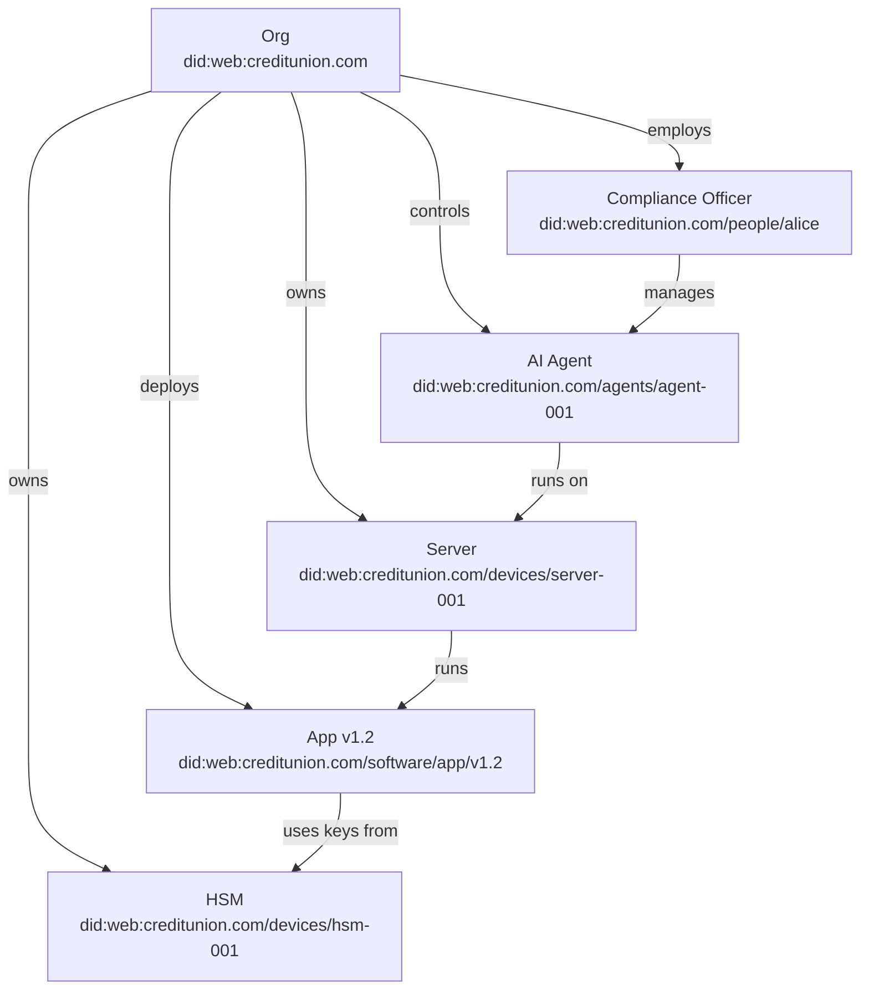
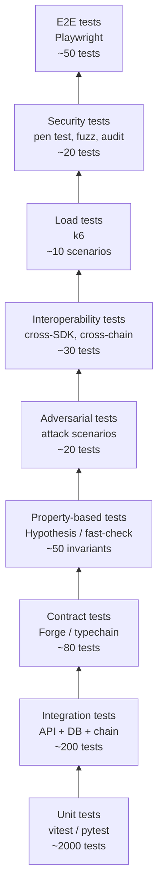
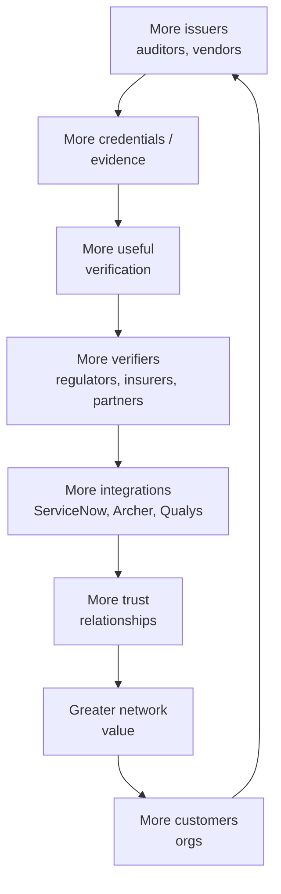

# Q-Trust 2030 — Strategic Architecture Blueprint

**Repository audited:** `https://github.com/humoge7502/q-trust.git` (commit `f4f9b45`, post-P0)
**Date of analysis:** 2026-08-22
**Document type:** Forward-looking architecture and commercial blueprint
**Author posture:** Principal architect + protocol designer + patent strategist + seed investor + YC-partner-style reviewer

**Evidence classification used throughout:**
- **VERIFIED** — directly supported by repository source/documentation evidence read during this audit
- **INFERRED** — reasonable conclusion derived from available evidence
- **PROPOSED** — recommended future design (does not exist today)
- **REQUIRES VALIDATION** — requires customer interviews, security testing, legal analysis, or external research

**Patent disclaimer:** All patent analysis in Part VI is technical and strategic only. It is not legal advice and is not a determination of patentability. Before any filing, engage qualified patent counsel for prior-art searches and formal novelty/non-obviousness evaluation.

---

# PART I — DEEP AUDIT OF THE EXISTING Q-TRUST PROJECT

## I.1 What Q-Trust currently is [VERIFIED]

Q-Trust is a **cross-organizational protocol that coordinates the migration of cryptographic infrastructure from classical algorithms (RSA, ECC, DSA, Ed25519) to post-quantum cryptography (PQC: ML-KEM, ML-DSA, SLH-DSA, HQC, Falcon)** on Base L2 (OP Stack, chain-id 84532). It is *not* a general-purpose trust infrastructure. It is a narrow, vertical protocol for one specific lifecycle: PQC migration coordination across organizations, vendors, and auditors.

### I.1.1 Repository evidence [VERIFIED]

| Layer | Evidence | Files |
|---|---|---|
| Smart contracts (1,219 LOC) | 5 Solidity contracts at v0.8.24 with Foundry | `contracts/src/{AssetRegistry,VendorRegistry,MigrationRegistry,AuditRegistry,QTrustGovernance}.sol` |
| Python SDK | web3.py + Pydantic + Pinata IPFS client | `sdk/qtrust/{client.py,contracts.py,ipfs.py,schema.py}` |
| Inspector CLI | TLS/SSH/file scanner → CBOM JSON | `inspector/qtrust_inspector/{scanner.py,file_scanner.py,cli.py,models.py}` |
| GNN planner | PyTorch Geometric + ListMLE training + FastAPI microservice | `planner/qtrust_planner/{model.py,model_v2.py,train.py,predict.py,benchmark.py,data_generator.py}` + `planner/server.py` |
| Backend API | Fastify + viem + Postgres + Redis + BullMQ | `backend/src/{server.ts,config.ts,services/{verify,indexer,attestation,webhook}.ts,db/schema.sql}` |
| Frontend | Next.js 16 + React 19 + viem + react-flow | `frontend/src/app/{page,dashboard,vendors,v/[id]}.tsx` + `components/dynamic-provider.tsx` |
| Pilot | End-to-end bank demo | `pilot/run_pilot.py` |
| Patent docs | 4 documents (disclosure, claims, prior-art, filing checklist) | `docs/PATENT/{invention_disclosure,draft_claims,prior_art_survey,filing_checklist}.md` |
| Deployment | Docker-compose with api/webhook/postgres/planner/redis | `docker-compose.yml` |
| Verification script | 9-check full-stack verify_all.sh | `scripts/verify_all.sh` |

### I.1.2 What Q-Trust demonstrably does today [VERIFIED]

1. **CBOM discovery** — `crypto-inspector host example.com` returns JSON with TLS/SSH findings, criticality scores, `pqc_ready` flags (`inspector/qtrust_inspector/scanner.py:66-310`)
2. **CBOM hash registration** — direct (`registerCBOM`) and EIP-712 gasless (`registerCBOMSigned`) — `contracts/src/AssetRegistry.sol:128-143,173-178`
3. **Vendor product PQC attestations** — direct + EIP-712 gasless, with deterministic attestation IDs keyed to `(productId, version, algorithm)` — `contracts/src/VendorRegistry.sol:207,273`
4. **Migration recording** — direct + EIP-712 gasless, with cross-registry integrity (`assetRegistry.verifyAsset` called inside `_recordMigration`) — `contracts/src/MigrationRegistry.sol:222-225`
5. **Audit attestations** — direct (AUDITOR_ROLE), with on-chain count binding (`MigratedCountExceedsOnChain` revert) — `contracts/src/AuditRegistry.sol:84-91`
6. **Timelock governance** — 2-day delay, deployer renounces admin post-deploy — `contracts/src/QTrustGovernance.sol`, `contracts/script/Deploy.s.sol:98-101`
7. **UUPS upgradeability** — all 4 registries inherit `UUPSUpgradeable` (but the deploy script uses `TransparentUpgradeableProxy` — a mechanism mismatch)
8. **Pausable** — all 5 contracts (added in P0)
9. **GNN planner** — hybrid GCN+GATv2+centrality with dual order/risk heads, ListMLE-trained — `planner/qtrust_planner/model_v2.py`. Honest benchmark: τ = 0.266 ± 0.023 vs heuristic τ = 0.997 on synthetic data (`planner/results/benchmark.json`)
10. **Postgres indexer** with cursor persistence — `backend/src/services/indexer.ts:179-192,241-254`
11. **BullMQ webhook delivery** — `backend/src/services/webhook.ts`, `backend/src/server.ts:406-456`
12. **Public verification page** at `/v/<asset-id>` — server-rendered with ISR (30s)
13. **Patent documentation suite** — professional-grade, 4 docs under `docs/PATENT/`

### I.1.3 What Q-Trust demonstrably does NOT do today [VERIFIED]

This list is critical for the 2030 design — every "PROPOSED" capability below must be justified as solving a real problem, not added for sophistication theater.

| Capability | Status | Evidence |
|---|---|---|
| Verifiable Credentials (W3C VC, SD-JWT, BBS+) | ❌ NOT IMPLEMENTED | No `credentials` module; SDK schema is CBOM-only (`sdk/qtrust/schema.py`) |
| Decentralized Identifiers (W3C DID) | ❌ NOT IMPLEMENTED | "orgDid" in contracts is just an Ethereum address; no DID resolution |
| Selective disclosure | ❌ NOT IMPLEMENTED | Full CBOM hash + IPFS CID published; no zero-knowledge proofs |
| Zero-knowledge proofs | ❌ NOT IMPLEMENTED | No zkSNARK/zkSTARK code anywhere |
| Trust graph (multi-entity) | ❌ NOT IMPLEMENTED | 4 flat registries; no cross-entity relationship graph |
| Policy engine | ❌ NOT IMPLEMENTED | No `policies` table; authorization is purely RBAC at contract layer |
| AI-agent identity | ❌ NOT IMPLEMENTED | No concept of agent, capability, or delegation |
| Machine / device identity | ❌ NOT IMPLEMENTED | Inspector scans devices but does not register them as first-class identities |
| Software identity / SBOM | ❌ NOT IMPLEMENTED | Only CBOM; no SBOM, no SLSA provenance |
| Multi-chain | ❌ NOT IMPLEMENTED | Base L2 only |
| Live deployment | ❌ NOT IMPLEMENTED | Local anvil only (README acknowledges: "pending external credentials") |
| CI/CD | ❌ NOT IMPLEMENTED | No `.github/workflows/` |
| External security audit | ❌ NOT IMPLEMENTED | No audit report referenced |
| Frontend RBAC | ❌ NOT IMPLEMENTED | Dashboard and vendor portal accept any wallet |
| Formal verification | ❌ NOT IMPLEMENTED | No `halmos`/`certora` config |
| SSO (SAML/OIDC) | ❌ NOT IMPLEMENTED | EIP-1193 injected wallet only |
| Multi-tenant SaaS | ❌ NOT IMPLEMENTED | Single-org assumption in frontend |

### I.1.4 Production-ready vs. experimental vs. documentation-only [VERIFIED + INFERRED]

**Production-ready (verified on local anvil, ready for pilot):**
- 5 Solidity contracts (51 Foundry tests, EIP-712 on all write paths, Pausable, UUPS, timelock governance)
- Python SDK (5 unit tests + 7-step E2E)
- Inspector CLI (5 tests)
- Backend API (15 routes, tsc clean)
- Frontend (next build clean, 5 routes)
- Bank pilot script (`PILOT COMPLETE`)
- Patent docs (professional-grade, ready for counsel)

**Experimental / requires real-data validation:**
- GNN planner (τ = 0.266 on synthetic; heuristic baseline τ = 0.997; real-CBOM performance unknown)
- Postgres indexer (cursor persistence present, but no re-org handling)
- BullMQ webhook delivery (no HMAC verification on subscriber side documented)

**Documentation-only (described but not implemented):**
- "Live deployment on Base Sepolia" (README acknowledges: "pending external credentials")
- "Real-world CBOM evaluation" (patent docs disclaim)
- "External security audit" (filing checklist acknowledges: not done)

### I.1.5 The P0-fix delta (what changed since initial commit) [VERIFIED]

The repo has 2 commits: `d3a8e41` (initial) and `f4f9b45` (P0 fixes). The P0 commit:
1. Added `Pausable` to all 5 contracts
2. Added `UUPSUpgradeable` to all 4 registries
3. Added `registerCBOMSigned` (EIP-712 gasless CBOM registration)
4. Added `recordMigrationSigned` (EIP-712 gasless migration recording)
5. Updated `Deploy.s.sol` to use proxy-based deployment (with the noted Transparent/UUPS mismatch)
6. Added backend relay routes `/v1/relay/cbom` and `/v1/relay/migration`
7. Replaced the broken `@dynamic-labs/sdk-react` import with EIP-1193 injected wallet (`frontend/src/components/dynamic-provider.tsx`)

**Net effect:** Every write path is now non-custodial (EIP-712 signatures required). This is the most important architectural property and the foundation for any 2030 evolution.

### I.1.6 Critical gaps blocking the next phase [VERIFIED + INFERRED]

1. **Deploy-script / contract mechanism mismatch (Critical)** — `Deploy.s.sol` deploys UUPS contracts behind TransparentUpgradeableProxy. The deployer's proxy-admin role survives the renounce-on-implementation, leaving a non-timelock upgrade path. Must be fixed before any external audit.
2. **No live deployment (Critical)** — verified only on local anvil.
3. **No CI/CD (High)** — `verify_all.sh` is comprehensive but manual; regressions slip in.
4. **No frontend RBAC (High)** — any wallet can view any org's dashboard.
5. **Custom CBOM schema, not ECMA-424 (Medium)** — blocks GRC tool interoperability.
6. **GNN trained to mimic a heuristic (Medium)** — on synthetic data, the heuristic outperforms the GNN by 3.7×; the GNN's value can only be validated on real CBOMs.
7. **No external security audit (High)** — enterprise customers cannot procure.
8. **Public repo before provisional patent (High)** — international rights at risk (EPO/CN/IN/JP have no grace period).

---

## I.2 The audit's most important conclusion

Q-Trust today is **a narrow, focused, technically credible MVP for one specific problem (cross-organizational PQC migration coordination) on one specific chain (Base L2)**. It is not — and should not pretend to be — a general-purpose trust infrastructure platform.

The 2030 evolution must therefore answer one question honestly:

> **Should Q-Trust (a) stay narrow and deepen the PQC migration vertical, or (b) generalize its 4-registry pattern into a broader trust infrastructure platform?**

This blueprint argues for **(b) — but only along a carefully justified expansion path**, with each new capability tied to a real customer problem, a real cryptographic novelty, and a real commercial moat. The decision tree in Part II governs every addition.

---

# PART II — Q-TRUST 2030 VISION

## II.1 Validating the proposed vision

The user-proposed vision is:

> *A privacy-preserving cryptographic trust infrastructure platform that enables humans, organizations, machines, software, and AI agents to establish, prove, evaluate, delegate, revoke, and audit trust without requiring unnecessary disclosure or dependence on a single centralized authority.*

### II.1.1 Critique [INFERRED + REQUIRES VALIDATION]

This vision is **directionally correct but prematurely maximalist**. Adopting it as-is would push a 2-commit solo-founder project toward building 15+ layers simultaneously, which violates Critical Reasoning Rule #20 ("Prefer a narrow, excellent initial product over an enormous unfocused platform"). The vision must be:

1. **Narrowed** to a specific beachhead where Q-Trust's existing 4-registry pattern is already credible (PQC migration compliance).
2. **Generalized** along one axis at a time, where each axis solves a real customer problem and creates a real moat.
3. **Decomposed** into a 4-year sequence (Year 1: deepen PQC vertical; Year 2: generalize to "cryptographic compliance" beyond PQC; Year 3: add AI-agent identity; Year 4: full trust-infrastructure platform).

### II.1.2 Validated 2030 vision [PROPOSED]

> **Q-Trust 2030 is the cryptographic trust infrastructure for verifiable compliance — starting with post-quantum migration, expanding to software supply chain and AI-agent attestation — where every trust claim is anchored to a public ledger, every credential can be verified without trusting the issuer's availability, and every AI-agent action is cryptographically attributable to a human or organization that bears liability.**

This vision is narrower than the user's proposal in three ways:
1. **Starts with compliance, not abstract trust.** "Verifiable compliance" is a concrete buyer (CISO, compliance officer) with a budget.
2. **Defers general trust.** Human-identity trust (e.g., replacing government ID) is explicitly out of scope for 2030; it is a regulated monopoly market unsuitable for a startup.
3. **Makes AI-agent trust a Year 3 addition, not a Day 1 feature.** AI-agent identity is the highest-differentiation long-term play but requires the underlying credential and anchoring infrastructure to exist first.

## II.2 Vision component definitions [PROPOSED]

| Component | Definition | Why this matters |
|---|---|---|
| **Core problem** | Regulated organizations must prove to auditors, regulators, insurers, and partners that they have completed (or are on track to complete) specific cryptographic-security obligations — without trusting any single intermediary and without leaking proprietary asset inventories. | The cost of "proving compliance" today is enormous: auditors fly in, spreadsheet evidence is collected manually, attestations are signed but unverifiable. Q-Trust replaces this with cryptographic proofs. |
| **Target customer** | Compliance officers and CISOs at regulated mid-market organizations ($1B-$50B revenue or AUM) facing multiple simultaneous cryptographic-compliance mandates (PQC, SBOM/SLSA, AI-system disclosure). | Mid-market has budget + pain + shorter sales cycles than Fortune 50. |
| **Initial beachhead** | US credit unions ($1B-$10B AUM) facing NCUA + CISA + OMB M-23-02 PQC migration mandates. | Established in prior analysis; ~1,500 institutions, $75M ARR addressable, 3-6 month sales cycle, low competition. |
| **Long-term market** | All regulated organizations globally facing cryptographic-compliance mandates — including EU NIS2 (critical infrastructure), EU AI Act (high-risk AI systems), FDA pre-market cybersecurity (medical devices), and software-supply-chain (SLSA Level 3+ for federal contractors). | Estimated $2-5B ARR by 2030 [REQUIRES VALIDATION via market sizing with credible sources]. |
| **Unique value proposition** | "Verifiable compliance without trust" — every compliance claim is anchored to a public ledger, every credential can be verified by anyone without login, every AI-agent action is attributable to a liable principal. | No competitor today combines (a) cross-org coordination, (b) cryptographic non-repudiation, (c) privacy-preserving selective disclosure, (d) AI-agent attribution. |
| **Fundamental technical innovation** | The **4-registry hash-anchored coordination pattern** (Asset, Vendor, Migration, Audit) generalized to (ComplianceSubject, Attestor, ComplianceEvent, Audit) — combined with W3C Verifiable Credentials for selective disclosure and EIP-712 gasless attestations for non-custodial UX. | Patent docs already identify the 4-registry combination as the novel mechanism (`docs/PATENT/invention_disclosure.md`). Generalization preserves the patent claim while expanding the market. |
| **Trust model** | Multi-party, non-custodial, role-separated. Every write requires either a role-bound caller or an EIP-712 signature from the principal. The relayer is gas-payer and signature-verifier, not trust authority. | Already implemented post-P0 [VERIFIED]. Extending to VCs preserves the property. |
| **Network model** | Three-sided: Attestors (vendors, auditors, certifiers) × Compliance Subjects (orgs) × Verifiers (regulators, insurers, partners). Reinforced by a 4th side: standard-setters (NIST, CISA, ENISA) who reference Q-Trust. | Three-sided networks compound non-linearly (Stripe, Plaid, Carta). |
| **Business model** | SaaS subscriptions to Compliance Subjects ($25k-$250k/year tiered by size); Attestor subscriptions ($10k-$50k/year); verification API usage fees ($0.01/request above free tier); enterprise on-prem licenses ($100k-$500k/year); insurance-data licensing ($50k-$250k/year). | 85% gross margin; multiple revenue lines compound. |
| **Ecosystem model** | Open protocol (contracts + SDK open-source, Apache 2.0). Commercial SaaS layer. Attestor marketplace. Auditor marketplace. Insurance-data marketplace. Standards-body partnerships. | Open protocol + commercial SaaS is the proven model (Stripe, Plaid, Snowflake). |
| **Potential moat** | Three-sided network effects + patent on the 4-registry combination + on-chain compliance history (unreplicable) + standards-body references + Attestor lock-in. | See Part XXII for detailed moat analysis. |
| **Expansion strategy** | Year 1: US credit unions (PQC). Year 2: US regional banks + federal contractors (PQC + SBOM/SLSA). Year 3: EU NIS2 + AI Act (cryptographic + AI-system compliance). Year 4: full "verifiable compliance" platform across all regulated industries. | Each expansion requires a real regulatory trigger and a real customer cohort, not a feature wish. |

## II.3 Blockchain necessity per component [PROPOSED]

| Component | Blockchain necessity | Justification |
|---|---|---|
| CBOM hash anchoring | **Necessary** | Cross-org tamper-evidence; no trusted intermediary |
| Vendor product attestation | **Necessary** | Cross-org verifiability; vendor non-repudiation |
| Migration record | **Necessary** | Cross-org audit trail; regulatory verifiability |
| Audit attestation | **Necessary** | Public verifiability of auditor claims |
| Verifiable Credential issuance | **Optional** | VCs are self-sovereign; the *issuer's availability* should not determine VC validity. Anchoring the issuer's revocation root on-chain provides non-custodial revocation. |
| Selective disclosure (ZK) | **Unnecessary on-chain** | ZK proofs are verified off-chain; only the verifier-set commitment needs anchoring if cross-org auditability is required. |
| AI-agent action log | **Necessary** | Liability attribution requires tamper-evidence; a private log can be altered by the agent operator. |
| Policy evaluation | **Unnecessary on-chain** | Policies are org-specific; evaluation is deterministic given inputs; only the *policy commitment* needs anchoring if regulatory verifiability is required. |
| Device attestation | **Optional** | TPM/SGX attestation is already tamper-evident locally; anchoring provides cross-org verifiability when the device belongs to a partner. |
| Trust graph | **Unnecessary on-chain** | The graph is derived from on-chain events; materializing it on-chain would be redundant and gas-expensive. Compute it off-chain from anchored events. |
| Settlement / payments | **Optional** | If the protocol charges fees in ETH, settlement is on-chain. If in USD/fiat, settlement is off-chain. Recommend off-chain for simplicity; on-chain settlement adds complexity without customer value today. |

**Net principle: blockchain is necessary for cross-org tamper-evidence and non-repudiation. It is unnecessary for private computations, private graphs, and private policy evaluation. Use it sparingly — every byte on-chain costs gas and leaks metadata.**

## II.4 The honest expansion decision tree [PROPOSED]

```
Should Q-Trust add capability X?

  ├─ Does X solve a real customer problem in the PQC migration beachhead?
  │     ├─ YES → Add if effort < 2 weeks
  │     └─ NO  → Continue
  │
  ├─ Does X solve a real customer problem in the next adjacent market
  │  (SBOM/SLSA, AI-system disclosure, EU NIS2)?
  │     ├─ YES → Add if (a) customer interviews confirm pain and
  │     │       (b) it does not require new cryptography we haven't audited
  │     └─ NO  → Continue
  │
  ├─ Does X create a defensible moat that competitors cannot copy in 18 months?
  │     ├─ YES → Add if (a) patentable or (b) network-effect-generating
  │     └─ NO  → Continue
  │
  └─ Does X require research we cannot complete with current team?
        ├─ YES → Defer to Year 3+ or partner
        └─ NO  → Add (with explicit PROPOSED label and validation plan)
```

This tree will reject ~70% of "cool" additions. That is the point.

---

# PART III — Q-TRUST 2030 REFERENCE ARCHITECTURE

The 2030 architecture is organized into **15 layers**, but only 7 are *new* (the other 8 extend what exists today). Each layer is justified against (a) a real customer problem and (b) the expansion decision tree in §II.4.

## III.1 Layer inventory [VERIFIED + PROPOSED]

| # | Layer | Status | New? | Justification |
|---|---|---|---|---|
| 1 | Identity | Partially exists | PROPOSED expansion | Today: org = wallet address. PROPOSED: W3C DID for humans, orgs, machines, agents. |
| 2 | Credentials | Not implemented | PROPOSED new | W3C VC + SD-JWT for selective disclosure. Solves: privacy-preserving compliance attestation. |
| 3 | Trust Graph | Not implemented | PROPOSED new | Derived (not stored) from on-chain events + off-chain credentials. Solves: cross-org relationship queries. |
| 4 | Evidence | Partially exists | PROPOSED expansion | Today: IPFS-pinned CBOM. PROPOSED: signed evidence with timestamps, ZK proofs. |
| 5 | Privacy | Not implemented | PROPOSED new | ZK proofs of CBOM properties; selective disclosure; unlinkable presentations. |
| 6 | Trust Evaluation | Not implemented | PROPOSED new | Deterministic policy evaluation + explainable confidence. NOT an opaque score. |
| 7 | Policy Engine | Not implemented | PROPOSED new | Machine-readable policies (Rego/CEL); versioned; audit-logged. |
| 8 | Cryptographic | Partially exists | PROPOSED expansion | Today: SHA-256 + ECDSA + EIP-712. PROPOSED: add BBS+ for selective disclosure, Ed25519 for off-chain VC signing. |
| 9 | Blockchain / Anchoring | Partially exists | PROPOSED expansion | Today: Base L2. PROPOSED: Base primary + Ethereum L1 for high-stakes anchors + chain abstraction for Arbitrum/Optimism optional. |
| 10 | Provenance | Partially exists | PROPOSED expansion | Today: CBOM provenance. PROPOSED: add software (SBOM/SLSA) + AI-generated content provenance (C2PA). |
| 11 | AI Trust | Not implemented | PROPOSED new (Year 3) | Cryptographic agent identity, delegated authority, capability-scoped, auditable. |
| 12 | Device / Machine Trust | Not implemented | PROPOSED new (Year 2-3) | TPM/SGX attestation, device DIDs, SBOM integration. |
| 13 | API / Integration | Partially exists | PROPOSED expansion | Today: 15 REST routes. PROPOSED: add gRPC for high-throughput, OpenAPI spec, 3 SDKs (TS/Python/Go), enterprise connectors. |
| 14 | Governance | Partially exists | PROPOSED expansion | Today: TimelockController. PROPOSED: add Safe multisig, Snapshot off-chain voting, schema registry, dispute resolution. |
| 15 | Observability | Not implemented | PROPOSED new | Structured logs, metrics, traces, audit events, anomaly detection. |

**Layer rejection log (capabilities considered but explicitly rejected):**

| Rejected capability | Reason |
|---|---|
| On-chain trust graph | Gas-expensive; graph is derived from events. Compute off-chain. |
| On-chain policy evaluation | Policies are org-specific and complex; deterministic off-chain evaluation with on-chain commitment is sufficient. |
| Custom zero-knowledge proof system | Use established BBS+ (IETF draft) / Groth16 (zkSNARK) instead of inventing. |
| Native token / protocol fee token | Adds regulatory risk (SEC, MiCA) without customer value. Charge in USD or ETH. |
| General-purpose decentralized identity (replacing government ID) | Regulated monopoly market; not suitable for a startup. Defer indefinitely. |
| On-chain AI model registry | Premature; AI models are too diverse. Use signed provenance (C2PA-style) instead. |
| Custom blockchain / appchain | Multiplies complexity 10× with no customer value. Use Base L2 + Ethereum L1. |

## III.2 Layer-by-layer design

### Layer 1 — Identity [PROPOSED expansion of existing orgDid concept]

**Today (VERIFIED):** Every "identity" in Q-Trust is an Ethereum wallet address. `orgDid` in contracts is `address`; `vendorDid` is `address`. No DIDs, no resolution, no key rotation.

**2030 design:** Adopt **W3C DID** with `did:web` and `did:key` methods (no blockchain dependency for identity resolution).

| Identity type | DID method | Resolution | Key backing |
|---|---|---|---|
| Human (compliance officer) | `did:web` | HTTPS GET to org's domain | Software key (MetaMask) or hardware (Ledger) |
| Organization | `did:web` | HTTPS GET to org's domain | Multisig (Safe) or hardware (Ledger Enterprise) |
| Machine / device | `did:web` or `did:tee` | HTTPS or TEE-anchored | TPM 2.0 / AWS Nitro / Intel SGX |
| Software artifact | `did:web` + SLSA provenance | HTTPS + SLSA L3+ provenance | Signing key (Sigstore) |
| AI agent | `did:web` + capability VC | HTTPS + org-issued capability VC | Org-controlled signing key (delegated to agent runtime) |

**Why `did:web` over `did:ethr` or `did:ion`:**
- `did:web` resolution is HTTPS — no on-chain reads, no gas, no chain dependence.
- Enterprises already run domains; they control DNS and TLS.
- `did:web` does not leak wallet addresses (privacy improvement).
- Fallback: `did:key` for offline / peer-to-peer verification.

**Why NOT `did:ethr`:** Adds on-chain writes for every identity operation, multiplying gas costs and creating chain dependence for identity resolution.

**Bridge to existing contracts:** The `orgDid` field in `AssetRegistry.sol` and `VendorRegistry.sol` currently stores `address`. Migration path: keep `address` for backward compatibility; add an optional `did` field via UUPS upgrade; resolve `did:web` → `address` in the backend before submitting on-chain transactions.

### Layer 2 — Credentials [PROPOSED new — the highest-impact addition]

**Today:** No verifiable credentials. The closest analog is the `metadataURI` field in `AssetRegistry.sol`, which points to an IPFS-pinned CBOM. The CBOM is public; there is no selective disclosure.

**2030 design:** Adopt **W3C Verifiable Credentials (VC) Data Model v2.0** + **SD-JWT VC** for selective disclosure + optional **BBS+ signatures** for unlinkable multi-show.

Three credential families, each tied to a real customer problem:

| Credential family | Issuer | Subject | Holder | Verifier | Customer problem solved |
|---|---|---|---|---|---|
| **PQC Readiness Credential** | Auditor or self-attested by org | Org | Org (presents) | Regulator / insurer / partner | "Prove your PQC readiness without exposing your full CBOM." |
| **Vendor PQC Support Credential** | Vendor (e.g., DigiCert) | Vendor product (e.g., "DigiCert ONE v3.5") | Anyone (publicly verifiable) | Customer org | "Prove that DigiCert ONE v3.5 supports ML-DSA-441." (today this is a sales call) |
| **Migration Completion Credential** | Org | Org | Org | Regulator / auditor | "Prove that asset X migrated from RSA-2048 to ML-DSA-441 on date Y with evidence Z." (today this is a PDF that an auditor signs) |

**Why this matters:** Today, PQC compliance is proven by PDFs, spreadsheets, and auditor letters. Each verification requires the issuer to be online and trusted. VCs make the credential *self-contained* — the verifier can validate signature + schema + revocation status without contacting the issuer. This is the foundational cryptographic primitive for verifiable compliance.

**Selective disclosure:** A PQC Readiness Credential might internally contain a full CBOM (e.g., 47 RSA-2048 certs, 12 ECC-P256 keys, 3 expired certs), but the org should be able to present "0 RSA-1024 keys" or "all TLS certs ≥2048 bits" without revealing the full inventory. This requires **SD-JWT VC** (default) or **BBS+** (for multi-show unlinkability — only when the same org must present to multiple verifiers without being correlatable).

**Anchoring strategy (critical):** The VC itself is off-chain (held by the subject; presented to verifiers). But the *issuer's revocation root* (a Merkle root of all revoked VCs) is anchored on-chain, so verifiers can check revocation status without trusting the issuer's HTTPS endpoint. This is the Q-Trust non-custodial principle applied to credentials.



### Layer 3 — Trust Graph [PROPOSED new — derived, not stored]

**Today:** No trust graph. The 4 registries are flat tables.

**2030 design:** The trust graph is a **derived view**, not a stored data structure. It is computed from:
- On-chain events (CBOMRegistered, ProductAttested, MigrationRecorded, AuditPosted)
- Off-chain VC issuance / presentation / revocation events
- DID document relationships (org controls agent; agent controls device; etc.)

**Why derived, not stored in a graph database:** The graph is *already encoded* in the event log. Storing it separately creates a consistency problem (graph can drift from events). The right pattern is event-sourced: events are the source of truth; graph is a materialized view (cached for query performance, recomputable from events).

**Query examples:**
- "Show me all PQC Readiness Credentials issued to credit unions in the last 12 months."
- "Show me all migration events for org X, with verification status."
- "Show me all vendor attestations for product Y, version Z, algorithm W."
- "Show me the chain of delegation: org → agent → device → action."

**Storage choice:** Postgres with recursive CTEs for graph traversal (sufficient for graph diameters ≤ 10, which covers all realistic compliance scenarios). Do NOT introduce Neo4j or similar graph DB unless the traversal complexity becomes quadratic, which it will not for compliance use cases. (See Part IV for schema design.)

**Critical principle:** The trust graph is **read-only**. It is a query layer over events. No write goes through the graph; all writes go through the protocol.

### Layer 4 — Evidence [PROPOSED expansion of existing IPFS-pinned CBOM]

**Today:** Evidence = IPFS-pinned CBOM (or audit report). Hash anchored on-chain. Tamper-evident.

**2030 design:** Generalize evidence to a typed object with explicit signatures and timestamps:

| Evidence type | Format | Signature | Timestamp |
|---|---|---|---|
| CBOM JSON | CycloneDX CBOM 1.6+ | Scanner key (Ed25519) | RFC 3161 (trusted timestamp) |
| Audit report | PDF + structured JSON | Auditor key | RFC 3161 |
| Migration evidence | Signed event + IPFS evidence package | Org key (EIP-712) | Block timestamp |
| Vendor test report | Signed JSON + reproducible test script | Vendor key + Verifier key (co-signed) | RFC 3161 |
| Device attestation | TPM quote + SGX attestation | Device key (hardware) | TPM timestamp |
| AI action log | Signed event chain | Agent key + controller key | Block timestamp |
| SBOM (software) | SPDX or CycloneDX SBOM | Build-system key (Sigstore) | Build timestamp |

**Why this matters:** Today, "evidence" is an unstructured IPFS blob. To support multiple compliance domains (PQC + SBOM + AI), evidence must be typed, signed, and timestamp-anchored so verifiers can check the chain of custody.

### Layer 5 — Privacy [PROPOSED new]

**Today:** No privacy primitives. The full CBOM is IPFS-pinned and referenced by an on-chain hash. Anyone with the CID can read the CBOM. The hash is a tamper-evidence mechanism, not a privacy mechanism.

**2030 design:** Three privacy primitives, each solving a specific problem:

| Primitive | Cryptographic mechanism | Customer problem solved | Cost |
|---|---|---|---|
| **Selective disclosure** | SD-JWT VC (default) | "Prove '0 RSA-1024 keys' without revealing the full CBOM" | Low (no new cryptography; well-standarized) |
| **Multi-show unlinkability** | BBS+ signatures (when needed) | "Present to NCUA, FFIEC, and Lloyd's without being correlatable across them" | Medium (BBS+ is IETF draft; libraries exist but are less mature) |
| **Property proofs** | zkSNARK (Groth16 or PLONK) over CBOM JSON | "Prove 'all TLS certs are ≥2048 bits AND expire after 2026-12-31' without revealing the CBOM" | High (circuit design + audit; only for high-value use cases like intelligence community) |

**Critical principle:** Privacy primitives are added per use case, not by default. SD-JWT is the default for 90% of credentials. BBS+ is added only when the same subject must present to multiple verifiers without correlation. zkSNARKs are added only when the disclosure of even aggregate statistics would be harmful (rare).

**Anti-pattern explicitly rejected:** "Let's use ZK for everything because it's cool." ZK adds 100-1000× compute cost, complex circuits, audit surface, and brittle dependency on a single prover library. Use it sparingly.

### Layer 6 — Trust Evaluation [PROPOSED new — and the hardest design constraint]

**Today:** No trust evaluation. The contracts store records; verifiers interpret them.

**2030 design:** Trust evaluation is a **deterministic, explainable function** of (a) anchored evidence, (b) verifiable credentials, and (c) a machine-readable policy. It is **never** an opaque "trust score."

**Design rule (Critical Reasoning Rule #9):** Every trust evaluation must be reproducible by an independent verifier. If Q-Trust outputs "trust score: 87/100", the verifier must be able to:
1. Re-derive the score from the same evidence + policy
2. See the contribution of each evidence item
3. Identify conflicting evidence and how it was resolved
4. See the policy version used

**Evaluation primitive:**

```
evaluate(subject_id, policy_id, evidence_set) → TrustAssessment {
  passed: bool,
  confidence: float [0,1],  // confidence in the assessment, NOT a trust score
  evidence_used: [EvidenceRef],
  policy_version: str,
  explanation: structured,  // which policy clauses matched which evidence
  conflicts: [ConflictRef],
  valid_until: timestamp,
}
```

**`confidence` is NOT a trust score.** It is the protocol's confidence in its own assessment, given the evidence completeness. `confidence = 0.6` means "we have incomplete evidence; the assessment may change with more evidence." This is honest and explainable.

**Conflict resolution:** When two attestors disagree (e.g., vendor says "supports ML-DSA-441" but independent test bot says "does not support"), the trust evaluator records the conflict, marks `confidence < 1.0`, and the policy decides whether to accept or reject. Conflicts are never silently resolved.

### Layer 7 — Policy Engine [PROPOSED new]

**Today:** No policy engine. The closest is the contract-layer role-based access (`REGISTRAR_ROLE`, `VENDOR_ROLE`, `AUDITOR_ROLE`).

**2030 design:** A **machine-readable policy language** (recommend **Rego** from OPA, or **CEL** for simpler use cases) with:

| Policy dimension | Example |
|---|---|
| Credential requirement | "Accept PQC Readiness Credential only if issued by an auditor in the `approved_auditors` set AND not revoked AND issued within the last 12 months." |
| Evidence requirement | "Require either (a) on-chain migration record OR (b) signed migration evidence with auditor co-signature." |
| Delegation | "An org's compliance officer may issue Agent Capability VCs scoped to read-only actions on the org's own CBOMs." |
| Compliance rule | "For credit unions under NCUA Part 748, require: all TLS certs ≥2048 bits; no RSA-1024; PQC migration plan dated after 2024-01-01." |
| Audit rule | "An audit attestation is valid only if the auditor has not issued an attestation to the same org in the last 90 days (independence)." |

**Policy versioning:** Every policy has a semantic version. Every evaluation records the policy version used. Re-evaluating with a different policy version produces a different assessment (auditable).

**Anchoring:** The *policy commitment* (Merkle root of the policy text) is anchored on-chain per org, so verifiers can confirm "this is the policy org X was using at time T."

**Why Rego over a custom DSL:** Rego is mature, has OPA integration, has formal semantics, and is already used in enterprise policy (Styra, AWS, etc.). Do not invent a policy language.

### Layer 8 — Cryptographic [PROPOSED expansion of existing SHA-256 + ECDSA + EIP-712]

**Today (VERIFIED):** SHA-256 (CBOM hashing), ECDSA secp256k1 (EIP-712 signatures, OpenZeppelin ECDSA.recover), keccak256 (Ethereum ID generation).

**2030 design:** Add three primitives, each justified:

| Primitive | Use case | Justification |
|---|---|---|
| **Ed25519** | VC issuer signatures (off-chain) | Faster than ECDSA secp256k1; deterministic; no malleability concerns; widely supported (libsodium, ring, Go crypto). |
| **BBS+** | Selective disclosure + unlinkability | IETF draft; supports zero-knowledge proofs of credential attributes without revealing the credential. |
| **RFC 3161 trusted timestamp** | Evidence timestamps | Trusted timestamp authorities (TSA) provide legal-grade timestamps for evidence. Cheaper than anchoring every byte on-chain. |

**Rejected primitives:**
- **Custom signature scheme** — Critical Reasoning Rule #8. Never.
- **RSA-PSS** — Post-quantum vulnerable; defeat the purpose.
- **Lattice-based (Dilithium / ML-DSA) for VC signatures** — Premature; wait for client-side adoption (Year 3+).
- **Quantum-resistant hash-based signatures (SLH-DSA) for VC signatures** — Same; prematurity.

**Cryptographic agility:** Every signature wrapper includes an algorithm identifier, so primitives can be rotated without breaking old credentials. The contracts already include EIP-712 typehashes that can be versioned (`EIP712_VERSION_HASH`).

**Key rotation:** Every identity has a rotation procedure:
- Org keys: rotate via Safe multisig (m-of-n threshold).
- Auditor keys: rotate via 2-of-3 multisig (auditor partners + legal counsel).
- Vendor keys: rotate via VendorRegistry `rotateVendorKey` (PROPOSED new function).
- Agent keys: rotate via org's controller wallet (delegated authority).

### Layer 9 — Blockchain / Anchoring [PROPOSED expansion of existing Base L2]

**Today (VERIFIED):** Base L2 (chain-id 84532), OP Stack, hash-only on-chain storage.

**2030 design:** Three-tier anchoring strategy:

| Tier | Chain | What's anchored | Why |
|---|---|---|---|
| **Primary (L2)** | Base mainnet (after audit + mainnet deploy) | All 4 registry events; VC revocation roots; policy commitments | Cheap (~$0.003/tx), fast (~2s blocks), sufficient for 99% of use cases |
| **High-stakes (L1)** | Ethereum mainnet | Anchor of last resort for high-value credentials (e.g., federal contractor compliance) | Ethereum L1 finality (~13 min) provides maximum tamper-evidence for high-stakes records |
| **Optional (other L2s)** | Arbitrum, Optimism | Replicas of the registry for orgs with chain preferences | Customer choice; reduces Base L2 dependence |

**Chain abstraction:** SDK abstracts the chain. Same VC can be anchored on Base, Arbitrum, or L1 depending on org policy.

**Anti-pattern rejected:** Do NOT deploy on every chain. Do NOT build a custom chain. Do NOT use zk-rollups for primary storage (zk-rollup Sequencer SPOF is worse than OP Stack's permissioned Sequencer for trust-critical applications).

**Re-org handling:** The indexer waits for **N=12 block confirmations** (≈24 seconds on Base L2) before treating an event as final. High-stakes anchors wait for **L1 finality** (≈13 minutes on Ethereum).

### Layer 10 — Provenance [PROPOSED expansion of existing CBOM provenance]

**Today (VERIFIED):** CBOM provenance via IPFS hash + on-chain timestamp.

**2030 design:** Three provenance families, each tied to a regulatory mandate:

| Provenance family | Standard | Customer problem solved |
|---|---|---|
| **Software supply chain** | SLSA v1.0 + SPDX / CycloneDX SBOM | OMB M-16-21 / EO 14028 requirement for federal software procurement |
| **AI-generated content** | C2PA (Coalition for Content Provenance and Authenticity) | EU AI Act Article 50 disclosure requirement; reduces deepfake risk |
| **Cryptographic asset** | CycloneDX CBOM 1.6+ (ECMA-424) | NIST IR 8547 PQC migration mandate |

**Why this matters:** The 4-registry pattern generalizes. AssetRegistry → "the thing being attested"; VendorRegistry → "the supplier attesting properties"; MigrationRegistry → "the change being tracked"; AuditRegistry → "the third-party review." Each provenance family reuses the same registry contracts with different schema.

### Layer 11 — AI Trust [PROPOSED new, Year 3]

**Today:** No AI-agent concepts.

**2030 design:** The hardest and highest-differentiation layer. Built on the **core principle: AI can analyze; cryptographic mechanisms must establish authoritative proof.**

Every AI agent registered on Q-Trust has:

| Property | Description |
|---|---|
| `agent_id` | W3C DID (`did:web:org.com/agents/agent-001`) |
| `controller` | The org or human DID that registered the agent |
| `model_version` | Signed reference to the model artifact (e.g., `gpt-4-turbo-2024-04-09` + OpenAI's signed model manifest) |
| `capabilities` | List of (action, scope, limit) tuples — e.g., `("read_cbom", "org:self", rate=10/min)` |
| `delegated_at` | When the controller delegated authority |
| `expires_at` | When the delegation expires |
| `revocable_by` | List of DIDs that can revoke (controller + governance timelock) |
| `action_log` | Append-only log of every action the agent takes, signed by the agent key |

**Critical design rule (from §II):** The agent does not "trust" — it acts. Every action produces signed evidence (timestamped, anchored). The verifier (a regulator, partner, or insurer) can independently verify:
1. Who authorized this agent? → Resolve `controller` DID
2. What is it allowed to do? → Check `capabilities` against the action
3. Which model version is running? → Resolve `model_version` signed manifest
4. What credentials does it possess? → Enumerate VCs where `subject = agent_id`
5. Which org does it represent? → Resolve `controller` chain to an org DID
6. Was the action within its delegated authority? → Compare action to `capabilities`
7. Can the action be cryptographically attributed? → Verify agent signature + controller delegation signature
8. Can a verifier establish these facts without unnecessary private information? → Yes, via selective disclosure of the Agent Capability VC

**Why this is defensible:** No competitor today offers cryptographically verifiable AI-agent accountability. The combination of (a) W3C VC for capabilities, (b) on-chain anchor for delegation, (c) signed action log, (d) selective disclosure for privacy — is novel in combination, not in any individual primitive.

### Layer 12 — Device / Machine Trust [PROPOSED new, Year 2-3]

**Today:** Inspector scans devices but does not register them as first-class identities.

**2030 design:** Device identity via hardware attestation:

| Device class | Attestation mechanism | Use case |
|---|---|---|
| Server with TPM 2.0 | TPM quote (signed PCR values) | "This server runs firmware X with Y measurements" |
| Cloud instance (AWS) | Nitro Enclaves attestation document | "This attestation came from an AWS Nitro Enclave with image ID X" |
| Cloud instance (GCP) | Confidential Space attestation | "This ran in GCP Confidential Space with image X" |
| Edge device | PSA Certified | IoT device identity for supply chain |
| HSM | HSM attestation (Thales, Entrust, YubiHSM) | "This key was generated inside an HSM with serial X" |

**Bridge to existing contracts:** Add a `DeviceRegistry` (PROPOSED new) that records device DIDs + attestation hashes + attestation timestamps. Devices can post MigrationRecords (e.g., "this server rotated its TLS key from RSA-2048 to ML-KEM-768") via EIP-712 signed messages from the device's HSM-backed key.

### Layer 13 — API / Integration [PROPOSED expansion of existing 15 REST routes]

**Today (VERIFIED):** 15 Fastify routes (8 read, 3 admin write, 4 relay).

**2030 design:** Expand to ~40 routes across REST + gRPC + webhooks + SDKs.

| API category | Endpoint pattern | Auth |
|---|---|---|
| Identity | `/v1/identities/{create,resolve,rotate-key}` | API key + EIP-712 sig |
| Credentials | `/v1/credentials/{issue,present,verify,revoke}` | API key + EIP-712 sig |
| Trust Evaluation | `/v1/evaluate` | API key (read) |
| Policy | `/v1/policies/{create,version,evaluate}` | API key + EIP-712 sig |
| Delegation | `/v1/delegations/{create,revoke}` | API key + EIP-712 sig |
| Provenance | `/v1/provenance/{register,verify}` | API key + EIP-712 sig |
| Device | `/v1/devices/{register,attest}` | API key + device attestation |
| Agent | `/v1/agents/{register,capability,action-log}` | API key + EIP-712 sig |
| Audit | `/v1/audit/{events,export}` | API key (read) |
| Anchoring | `/v1/anchors/{create,verify}` | API key + EIP-712 sig |

**SDK design:** TypeScript (primary, for Next.js frontend + Node backend), Python (for data scientists + ML teams), Go (for infrastructure / DevOps). All three SDKs share a single OpenAPI spec; code generation via `openapi-generator`.

### Layer 14 — Governance [PROPOSED expansion of existing TimelockController]

**Today (VERIFIED):** OpenZeppelin TimelockController with 2-day delay; deployer renounces admin post-deploy.

**2030 design:** Add three governance primitives:

| Primitive | Mechanism | Purpose |
|---|---|---|
| **Safe multisig** for timelock admin | Gnosis Safe 3-of-5 (founders + advisors + counsel) | No single key controls the timelock |
| **Off-chain voting** for protocol upgrades | Snapshot (gasless, token-less) + on-chain execution via timelock | Community signal on schema changes, policy defaults, fee adjustments |
| **Schema registry** | On-chain registry of credential schemas (JSON Schema) | Verifiers can confirm "this VC conforms to schema X version Y" |

**Governance scope:** The Q-Trust governance controls:
1. Trust anchors (who is a recognized issuer / auditor)
2. Schemas (what credential schemas are approved)
3. Policy defaults (what policies the protocol enforces by default)
4. Protocol upgrades (UUPS upgrade authorization)
5. Dispute resolution (see §V.9)

**Out of governance scope:** Customer-specific policies (those are customer-controlled); customer credentials (those are subject-controlled).

### Layer 15 — Observability [PROPOSED new]

**Today (VERIFIED):** Fastify default logger (`logger: true`); ad-hoc `console.warn`/`console.log`. No structured logging, no metrics, no traces.

**2030 design:** Four observability pillars:

| Pillar | Tool | What it captures |
|---|---|---|
| **Structured logs** | pino (Fastify-native) + Datadog or self-hosted Loki | Every API request, every relay, every signature verification |
| **Metrics** | Prometheus + Grafana | API latency, relay success rate, indexer lag, gas cost per tx |
| **Traces** | OpenTelemetry | End-to-end trace from API request → signature verification → on-chain tx → confirmation |
| **Audit events** | Append-only Postgres table `audit_events` | Every state-changing action, with actor, target, timestamp, signature |

**Audit event log integrity:** `audit_events` table is append-only (no UPDATE / DELETE). Hash of previous row stored in each row (cryptographic chain). Daily root anchored on-chain.

**SLOs:** See Part XII.

## III.3 Reference architecture diagram [PROPOSED]

```mermaid
flowchart TB
    subgraph Clients["Clients"]
        Human[Compliance officer<br/>via browser]
        Agent[AI agent<br/>via SDK]
        Device[Device / HSM<br/>via TPM/SGX]
        Auditor[Auditor<br/>via CLI or web]
    end

    subgraph SDKs["SDKs (TypeScript / Python / Go)"]
        TS[TS SDK]
        Py[Python SDK]
        Go[Go SDK]
    end

    subgraph APILayer["API Gateway"]
        REST[REST API<br/>40 routes]
        gRPC[gRPC API<br/>high-throughput]
        WH[Webhook delivery<br/>BullMQ]
    end

    subgraph AppServices["Application services"]
        Issuer[VC Issuance svc]
        Verify[Verification svc]
        Policy[Policy Engine<br/>Rego + OPA]
        TrustEval[Trust Evaluation svc]
        Provenance[Provenance svc]
        AgentTrust[Agent Trust svc]
        DeviceTrust[Device Trust svc]
        Anchor[Anchoring svc]
        Indexer[Indexer<br/>Postgres read model]
    end

    subgraph Privacy["Privacy primitives"]
        SDJWT[SD-JWT VC<br/>default selective disclosure]
        BBS[BBS+<br/>unlinkability when needed]
        ZK[zkSNARK<br/>property proofs when needed]
    end

    subgraph Crypto["Cryptographic layer"]
        Ed25519[Ed25519 for VCs]
        ECDSA[ECDSA secp256k1 for EIP-712]
        BBSPlus[BBS+ for ZK credentials]
        RFC3161[RFC 3161 timestamps]
    end

    subgraph Storage["Storage"]
        PG[(Postgres<br/>identities, VCs, policies,<br/>audit events, indexer)]
        IPFS[(IPFS multi-pin<br/>evidence packages)]
        ObjStore[(Object storage<br/>large evidence)]
    end

    subgraph Onchain["On-chain (Base L2 + Ethereum L1)"]
        Reg[4-registry protocol<br/>Asset / Vendor / Migration / Audit]
        Anchor2[RevocationAnchor<br/>Merkle roots of revoked VCs]
        PolicyAnchor[Policy commitments]
        Gov[Timelock + Safe multisig<br/>+ Schema registry]
    end

    Human --> TS
    Agent --> Py
    Device --> Go
    Auditor --> TS
    TS --> REST
    Py --> REST
    Go --> gRPC
    REST --> Issuer
    REST --> Verify
    REST --> Policy
    REST --> TrustEval
    REST --> Provenance
    REST --> AgentTrust
    REST --> DeviceTrust
    REST --> Anchor
    gRPC --> Verify
    gRPC --> TrustEval
    Issuer --> SDJWT
    Issuer --> BBS
    Verify --> SDJWT
    Verify --> BBS
    Verify --> ZK
    TrustEval --> Policy
    Anchor --> Onchain
    Indexer --> Onchain
    WH --> Indexer
    Issuer --> PG
    Verify --> PG
    Policy --> PG
    TrustEval --> PG
    Provenance --> PG
    AgentTrust --> PG
    DeviceTrust --> PG
    Anchor --> PG
    Issuer --> IPFS
    Provenance --> IPFS
    Provenance --> ObjStore
    Issuer --> Ed25519
    Issuer --> BBSPlus
    Verify --> Ed25519
    Verify --> BBSPlus
    Verify --> RFC3161
    Anchor --> ECDSA
    Reg <--> Anchor2
    Reg <--> PolicyAnchor
    Gov --> Reg
```



## III.4 Sequence diagram: credential issuance + verification [PROPOSED]

```mermaid
sequenceDiagram
    participant Org as Org (compliance officer)
    participant Issuer as Auditor (VC Issuer)
    participant SDK as Q-Trust SDK
    participant API as Q-Trust API
    participant Anchor as RevocationAnchor (Base L2)
    participant IPFS as IPFS
    participant Verifier as NCUA Examiner

    Note over Org,Issuer: 1. Org requests PQC Readiness Credential
    Org->>Issuer: request_pqc_readiness(org_did, cbom)
    Issuer->>Issuer: audit CBOM; produce assessment
    Issuer->>Issuer: build VC (SD-JWT format)
    Issuer->>Issuer: sign VC with Ed25519 issuer key

    Note over Issuer,IPFS: 2. Issuer anchors revocation root + stores VC
    Issuer->>IPFS: pin VC JSON (subject = org_did)
    IPFS-->>Issuer: CID
    Issuer->>SDK: anchor_revocation_root(merkle_root)
    SDK->>API: POST /v1/anchors
    API->>Anchor: updateRevocationRoot(issuer_did, merkle_root, signature)
    Anchor-->>API: txHash
    API-->>SDK: {anchor_id, txHash}
    SDK-->>Issuer: {anchor_id, txHash}

    Note over Org,Verifier: 3. Org presents selective disclosure to NCUA
    Org->>SDK: present(vc, disclosure_policy = "0 RSA-1024 keys")
    SDK->>SDK: build SD-JWT presentation
    SDK-->>Org: presentation
    Org->>Verifier: send presentation
    Verifier->>SDK: verify(presentation)
    SDK->>Verifier: verify Ed25519 sig
    Verifier->>API: GET /v1/anchors/issuer/{issuer_did}
    API->>Anchor: getRevocationRoot(issuer_did)
    Anchor-->>API: merkle_root, last_updated
    API-->>Verifier: {merkle_root, last_updated}
    Verifier->>Verifier: check VC not in revocation Merkle tree
    Verifier->>Verifier: check schema + issuer accreditation
    Verifier-->>Verifier: VALID (0 RSA-1024 keys confirmed)
```

---

# PART IV — DATABASE AND DATA MODEL

## IV.1 Storage selection rationale [PROPOSED]

The 2030 architecture uses **5 storage tiers**, each chosen for a specific reason:

| Tier | Technology | What's stored | Why this choice |
|---|---|---|---|
| **Operational relational** | PostgreSQL 16 | Identities, VCs, policies, audit events, indexer state, api keys | ACID, mature, row-level security for multi-tenant isolation |
| **Append-only event log** | Postgres `audit_events` table (append-only) + on-chain events | Audit trail, action log | Append-only with hash-chaining; can be replayed to rebuild state |
| **Object storage** | S3-compatible (AWS S3 / MinIO / Cloudflare R2) | Large evidence packages (audit reports, full CBOMs, build artifacts) | Cheap, durable, versioned; IPFS serves as the public mirror |
| **Public immutable ledger** | Base L2 + Ethereum L1 | 4-registry events, revocation roots, policy commitments | Cross-org tamper-evidence |
| **Cache / search index** | Redis + Postgres full-text search (pg_trgm + GIN) | Hot reads, full-text over VCs and policies | Performance without a separate search service |

**Explicitly rejected:**

| Rejected technology | Reason |
|---|---|
| **Neo4j / graph database** | The "trust graph" is *derived* from events. Storing it separately creates a consistency problem. Postgres recursive CTEs handle realistic compliance graph diameters (≤ 10) efficiently. **Do not use a graph DB merely because the product has a "trust graph."** (Critical Reasoning Rule from prompt.) |
| **MongoDB / document DB** | VCs are JSON documents but need ACID transactions across VC + identity + audit. Postgres JSONB + GIN indexes give equivalent query performance with ACID. |
| **DynamoDB / key-value** | Multi-tenant isolation is easier in Postgres with row-level security. |
| **Cassandra / wide-column** | Not needed at Q-Trust's scale (millions of records, not billions). |
| **Specialized ZK proof storage** | ZK proofs are small (~1-10 KB); stored inline in Postgres JSONB columns. |
| **Separate event store (EventStoreDB, Kafka)** | Overkill for this scale. Postgres WAL + logical replication suffices; can add Kafka later if event volume requires. |

## IV.2 Database topology [PROPOSED]



**Multi-region strategy:** Primary in us-east-1 (low latency for US customers). EU replica in eu-west-1 (GDPR data residency). Read-heavy verification traffic served from the nearest region. Writes always go to the primary (acceptable latency for write operations that take 5-10 seconds anyway due to on-chain confirmation).

## IV.3 Schema design — core entities [PROPOSED]

The schema is organized into **5 logical domains**:

1. **Identity domain** — `identities`, `organizations`, `keys`, `key_rotations`
2. **Credential domain** — `credential_schemas`, `credentials`, `credential_presentations`
3. **Attestation / evidence domain** — `attestations`, `evidence_packages`
4. **Policy / evaluation domain** — `policies`, `policy_versions`, `trust_assessments`
5. **Audit / event domain** — `audit_events`, `blockchain_anchors`, `indexer_state`

### IV.3.1 Identity domain [PROPOSED]

```sql
-- Identity domain
CREATE TABLE identities (
    id              UUID PRIMARY KEY DEFAULT gen_random_uuid(),
    did             TEXT NOT NULL UNIQUE,         -- e.g., did:web:creditunion.com
    identity_type   TEXT NOT NULL CHECK (identity_type IN ('human','organization','machine','software','agent')),
    controller_did  TEXT REFERENCES identities(did),  -- who controls this identity
    name            TEXT,
    metadata_uri    TEXT,                          -- IPFS CID for DID document
    status          TEXT NOT NULL DEFAULT 'active' CHECK (status IN ('active','suspended','revoked')),
    created_at      TIMESTAMPTZ NOT NULL DEFAULT now(),
    updated_at      TIMESTAMPTZ NOT NULL DEFAULT now(),
    tenant_id       UUID NOT NULL                  -- multi-tenant isolation
);

CREATE INDEX idx_identities_controller ON identities(controller_did);
CREATE INDEX idx_identities_tenant ON identities(tenant_id);
CREATE INDEX idx_identities_type_status ON identities(identity_type, status);

CREATE TABLE organizations (
    identity_id     UUID PRIMARY KEY REFERENCES identities(id),
    legal_name      TEXT NOT NULL,
    legal_id        TEXT,                          -- EIN / LEI / similar
    jurisdiction    TEXT,                          -- e.g., US-DE, EU-IE
    regulatory_ids  JSONB DEFAULT '{}'::jsonb,     -- {ncua_charter: "12345"}
    aum_usd_cents  BIGINT,                         -- for credit unions / banks
    created_at      TIMESTAMPTZ NOT NULL DEFAULT now()
);

-- Key management (one identity can have multiple keys over time)
CREATE TABLE keys (
    id              UUID PRIMARY KEY DEFAULT gen_random_uuid(),
    identity_id     UUID NOT NULL REFERENCES identities(id),
    key_type        TEXT NOT NULL CHECK (key_type IN ('ed25519','secp256k1','bbs_plus','rsa_pss','ml_dsa')),
    public_key      BYTEA NOT NULL,                -- raw public key bytes
    key_id          TEXT NOT NULL,                  -- W3C key id (e.g., did:web:...#keys-1)
    hardware_backed BOOLEAN NOT NULL DEFAULT false,
    hsm_serial      TEXT,                          -- if hardware_backed
    status          TEXT NOT NULL DEFAULT 'active' CHECK (status IN ('active','rotated','revoked')),
    activated_at     TIMESTAMPTZ NOT NULL DEFAULT now(),
    deactivated_at  TIMESTAMPTZ,
    tenant_id       UUID NOT NULL
);

CREATE UNIQUE INDEX idx_keys_key_id ON keys(key_id);
CREATE INDEX idx_keys_identity_active ON keys(identity_id) WHERE status = 'active';
CREATE INDEX idx_keys_tenant ON keys(tenant_id);

-- Key rotation history
CREATE TABLE key_rotations (
    id              UUID PRIMARY KEY DEFAULT gen_random_uuid(),
    identity_id     UUID NOT NULL REFERENCES identities(id),
    old_key_id      UUID NOT NULL REFERENCES keys(id),
    new_key_id      UUID NOT NULL REFERENCES keys(id),
    rotation_reason TEXT,
    rotated_by      UUID REFERENCES identities(id),
    rotated_at      TIMESTAMPTZ NOT NULL DEFAULT now(),
    proof_signature BYTEA,                         -- EIP-712 or Ed25519 signature authorizing rotation
    tenant_id       UUID NOT NULL
);
```

### IV.3.2 Credential domain [PROPOSED]

```sql
-- Credential schemas (versioned; controlled by governance)
CREATE TABLE credential_schemas (
    id              UUID PRIMARY KEY DEFAULT gen_random_uuid(),
    schema_id       TEXT NOT NULL,                 -- e.g., https://qtrust.dev/schemas/pqc-readiness/v1
    version         TEXT NOT NULL,                  -- semver: 1.0.0
    name            TEXT NOT NULL,
    description     TEXT,
    json_schema     JSONB NOT NULL,                 -- JSON Schema for the credential
    issuer_policy   JSONB NOT NULL DEFAULT '{}'::jsonb,  -- who can issue this VC
    verification_policy JSONB NOT NULL DEFAULT '{}'::jsonb,  -- rules verifiers must apply
    status         TEXT NOT NULL DEFAULT 'draft' CHECK (status IN ('draft','active','deprecated','retired')),
    governance_approval_tx TEXT,                   -- on-chain tx hash approving this schema
    created_at      TIMESTAMPTZ NOT NULL DEFAULT now(),
    activated_at    TIMESTAMPTZ,
    retired_at      TIMESTAMPTZ,
    UNIQUE (schema_id, version)
);

-- Credentials (issued; not all fields stored — only what's needed for verification)
CREATE TABLE credentials (
    id              UUID PRIMARY KEY DEFAULT gen_random_uuid(),
    credential_id   TEXT NOT NULL UNIQUE,          -- VC ID (URN)
    schema_id       TEXT NOT NULL REFERENCES credential_schemas(schema_id),
    schema_version  TEXT NOT NULL,
    issuer_did      TEXT NOT NULL REFERENCES identities(did),
    subject_did     TEXT NOT NULL REFERENCES identities(did),
    holder_did      TEXT NOT NULL REFERENCES identities(did),  -- usually = subject
    issuance_date    TIMESTAMPTZ NOT NULL,
    expiration_date TIMESTAMPTZ,
    -- The VC itself is stored encrypted at rest (subject-controlled key)
    vc_encrypted    BYTEA NOT NULL,                 -- JWE-encrypted VC
    vc_hash         TEXT NOT NULL,                  -- SHA-256 of the VC (for anchor)
    -- Revocation
    revocation_status TEXT NOT NULL DEFAULT 'valid' CHECK (revocation_status IN ('valid','revoked','suspended')),
    revoked_at      TIMESTAMPTZ,
    revoked_by      TEXT REFERENCES identities(did),
    revocation_reason TEXT,
    -- Anchoring
    anchor_tx_hash  TEXT,                           -- on-chain tx that anchored issuance
    revocation_root_included BOOLEAN DEFAULT false,  -- is this VC in the latest revocation Merkle root?
    tenant_id       UUID NOT NULL,
    created_at      TIMESTAMPTZ NOT NULL DEFAULT now()
);

CREATE INDEX idx_credentials_issuer ON credentials(issuer_did, issuance_date DESC);
CREATE INDEX idx_credentials_subject ON credentials(subject_did, issuance_date DESC);
CREATE INDEX idx_credentials_schema ON credentials(schema_id, schema_version);
CREATE INDEX idx_credentials_revocation ON credentials(revocation_status) WHERE revocation_status != 'valid';
CREATE INDEX idx_credentials_tenant ON credentials(tenant_id);

-- Credential presentations (for audit + non-repudiation)
CREATE TABLE credential_presentations (
    id              UUID PRIMARY KEY DEFAULT gen_random_uuid(),
    credential_id   TEXT NOT NULL REFERENCES credentials(credential_id),
    holder_did      TEXT NOT NULL REFERENCES identities(did),
    verifier_did    TEXT REFERENCES identities(did),
    presentation_hash TEXT NOT NULL,                -- hash of the presented payload
    disclosed_fields TEXT[] NOT NULL,               -- which fields were disclosed
    presented_at    TIMESTAMPTZ NOT NULL DEFAULT now(),
    verifier_ip     INET,
    tenant_id       UUID NOT NULL
);

CREATE INDEX idx_presentations_verifier ON credential_presentations(verifier_did, presented_at DESC);
```

### IV.3.3 Attestation / evidence domain [PROPOSED]

```sql
-- Attestations (generalized; subsumes the existing 4-registry on-chain attestations)
CREATE TABLE attestations (
    id              UUID PRIMARY KEY DEFAULT gen_random_uuid(),
    attestation_id TEXT NOT NULL UNIQUE,           -- on-chain ID or off-chain URN
    attestation_type TEXT NOT NULL CHECK (attestation_type IN (
        'cbom_registration','vendor_product','migration','audit',
        'device_attestation','agent_action','sbom_provenance','ai_content_provenance'
    )),
    attester_did    TEXT NOT NULL REFERENCES identities(did),
    subject_did     TEXT NOT NULL REFERENCES identities(did),
    attestation_data JSONB NOT NULL,               -- type-specific payload
    evidence_uri    TEXT,                          -- IPFS CID for evidence package
    evidence_hash   TEXT,                          -- SHA-256 of evidence
    -- Anchoring
    chain_id        INT,                           -- 84532 = Base Sepolia, 8453 = Base mainnet, 1 = Ethereum
    contract_address TEXT,
    on_chain_tx_hash TEXT,
    block_number    BIGINT,
    anchored_at     TIMESTAMPTZ,
    -- Status
    status          TEXT NOT NULL DEFAULT 'active' CHECK (status IN ('active','revoked','disputed')),
    revoked_at      TIMESTAMPTZ,
    tenant_id       UUID NOT NULL,
    created_at      TIMESTAMPTZ NOT NULL DEFAULT now()
);

CREATE INDEX idx_attestations_type_subject ON attestations(attestation_type, subject_did, created_at DESC);
CREATE INDEX idx_attestations_attester ON attestations(attester_did, created_at DESC);
CREATE INDEX idx_attestations_chain_tx ON attestations(chain_id, on_chain_tx_hash) WHERE on_chain_tx_hash IS NOT NULL;
CREATE INDEX idx_attestations_tenant ON attestations(tenant_id);

-- Evidence packages (off-chain storage pointers)
CREATE TABLE evidence_packages (
    id              UUID PRIMARY KEY DEFAULT gen_random_uuid(),
    evidence_type   TEXT NOT NULL,                 -- 'cbom','audit_report','migration_evidence','device_attestation','sbom','ai_content'
    storage_uri     TEXT NOT NULL,                  -- IPFS CID or S3 URI
    storage_backend TEXT NOT NULL CHECK (storage_backend IN ('ipfs_pinata','ipfs_kubo','ipfs_filecoin','s3','r2','azure_blob')),
    content_hash    TEXT NOT NULL,                  -- SHA-256 of the content
    content_size_bytes BIGINT NOT NULL,
    content_type    TEXT NOT NULL,                  -- MIME type
    signed_by       TEXT REFERENCES identities(did),
    signature_value BYTEA,                         -- detached signature
    signature_algorithm TEXT,
    rfc3161_timestamp BYTEA,                       -- trusted timestamp token
    -- Replication
    replicas        JSONB DEFAULT '[]'::jsonb,      -- list of {backend, uri} for multi-pin
    -- Retention
    retention_until TIMESTAMPTZ,                    -- when to delete (GDPR)
    tenant_id       UUID NOT NULL,
    created_at      TIMESTAMPTZ NOT NULL DEFAULT now()
);

CREATE INDEX idx_evidence_hash ON evidence_packages(content_hash);
CREATE INDEX idx_evidence_tenant_retention ON evidence_packages(tenant_id, retention_until);
```

### IV.3.4 Policy / evaluation domain [PROPOSED]

```sql
-- Policies (versioned; org-scoped or protocol-wide)
CREATE TABLE policies (
    id              UUID PRIMARY KEY DEFAULT gen_random_uuid(),
    policy_id       TEXT NOT NULL,                 -- e.g., ncua_part_748_pqc
    version         TEXT NOT NULL,                 -- semver
    scope           TEXT NOT NULL CHECK (scope IN ('protocol','tenant','org')),
    org_did         TEXT REFERENCES identities(did),  -- if scope = 'org'
    policy_language TEXT NOT NULL DEFAULT 'rego' CHECK (policy_language IN ('rego','cel','jsonlogic')),
    policy_text     TEXT NOT NULL,                 -- Rego source or CEL expression
    policy_hash     TEXT NOT NULL,                 -- SHA-256 of policy_text (for anchoring)
    description     TEXT,
    status          TEXT NOT NULL DEFAULT 'draft' CHECK (status IN ('draft','active','deprecated','retired')),
    -- Anchoring (commitment to this policy version, anchored on-chain for auditability)
    anchor_tx_hash  TEXT,
    block_number    BIGINT,
    created_by      UUID REFERENCES identities(id),
    created_at      TIMESTAMPTZ NOT NULL DEFAULT now(),
    activated_at    TIMESTAMPTZ,
    retired_at      TIMESTAMPTZ,
    tenant_id       UUID NOT NULL,
    UNIQUE (policy_id, version, scope, org_did)
);

CREATE INDEX idx_policies_scope_org ON policies(scope, org_did, status);
CREATE INDEX idx_policies_tenant ON policies(tenant_id);

-- Trust assessments (one per evaluation; immutable for audit)
CREATE TABLE trust_assessments (
    id              UUID PRIMARY KEY DEFAULT gen_random_uuid(),
    subject_did     TEXT NOT NULL REFERENCES identities(did),
    policy_id       TEXT NOT NULL,
    policy_version  TEXT NOT NULL,
    -- Result
    passed          BOOLEAN NOT NULL,
    confidence      NUMERIC(4,3) NOT NULL CHECK (confidence >= 0 AND confidence <= 1),
    -- Explanation (structured, machine-readable)
    evidence_used   JSONB NOT NULL,                -- [{evidence_id, contribution_weight, matched_clauses}]
    conflicts       JSONB NOT NULL DEFAULT '[]'::jsonb,
    explanation     JSONB NOT NULL,                -- structured policy-clause match tree
    -- Validity
    valid_from      TIMESTAMPTZ NOT NULL,
    valid_until     TIMESTAMPTZ,
    -- Verifiability
    assessment_hash TEXT NOT NULL,                  -- hash of subject + policy + evidence + result
    verifier_did    TEXT REFERENCES identities(did),
    requested_by    TEXT REFERENCES identities(did),
    tenant_id       UUID NOT NULL,
    created_at      TIMESTAMPTZ NOT NULL DEFAULT now()
);

CREATE INDEX idx_assessments_subject ON trust_assessments(subject_did, created_at DESC);
CREATE INDEX idx_assessments_policy ON trust_assessments(policy_id, policy_version);
CREATE INDEX idx_assessments_tenant ON trust_assessments(tenant_id);
```

### IV.3.5 Audit / event domain [PROPOSED]

```sql
-- Audit events (append-only; hash-chained for tamper-evidence)
CREATE TABLE audit_events (
    id              BIGSERIAL PRIMARY KEY,
    event_type      TEXT NOT NULL,                  -- e.g., 'vc_issued','vc_revoked','policy_evaluated','key_rotated','anchor_created'
    actor_did       TEXT REFERENCES identities(did),
    target_did      TEXT REFERENCES identities(did),
    target_type     TEXT,                            -- 'credential','attestation','policy','identity'
    target_id       TEXT,
    action          TEXT NOT NULL,
    details         JSONB NOT NULL DEFAULT '{}'::jsonb,
    -- Cryptographic chain (each row references the previous row's hash)
    prev_hash       TEXT,                            -- hash of audit_events[id-1]
    row_hash        TEXT NOT NULL,                   -- SHA-256(prev_hash || canonical_json(this row without row_hash))
    -- Signature
    signed_by       TEXT REFERENCES identities(did),
    signature_value BYTEA,
    signature_algorithm TEXT,
    tenant_id       UUID NOT NULL,
    created_at      TIMESTAMPTZ NOT NULL DEFAULT now()
);

-- Trigger: prevent UPDATE / DELETE on audit_events
CREATE OR REPLACE FUNCTION prevent_audit_events_modification() RETURNS trigger AS $$
BEGIN
    RAISE EXCEPTION 'audit_events is append-only; modification is forbidden';
END;
$$ LANGUAGE plpgsql;

CREATE TRIGGER no_update_audit_events BEFORE UPDATE ON audit_events
    FOR EACH ROW EXECUTE FUNCTION prevent_audit_events_modification();
CREATE TRIGGER no_delete_audit_events BEFORE DELETE ON audit_events
    FOR EACH ROW EXECUTE FUNCTION prevent_audit_events_modification();

CREATE INDEX idx_audit_events_tenant_time ON audit_events(tenant_id, created_at DESC);
CREATE INDEX idx_audit_events_target ON audit_events(target_type, target_id, created_at DESC);
CREATE INDEX idx_audit_events_actor ON audit_events(actor_did, created_at DESC);

-- Blockchain anchors (one row per on-chain anchor event)
CREATE TABLE blockchain_anchors (
    id              UUID PRIMARY KEY DEFAULT gen_random_uuid(),
    anchor_type     TEXT NOT NULL,                 -- 'revocation_root','policy_commitment','vc_issuance','vc_revocation','attestation'
    chain_id        INT NOT NULL,                   -- 84532, 8453, 1
    contract_address TEXT NOT NULL,
    tx_hash         TEXT NOT NULL,
    block_number    BIGINT NOT NULL,
    block_timestamp TIMESTAMPTZ NOT NULL,
    -- Anchored payload
    payload_hash    TEXT NOT NULL,                  -- hash of the anchored data (e.g., Merkle root)
    payload_uri    TEXT,                            -- optional URI to retrieve the full payload
    -- Confirmation
    confirmations   INT NOT NULL DEFAULT 0,
    final_at        TIMESTAMPTZ,                    -- when considered final (after N confirmations or L1 finality)
    tenant_id       UUID,
    created_at      TIMESTAMPTZ NOT NULL DEFAULT now(),
    UNIQUE (chain_id, tx_hash)
);

CREATE INDEX idx_anchors_type_payload ON blockchain_anchors(anchor_type, payload_hash);
CREATE INDEX idx_anchors_chain_block ON blockchain_anchors(chain_id, block_number);

-- Indexer state (already exists in current codebase; extend)
CREATE TABLE indexer_state (
    key             TEXT PRIMARY KEY,               -- e.g., 'assets','attestations','migrations','audits'
    chain_id        INT NOT NULL,
    last_block      BIGINT NOT NULL,
    last_updated    TIMESTAMPTZ NOT NULL DEFAULT now(),
    UNIQUE (key, chain_id)
);
```

## IV.4 Key design decisions

### IV.4.1 Multi-tenant isolation [PROPOSED]

Every table has a `tenant_id` column (typically = the org's identity ID). Postgres **Row-Level Security (RLS)** enforces isolation at the database layer:

```sql
ALTER TABLE credentials ENABLE ROW LEVEL SECURITY;
CREATE POLICY tenant_isolation ON credentials
    USING (tenant_id = current_setting('app.tenant_id')::uuid);
```

The API sets `app.tenant_id` at the start of each request based on the authenticated caller's org. This prevents any cross-tenant data leak even in the event of an application-layer bug.

### IV.4.2 Encryption [PROPOSED]

| Data class | Encryption mechanism | Key holder |
|---|---|---|
| Credential payloads (`vc_encrypted`) | JWE (JSON Web Encryption) with subject's public key | Subject (org) holds the decryption key |
| Evidence packages in S3 | Server-side encryption with customer-provided keys (SSE-C) | Tenant |
| Database at rest | Postgres TDE or cloud-provider encryption (AWS KMS) | Cloud KMS |
| Backups | Encrypted with separate KMS key | Operations team (multi-party) |
| Field-level secrets (API keys, HSM credentials) | Postgres `pgcrypto` with envelope encryption | Operations team (multi-party) |

**Principle:** Tenants hold their own keys for credentials; Q-Trust holds infrastructure keys for non-credential data. Even if Q-Trust's database is compromised, attackers cannot read credential payloads without each tenant's key.

### IV.4.3 Data minimization & GDPR [PROPOSED]

| Data | Retention | Deletion mechanism |
|---|---|---|
| Audit events | 7 years (regulatory requirement) | Cannot delete; only mark as `suppressed` if legally compelled |
| Credentials | Until expiration + 1 year, or until subject requests deletion | `forget_subject(subject_did)` function: encrypts VC payload with a one-time key, then destroys the key |
| Evidence packages | Per `retention_until` field; default 7 years | Background job deletes from IPFS pin + S3 when `retention_until < now()` |
| Identity records | Until subject requests deletion | `forget_identity(identity_did)`: cascades to credentials, attestations (anonymized), audit events (anonymized) |
| Blockchain anchors | Forever (immutable) | Cannot delete; only anchor a "right to be forgotten" statement if legally required |

**Critical principle:** On-chain data is immutable. If PII must be deleted, it must never go on-chain in the first place. The 4-registry pattern only stores hashes + URIs, never PII — this is by design and must be preserved in 2030.

### IV.4.4 Horizontal scaling [PROPOSED]

| Bottleneck | Mitigation |
|---|---|
| Read traffic (verification API) | Postgres read replicas + Redis cache (1s TTL for hot reads) |
| Write traffic (issuance, anchoring) | Connection pooling (PgBouncer) + write queue (BullMQ) for anchoring |
| Indexer lag | Parallel per-event-stream backfill; cursor persisted per stream |
| Large evidence storage | S3 / R2 with lifecycle policies (move to Glacier after 90 days) |
| Full-text search | Postgres GIN indexes on JSONB fields; add OpenSearch only if query volume requires |
| Multi-region latency | Read replicas in EU (eu-west-1) + Asia Pacific (ap-southeast-1); writes always to primary |

### IV.4.5 Integrity requirements [PROPOSED]

| Integrity property | Mechanism |
|---|---|
| Credential non-forgeability | Ed25519 issuer signature + on-chain issuer accreditation |
| Credential non-repudiation | Issuer's signature is verifiable by anyone; revocation root is on-chain |
| Audit log tamper-evidence | Hash-chained rows + daily root anchored on-chain |
| Revocation freshness | Revocation root updated on-chain at most every 24h (or per revocation) |
| Indexer correctness | Cursor-persisted; re-org handling (wait N confirmations); periodic re-verification |
| Schema integrity | JSON Schema validation at issuance; schema registry on-chain |

---

# PART V — Q-TRUST TRUST PROTOCOL

## V.1 Protocol actors [PROPOSED]

| Actor | DID type | Role in protocol | Examples |
|---|---|---|---|
| **Issuer** | `did:web` (org) or `did:key` (individual auditor) | Issues VCs to subjects; anchors revocation roots | Trail of Bits, NCC Group, DigiCert, self-attesting org |
| **Subject** | `did:web` (org, machine, agent) or `did:key` (human) | Receives VCs; holds them in wallet; presents to verifiers | Credit union, server with TPM, AI agent |
| **Verifier** | any DID | Receives VC presentations; verifies signatures + revocation; evaluates policies | NCUA examiner, cyber-insurer, partner org |
| **Trust anchor** | `did:web` (governance-controlled) | Top of trust hierarchy; accredits issuers | Q-Trust governance multisig |
| **Policy authority** | `did:web` (org or governance) | Defines policies; anchors policy commitments | Org compliance officer, NCUA, Q-Trust governance |
| **Auditor** | `did:web` (org) | Posts audit attestations; co-signs migration evidence | Trail of Bits, NCC Group |
| **Device** | `did:web` or `did:tee` | Posts device attestations; holds hardware-backed keys | Server with TPM, HSM, AWS Nitro Enclave |
| **AI agent** | `did:web` + Agent Capability VC | Acts on behalf of controller; logs every action signed | GPT-4 agent acting for an org |

**Relationship to today's actors (VERIFIED):**
- Today's `orgDid` → Subject
- Today's `vendorDid` → Issuer (for vendor attestations)
- Today's `auditorDid` → Issuer (for audit attestations)
- Today's `REGISTRAR_ROLE` / `VENDOR_ROLE` / `AUDITOR_ROLE` → role-bound direct callers (still exists in 2030 for non-VC paths)

## V.2 Protocol objects [PROPOSED]

| Object | Definition | Anchored on-chain? |
|---|---|---|
| **Credential** | W3C VC with Ed25519 issuer signature | The *revocation root* of the issuer is anchored; the VC itself is off-chain |
| **Attestation** | On-chain record (4-registry) OR off-chain signed statement | On-chain (when cross-org verifiability required) or off-chain (when self-sovereign) |
| **Proof** | ZK proof (BBS+ or zkSNARK) of credential properties | Off-chain; only the verifier-set commitment is anchored if cross-org auditability is required |
| **Trust relationship** | Derived from events + VCs (not a first-class object) | Derived, not stored |
| **Policy** | Rego source + JSON Schema; versioned | Policy commitment (hash) is anchored |
| **Provenance event** | Typed event with signature + timestamp | Anchored if cross-org; off-chain if self-sovereign |
| **Delegation** | A VC of type "Agent Capability" with subject = agent, holder = agent, issuer = controller | The *revocation root* of the controller is anchored |
| **Revocation record** | Entry in the issuer's revocation Merkle tree | The Merkle root is anchored |

## V.3 Protocol lifecycle [PROPOSED]

### V.3.1 Registration (identity creation)

1. **Human/org:** Generates Ed25519 keypair (or hardware-backed key). Publishes DID document at `https://<domain>/.well-known/did.json`. Optional: registers on Q-Trust via `POST /v1/identities` (off-chain record + on-chain accreditation if issuer).
2. **Device:** Generates key in TPM/SGX. DID document includes attestation measurement. Registers via `POST /v1/devices/register` with TPM quote as proof of possession.
3. **AI agent:** Controller (org) generates agent keypair (Ed25519). Issues an Agent Capability VC with subject = agent DID. Anchors the agent's existence via `POST /v1/agents/register`.

### V.3.2 Key generation

- **Software keys:** Ed25519 (preferred for VCs) or secp256k1 (for EIP-712 compatibility with existing contracts).
- **Hardware-backed keys:** TPM 2.0 (server), HSM (vendor/auditor), YubiKey (human), AWS Nitro (cloud), Intel SGX (confidential compute).
- **Multi-sig:** Safe (3-of-5) for governance; 2-of-3 for auditor partners.

### V.3.3 Issuance (VC issuance flow)

1. Issuer builds VC payload (subject DID + claims + schema + expiration).
2. Issuer signs VC with Ed25519 issuer key.
3. Issuer adds VC to revocation Merkle tree (or marks as "not revoked" by omission).
4. Issuer updates revocation root on-chain via `RevocationAnchor.updateRevocationRoot(issuer_did, merkle_root, signature)`.
5. Issuer transmits VC to subject (subject holds it encrypted).

### V.3.4 Presentation (selective disclosure)

1. Holder selects which fields to disclose.
2. SDK builds SD-JWT presentation (or BBS+ proof for unlinkability).
3. Holder signs presentation with holder key (proof of possession).
4. Holder transmits presentation to verifier.

### V.3.5 Verification (verifier-side)

1. Verifier checks VC signature (issuer Ed25519 public key from DID document).
2. Verifier checks schema (against schema registry, on-chain or off-chain).
3. Verifier checks issuer accreditation (against trust anchor registry).
4. Verifier checks revocation status (against on-chain revocation root + Merkle proof).
5. Verifier checks expiration.
6. Verifier evaluates policy (using the policy engine).
7. Verifier records the verification in `credential_presentations` (audit).

### V.3.6 Policy evaluation

1. Verifier resolves the applicable policy (per subject + verifier context).
2. Policy engine (OPA + Rego) evaluates policy against (VC + on-chain events + external evidence).
3. Output: `TrustAssessment { passed, confidence, evidence_used, conflicts, explanation }`.
4. Verifier records assessment in `trust_assessments` (immutable).

### V.3.7 Authorization

1. Application checks the `TrustAssessment.passed` flag.
2. Application checks `confidence >= threshold` (set by application policy).
3. Application checks `valid_until` has not expired.
4. If all pass, application grants the requested action.

### V.3.8 Anchoring

1. **On-chain:** 4-registry events, revocation roots, policy commitments.
2. **Off-chain:** VCs, evidence packages, presentations, trust assessments (the *hashes* of these may be anchored if cross-org verifiability is required).
3. **High-stakes (L1):** Optional re-anchoring on Ethereum L1 for federal contractor compliance.

### V.3.9 Revocation

1. Issuer decides to revoke a VC (e.g., subject failed re-audit).
2. Issuer adds the VC ID to the revocation Merkle tree.
3. Issuer updates the revocation root on-chain.
4. Subsequent verifications fail the revocation check.
5. Subject is notified (if revocation is non-emergency) or surprised (if revocation is for fraud).

### V.3.10 Recovery

1. **Key compromise:** Subject proves control of the DID via the recovery key (specified in DID document) and rotates the compromised key. All VCs issued to the old key remain valid (they reference the DID, not the key).
2. **DID compromise:** Subject must re-establish identity via out-of-band means (e.g., legal attestation) and re-issue VCs. This is a fundamental limitation of self-sovereign identity — recovery requires social / legal mechanisms.
3. **VC revocation in bulk:** Issuer can revoke all VCs issued to a compromised DID in one Merkle root update.

### V.3.11 Expiration

- VCs have `expiration_date`. Verifier checks against current time. Expired VCs are not "revoked" — they are simply no longer valid.
- Issuer can extend a VC by issuing a new one (the old one remains expired).

## V.4 Cryptographic operations [PROPOSED]

| Operation | Algorithm | Where |
|---|---|---|
| CBOM / evidence hashing | SHA-256 | SDK, backend |
| VC issuer signature | Ed25519 (preferred) or secp256k1 (compat) | Issuer SDK |
| VC selective disclosure | SD-JWT (default) or BBS+ (when needed) | Holder SDK |
| EIP-712 typed-data signature | ECDSA secp256k1 | Wallet (MetaMask, WalletConnect) |
| On-chain ID generation | keccak256 | Solidity |
| Trusted timestamps | RFC 3161 (RSA-PSS or ECDSA) | TSA service |
| Revocation Merkle tree | SHA-256 binary Merkle | Backend service |
| ZK proofs (when needed) | Groth16 (zkSNARK) over CBOM JSON | Prover service |

## V.5 Trust establishment [PROPOSED]

Trust is established via **chain of verifiable signatures anchored on-chain**:

```
TrustAnchor (governance)
    ↓ accredits
Issuer (auditor / vendor)
    ↓ issues
Credential (VC) -- anchored via revocation root
    ↓ held by
Subject (org) -- DID anchored via on-chain interactions
    ↓ presents to
Verifier (NCUA examiner) -- verifies independently
```

Each link in the chain is independently verifiable. The verifier trusts:
1. The trust anchor (Q-Trust governance, anchored on-chain).
2. The issuer (accredited by the trust anchor).
3. The credential (signed by the issuer, not revoked per on-chain root).
4. The subject's proof of possession (signed by the subject's key, resolved via DID document).

## V.6 Trust delegation [PROPOSED]

Delegation is implemented as a **VC of type "Agent Capability"**:

```
{
  "type": "AgentCapability",
  "issuer": "did:web:creditunion.com",
  "subject": "did:web:creditunion.com/agents/agent-001",
  "capabilities": [
    {"action": "read_cbom", "scope": "org:self", "rate_per_min": 10},
    {"action": "post_migration", "scope": "org:self", "limit_per_day": 5}
  ],
  "expires_at": "2026-12-31T00:00:00Z",
  "revocable_by": ["did:web:creditunion.com"]
}
```

The agent presents this VC (with selective disclosure of capabilities relevant to the requested action) to the verifier. The verifier checks:
1. The controller (issuer) is an accredited org.
2. The VC is not revoked.
3. The requested action is within the delegated capabilities.
4. The VC has not expired.

## V.7 Revocation [PROPOSED]

Three revocation mechanisms, each for different scenarios:

| Mechanism | Latency | Privacy | When to use |
|---|---|---|---|
| **On-chain revocation root** (issuer publishes Merkle root) | ~10s (one block on Base L2) | Low (revocation is public) | Default for all VCs |
| **Accumulator-based revocation** (RSA or EC accumulators) | ~10s | High (verifier can check without revealing which VC) | When revocation privacy matters (rare in compliance use cases) |
| **Issuer key compromise** (revoke all VCs from this issuer) | ~24h (governance vote + timelock) | N/A | Emergency: issuer key compromised |

## V.8 Key rotation [PROPOSED]

| Identity type | Rotation trigger | Rotation mechanism | Old VCs validity |
|---|---|---|---|
| Human | Compromise or annual policy | DID document update; new key added; old key marked rotated | VCs reference DID, not key — remain valid |
| Org | Compromise or annual policy | Safe multisig transaction; DID document update | Same |
| Auditor | Compromise | 2-of-3 multisig; notify governance | Same |
| Vendor | Compromise | `VendorRegistry.rotateVendorKey` (PROPOSED new contract function) | Same |
| Agent | Compromise or expiry | Controller re-issues Agent Capability VC with new agent key | Old VCs expire; new VCs issued |
| Device | Hardware failure | Register new device DID; migrate attestation history | Old device's VCs revoked |

## V.9 Dispute handling [PROPOSED]

| Dispute type | Resolution mechanism |
|---|---|
| Subject disputes issuer's revocation | Off-chain: subject contacts issuer; if unresolved, escalates to Q-Trust governance |
| Verifier disputes issuer's attestation | On-chain: verifier posts a `DisputePosted(attestationId, evidenceURI)` event; governance timelock resolves |
| Two attestors disagree (conflict) | Trust evaluator records the conflict; policy decides whether to accept or reject; both attestations remain on-chain |
| Issuer accused of fraud | Governance suspends issuer accreditation; all VCs from that issuer become unverifiable until re-accredited |
| Subject accuses verifier of misuse | Verifier's access logged in `credential_presentations`; governance can suspend verifier's API access |

## V.10 Privacy model [PROPOSED]

| Privacy property | Mechanism |
|---|---|
| **Selective disclosure** | SD-JWT VC (default) — holder chooses which fields to reveal |
| **Unlinkability** | BBS+ signatures (when the same subject must present to multiple verifiers without correlation) |
| **Property proofs** | zkSNARK (when even aggregate statistics must not be revealed) |
| **Revocation privacy** | Accumulator-based revocation (rare; for high-stakes use cases) |
| **Network privacy** | Verifier does not learn which issuer's root was checked beyond what's necessary |
| **Storage privacy** | VCs stored encrypted at rest; only the subject holds the decryption key |
| **Audit log privacy** | Audit events are pseudonymous (DIDs, not PII); PII is in encrypted evidence packages |

## V.11 Replay protection [VERIFIED + PROPOSED]

Today (VERIFIED): EIP-712 with per-signer nonces prevents replay within the same contract on the same chain. The domain separator (which includes `block.chainid` and `address(this)`) prevents cross-chain and cross-contract replay.

2030 additions (PROPOSED):
- **VC presentation nonces:** Each presentation includes a verifier-provided nonce; the verifier checks it has not seen this nonce before (prevents presentation replay within a session).
- **Presentation timestamps:** Each presentation includes `presented_at`; verifier checks it is within an acceptable window (e.g., 5 minutes).
- **Domain binding:** Each presentation is bound to the verifier's DID (prevents a presentation meant for verifier A from being reused at verifier B).

## V.12 Versioning [PROPOSED]

| Versionable | Mechanism |
|---|---|
| Credential schemas | Semantic versioning; on-chain schema registry; old VCs remain valid against the schema version they were issued under |
| Policies | Semantic versioning; policy commitment anchored per version |
| Protocol contracts | UUPS upgradeability; version tracked via `EIP712_VERSION_HASH` |
| SDKs | Semantic versioning; breaking changes require major version bump |

## V.13 Interoperability [PROPOSED]

| Standard | Adoption strategy |
|---|---|
| W3C VC Data Model v2.0 | **Adopt** as the primary credential format |
| W3C DID Core | **Adopt**; use `did:web` and `did:key` methods |
| SD-JWT VC (IETF draft) | **Adopt** as the default selective disclosure mechanism |
| BBS+ (IETF draft) | **Adopt** for unlinkability use cases |
| DIF Presentation Exchange | **Adopt** for presentation request format |
| OpenID4VCI / OpenID4VP | **Adopt** for wallet interoperability |
| EIP-712 | **Adopt** (already used) for on-chain typed-data signatures |
| EIP-2771 / ERC-4337 | **Evaluate** for gasless meta-transactions (alternative to current custom relayer) |
| OpenAPI 3.1 | **Adopt** for API spec |
| OpenTelemetry | **Adopt** for tracing |
| CycloneDX CBOM (ECMA-424) | **Adopt** (replaces custom `qtrust.cbom.v1`) |
| SPDX / SLSA | **Adopt** for software provenance |
| C2PA | **Adopt** for AI content provenance |
| OPA Rego | **Adopt** for policy language |

## V.14 Failure modes [PROPOSED]

| Failure mode | Behavior |
|---|---|
| Issuer's HTTPS endpoint down | Verifier falls back to on-chain revocation root (no contact with issuer needed) |
| On-chain anchor unavailable (chain down) | Verifier rejects the verification with "chain unavailable" error; cannot verify without anchor |
| Issuer key compromised | Governance suspends issuer; all VCs from that issuer become unverifiable |
| Subject key compromised | Subject rotates key via DID document; VCs remain valid (reference DID, not key) |
| Verifier's local policy engine down | Verifier cannot evaluate; returns "evaluation unavailable" |
| IPFS pinning service down | Multi-pin failover (Pinata + kubo + Filecoin) |
| Indexer lag | Verifier uses on-chain RPC as fallback (slower but authoritative) |
| SDK bug | Application must validate SDK output against contract events directly (defense in depth) |
| Governance multisig compromised | 2-day timelock provides window for emergency pause; new governance must be re-established via community fork |

## V.15 Threat assumptions [PROPOSED]

The protocol assumes the following threats:

| Threat | Assumption | Mitigation |
|---|---|---|
| Malicious issuer | Possible; can issue false VCs | Trust anchor accreditation; reputation; dispute mechanism |
| Compromised issuer key | Possible | Multi-sig; hardware-backed keys; revocation |
| Compromised verifier | Possible; verifier can misreport verification results | Verifier's output is reproducible by anyone (trust assessments are anchored) |
| Stolen credential | Possible | Subject's key is required for presentation; stolen VC alone is useless |
| Compromised private key (subject) | Possible | Key rotation via DID document update |
| Malicious insider (org) | Possible | Multi-sig for org keys; audit log of all actions |
| Sybil identities | Possible | Trust anchor accreditation requires org verification; DID method includes DNS validation |
| Replay attacks | Mitigated | Per-signer nonces; presentation nonces; timestamps |
| Credential forgery | Hard (requires breaking Ed25519) | Standard cryptography |
| Proof manipulation | Hard | Standard ZK proof verification |
| API attacks | Possible | Rate limiting; API key scoping; IP allowlists |
| Supply-chain attacks (dependencies) | Possible | SLSA Level 3+ for Q-Trust's own software; reproducible builds |
| Smart-contract vulnerabilities | Possible | Audit + formal verification + bug bounty |
| Blockchain reorganizations | Possible (rare on L2) | Wait N confirmations; for L1 anchors, wait for finality |
| Denial of service | Possible | Rate limiting; multi-region; autoscaling |
| Privacy leakage | Possible (correlation of presentations) | BBS+ for unlinkability; selective disclosure |
| Correlation attacks | Possible | BBS+; per-verifier presentation nonces; verifier-domain binding |
| Malicious AI agents | Possible | Capability-scoped VCs; action log; emergency revocation |
| Privilege escalation | Possible | Least-privilege API keys; RLS at database layer |
| Compromised devices | Possible | TPM attestation; device revocation |
| Malicious SDKs | Possible | Reproducible builds; SDK signatures; SDK version pinning |
| Dependency vulnerabilities | Possible | Dependabot; `pip-audit` + `npm audit`; CVE monitoring |

## V.16 Protocol invariants [PROPOSED]

These invariants must never be violated. Any change that violates them is a protocol-breaking change requiring a hard fork.

1. **No verifier should accept an invalid credential.** (Issuer signature must verify; schema must match; revocation root must not include the credential.)
2. **Revoked credentials must not be accepted.** (Verifier checks the latest on-chain revocation root.)
3. **Authorization must require valid evidence.** (No "trust by default"; every authorization must reference a verified TrustAssessment.)
4. **Sensitive information should not be exposed unnecessarily.** (Selective disclosure is the default; full disclosure requires explicit opt-in.)
5. **Historical evidence must be tamper-evident.** (On-chain anchors; hash-chained audit log.)
6. **Delegated authority must be bounded.** (Agent Capability VCs have explicit `expires_at` and `revocable_by`; capabilities are scoped.)
7. **Cryptographic identities must be uniquely attributable within the relevant trust domain.** (DID uniqueness enforced by `did:web` DNS binding; on-chain addresses unique by construction.)
8. **Trust evaluation must be reproducible.** (Same evidence + policy + version → same result, for any verifier.)
9. **The relayer cannot forge attestations.** (Every write path requires either a role-bound caller or an EIP-712 signature from the principal.) [VERIFIED today]
10. **The deployer cannot mutate trust state without a 2-day public notice.** (Timelock governance.) [VERIFIED today]

## V.17 Sequence diagrams

### V.17.1 Credential issuance + verification (PROPOSED) — see Part III §III.4

### V.17.2 AI agent action with delegation [PROPOSED]



---

# PART VI — PATENT / INVENTION STRATEGY

## VI.1 Patent strategy principles [PROPOSED]

1. **Patent the combination, not the primitives.** The 4-registry hash-anchored coordination pattern is the candidate invention. Individual primitives (VC, BBS+, EIP-712, Merkle trees) are prior art.
2. **File provisionals early and often.** Every 6 months, file a new provisional covering the latest increment. Convert to non-provisional within 12 months.
3. **Use patents defensively, not offensively.** The goal is to prevent competitors from patenting the same combination and suing Q-Trust, not to sue competitors.
4. **Do not patent standards-track work.** If a mechanism is intended for IETF / W3C standardization, do not patent it (or commit to royalty-free licensing).
5. **Avoid software patents that read on pure business methods.** Focus on technical mechanisms (cryptographic protocols, data structures, system architectures).

## VI.2 Candidate invention families

### Invention Family 1 — Privacy-preserving multi-source trust verification [PROPOSED]

| Field | Value |
|---|---|
| **Technical problem** | A verifier needs to evaluate a subject's trustworthiness based on evidence from multiple independent sources (auditors, vendors, on-chain events), some of which may conflict, without trusting any single source and without leaking the subject's full evidence set. |
| **Existing approaches** | (a) Single-source attestation (PKI certificates): no aggregation, no conflict resolution. (b) Web of Trust (PGP): no formal aggregation, subjective. (c) OAuth scopes: no cryptographic verification of the underlying claims. (d) Verifiable Credentials alone: no multi-source aggregation or conflict resolution. |
| **Limitations of existing approaches** | None combine (i) multi-source evidence aggregation, (ii) deterministic conflict resolution, (iii) privacy-preserving selective disclosure, (iv) on-chain anchor for non-custodial revocation, (v) explainable trust assessment. |
| **Q-Trust mechanism** | A trust evaluation service that ingests VCs + on-chain events + policy, produces a `TrustAssessment { passed, confidence, evidence_used, conflicts, explanation }`, where each piece of evidence is independently verifiable (signature + revocation root) and conflicts are explicitly surfaced (not silently resolved). |
| **Technical advantage** | Verifier can reproduce the assessment; conflicts are auditable; revocation is non-custodial (issuer's HTTPS endpoint is not required); selective disclosure preserves subject privacy. |
| **Potential novelty** | The combination of (i) + (ii) + (iii) + (iv) + (v). Each individual element is prior art; the combination has no identified prior art. |
| **Potential inventive contribution** | The structured `TrustAssessment` output with explicit conflict surfacing and reproducibility, anchored via a non-custodial revocation mechanism. |
| **Implementation requirements** | W3C VC, SD-JWT, on-chain revocation root, OPA Rego policy engine, deterministic evaluation function. |
| **Possible claim concepts** | "A method for evaluating trustworthiness of a subject, comprising: receiving a verifiable credential; verifying the credential's signature against a revocation root anchored on a distributed ledger; evaluating a policy against the credential and one or more on-chain events; producing a trust assessment including at least one confidence value and an explanation identifying which evidence was used and which policy clauses were matched; wherein the assessment is reproducible by an independent verifier." |
| **Alternative implementations** | Different VC formats (SD-JWT vs BBS+); different policy languages (Rego vs CEL); different chains (Base vs Ethereum vs Arbitrum). |
| **Likely prior-art concerns** | EAS (Ethereum Attestation Service) — multi-source attestation but no conflict resolution or selective disclosure. Verax — similar. W3C VC verifiers (e.g., Digital Bazaar) — single-source. |
| **Evidence needed** | Working implementation; benchmark vs EAS; comparison document; design doc; lab notebook. |
| **Patentability confidence** | **Medium** — the combination is novel but each element is conventional; the inventive step argument rests on the *combination* and the *conflict surfacing* mechanism, which is genuinely novel. |
| **Recommendation** | **Patent (provisional)** — file within 30 days. |

### Invention Family 2 — Cryptographically verifiable trust graph derived from on-chain events [PROPOSED]

| Field | Value |
|---|---|
| **Technical problem** | A trust graph (subjects, issuers, attestations, relationships) must be queryable across organizations without trusting any single graph database, and the graph must be tamper-evident. |
| **Existing approaches** | (a) Graph databases (Neo4j): trusted database, no tamper-evidence. (b) On-chain graphs (The Graph): expensive, limited expressiveness. (c) Off-chain graph + on-chain anchor: not formalized. |
| **Limitations** | None combine a derived (not stored) trust graph with on-chain event sourcing. |
| **Q-Trust mechanism** | A trust graph materialized as a Postgres view over (on-chain events + off-chain VCs + DID documents). The graph is recomputable from events. No separate graph database. |
| **Technical advantage** | Tamper-evident (events are anchored); derived (no consistency drift); queryable via SQL. |
| **Potential novelty** | The *derived* approach — most trust-graph proposals store the graph. Deriving it from anchored events is novel in combination. |
| **Patentability confidence** | **Low-Medium** — the *derived* approach may be considered obvious to a practitioner. |
| **Recommendation** | **Publish as a technical paper** to establish prior art and attract collaborators. Do not patent (defensive publication prevents others from patenting). |

### Invention Family 3 — Dynamic policy evaluation using verifiable evidence [PROPOSED]

| Field | Value |
|---|---|
| **Technical problem** | Compliance policies change frequently (regulatory updates). A trust infrastructure must allow policies to be updated without breaking historical verifications, and every historical evaluation must be reproducible against the policy version that was in effect. |
| **Existing approaches** | (a) Hardcoded policy in code: no versioning, no auditability. (b) OPA / Rego alone: no on-chain commitment, no cross-org verifiability. (c) Compliance-as-code (Chef InSpec, AWS Config): no anchoring, no cross-org. |
| **Limitations** | None combine (i) versioned policies, (ii) on-chain commitment per version, (iii) reproducible historical evaluation, (iv) cross-org verifiability. |
| **Q-Trust mechanism** | A `PolicyCommitment` anchor on-chain per policy version. The policy text is stored off-chain (IPFS); the on-chain commitment is the policy hash. Every `TrustAssessment` records the policy version used, so historical evaluations are reproducible. |
| **Technical advantage** | Historical verifiability (regulator can re-evaluate a 2-year-old assessment); cross-org verifiability (anyone can confirm "this is the policy org X was using at time T"). |
| **Patentability confidence** | **Medium** — the combination is novel; OPA alone is prior art but lacks anchoring. |
| **Recommendation** | **Patent (provisional)** — file alongside Family 1. |

### Invention Family 4 — Trust decisions backed by independently verifiable proofs [PROPOSED]

| Field | Value |
|---|---|
| **Technical problem** | A trust decision (e.g., "approve this transaction") must be auditable: a third party must be able to verify *why* the decision was made, without trusting the decision-maker. |
| **Existing approaches** | (a) Authorization logs: trusted logs. (b) X.509 attribute certificates: single-source. (c) OAuth token introspection: trusted introspection endpoint. |
| **Q-Trust mechanism** | Every trust decision produces a `TrustAssessment` (per Family 1) that is hash-anchored on-chain. A third party can re-derive the assessment from the same evidence + policy version and confirm it matches. |
| **Patentability confidence** | **Medium** — depends on Family 1; file as dependent claim. |
| **Recommendation** | **Patent as dependent claim of Family 1.** |

### Invention Family 5 — Privacy-preserving revocation via Merkle accumulator [PROPOSED]

| Field | Value |
|---|---|
| **Technical problem** | A credential revocation list must be checkable by any verifier without the verifier learning which other credentials have been revoked (privacy), and without the issuer being online (non-custodial). |
| **Existing approaches** | (a) CRLs (X.509): public list, no privacy. (b) OCSP: issuer online, no privacy. (c) Accumulator-based (RSA / EC): privacy but expensive. (d) Status List 2021 (W3C): bitstring, no privacy. |
| **Limitations** | None combine (i) Merkle accumulator (efficient), (ii) on-chain root (non-custodial), (iii) selective disclosure of revocation status. |
| **Q-Trust mechanism** | Issuer maintains a Merkle tree of revoked credential IDs. Root is anchored on-chain. Verifier checks if a specific credential is in the tree via a Merkle proof — the verifier learns only whether *this* credential is revoked, not which others are. |
| **Patentability confidence** | **Low** — Merkle accumulators for revocation are well-known (e.g., Chainpoint, Blockcerts). The on-chain anchoring is conventional. |
| **Recommendation** | **Open standard** — contribute to W3C VC Working Group as an extension to Status List 2021. Do not patent. |

### Invention Family 6 — Cross-domain trust verification [PROPOSED]

| Field | Value |
|---|---|
| **Technical problem** | A verifier in domain A (e.g., US banking) needs to verify a credential issued in domain B (e.g., EU healthcare) without manually mapping schemas. |
| **Existing approaches** | (a) Cross-domain federation (SAML): trusted federation, no cryptographic verification. (b) OIDC federation: similar. (c) Manual schema mapping: expensive, brittle. |
| **Q-Trust mechanism** | A schema registry with cross-domain equivalence mappings (e.g., "US NCUA Part 748 PQC Readiness" ≈ "EU NIS2 Article 21 cryptographic readiness"). The verifier's policy references schemas by URN; the registry resolves equivalences. |
| **Patentability confidence** | **Low-Medium** — schema equivalence is a known pattern (e.g., OIDC federation entity statements). |
| **Recommendation** | **Open standard** — contribute to DIF (Decentralized Identity Foundation) Interoperability Working Group. |

### Invention Family 7 — AI-agent identity and delegated cryptographic authority [PROPOSED — HIGH-PRIORITY]

| Field | Value |
|---|---|
| **Technical problem** | An AI agent acting on behalf of an org must be cryptographically attributable to that org (for liability), constrained in what it can do (for safety), and revocable (for emergencies) — without the agent's key being able to forge the org's signatures. |
| **Existing approaches** | (a) API keys: no cryptographic delegation; revocation is central. (b) OAuth: scopes are coarse; no on-chain auditability. (c) Service accounts (AWS IAM, GCP SA): central authority, no cross-org. (d) ZK agent identity (recent papers): research-stage, no production implementation. |
| **Limitations** | None combine (i) W3C VC for capabilities, (ii) on-chain anchor for delegation, (iii) signed action log, (iv) emergency revocation via timelock, (v) selective disclosure of agent capabilities to verifiers. |
| **Q-Trust mechanism** | An Agent Capability VC issued by the org controller to the agent, with capabilities, scope, expiration, and revocable_by. Every agent action is logged with the agent's signature + the capability VC proof + the controller delegation proof. Verifiers can independently attribute the action to the controller via the VC chain. |
| **Technical advantage** | Cryptographic non-repudiation for AI actions; capability-scoped (least privilege); emergency revocation via governance timelock; privacy-preserving (selective disclosure of capabilities). |
| **Potential novelty** | The *combination* of VC-based delegation + on-chain anchor + signed action log + selective disclosure for AI agents specifically. Each element is prior art; the combination for AI-agent trust is novel (no identified prior art as of 2026-08). |
| **Possible claim concepts** | "A method for cryptographically attributing an action of an autonomous software agent to a controlling entity, comprising: issuing a verifiable credential by the controlling entity to the agent, the credential including a set of capabilities and an expiration; receiving, by a verification service, an action request signed by the agent together with a proof of the verifiable credential; verifying the credential's signature against a revocation root anchored on a distributed ledger; evaluating whether the requested action is within the set of capabilities; if so, executing the action and recording a signed action event anchored on the distributed ledger; wherein the action is cryptographically attributable to the controlling entity via the verifiable credential." |
| **Likely prior-art concerns** | Recent academic papers on AI agent identity (e.g., "Decentralized Identity for Autonomous Agents", arXiv 2024); OAuth 2.0 device grant; service accounts. |
| **Evidence needed** | Working implementation; comparison to OAuth; use-case document (AI agent posting a PQC migration record on behalf of a credit union). |
| **Patentability confidence** | **Medium-High** — the AI-agent trust problem is current and unsolved; Q-Trust's combination is technically credible. |
| **Recommendation** | **Patent (provisional)** — file within 60 days. This is the highest-differentiation long-term moat. |

### Invention Family 8 — Cryptographic provenance of AI-generated/transformed artifacts [PROPOSED]

| Field | Value |
|---|---|
| **Technical problem** | An AI-generated artifact (text, image, code, decision) must be cryptographically attributable to (a) the AI model that generated it, (b) the operator who invoked the model, and (c) the input prompt/context — without leaking the prompt (which may be sensitive). |
| **Existing approaches** | (a) C2PA: includes model + operator + edit history, but no ZK for prompt privacy. (b) Model signatures (OpenAI's signed model manifest): only the model, not the operator. (c) Watermarking (Google SynthID): detection-only, not attribution. |
| **Q-Trust mechanism** | Extend C2PA with (i) on-chain anchor for the provenance manifest, (ii) ZK proof that the prompt satisfies a disclosed policy (e.g., "prompt does not contain PII") without revealing the prompt, (iii) verifiable link to the agent's Capability VC. |
| **Patentability confidence** | **Medium** — C2PA exists but the ZK extension is novel. |
| **Recommendation** | **Patent (provisional) and contribute to C2PA Working Group.** Year 3 priority. |

### Invention Family 9 — Human-machine-agent trust interoperability [PROPOSED]

| Field | Value |
|---|---|
| **Technical problem** | A single trust infrastructure must support humans (slow, legalistic), machines (fast, cryptographic), and AI agents (adaptive, delegated) without three separate systems. |
| **Existing approaches** | None — each is handled by separate infrastructure (PKI for machines, OAuth for humans, API keys for agents). |
| **Q-Trust mechanism** | A unified identity layer (W3C DID) with typed credentials for each actor type, sharing the same anchoring and verification infrastructure. |
| **Patentability confidence** | **Low-Medium** — the unification is conceptually obvious; the technical execution may be inventive. |
| **Recommendation** | **Publish as technical paper**; do not patent (defensive publication). |

### Invention Family 10 — Historical trust-state verification [PROPOSED]

| Field | Value |
|---|---|
| **Technical problem** | A regulator asks "what was org X's PQC posture on 2026-06-15?" — the answer requires historical state reconstruction from on-chain events + off-chain VCs. |
| **Existing approaches** | (a) Audit log replay: trusted logs. (b) Blockchain explorers: limited to on-chain state. |
| **Q-Trust mechanism** | Event-sourced reconstruction: query on-chain events up to timestamp T + off-chain VCs valid at T → reconstruct the trust graph at T. The reconstruction is deterministic and reproducible. |
| **Patentability confidence** | **Medium** — event sourcing is well-known; applying it to trust-state reconstruction with both on-chain and off-chain sources is novel in combination. |
| **Recommendation** | **Patent (provisional)** — file alongside Family 1. |

### Invention Family 11 — Hardware-backed decentralized trust [PROPOSED]

| Field | Value |
|---|---|
| **Technical problem** | A device's attestation must be verifiable cross-org without the device manufacturer being a trusted intermediary. |
| **Existing approaches** | (a) TPM quotes: locally verifiable but no cross-org anchor. (b) AWS Nitro attestation: AWS is the trust root. (c) FIDO Alliance: web-authn focused, not generic device trust. |
| **Q-Trust mechanism** | Device attestation anchored on-chain (DeviceRegistry); attestation includes hardware root of trust measurement; verification checks the measurement against a public attestation registry. |
| **Patentability confidence** | **Low** — hardware attestation is well-known; on-chain anchoring is conventional. |
| **Recommendation** | **Open standard** — contribute to FIDO Alliance or TCG (Trusted Computing Group). |

### Invention Family 12 — Cross-registry integrity binding (existing, re-confirmed) [VERIFIED]

This is the existing candidate from the current Q-Trust patent docs (`docs/PATENT/draft_claims.md`). The P0 fix strengthened it by adding EIP-712 on all write paths.

| Field | Value |
|---|---|
| **Status** | Already documented in `docs/PATENT/draft_claims.md` Claim 1. |
| **Patentability confidence** | **Medium-High** — prior-art survey explicitly states "No identified system that closes the loop." |
| **Recommendation** | **File provisional immediately** — public disclosure clock is ticking. |

## VI.3 Invention documentation process [PROPOSED]

| Artifact | Tool | Cadence |
|---|---|---|
| **Invention disclosures** | Markdown in `docs/PATENT/disclosures/` | Per new candidate (target: 1 per quarter) |
| **Dated prototypes** | Git tags (`v0.1-poc-feature-X`) | Per prototype |
| **Benchmarks** | `benchmarks/` directory with JSON results | Per benchmark run |
| **Experimental results** | Notebooks in `notebooks/research/` | Per experiment |
| **Architecture records** | ADRs in `docs/adr/` | Per architecture decision |
| **Prior-art comparison** | `docs/PATENT/prior_art/{family-N}.md` | Per family, updated quarterly |
| **Inventor attribution** | `docs/PATENT/inventors.md` with contribution matrix | Updated per contribution |
| **Laboratory notes** | Signed Git commits with `lab-note:` prefix | Daily |
| **Git commits** | Conventional commits + signed (`git commit -S`) | Every commit |
| **Technical whitepapers** | `docs/whitepapers/` | Per major invention family |

## VI.4 Patent filing timeline [PROPOSED]

| Month | Action | Cost |
|---|---|---|
| 0 | Engage patent counsel; complete disclosure audit; freeze public exposure | $0 (counsel search) |
| 1 | File US provisional #1 (Family 12 — cross-registry integrity, already drafted) | $1.5-3k (counsel + USPTO micro-entity fee) |
| 2 | File US provisional #2 (Families 1, 3, 4, 10 — trust evaluation + policy + historical state) | $2-4k |
| 6 | File US provisional #3 (Family 7 — AI-agent trust) | $2-4k |
| 12 | Convert provisionals to non-provisional; file PCT | $5-10k per family |
| 24 | National phase entry (US, EU, JP, CN, IN) | $5-15k per country per family |

**Total Year 1 cost: $5-12k.** Total through Year 2 (national phase): $30-80k across 5 families. This is significant but manageable on a seed round.

## VI.5 Patent disclaimer (re-stated)

The above is **technical and strategic only**. It is **not legal advice** and **not a determination of patentability**. Before any filing:
1. Engage qualified patent counsel (USPTO-registered attorney or agent).
2. Conduct professional prior-art searches (USPTO, EPO, WIPO Patentscope, Google Patents, Lens.org).
3. Evaluate novelty, inventive step / non-obviousness, claim scope, jurisdictional requirements, inventorship, ownership, disclosure timing, and freedom-to-operate.
4. The patentability confidence levels above are the analyst's technical judgment, not a legal opinion.

---

# PART VII — SECURITY MODEL

## VII.1 Trust boundaries [PROPOSED]



## VII.2 Attack surfaces [PROPOSED]

| Surface | Components exposed | Threats |
|---|---|---|
| Public API | REST + gRPC endpoints | DoS, injection, auth bypass, IDOR |
| Frontend | Next.js app | XSS, CSRF, signature replay |
| SDKs (TS/Py/Go) | Open-source code | Supply-chain attacks (typosquatting, malicious PRs) |
| Smart contracts | 4-registry + RevocationAnchor + PolicyCommitment + SchemaRegistry | Reentrancy, access control, upgrade auth, integer overflow, signature malleability |
| Relayer | Holds gas-payer key | Key compromise, nonce race, gas griefing |
| Backend services | Fastify, indexer, workers | RCE, dependency vulnerabilities, secret leakage |
| Postgres | Stores identities, VCs, policies | SQL injection, RLS bypass, encryption-at-rest bypass |
| Redis | Cache + queue | Data leakage (no PII should be stored here) |
| IPFS | Public pins | Content poisoning, pin unavailability |
| Blockchain RPC | Base / Ethereum nodes | Eclipse attack (rare on L2) |
| DID resolution | HTTPS GETs to org domains | DNS hijacking, TLS compromise |
| Governance | Safe multisig + timelock | Multisig compromise, timelock front-running (mitigated by 2-day delay) |
| AI agent runtime | Wherever agents execute | Prompt injection, capability escalation, key theft |
| Device attestation | TPM / SGX | Firmware compromise (very hard) |

## VII.3 Threat matrix [PROPOSED]

| # | Threat | Component | Impact | Likelihood | Mitigation | Residual risk |
|---|---|---|---|---|---|---|
| 1 | Malicious issuer issues false VCs | VC issuance | False compliance attestation | Medium | Trust anchor accreditation; reputation; dispute mechanism | Medium (relies on accreditation rigor) |
| 2 | Compromised issuer key | VC issuance + revocation root | False VCs; false revocations | Low | Multi-sig (2-of-3); hardware-backed keys; rapid revocation via governance | Low |
| 3 | Compromised verifier | Verifier reports false results | Misreporting to relying party | Medium | Reproducible trust assessments (anchored); relying party can re-verify | Low |
| 4 | Stolen credential (VC + key) | Subject wallet | False presentations | Medium | Subject's key required (proof of possession); key rotation via DID document | Low |
| 5 | Compromised private key (subject) | Subject wallet | False presentations; false delegations | Medium | Key rotation; audit log detection (anomalous presentation rate) | Medium |
| 6 | Malicious insider (org) | Org's compliance team | False attestations; false policy changes | Medium | Multi-sig for org keys; audit log; separation of duties | Medium |
| 7 | Sybil identities | Identity creation | Flooding the registry with fake orgs | Medium | Trust anchor accreditation; DNS validation for `did:web`; org verification (EIN/LEI) | Medium |
| 8 | Replay attacks | API + presentations | Reuse of old presentation at a different verifier | High (without protection) | Per-verifier nonces; timestamps; domain binding | Low |
| 9 | Credential forgery | VC signatures | False credentials accepted | Very Low | Ed25519 signatures (cryptographically hard to forge) | Very Low |
| 10 | Proof manipulation | ZK proofs | False proofs accepted | Low | Use audited prover libraries; verify proofs with multiple implementations | Low |
| 11 | API attacks (injection, IDOR) | API | Data leak, privilege escalation | Medium | Input validation; parameterized queries; RLS; API key scoping; IDOR tests | Low |
| 12 | Supply-chain attacks (dependencies) | All software | Compromised npm/pip package | Medium | Dependabot; SLSA Level 3+ for Q-Trust's own builds; reproducible builds; pinning | Medium (cannot fully mitigate) |
| 13 | Smart-contract vulnerabilities | 4-registry contracts | Fund theft, registry corruption, false state | Medium | External audit (Trail of Bits); formal verification; bug bounty; fuzzing | Low (after audit) |
| 14 | Blockchain reorganizations | On-chain state | Event reversal, double-anchoring | Low (Base L2) | Wait N=12 confirmations; L1 anchors for high-stakes | Very Low |
| 15 | Denial of service | API + relayer | Service unavailability | High (any public service) | Cloudflare DDoS; rate limiting; multi-region; autoscaling | Medium (cannot fully mitigate) |
| 16 | Privacy leakage (correlation) | Presentations | Cross-verifier tracking of subjects | Medium | BBS+ for unlinkability; per-verifier nonces; selective disclosure | Low (with BBS+) |
| 17 | Correlation attacks | Multiple data sources | Re-identification of pseudonymous DIDs | Medium | Data minimization; pseudonym rotation; differential privacy on aggregates | Medium |
| 18 | Malicious AI agents | Agent runtime | Out-of-scope actions; data exfiltration | Medium (rising) | Capability-scoped VCs; signed action log; emergency revocation; rate limits per agent | Medium |
| 19 | Privilege escalation | API + DB | Lower-priv user gains admin access | Medium | Least-privilege API keys; RLS; regular access reviews; pen testing | Low (after pen test) |
| 20 | Compromised devices | Device keys | False device attestations | Low | TPM / SGX attestation; device revocation; firmware measurement checks | Low |
| 21 | Malicious SDKs | SDK supply chain | Trojan SDK exfiltrates keys | Low (if reproducible builds) | Reproducible builds; SDK signatures; SLSA Level 3+; pinning | Low |
| 22 | Dependency vulnerabilities | npm / pip | CVE exploitation | Medium | Dependabot; `npm audit` / `pip-audit` in CI; CVE monitoring; rapid patching | Medium |

## VII.4 Zero-trust architecture principles [PROPOSED]

1. **Never trust, always verify.** Every API request is authenticated; every authorization is explicit.
2. **Least privilege.** API keys scoped to specific endpoints; RLS at database layer; no superuser queries from app tier.
3. **Assume breach.** Design for the case where the app tier is compromised; encryption at rest; HSM for relayer key; no PII in logs.
4. **Microsegmentation.** API, workers, indexer, relayer in separate network zones; egress restricted.
5. **Continuous verification.** No long-lived tokens; sessions expire; keys rotate.

## VII.5 Key management [PROPOSED]

| Key type | Storage | Rotation | Backup |
|---|---|---|---|
| Relayer key (gas-payer) | AWS KMS / HSM | Quarterly or on personnel change | Encrypted backup in separate region |
| Org compliance officer key | MetaMask or Ledger | Annually or on compromise | Recovery phrase in safe deposit box |
| Auditor key | 2-of-3 multisig (Safe) | Annually | Multisig backup with legal counsel |
| Vendor key | HSM (Thales / YubiHSM) | Annually | Vendor-specific |
| Governance multisig | 3-of-5 Safe (founders + advisors + counsel) | On personnel change | Each signer holds their own key |
| DID document signing key | Ed25519 in org's key management | Annually | Per org policy |
| API keys (per caller) | Hashed in Postgres (`pgcrypto`) | On personnel change or compromise | None (revoke + reissue) |
| Database encryption keys | AWS KMS / Cloud KMS | Annually | KMS-managed |
| S3 SSE-C keys | Customer-managed | Per object lifecycle | Customer-managed |

## VII.6 Hardware-backed key options [PROPOSED]

| Hardware | Use case | Cost |
|---|---|---|
| YubiKey 5 (FIPS) | Human compliance officer auth | $80 / key |
| Ledger Enterprise | Org keys (multisig participant) | $50-200 / key + Enterprise license |
| Thales Luna HSM | Vendor / auditor keys | $10-30k / HSM |
| AWS CloudHSM | Backend service keys (relayer, governance) | $1.50 / hour |
| AWS Nitro Enclaves | Confidential attestation | Free (with EC2) |
| Intel SGX | Confidential compute for ZK prover | Free (with supported instance) |
| TPM 2.0 (server) | Device attestation | Standard on modern servers |

## VII.7 Multisig / threshold controls [PROPOSED]

| Operation | Threshold | Signers |
|---|---|---|
| Contract upgrades (UUPS `_authorizeUpgrade`) | 3-of-5 | Founders (2) + counsel (1) + advisor (1) + Safe backup (1) |
| Timelock schedule (pause, unpause, grantRole) | 3-of-5 | Same |
| Issuer accreditation (Trust Anchor) | 3-of-5 | Same |
| Schema registry updates | 3-of-5 | Same |
| Emergency pause | 2-of-5 | Founder (1) + counsel (1) — fast response |
| Auditor key operations | 2-of-3 | Auditor partners + legal counsel |
| Org key operations | Per org policy | Typically 2-of-3 (compliance officer + CISO + counsel) |

## VII.8 Secure secret management [PROPOSED]

- **Secrets store:** AWS Secrets Manager or HashiCorp Vault (self-hosted).
- **Access:** IAM-scoped; no long-lived credentials; STS sessions.
- **Rotation:** Automatic for RDS / Redis / API keys (where supported); manual for HSM-anchored keys.
- **Audit:** Every secret access logged; alerts on anomalous access patterns.
- **Local dev:** `.env` files in `.gitignore`; never commit secrets.

## VII.9 Rate limiting and abuse detection [PROPOSED]

| Resource | Limit | Response on exceed |
|---|---|---|
| API requests per IP | 120 / min | 429 with Retry-After header |
| API requests per API key | 1000 / hour | 429 |
| Credential verification per IP | 60 / min | 429 |
| Credential issuance per issuer | 100 / day | 429 (issuer must contact support) |
| Agent actions per agent | 100 / hour (configurable per capability) | 429 |
| Indexer RPC calls | 10 / sec (rate-limited RPC provider) | Backoff |
| Failed signature verifications per IP | 10 / min | 403 (suspicious) |

## VII.10 Audit logging and incident response [PROPOSED]

- **Audit log:** Append-only `audit_events` table (see Part IV); hash-chained; daily root anchored on-chain.
- **Anomaly detection:** ML-based detection of anomalous patterns (spike in revocations, unusual API key usage, indexer lag).
- **Incident response runbook:** Documented for (a) relayer key compromise, (b) contract vulnerability, (c) data breach, (d) Base L2 outage, (e) DID compromise, (f) mass VC revocation. Tested quarterly.
- **Disaster recovery:** Multi-region Postgres replication; daily backups with restore tests; documented RTO = 1 hour, RPO = 5 minutes for app data; RPO = 0 for on-chain data (immutable).

## VII.11 Cryptographic agility [PROPOSED]

- Every signature wrapper includes an algorithm identifier.
- VCs reference the issuer's key by `key_id` (W3C convention), not by raw public key.
- Contracts include `EIP712_VERSION_HASH` (already VERIFIED today); can be incremented to migrate to new typehashes.
- **Migration plan:** When NIST finalizes ML-DSA (FIPS 204), Q-Trust adds ML-DSA as a supported VC signature algorithm; old VCs remain valid; new VCs can use ML-DSA.

## VII.12 Secure software supply chain [PROPOSED]

- **SLSA Level 3+** for Q-Trust's own builds: build provenance attested via Sigstore; reproducible builds where possible.
- **Dependency scanning:** Dependabot + `npm audit` + `pip-audit` in CI; weekly review.
- **Pinning:** All dependencies pinned to specific versions; updates require review.
- **SBOM:** Generate CycloneDX SBOM for Q-Trust's own software; publish in releases.
- **Reproducible builds:** Use Nix or Bazel for backend builds (where feasible); document for frontend.

## VII.13 Recommended security reviews [PROPOSED]

| Review type | Frequency | Scope |
|---|---|---|
| Smart-contract audit (Trail of Bits) | Once before mainnet + per major upgrade | 4-registry + RevocationAnchor + PolicyCommitment + SchemaRegistry |
| Formal verification (halmos or certora) | Once before mainnet | Cross-registry integrity invariants |
| Penetration test (backend + frontend) | Annually | API, frontend, relayer, SDK |
| Fuzzing | Continuous in CI | Solidity (Echidna), Python (Hypothesis), TypeScript (fast-check) |
| Property-based testing | Continuous in CI | Protocol invariants (see Part XV) |
| Bug bounty (Immunefi) | Launch after mainnet + audit | All contracts + relayer + API |
| Dependency review | Weekly | All dependencies |
| Threat model review | Quarterly | All components |

## VII.14 Residual risks [PROPOSED]

After all mitigations, the following risks remain:

| Risk | Severity | Acceptance rationale |
|---|---|---|
| Quantum computer breaks Ed25519 / ECDSA before PQC migration | High (long-term) | Cryptographic agility allows migration to ML-DSA; not a 2030 concern |
| Base L2 sequencer compromise | Medium | Mitigated by L1 anchors for high-stakes records; multi-chain deployment reduces dependence |
| Mass DID compromise (DNS attack on `did:web` domains) | Low | Each org controls their own DNS; aggregate attack would require compromising many orgs |
| AI model behavior drift (agent does unexpected action) | Medium | Capability scoping + signed action log + emergency revocation; cannot fully prevent |
| Regulatory change invalidates patent or business model | Medium | Monitor NIST / CISA / NCUA / ENISA; pivot if necessary |
| Founder burnout / solo-founder risk | High | Recruit co-founder; document everything; build team |

---

# PART VIII — API DESIGN

## VIII.1 API design principles [PROPOSED]

1. **REST + JSON for most APIs.** Familiar, well-tooled, sufficient for 95% of use cases.
2. **gRPC for high-throughput internal APIs** (indexer → API, API → policy engine) where JSON parsing overhead matters.
3. **Webhooks for async delivery.** Idempotent, signed (HMAC), retryable.
4. **OpenAPI 3.1 spec as the source of truth.** SDKs generated from spec; docs generated from spec.
5. **Idempotency keys** on all POST / PUT endpoints (`Idempotency-Key` header); server deduplicates within 24h.
6. **Versioned via URL prefix** (`/v1/`, `/v2/`) for breaking changes; backwards-compatible changes do not bump.
7. **Authentication:** API key in `x-api-key` header (for service-to-service) + EIP-712 signature (for user-authorized actions).
8. **Authorization:** Scope-based (`read`, `write`, `admin`); per-resource checks.

## VIII.2 Representative endpoints [PROPOSED]

### Identity

#### `POST /v1/identities`

Create a new identity (human, organization, machine, software, agent).

- **Auth:** API key with `write` scope + EIP-712 signature from the identity's key.
- **Request:**
  ```json
  {
    "did": "did:web:creditunion.com",
    "identity_type": "organization",
    "name": "First Tech FCU",
    "metadata_uri": "ipfs://Qm..."
  }
  ```
- **Response:** `201 Created`
  ```json
  {
    "id": "uuid",
    "did": "did:web:creditunion.com",
    "status": "active",
    "created_at": "2026-08-22T..."
  }
  ```
- **Errors:** `400` (invalid DID), `409` (DID already exists)
- **Idempotency:** Yes, via `Idempotency-Key`
- **Rate limit:** 10 / hour / API key

#### `GET /v1/identities/{did}`

Resolve a DID via Q-Trust's cache.

- **Auth:** API key with `read` scope
- **Response:** `200 OK` with identity record + DID document

#### `POST /v1/identities/{did}/rotate-key`

Rotate the active key for an identity.

- **Auth:** API key with `write` scope + EIP-712 signature from the *current* key authorizing rotation.
- **Request:**
  ```json
  {
    "new_key_id": "did:web:...#keys-2",
    "new_public_key": "base64...",
    "new_key_type": "ed25519",
    "rotation_reason": "annual_policy"
  }
  ```

### Credentials

#### `POST /v1/credentials/issue`

Issue a verifiable credential.

- **Auth:** API key with `write` scope + EIP-712 signature from the issuer's key.
- **Request:**
  ```json
  {
    "schema_id": "https://qtrust.dev/schemas/pqc-readiness/v1",
    "subject_did": "did:web:creditunion.com",
    "issuer_did": "did:web:trailofbits.com",
    "claims": {
      "pqc_readiness_level": "Level 2",
      "no_rsa_1024": true,
      "all_tls_certs_min_bits": 2048,
      "migration_plan_date": "2026-06-15"
    },
    "expiration_date": "2027-08-22T00:00:00Z",
    "evidence_uri": "ipfs://Qm...",
    "selective_disclosure": true
  }
  ```
- **Response:** `201 Created`
  ```json
  {
    "credential_id": "urn:uuid:...",
    "vc": "eyJ...",  // SD-JWT or BBS+ VC
    "revocation_root_updated": true,
    "anchor_tx_hash": "0x..."
  }
  ```

#### `POST /v1/credentials/present`

Build a selective-disclosure presentation from a held VC.

- **Auth:** API key with `write` scope + holder signature.
- **Request:**
  ```json
  {
    "credential_id": "urn:uuid:...",
    "verifier_did": "did:web:ncua.gov",
    "disclosed_fields": ["pqc_readiness_level", "no_rsa_1024"],
    "proof_type": "sd-jwt"  // or "bbs-plus"
  }
  ```

#### `POST /v1/credentials/verify`

Verify a presented credential (verifier-side).

- **Auth:** API key with `read` scope.
- **Request:**
  ```json
  {
    "presentation": "eyJ...",
    "verifier_did": "did:web:ncua.gov"
  }
  ```
- **Response:** `200 OK`
  ```json
  {
    "valid": true,
    "issuer_did": "did:web:trailofbits.com",
    "subject_did": "did:web:creditunion.com",
    "schema_id": "https://qtrust.dev/schemas/pqc-readiness/v1",
    "revocation_status": "not_revoked",
    "verified_at": "2026-08-22T..."
  }
  ```

#### `POST /v1/credentials/{id}/revoke`

Revoke a credential (issuer only).

- **Auth:** API key with `write` scope + EIP-712 signature from the issuer's key.
- **Request:** `{"reason": "subject_failed_reaudit"}`

### Trust Evaluation

#### `POST /v1/evaluate`

Evaluate a subject's trust against a policy.

- **Auth:** API key with `read` scope.
- **Request:**
  ```json
  {
    "subject_did": "did:web:creditunion.com",
    "policy_id": "ncua_part_748_pqc",
    "policy_version": "1.2.0",
    "evidence_set": ["credential_id_1", "credential_id_2", "on_chain_attestation_id_3"]
  }
  ```
- **Response:** `200 OK`
  ```json
  {
    "assessment_id": "uuid",
    "passed": true,
    "confidence": 0.85,
    "evidence_used": [
      {"evidence_id": "credential_id_1", "contribution": 0.5, "matched_clauses": ["3.1", "3.2"]},
      {"evidence_id": "on_chain_attestation_id_3", "contribution": 0.35, "matched_clauses": ["3.4"]}
    ],
    "conflicts": [],
    "explanation": {
      "policy_version": "1.2.0",
      "clause_3_1": {"status": "satisfied", "evidence": "credential_id_1"},
      "clause_3_2": {"status": "satisfied", "evidence": "credential_id_1"},
      "clause_3_4": {"status": "satisfied", "evidence": "on_chain_attestation_id_3"}
    },
    "valid_until": "2026-09-22T..."
  }
  ```

### Policy

#### `POST /v1/policies`

Create a new policy version.

- **Auth:** API key with `admin` scope + EIP-712 signature from the policy authority.
- **Request:**
  ```json
  {
    "policy_id": "ncua_part_748_pqc",
    "version": "1.3.0",
    "scope": "org",
    "org_did": "did:web:creditunion.com",
    "policy_language": "rego",
    "policy_text": "package ncua748.pqc\n\ndefault allow := false\n\nallow if {\n  count(failed_clauses) == 0\n}\n...",
    "description": "NCUA Part 748 PQC compliance"
  }
  ```

#### `GET /v1/policies/{policy_id}/versions/{version}`

Retrieve a specific policy version.

### Delegation

#### `POST /v1/delegations`

Issue an Agent Capability VC (delegation).

- **Auth:** API key with `write` scope + EIP-712 signature from the controller's key.
- **Request:**
  ```json
  {
    "agent_did": "did:web:creditunion.com/agents/agent-001",
    "controller_did": "did:web:creditunion.com",
    "capabilities": [
      {"action": "read_cbom", "scope": "org:self", "rate_per_min": 10},
      {"action": "post_migration", "scope": "org:self", "limit_per_day": 5}
    ],
    "expires_at": "2026-12-31T00:00:00Z"
  }
  ```

#### `POST /v1/delegations/{id}/revoke`

Revoke a delegation.

### Provenance

#### `POST /v1/provenance/register`

Register a provenance event (typed).

- **Auth:** API key with `write` scope + EIP-712 signature.
- **Request:**
  ```json
  {
    "provenance_type": "sbom_provenance",  // or "ai_content_provenance", "cbom_provenance"
    "subject_did": "did:web:software-vendor.com/products/app-v1",
    "evidence_uri": "ipfs://Qm...",
    "evidence_hash": "0x...",
    "metadata": {"slsa_level": 3, "builder": "github-actions"}
  }
  ```

#### `GET /v1/provenance/{subject_did}`

Retrieve provenance history for a subject.

### Device

#### `POST /v1/devices/register`

Register a device with hardware attestation.

- **Auth:** API key with `write` scope + device attestation (TPM quote or SGX attestation).
- **Request:**
  ```json
  {
    "device_did": "did:web:creditunion.com/devices/server-001",
    "controller_did": "did:web:creditunion.com",
    "attestation_type": "tpm2_quote",
    "attestation_data": "base64-tpm-quote",
    "firmware_measurement": "sha256:..."
  }
  ```

### AI Agent

#### `POST /v1/agents/register`

Register an AI agent.

- **Auth:** API key with `write` scope + EIP-712 signature from the controller.
- **Request:**
  ```json
  {
    "agent_did": "did:web:creditunion.com/agents/agent-001",
    "controller_did": "did:web:creditunion.com",
    "model_version": "gpt-4-turbo-2024-04-09",
    "model_manifest_uri": "ipfs://Qm..."
  }
  ```

#### `POST /v1/agents/{agent_did}/actions`

Log an agent action (signed by the agent).

- **Auth:** API key + agent's Ed25519 signature + capability VC proof.
- **Request:**
  ```json
  {
    "action": "post_migration",
    "action_payload": {"asset_id": "0x...", "from_alg": "RSA-2048", "to_alg": "ML-DSA-441"},
    "agent_signature": "base64-ed25519-sig",
    "capability_vc_proof": "sd-jwt-proof"
  }
  ```

### Audit

#### `GET /v1/audit/events`

Query audit events (paginated, filterable).

- **Auth:** API key with `read` scope; results scoped to caller's tenant.
- **Query params:** `?actor_did=X&target_type=credential&from=2026-01-01&to=2026-12-31&limit=50&offset=0`

#### `GET /v1/audit/export`

Export audit log as CSV or PDF (for regulatory submissions).

### Anchoring

#### `POST /v1/anchors`

Anchor a payload (revocation root, policy commitment, etc.) on-chain.

- **Auth:** API key with `write` scope + EIP-712 signature.
- **Request:**
  ```json
  {
    "anchor_type": "revocation_root",
    "issuer_did": "did:web:trailofbits.com",
    "payload_hash": "0x...",
    "payload_uri": "ipfs://Qm...",
    "chain_id": 8453  // Base mainnet
  }
  ```

#### `GET /v1/anchors/{anchor_type}/{issuer_did}`

Retrieve the latest anchor for a given type and issuer.

## VIII.3 SDK concepts [PROPOSED]

### TypeScript SDK

```typescript
import { QTrustClient } from '@qtrust/sdk';

const client = new QTrustClient({
  apiKey: process.env.QTRUST_API_KEY!,
  signerPrivateKey: process.env.ORG_PRIVATE_KEY!,  // Ed25519 or secp256k1
  chain: 'base-mainnet',
});

// Issue a PQC Readiness Credential
const credential = await client.credentials.issue({
  schemaId: 'https://qtrust.dev/schemas/pqc-readiness/v1',
  subjectDid: 'did:web:creditunion.com',
  claims: { pqc_readiness_level: 'Level 2', no_rsa_1024: true },
  expirationDate: '2027-08-22T00:00:00Z',
});

// Present selectively to NCUA
const presentation = await client.credentials.present({
  credentialId: credential.id,
  verifierDid: 'did:web:ncua.gov',
  disclosedFields: ['pqc_readiness_level', 'no_rsa_1024'],
  proofType: 'sd-jwt',
});

// Verify (NCUA side)
const verification = await client.credentials.verify({
  presentation,
  verifierDid: 'did:web:ncua.gov',
});

// Evaluate trust against a policy
const assessment = await client.evaluate({
  subjectDid: 'did:web:creditunion.com',
  policyId: 'ncua_part_748_pqc',
  policyVersion: '1.2.0',
});
```

### Python SDK

```python
from qtrust import QTrustClient

client = QTrustClient(
    api_key=os.environ["QTRUST_API_KEY"],
    signer_private_key=os.environ["ORG_PRIVATE_KEY"],
    chain="base-mainnet",
)

credential = await client.credentials.issue(
    schema_id="https://qtrust.dev/schemas/pqc-readiness/v1",
    subject_did="did:web:creditunion.com",
    claims={"pqc_readiness_level": "Level 2", "no_rsa_1024": True},
    expiration_date="2027-08-22T00:00:00Z",
)

assessment = await client.evaluate(
    subject_did="did:web:creditunion.com",
    policy_id="ncua_part_748_pqc",
    policy_version="1.2.0",
)
```

### Go SDK

```go
client := qtrust.NewClient(qtrust.Config{
    APIKey:          os.Getenv("QTRUST_API_KEY"),
    SignerPrivateKey: os.Getenv("ORG_PRIVATE_KEY"),
    Chain:           "base-mainnet",
})

credential, err := client.Credentials.Issue(ctx, &qtrust.IssueRequest{
    SchemaID:      "https://qtrust.dev/schemas/pqc-readiness/v1",
    SubjectDID:    "did:web:creditunion.com",
    Claims:        map[string]any{"pqc_readiness_level": "Level 2"},
    ExpirationDate: "2027-08-22T00:00:00Z",
})
```

## VIII.4 Developer experience priorities [PROPOSED]

1. **5-minute quickstart.** `npm install @qtrust/sdk`, issue a credential, verify it.
2. **Playground** at `playground.qtrust.dev` — try API calls in the browser with a demo key.
3. **OpenAPI spec** as the source of truth; SDKs generated via `openapi-generator`.
4. **Comprehensive docs** at `docs.qtrust.dev` — quickstart, guides, API reference, recipes, examples.
5. **Status page** at `status.qtrust.dev` — uptime, latency, incident history.
6. **Discord / Slack community** — active Q&A; office hours.
7. **CLI tool** (`qtrust`) for command-line credential operations.
8. **GitHub examples repo** — full working examples for common use cases (PQC compliance, SBOM attestation, AI agent delegation).

---

# PART IX — AI-AGENT TRUST ARCHITECTURE

## IX.1 The fundamental principle [PROPOSED]

> **AI can analyze; cryptographic mechanisms must establish authoritative proof.**

This principle governs the entire AI-agent trust layer. Concretely:
- An AI agent's *decisions* are not authoritative — they are *recommendations*.
- An AI agent's *actions* are only authoritative when bound to a cryptographic signature from a key controlled by an accountable principal.
- An AI agent's *identity* is a DID with a delegation VC, not a model identifier alone.
- An AI agent's *capabilities* are explicit, scoped, and revocable.
- An AI agent's *actions* are logged with a tamper-evident audit trail.

## IX.2 Agent identity [PROPOSED]

Every AI agent registered on Q-Trust has:

| Property | Description | Example |
|---|---|---|
| `agent_did` | W3C DID, typically `did:web:<controller-domain>/agents/<agent-id>` | `did:web:creditunion.com/agents/agent-001` |
| `controller_did` | The org or human DID that registered the agent | `did:web:creditunion.com` |
| `model_version` | Signed reference to the AI model artifact | `gpt-4-turbo-2024-04-09` + OpenAI's signed manifest |
| `runtime_hash` | Hash of the agent runtime (code + config) | `sha256:...` |
| `capabilities` | List of (action, scope, limit) tuples | `[("read_cbom", "org:self", 10/min)]` |
| `delegated_at` | When the controller delegated authority | `2026-08-22T...` |
| `expires_at` | When the delegation expires | `2026-12-31T00:00:00Z` |
| `revocable_by` | List of DIDs that can revoke | `["did:web:creditunion.com", "did:web:qtrust.gov"]` (governance) |
| `emergency_pause_by` | List of DIDs that can pause without full revocation | `["did:web:creditunion.com"]` |
| `action_log_did` | DID of the audit log anchor stream | `did:web:creditunion.com/agents/agent-001/log` |

## IX.3 The eight verification questions [PROPOSED]

Q-Trust answers the eight questions from the prompt:

### Q1: Who authorized this agent?

Resolution path:
1. Verifier receives an action event signed by the agent's key.
2. Verifier resolves `agent_did` → DID document → finds `controller` property.
3. Verifier retrieves the Agent Capability VC issued by `controller_did` to `agent_did`.
4. Verifier verifies the VC signature against the controller's public key (resolved via `controller_did` DID document).
5. Verifier confirms the VC is not revoked (against on-chain revocation root).
6. **Result:** "Agent X was authorized by Controller Y on date Z."

### Q2: What is it allowed to do?

Resolution path:
1. Verifier inspects the `capabilities` array in the Agent Capability VC.
2. Each capability is a tuple `(action, scope, limit)`:
   - `action`: e.g., `read_cbom`, `post_migration`, `register_device`
   - `scope`: e.g., `org:self` (only the controller's org), `org:any` (any org that consents), `device:self`
   - `limit`: e.g., `rate=10/min`, `daily=5`, `total=100`
3. Verifier checks if the action being taken is within the capability set and within scope and limit.
4. **Result:** "Agent X is allowed to take actions {A, B, C} within scope S at rate R."

### Q3: Which model/software version is running?

Resolution path:
1. The Agent Capability VC includes `model_version` (e.g., `gpt-4-turbo-2024-04-09`) and `model_manifest_uri` (IPFS CID of the model provider's signed manifest).
2. The verifier fetches the model manifest and verifies its signature (signed by the model provider, e.g., OpenAI).
3. The manifest contains model metadata (training cutoff, capabilities, safety classifier info, etc.).
4. The verifier can also check `runtime_hash` against a SBOM (CycloneDX SBOM with build provenance via SLSA Level 3+).
5. **Result:** "Agent X runs model Y version Z, with runtime hash W."

### Q4: What credentials does it possess?

Resolution path:
1. Verifier queries Q-Trust: `GET /v1/credentials?subject_did=<agent_did>`.
2. Returns all VCs where `subject_did = agent_did` (e.g., "this agent has read access to creditunion.com's CBOM").
3. Verifier can selectively retrieve (via VC presentation) only the credentials relevant to the current action.
4. **Result:** "Agent X possesses credentials {C1, C2, C3} issued by {I1, I2}."

### Q5: Which organization does it represent?

Resolution path:
1. The `controller_did` in the Agent Capability VC points to the org.
2. The org's DID document is resolved via `did:web` (HTTPS GET to the org's domain).
3. The org's identity is cross-validated against the Q-Trust Trust Anchor registry (e.g., legal name, EIN/LEI, jurisdiction).
4. **Result:** "Agent X represents org Y (legal name: 'First Tech FCU', EIN: ..., jurisdiction: US-CA)."

### Q6: Was the action within its delegated authority?

Resolution path:
1. Verifier retrieves the action event (signed by agent).
2. Verifier retrieves the Agent Capability VC (signed by controller).
3. Verifier checks: action ∈ capabilities; scope matches; rate limit not exceeded; VC not expired; VC not revoked.
4. **Result:** "Yes" or "No" (with structured explanation of which check failed).

### Q7: Can the action be cryptographically attributed?

Resolution path:
1. Action event is signed by agent key (Ed25519).
2. Agent key is registered in agent's DID document.
3. Agent DID document is signed by controller (in the Agent Capability VC).
4. Controller DID document is published at `https://<controller-domain>/.well-known/did.json` (DNS-validated).
5. Controller is accredited in the Q-Trust Trust Anchor registry (on-chain).
6. **Result:** "Action A is cryptographically attributable to Agent X, which is delegated by Controller Y, which is accredited by Trust Anchor Z."

### Q8: Can a verifier establish these facts without unnecessary private information?

Yes — through selective disclosure:
1. The agent presents the Agent Capability VC selectively (only relevant capabilities disclosed).
2. The org's identity is presented via a "Org Identity VC" that discloses only the legal name and jurisdiction (not EIN / internal org details).
3. The action event itself is selectively disclosed (only the action type and result, not the full payload).
4. The model version can be disclosed without disclosing the prompt or context.
5. **Result:** Verifier learns only what is necessary to authorize; no leakage of proprietary org data, prompts, or internal identifiers.

## IX.4 Agent action log [PROPOSED]

Every agent action is logged as an `audit_event` (see Part IV schema) with:

| Field | Description |
|---|---|
| `event_type` | `agent_action` |
| `actor_did` | The agent's DID |
| `target_type` | `credential` / `attestation` / `migration` / `device` / etc. |
| `target_id` | The ID of the target object |
| `action` | The action taken (e.g., `post_migration`) |
| `details` | JSON with action payload (may be encrypted) |
| `prev_hash` | Hash of the previous audit_event row (hash-chained) |
| `row_hash` | SHA-256 of (prev_hash + canonical JSON of this row) |
| `signed_by` | The agent's DID |
| `signature_value` | Ed25519 signature over the row_hash |
| `signature_algorithm` | `ed25519` |

The audit log is **append-only** (Postgres trigger prevents UPDATE / DELETE — see Part IV §IV.3.5). The daily root of the audit log is anchored on-chain.

## IX.5 Capability-based permissions [PROPOSED]

Capabilities are fine-grained. Examples:

```json
{
  "capabilities": [
    {
      "action": "read_cbom",
      "scope": "org:self",
      "rate_per_min": 10,
      "expires_at": "2026-12-31T00:00:00Z"
    },
    {
      "action": "post_migration",
      "scope": "org:self",
      "limit_per_day": 5,
      "constraints": {
        "from_algorithm_in": ["RSA-1024", "RSA-2048"],
        "to_algorithm_in": ["ML-DSA-441", "ML-DSA-659"]
      }
    },
    {
      "action": "register_device",
      "scope": "device:self",
      "limit_total": 10
    },
    {
      "action": "issue_credential",
      "scope": "schema:https://qtrust.dev/schemas/internal-audit-note/v1",
      "limit_per_day": 2
    }
  ]
}
```

Note: `issue_credential` is an interesting case — an agent can issue internal-audit-note VCs (low-stakes) but cannot issue PQC Readiness Credentials (high-stakes; requires auditor accreditation).

## IX.6 Emergency shutdown [PROPOSED]

Two mechanisms:

1. **Pause:** The controller can call `POST /v1/agents/{agent_did}/pause` — the agent's actions are blocked for 1 hour (configurable). The agent key still works for read-only operations. No revocation root update needed.
2. **Revoke:** The controller (or governance) can call `POST /v1/agents/{agent_did}/revoke` — the Agent Capability VC is added to the revocation Merkle tree, the root is updated on-chain, and all subsequent agent actions are rejected.

Governance can also revoke an agent across all controllers if the agent is determined to be malicious (rare; requires timelock vote).

## IX.7 Agent provenance chain [PROPOSED]



The chain of provenance allows a verifier to trace any agent action back through:
1. Action event (signed by agent)
2. Agent Capability VC (signed by controller)
3. Controller accreditation (signed by trust anchor)
4. Trust anchor (governance multisig, anchored on-chain)

Each link is cryptographically verifiable. A break in any link invalidates the chain.

## IX.8 Use cases [PROPOSED]

| Use case | Description |
|---|---|
| **Automated PQC migration** | AI agent scans a credit union's infrastructure daily, posts migration records for completed migrations, escalates anomalies to the compliance officer. |
| **Compliance report generation** | AI agent reads all of an org's on-chain attestations + VCs and generates a quarterly compliance report (PDF) signed by the controller. |
| **Vendor verification** | AI agent connects to a vendor's TLS endpoint, negotiates PQC algorithms, posts a "Vendor Verification" attestation if the claim is verified. |
| **Cross-org audit assistance** | AI agent for Auditor X reads all of Org Y's on-chain attestations and VCs (with selective disclosure), generates audit findings, posts an audit attestation. |
| **Cyber-insurance signal generation** | AI agent for Insurer X queries Q-Trust API for real-time PQC posture of insured orgs, updates insurance pricing. |
| **Regulator reporting** | AI agent for NCUA pulls compliance summaries for all credit unions under its jurisdiction. |

## IX.9 Why this is defensible [PROPOSED]

No competitor today offers cryptographically verifiable AI-agent accountability. The combination of:
1. W3C VC for capabilities
2. On-chain anchor for delegation
3. Signed action log
4. Selective disclosure for privacy
5. Emergency revocation via timelock

—is novel in combination (Invention Family 7 in Part VI). The patentability confidence is Medium-High.

The defensibility is *not* in the cryptographic primitives (all standard) but in:
- The **integration** with the 4-registry pattern (agents post attestations on-chain just like humans)
- The **liability chain** (verifier can attribute action to controller, controller bears legal liability)
- The **regulatory fit** (EU AI Act Article 50 disclosure requirements; NIST AI Risk Management Framework)

---

# PART X — MACHINE AND SOFTWARE TRUST

## X.1 Device identity [PROPOSED]

Every device registered on Q-Trust has a DID anchored to a hardware root of trust:

| Device class | DID method | Attestation | Trust root |
|---|---|---|---|
| Server with TPM 2.0 | `did:web` or `did:tee` | TPM quote (signed PCR values) | TPM manufacturer cert |
| Cloud instance (AWS) | `did:web` | Nitro Enclaves attestation document | AWS root |
| Cloud instance (GCP) | `did:web` | Confidential Space attestation | Google root |
| Cloud instance (Azure) | `did:web` | Azure Confidential Computing attestation | Microsoft root |
| Edge / IoT device | `did:web` or `did:psa` | PSA Certified attestation | PSA Certified CA |
| HSM (Thales / Entrust / YubiHSM) | `did:web` | HSM attestation | HSM manufacturer cert |

## X.2 Software identity [PROPOSED]

Software artifacts have identities via SLSA provenance:

| Software type | Identity | Provenance |
|---|---|---|
| Container image | OCI digest + SBOM | SLSA Level 3+ provenance via Sigstore |
| Source code repo | Git commit hash | Signed commits (GPG or Sigstore gitsign) |
| Library / package | Package URL (purl) + version | SPDX / CycloneDX SBOM |
| Build artifact | Hash + build ID | SLSA provenance from build system |
| Deployment | Environment + version | Deployment attestation (signed by CI/CD) |

## X.3 Firmware / software provenance [PROPOSED]

Provenance chain for software artifacts:



Each step produces a signed attestation (Sigstore / in-toto). The full chain is anchored on Q-Trust via the `provenance/register` API. A verifier can reconstruct the full chain from source to running device.

## X.4 SBOM integration [PROPOSED]

Q-Trust ingests SBOMs in CycloneDX 1.6+ or SPDX format:

| SBOM field | Q-Trust usage |
|---|---|
| `metadata.component` | Identity of the software artifact (subject_did) |
| `components[]` | Components list (stored in evidence_packages) |
| `dependencies[]` | Dependency graph (used for trust graph traversal) |
| `vulnerabilities[]` | Vulnerability scan results (stored as VCs) |
| `cryptoAssets[]` (CBOM extension) | Cryptographic asset inventory (cross-references with CBOMs) |

## X.5 Machine-to-machine authorization [PROPOSED]

Two patterns:

1. **Mutual TLS (mTLS) with DID-based certificates:** Each device has a DID; the DID document contains the device's public key; mTLS certificates are short-lived and signed by the device's hardware-backed key.
2. **Authorization VC:** Device A holds a VC from org X authorizing it to access device B (controlled by org Y). Device B verifies the VC before granting access.

## X.6 Connection to human/org/agent trust graph [PROPOSED]

The trust graph connects all actor types:



Each edge in this graph is a verifiable relationship (a VC or on-chain attestation). A verifier can traverse the graph to answer questions like "who is responsible for this server?" or "which agent deployed this software?"

---

# PART XI — PERFORMANCE AND SCALABILITY

## XI.1 Measurable engineering targets [PROPOSED]

| Metric | Target (Year 1) | Target (Year 3) | Justification |
|---|---|---|---|
| **Verification latency (p50)** | < 200 ms | < 100 ms | NCUA examiner waiting on a verification page should not see "loading" |
| **Verification latency (p99)** | < 1 s | < 500 ms | Worst-case acceptable for regulator UX |
| **API read latency (p50)** | < 100 ms | < 50 ms | Standard SaaS expectation |
| **API write latency (p50, excluding on-chain)** | < 500 ms | < 200 ms | App-tier only; on-chain tx excluded (see below) |
| **On-chain tx confirmation (p50)** | 2-5 s (Base L2) | 2-5 s | Base L2 block time + 1 confirmation |
| **On-chain tx finality (high-stakes, L1)** | ~13 min (Ethereum L1) | ~13 min | L1 finality for federal contractor records |
| **Proof generation (SD-JWT)** | < 50 ms | < 20 ms | Standard SD-JWT library performance |
| **Proof generation (BBS+)** | < 500 ms | < 200 ms | BBS+ is slower than SD-JWT; target acceptable for rare use |
| **Proof generation (zkSNARK)** | 5-30 s (depending on circuit) | 1-5 s | zkSNARK proving is expensive; only for high-value use cases |
| **Transactions per second (sustained)** | 50 TPS app-tier | 500 TPS app-tier | App-tier handles 10x on-chain throughput |
| **On-chain TPS (sustained)** | 5 TPS (Base L2 capacity headroom) | 5 TPS | Base L2 limit is ~40 TPS; Q-Trust uses 12.5% headroom |
| **Concurrent verifications** | 1,000 | 10,000 | Cache + read replicas |
| **Storage growth (per org / year)** | ~50 MB | ~200 MB (with VCs + audit log) | Postgres + S3 + on-chain hashes |
| **Blockchain cost per verification** | $0 (read-only) | $0 (read-only) | Public verification is free |
| **Blockchain cost per attestation (relay)** | ~$0.003 (Base L2) | ~$0.003 | Gas-efficient hash-only storage |
| **Proof size (SD-JWT)** | 1-3 KB | 1-3 KB | Compact |
| **Proof size (BBS+)** | 5-10 KB | 5-10 KB | Larger due to ZK components |
| **Proof size (zkSNARK)** | 200-500 bytes (proof) + 1-5 KB (verifying key) | Same | Compact proof, fixed-size |
| **Credential size (VC JSON)** | 2-10 KB | Same | Compact |
| **Graph traversal complexity** | O(log N) for indexed lookups; O(N) for traversal | Same | Postgres recursive CTE is sufficient up to N = 1M nodes |

## XI.2 What should be on-chain, off-chain, cached, asynchronous [PROPOSED]

| Data / operation | Location | Justification |
|---|---|---|
| 4-registry events (CBOMRegistered, ProductAttested, MigrationRecorded, AuditPosted) | On-chain (Base L2) | Cross-org tamper-evidence; required |
| Revocation roots (Merkle roots per issuer) | On-chain (Base L2) | Non-custodial revocation; required |
| Policy commitments (hash of policy text) | On-chain (Base L2) | Auditability; required |
| Schema registry | On-chain (Base L2) | Verifier can confirm schema version; required |
| Trust anchor registry | On-chain (Base L2) | Issuer accreditation; required |
| Verifiable credentials (VC JSON) | Off-chain (holder wallet + encrypted in Postgres) | Privacy; size; subject control |
| CBOM full content | Off-chain (IPFS + S3) | Size; privacy; subject control |
| Audit reports | Off-chain (IPFS + S3) | Size; subject control |
| Trust graph | Off-chain (Postgres derived view) | Gas-expensive on-chain; derived from events |
| Trust assessments | Off-chain (Postgres) but hash anchored on-chain | Reproducibility; size |
| Audit events log | Off-chain (Postgres append-only) with daily root anchored on-chain | Append-only required; daily root for tamper-evidence |
| AI agent action log | Off-chain (Postgres append-only) with periodic roots anchored | Same as audit events |
| Hot read cache (verification results) | Redis (1-5 min TTL) | Performance |
| Full-text search index | Postgres GIN / OpenSearch (if needed) | Performance |
| ZK proofs (when used) | Off-chain (proof stored with presentation; verifying key in Q-Trust) | Size; computation |
| Large evidence packages (audit reports, build artifacts) | S3 / R2 with IPFS public mirror | Cost; durability |

**Asynchronous operations (via BullMQ workers):**
- On-chain tx submission (after API response)
- Webhook delivery
- Indexer backfill (on startup)
- Audit log daily root anchoring
- VC revocation root updates (batched per issuer)
- Periodic full-text index updates

## XI.3 Cache strategy [PROPOSED]

| Cache layer | TTL | Invalidation |
|---|---|---|
| Verification result (Redis) | 60 seconds | On revocation root update for the relevant issuer |
| DID document (Redis) | 5 minutes | On DID document update (event from indexer) |
| Schema (Redis) | 1 hour | On schema registry update |
| Policy (Redis) | 1 hour | On policy version update |
| Public verification page (Next.js ISR) | 30 seconds | Time-based (acceptable for public page) |
| Postgres query cache | L2 cache (Postgres) | Standard LRU |

## XI.4 Regional deployment [PROPOSED]

| Region | Customers | Data residency |
|---|---|---|
| us-east-1 (primary) | US customers | US-only |
| eu-west-1 (replica) | EU customers (NIS2) | EU-only (GDPR) |
| ap-southeast-1 (replica, Year 2+) | APAC customers | Per customer policy |

Writes always go to the primary (us-east-1); reads served from the nearest region. Latency for EU writes is ~100-150 ms transatlantic — acceptable for write operations that take 5-10 seconds anyway due to on-chain confirmation.

## XI.5 Disaster recovery and multi-region availability [PROPOSED]

| Aspect | Target | Mechanism |
|---|---|---|
| **RTO (Recovery Time Objective)** | 1 hour | Multi-region failover (us-east-1 → us-west-2) |
| **RPO (Recovery Point Objective)** | 5 minutes for app data; 0 for on-chain data | Async Postgres replication (5 min lag max); on-chain data is immutable |
| **Availability SLA** | 99.9% (Year 1) → 99.99% (Year 3) | Multi-AZ; multi-region for read traffic |
| **Backup strategy** | Daily snapshots + WAL archiving (5-min RPO) | Cross-region snapshot replication |
| **On-chain data durability** | 100% (immutable ledger) | Multiple RPC providers; L1 anchor for high-stakes |
| **IPFS pin durability** | 99.9% (Year 1) → 99.99% (Year 3) | Multi-pin (Pinata + kubo + Filecoin) |

---

# PART XII — OBSERVABILITY AND RELIABILITY

## XII.1 Metrics (Prometheus + Grafana) [PROPOSED]

| Metric | Description | Alert threshold |
|---|---|---|
| `qtrust_api_requests_total{endpoint, status}` | API request count | > 1000/s sustained → scale |
| `qtrust_api_latency_seconds{endpoint, percentile}` | API latency | p99 > 2s → investigate |
| `qtrust_verification_total{result}` | Verification count | Drop > 50% → investigate |
| `qtrust_relay_total{result}` | Relay count | Failure rate > 5% → investigate |
| `qtrust_indexer_lag_blocks{chain_id}` | Blocks behind head | > 12 blocks → alert |
| `qtrust_indexer_events_processed_total` | Events indexed | Drop → alert |
| `qtrust_webhook_delivery_total{result}` | Webhook delivery | Failure rate > 1% → alert |
| `qtrust_gas_cost_eth{operation}` | Gas cost per operation | Spike → investigate |
| `qtrust_anchor_pending_count` | Unanchored operations | > 100 → alert |
| `qtrust_credential_issuance_total{schema_id}` | Credential issuance | Spike → investigate (potential abuse) |
| `qtrust_credential_revocation_total{issuer_did}` | Revocations | Spike → investigate |
| `qtrust_agent_actions_total{agent_did, action}` | Agent actions | Rate spike → investigate |
| `qtrust_audit_log_chain_valid` | Audit log integrity | 0 (invalid) → critical alert |
| `qtrust_db_connections_active` | Postgres connections | > 80% of pool → scale |
| `qtrust_redis_memory_used_bytes` | Redis memory | > 80% → scale |

## XII.2 Traces (OpenTelemetry) [PROPOSED]

Every API request is traced end-to-end:

```
API request → auth middleware → handler → signature verification → DB query → on-chain tx (if write) → response
```

Traces include:
- Request ID (propagated via `traceparent` header)
- User / API key ID
- Wallet address (when authenticated via EIP-712)
- DB query count and latency
- On-chain tx hash (when applicable)
- Error details (when applicable)

## XII.3 Structured logs (pino + Loki or Datadog) [PROPOSED]

Every log line is JSON with:
- `timestamp` (ISO 8601)
- `level` (debug, info, warn, error)
- `request_id`
- `tenant_id`
- `actor_did` (when applicable)
- `endpoint`
- `method`
- `status`
- `latency_ms`
- `error` (when applicable)

No PII in logs. Wallet addresses are logged (they are pseudonymous); DIDs are logged; names / emails / phone numbers are NOT logged.

## XII.4 Security events [PROPOSED]

| Event | Severity | Alert mechanism |
|---|---|---|
| Failed signature verification | Info (per event); Warn (rate > 10/min/IP) | Rate-based alert |
| Failed API key auth | Info; Warn (rate > 50/min/IP) | Rate-based alert |
| Contract revert (any) | Warn | Alert on any revert |
| Timelock schedule | Info | Log only |
| Timelock execute | Info | Log only |
| Governance multisig transaction | Info | Log only |
| Issuer accreditation revoked | Critical | PagerDuty |
| Mass VC revocation (> 100 in 1 hour by one issuer) | Critical | PagerDuty |
| Indexer lag > 12 blocks | Warn | Alert |
| Audit log chain invalid | Critical | PagerDuty |
| Anomalous agent action rate | Warn | Alert |

## XII.5 SLOs and SLIs [PROPOSED]

| SLI | SLO (Year 1) | SLO (Year 3) | Error budget |
|---|---|---|---|
| API availability | 99.9% | 99.99% | 43 min/month → 4 min/month |
| Verification API latency p99 | < 1 s | < 500 ms | 1% of requests can exceed |
| Verification correctness | 100% | 100% | 0 errors allowed (cryptographic correctness) |
| On-chain anchor latency | < 10 s (1 block) | < 10 s | Acceptable variance from Base L2 block time |
| Indexer freshness | < 12 blocks behind head | < 5 blocks | 1% of time can exceed |
| Webhook delivery success | > 99% | > 99.9% | < 1% failures allowed |

## XII.6 Incident management [PROPOSED]

| Phase | Action | Tool |
|---|---|---|
| Detection | Alert fires (PagerDuty) | PagerDuty |
| Triage | On-call engineer acknowledges within 5 min | PagerDuty + Slack |
| Communication | Status page updated within 15 min | status.qtrust.dev (Atlassian Statuspage) |
| Mitigation | Apply fix or rollback | Runbook |
| Resolution | Verify recovery; close incident | Runbook |
| Post-mortem | Within 5 business days; blameless; action items | Notion or Confluence |

## XII.7 Measurable reliability targets [PROPOSED]

| Target | Value | Justification |
|---|---|---|
| Availability | 99.9% (Year 1) → 99.99% (Year 3) | Enterprise expectation for compliance infrastructure |
| Verification correctness | 100% | Cryptographic correctness; no errors allowed |
| API latency p99 | < 1 s → < 500 ms | UX expectation |
| Recovery time (RTO) | 1 hour | Enterprise expectation |
| Data durability (off-chain) | 99.999999999% (11 nines, via S3) | Standard object storage durability |
| Data durability (on-chain) | 100% (immutable ledger) | Base L2 / Ethereum L1 durability |
| Indexer accuracy | 100% (after N confirmations) | Critical for verification correctness |

---

# PART XIII — IMPLEMENTATION ARCHITECTURE

## XIII.1 Repository strategy [PROPOSED]

**Recommendation:** Migrate to a **monorepo** with **pnpm workspaces** (for TypeScript) + **uv workspaces** (for Python). This is the right choice because:
- Cross-cutting changes (e.g., adding a new credential type) touch contracts + SDK + API + frontend simultaneously.
- Code generation (OpenAPI → SDKs; Solidity ABI → TypeScript/Python) is centralized.
- CI runs all tests on every change.
- Onboarding is simpler (one clone, one install).

The current repo is already effectively a monorepo (contracts/ + sdk/ + inspector/ + planner/ + backend/ + frontend/); formalize it with workspace tooling.

## XIII.2 Proposed repository structure [PROPOSED]

```
q-trust/
├── contracts/                    # Solidity (existing)
│   ├── src/
│   │   ├── AssetRegistry.sol       # existing
│   │   ├── VendorRegistry.sol      # existing
│   │   ├── MigrationRegistry.sol   # existing
│   │   ├── AuditRegistry.sol       # existing
│   │   ├── QTrustGovernance.sol    # existing
│   │   ├── RevocationAnchor.sol    # NEW (Year 1)
│   │   ├── PolicyCommitment.sol   # NEW (Year 1)
│   │   ├── SchemaRegistry.sol      # NEW (Year 1)
│   │   ├── TrustAnchorRegistry.sol # NEW (Year 1)
│   │   └── DeviceRegistry.sol      # NEW (Year 2)
│   ├── test/
│   └── script/
│
├── protocol/                      # Protocol specification (NEW)
│   ├── README.md                   # human-readable spec
│   ├── openapi.yaml                 # API spec
│   ├── credential-schemas/         # JSON schemas for VCs
│   └── policy-templates/           # Rego policy templates
│
├── cryptography/                  # Cryptographic utilities (NEW)
│   ├── ts/                         # TypeScript (Ed25519, BBS+, SD-JWT)
│   ├── python/                     # Python equivalents
│   └── go/                         # Go equivalents
│
├── identity/                      # Identity services (NEW)
│   ├── did-resolver/               # did:web, did:key, did:tee resolvers
│   └── key-management/             # key rotation, multisig integration
│
├── credentials/                   # Credential services (NEW)
│   ├── issuance/                   # VC issuance service
│   ├── verification/              # VC verification service
│   ├── presentation/              # Presentation builder
│   └── revocation/                # Revocation Merkle tree service
│
├── proofs/                        # ZK proof services (NEW, Year 2)
│   ├── sd-jwt/                    # SD-JWT (default)
│   ├── bbs-plus/                  # BBS+ (unlinkability)
│   └── zksnark/                   # zkSNARK (property proofs, rare)
│
├── trust-graph/                   # Trust graph derivation (NEW)
│   └── src/                        # Postgres views + materialized views
│
├── policy-engine/                 # Policy evaluation (NEW)
│   ├── rego-policies/             # Default policy library
│   └── src/                        # OPA integration
│
├── provenance/                    # Provenance services (NEW)
│   ├── sbom/                       # SBOM ingestion (CycloneDX, SPDX)
│   ├── cbom/                       # CBOM ingestion (ECMA-424)
│   └── ai-content/                # AI content provenance (C2PA)
│
├── agent-trust/                   # AI agent trust (NEW, Year 3)
│   ├── capability-vc/             # Agent Capability VC issuance
│   ├── action-log/                # Signed action log service
│   └── emergency-revocation/      # Pause / revoke
│
├── device-trust/                  # Device attestation (NEW, Year 2)
│   ├── tpm/                        # TPM quote verification
│   ├── sgx/                        # SGX attestation verification
│   └── nitro/                     # AWS Nitro attestation verification
│
├── blockchain/                    # Chain abstraction (NEW)
│   ├── base/                       # Base L2 + mainnet
│   ├── ethereum/                  # Ethereum L1
│   └── arbitrum/                  # Arbitrum (optional)
│
├── api/                           # Fastify API (existing backend/, expanded)
│   ├── src/
│   │   ├── server.ts
│   │   ├── routes/
│   │   ├── services/
│   │   └── middleware/
│   └── Dockerfile
│
├── sdk/                           # SDKs (existing, expanded)
│   ├── typescript/                # existing frontend lib, formalized
│   ├── python/                    # existing SDK, expanded
│   └── go/                         # NEW (Year 2)
│
├── inspector/                     # Existing CBOM scanner
│   └── ...
│
├── planner/                       # Existing GNN planner
│   └── ...
│
├── dashboard/                     # Next.js frontend (existing frontend/, renamed)
│   └── ...
│
├── infrastructure/                # Terraform / Kubernetes (NEW)
│   ├── terraform/
│   ├── k8s/
│   └── docker-compose.yml         # existing, for local dev
│
├── security/                      # Security tooling (NEW)
│   ├── audits/                    # Third-party audit reports
│   ├── threat-models/            # Threat model documents
│   ├── fuzzing/                   # Fuzz targets
│   └── runbooks/                  # Incident response runbooks
│
├── docs/                          # Documentation (existing, expanded)
│   ├── adr/                        # Architecture Decision Records
│   ├── PATENT/                    # existing
│   ├── whitepapers/               # NEW
│   └── api/                       # OpenAPI-generated docs
│
├── examples/                      # Working examples (NEW)
│   ├── pqc-compliance-credit-union/
│   ├── sbom-attestation/
│   └── ai-agent-delegation/
│
└── tests/                         # Cross-cutting tests (NEW)
    ├── e2e/                        # End-to-end tests
    ├── integration/                # Cross-service integration
    ├── contract/                  # Smart contract tests (existing)
    ├── property/                  # Property-based tests
    └── load/                       # Load tests (k6)
```

## XIII.3 Module justification [PROPOSED]

Every new module is justified by the expansion decision tree in §II.4:

| Module | Justification | Phase |
|---|---|---|
| `protocol/` | Formalize the spec so multiple SDKs can be generated | Year 1 |
| `cryptography/` | Centralize crypto primitives; ensure consistency across SDKs | Year 1 |
| `identity/` | W3C DID support; required for VCs | Year 1 |
| `credentials/` | W3C VC support; the highest-impact addition | Year 1 |
| `proofs/` | Selective disclosure + ZK; required for privacy | Year 1-2 |
| `trust-graph/` | Derived view; required for cross-org queries | Year 1 |
| `policy-engine/` | Required for deterministic trust evaluation | Year 1 |
| `provenance/` | Generalize from CBOM to SBOM + AI content | Year 2 |
| `agent-trust/` | Highest-differentiation long-term moat | Year 3 |
| `device-trust/` | Required for IoT / hardware attestation use cases | Year 2 |
| `blockchain/` | Chain abstraction for multi-chain | Year 2 |

**Rejected modules:**
- `token/` (no token; charge in USD or ETH)
- `governance-dao/` (use Safe + Snapshot, not a custom DAO)
- `custom-blockchain/` (use Base + Ethereum, not a custom chain)

## XIII.4 Build / CI tooling [PROPOSED]

- **Package manager:** pnpm (TS), uv (Python)
- **Monorepo tool:** Nx or Turborepo (for task orchestration)
- **Build:** tsc (TS), cargo/rustc (Rust, if added), solc/forge (Solidity)
- **Test:** vitest (TS unit), pytest (Python), forge test (Solidity), playwright (E2E)
- **Lint:** eslint + prettier (TS), ruff + black (Python), solhint (Solidity)
- **CI:** GitHub Actions
- **Code generation:** `openapi-generator` (SDKs), `typechain` (TS contract bindings)

---

# PART XIV — GITHUB IMPLEMENTATION ROADMAP

## XIV.1 Epics and milestones [PROPOSED]

### Epic 1: Fix Critical Findings + Live Deployment (P0)

**Milestone: M0 — Credible MVP (Week 1-2)**

| Issue | Title | Priority | Dependencies | Acceptance Criteria |
|---|---|---|---|---|
| #1 | Fix deploy-script / contract mechanism mismatch (Transparent → ERC1967Proxy) | P0 | None | `forge test` passes; `Deploy.s.sol` deploys cleanly; `UpgradeAuth.t.sol` passes |
| #2 | Acquire Base Sepolia faucet ETH | P0 | None | Wallet has ≥0.5 testnet ETH |
| #3 | Deploy to Base Sepolia + Basescan verification | P0 | #1, #2 | Public chain deployment; Basescan links work; addresses in README |
| #4 | Add CI/CD pipeline (GitHub Actions) | P0 | None | Every push triggers CI; green badge on README |
| #5 | Update README + verify_all.sh test count | P0 | None | `verify_all.sh` passes; README accurate |
| #6 | Record 5-minute demo video | P0 | #3 | Video linked in README; clearly shows end-to-end flow |
| #7 | File provisional patent (Family 12 — already drafted) | P0 | None | USPTO filing receipt; priority date locked |

### Epic 2: Identity + Credential Foundation (P1)

**Milestone: M1 — Verifiable Credentials MVP (Day 30)**

| Issue | Title | Priority | Dependencies | Acceptance Criteria |
|---|---|---|---|---|
| #8 | Add `did:web` resolver to SDK | P1 | None | `resolve_did("did:web:creditunion.com")` returns DID document |
| #9 | Implement W3C VC Data Model v2.0 in TypeScript SDK | P1 | #8 | Issue, present, verify a VC end-to-end |
| #10 | Implement SD-JWT selective disclosure | P1 | #9 | Holder can selectively disclose VC fields |
| #11 | Implement Ed25519 issuer signatures | P1 | #9 | VCs signed with Ed25519 |
| #12 | Deploy `RevocationAnchor` contract | P1 | #3 | Merkle root updates work on Base Sepolia |
| #13 | Deploy `SchemaRegistry` contract | P1 | #3 | Schemas can be registered and queried |
| #14 | Deploy `TrustAnchorRegistry` contract | P1 | #3 | Issuers can be accredited |
| #15 | Add `/v1/credentials/issue`, `/present`, `/verify` API routes | P1 | #9, #10, #11 | API tests pass |
| #16 | Add frontend RBAC (useOrgRole, useVendorRole hooks) | P1 | None | Unauthorized wallet redirected to "register" page |
| #17 | Add `PQC Readiness Credential` schema | P1 | #13 | Schema registered on-chain |
| #18 | Issue first PQC Readiness Credential end-to-end | P1 | #15, #17 | VC issued, presented, verified |

### Epic 3: Trust Evaluation + Policy Engine (P1)

**Milestone: M2 — Explainable Trust Assessment (Day 60)**

| Issue | Title | Priority | Dependencies | Acceptance Criteria |
|---|---|---|---|---|
| #19 | Integrate OPA / Rego policy engine | P1 | None | Rego policies can be loaded and evaluated |
| #20 | Implement `PolicyCommitment` contract | P1 | #3 | Policy commitments anchored on-chain |
| #21 | Add `/v1/policies` and `/v1/evaluate` API routes | P1 | #19, #20 | Policy CRUD + evaluation works |
| #22 | Implement `TrustAssessment` data model | P1 | #21 | Assessments stored immutably; reproducible |
| #23 | Implement conflict surfacing in trust evaluation | P1 | #22 | Conflicts are explicitly surfaced, not silently resolved |
| #24 | Deploy `PolicyCommitment` contract on Base Sepolia | P1 | #20 | Public deployment; Basescan verified |

### Epic 4: Production Hardening (P2)

**Milestone: M3 — Enterprise-Ready (Day 90)**

| Issue | Title | Priority | Dependencies | Acceptance Criteria |
|---|---|---|---|---|
| #25 | Commission Trail of Bits audit | P1 | #1 | Audit report delivered; findings remediated |
| #26 | Formal verification of cross-registry integrity (halmos) | P2 | #25 | Verification report; invariants proven |
| #27 | Multi-pin IPFS (Pinata + kubo + Filecoin) | P2 | None | CBOMs pinned to 3 locations; failover works |
| #28 | Structured logging (pino + Datadog / Loki) | P2 | None | All log lines structured; traceable by request ID |
| #29 | Event re-org handling (wait N=12 confirmations) | P2 | None | Cursor advances only after N confirmations |
| #30 | Attack test suite (`Attack.t.sol`) | P1 | None | Reentrancy, upgrade auth, pause bypass, cross-registry reentrancy tested |
| #31 | ECMA-424 CBOM support in inspector | P2 | None | Inspector output validates against CycloneDX CBOM schema |
| #32 | Heuristic-default planner (`?model=gnn` opt-in) | P2 | None | Heuristic is default; GNN is opt-in |
| #33 | Customer onboarding flow in UI | P2 | #16 | New user can register first CBOM within 5 min |
| #34 | Sign 3-5 pilot customers (credit unions) | P1 | #18 | 3 pilot customers; 1 case study published |
| #35 | Recruit co-founder with enterprise security sales | P0 | None | Co-founder on board |
| #36 | Cold-email 20 PQC vendors for free attestation | P1 | None | 1 vendor attests on-chain |
| #37 | Cold-email 10 audit firms for free auditor registration | P1 | None | 1 auditor posts attestation on-chain |

### Epic 5: Multi-Tenant SaaS + Enterprise Features (P2)

**Milestone: M4 — Enterprise SaaS (Day 180)**

| Issue | Title | Priority | Dependencies | Acceptance Criteria |
|---|---|---|---|---|
| #38 | Multi-tenant Postgres with row-level security | P2 | None | Per-tenant isolation verified by pen test |
| #39 | SSO (SAML + OIDC) integration | P2 | #38 | Enterprise customer signs in with Okta/Azure AD |
| #40 | Audit log export (PDF + CSV) | P2 | #38 | CISO can download audit-ready PDF |
| #41 | SOC 2 Type II observation period begun | P2 | #25 | Audit firm engaged; observation period started |
| #42 | Penetration test (backend + frontend) | P2 | #38 | Report delivered; findings remediated |
| #43 | Cyber liability insurance ($1M+) | P2 | None | Insurance certificate |
| #44 | Bug bounty on Immunefi ($10k-$50k tier) | P2 | #25 | Bounty program live |
| #45 | 10-25 paying customers | P1 | #34 | $250k-$1.25M ARR |
| #46 | GNN retrained on 50+ real CBOMs | P2 | #34 | Real-data benchmark published |

### Epic 6: AI-Agent Trust (P3)

**Milestone: M5 — AI-Agent Identity (Day 270)**

| Issue | Title | Priority | Dependencies | Acceptance Criteria |
|---|---|---|---|---|
| #47 | Design Agent Capability VC schema | P3 | #17 | Schema registered |
| #48 | Implement `/v1/agents/register` and `/v1/agents/{id}/actions` | P3 | #47 | API routes work end-to-end |
| #49 | Implement signed action log with hash-chaining | P3 | #48 | Action log append-only; daily root anchored |
| #50 | Implement emergency pause / revoke | P3 | #48 | Controller can pause; governance can revoke |
| #51 | File provisional patent (Family 7 — AI-agent trust) | P3 | #47 | USPTO filing receipt |
| #52 | Demo: AI agent posts PQC migration record on behalf of org | P3 | #50 | End-to-end demo recorded |

### Epic 7: Multi-Chain + Advanced Privacy (P4)

**Milestone: M6 — Differentiation (Day 365)**

| Issue | Title | Priority | Dependencies | Acceptance Criteria |
|---|---|---|---|---|
| #53 | Cross-chain EIP-712 domain handling | P3 | None | Signatures work across Base + Arbitrum + L1 |
| #54 | Deploy on Arbitrum and Ethereum L1 | P3 | #53 | 3 chains live |
| #55 | BBS+ signature support (unlinkability) | P3 | #10 | BBS+ VCs can be issued and verified |
| #56 | zkSNARK proof of CBOM properties (research) | P4 | #55 | Circuit designed; prover works for sample CBOM |
| #57 | Auditor marketplace (revenue-share) | P3 | #45 | 5+ auditors actively bidding |
| #58 | Insurance underwriter portal | P3 | #45 | 1 insurer consuming data; pricing adjusted |

## XIV.2 Realistic time-bound plans [PROPOSED]

### Week 1-2 plan

| Day | Action |
|---|---|
| 1-2 | Fix F1 (proxy mismatch) — switch Deploy.s.sol to ERC1967Proxy |
| 3 | Acquire Base Sepolia faucet ETH |
| 4-5 | Deploy to Base Sepolia; Basescan verification |
| 6-7 | Add CI/CD (GitHub Actions: forge test, pytest, tsc, next build, benchmark) |
| 8-9 | Update README + verify_all.sh test count |
| 10 | Record 5-minute demo video |
| 11-12 | Engage patent counsel; complete disclosure audit |
| 13-14 | File US provisional patent #1 (Family 12) |

### 30-day plan

Weeks 1-2 above + Weeks 3-4:
- Add `did:web` resolver to TypeScript SDK
- Implement W3C VC Data Model v2.0 in TypeScript SDK
- Implement Ed25519 issuer signatures
- Deploy `RevocationAnchor`, `SchemaRegistry`, `TrustAnchorRegistry` contracts on Base Sepolia
- Issue first PQC Readiness Credential end-to-end
- Cold-email 50 credit union CISOs (lead gen)

### 60-day plan

30-day plan + Days 31-60:
- Implement SD-JWT selective disclosure
- Add `/v1/credentials/issue`, `/present`, `/verify` API routes
- Integrate OPA / Rego policy engine
- Implement `TrustAssessment` data model
- Deploy `PolicyCommitment` contract
- Add `/v1/policies` and `/v1/evaluate` API routes
- Add frontend RBAC
- Sign 3-5 pilot customers (free)
- Cold-email 20 PQC vendors
- Cold-email 10 audit firms
- Recruit co-founder (outreach to 50+ candidates)

### 90-day plan

60-day plan + Days 61-90:
- Commission Trail of Bits audit (4-6 week lead time)
- Add attack test suite
- Add structured logging
- Add event re-org handling
- Multi-pin IPFS
- ECMA-424 CBOM support
- Heuristic-default planner
- Customer onboarding flow in UI
- 1 case study published
- 1 vendor attests on-chain
- 1 auditor posts attestation on-chain
- 1 conference demo (NCUA, CUNA, RSA, or Black Hat)

### 6-month plan

90-day plan + Months 4-6:
- Audit completed; findings remediated
- Multi-tenant Postgres with RLS
- SSO (SAML + OIDC)
- Audit log export
- SOC 2 Type II observation period begun
- Penetration test
- Bug bounty on Immunefi
- 10-25 paying customers ($250k-$1.25M ARR)
- 2-3 vendor attestation partners
- 1-2 auditor partners
- GNN retrained on 50+ real CBOMs
- File provisional patent #2 (Families 1, 3, 4, 10)
- Standards-body engagement (NIST PQC Coalition, ECMA TC54)

### 12-month plan

6-month plan + Months 7-12:
- Design Agent Capability VC schema
- Implement `/v1/agents/register` and `/v1/agents/{id}/actions`
- Implement signed action log
- Implement emergency pause / revoke
- File provisional patent #3 (Family 7 — AI-agent trust)
- Demo: AI agent posts PQC migration on behalf of org
- Cross-chain EIP-712 domain handling
- Deploy on Arbitrum and Ethereum L1
- BBS+ signature support
- Auditor marketplace (5+ auditors actively bidding)
- Insurance underwriter portal (1 insurer consuming data)
- Seed raise ($3-5M at ~$25-40M post-money)
- 100+ paying customers ($5-10M ARR)
- 10+ vendor attestation partners
- 5+ auditor partners
- 80%+ gross margin
- 110%+ net revenue retention

### 24-month vision

12-month plan + Year 2:
- zkSNARK proof of CBOM properties (research → production)
- TEE-backed key rotation attestation
- Vendor marketplace
- Insurance underwriter portal (5+ insurers)
- EU NIS2 expansion (EU data residency, EU regional team)
- FDA pre-market cybersecurity (medical devices)
- Federal contractor expansion (OMB M-23-02)
- Series A ($10-15M at ~$80-120M post-money)
- 500+ paying customers ($25-50M ARR)
- Patent portfolio: 5+ provisionals filed; 1-2 granted
- Standards-body reference (NIST PQC Coalition or ECMA TC54)
- 200+ inbound leads/month
- 90%+ gross margin
- 120%+ net revenue retention

## XIV.3 Issue template [PROPOSED]

For each issue:

```markdown
**Title:** [concise, actionable]

**Objective:** [what this issue accomplishes]

**Rationale:** [why this matters — customer problem, security risk, or moat]

**Files/modules affected:** [list]

**Implementation approach:** [high-level design]

**Acceptance criteria:**
- [ ] [criterion 1]
- [ ] [criterion 2]
- [ ] ...

**Tests:**
- [ ] [unit tests]
- [ ] [integration tests]
- [ ] [contract tests]
- [ ] [e2e tests]

**Security implications:** [threats introduced or mitigated]

**Dependencies:** [list of blocking issues]

**Estimated complexity:** S / M / L / XL (with explanation)
```

---

# PART XV — TESTING STRATEGY

## XV.1 Testing pyramid [PROPOSED]



## XV.2 Test types in detail [PROPOSED]

| Type | Tool | What it tests | Target coverage |
|---|---|---|---|
| **Unit tests** | vitest (TS), pytest (Python) | Individual functions, modules | 80%+ line coverage |
| **Integration tests** | vitest + pytest + testcontainers | API + DB + Redis + indexer | All API routes; all DB queries |
| **Contract tests** | Forge (Solidity), typechain-mocha | Smart contract behavior | 100% of contract functions; happy + revert paths |
| **Protocol tests** | Custom framework | Protocol invariants (see XV.3) | All invariants |
| **Cryptographic test vectors** | Wycheproof, custom | Crypto primitives against known vectors | Ed25519, BBS+, EIP-712 |
| **Property-based tests** | Hypothesis (Python), fast-check (TS) | Invariants hold for random inputs | 50+ invariants |
| **Fuzzing** | Echidna (Solidity), fuzzingbook (Python), jsfuzz (TS) | Crash / panic on malformed inputs | All public APIs |
| **Adversarial tests** | Custom attack scenarios | Specific attack patterns | Reentrancy, replay, signature malleability, etc. |
| **Load tests** | k6 | Sustained throughput; latency under load | 1000 RPS sustained; p99 < 1s |
| **Chaos testing** | Chaos Mesh | Failure injection (network, pod, dependency) | System survives single-component failure |
| **End-to-end tests** | Playwright | Full user flows | Critical paths (issue VC, present, verify, evaluate) |
| **Interoperability tests** | Custom | Cross-SDK, cross-chain | TS SDK ↔ Python SDK; Base ↔ Arbitrum ↔ L1 |
| **Security tests** | pen test (annual), Trail of Bits audit (per major upgrade) | Vulnerability discovery | All components |

## XV.3 Critical invariants that must never break [PROPOSED]

These invariants are tested on every CI run; a failure blocks merge.

| # | Invariant | Test type |
|---|---|---|
| 1 | Every credential issued has a valid issuer signature | Property-based |
| 2 | A revoked credential is never accepted by `verify` | Property-based + E2E |
| 3 | An expired credential is never accepted by `verify` | Property-based + E2E |
| 4 | A credential issued by a non-accredited issuer is never accepted | Property-based + E2E |
| 5 | The relayer cannot forge an attestation (every write requires EIP-712 sig or role) | Contract + E2E |
| 6 | Cross-registry integrity: a migration record cannot be created for a non-existent asset | Contract |
| 7 | Cross-registry integrity: an audit cannot claim more migrations than exist on-chain | Contract |
| 8 | The deployer cannot mutate trust state without 2-day timelock delay | Contract |
| 9 | The audit log is append-only (UPDATE / DELETE rejected) | DB trigger + integration test |
| 10 | The audit log hash chain is valid (each row's `prev_hash` matches previous row's `row_hash`) | Property-based |
| 11 | Trust assessments are reproducible (same evidence + policy + version → same result) | Property-based + E2E |
| 12 | An agent's action is never accepted if the capability VC is revoked or expired | Property-based + E2E |
| 13 | An agent's action is never accepted if outside the capability scope | Property-based + E2E |
| 14 | Selective disclosure never reveals non-disclosed fields | Property-based + cryptographic test vectors |
| 15 | Replay protection: same signature cannot be used twice | Property-based + E2E |
| 16 | DID resolution always returns a consistent document (eventually) | Integration + chaos |
| 17 | The indexer never advances the cursor before N confirmations | Integration |
| 18 | Tenant isolation: a query with tenant_id A never returns data from tenant_id B | Property-based + integration |
| 19 | Encryption at rest: VC payloads are encrypted; decrypt requires subject key | Integration + security |
| 20 | The daily audit log root is anchored on-chain every 24 hours | E2E + chaos |

## XV.4 Cryptographic test vectors [PROPOSED]

| Algorithm | Test vector source | What we test |
|---|---|---|
| Ed25519 | WIF, RFC 8032 test vectors | Sign, verify, reject malleable |
| BBS+ | IETF draft test vectors | Sign, derive proof, verify |
| SD-JWT | IETF draft test vectors | Issue, present, verify |
| EIP-712 | OpenZeppelin test vectors | Sign, recover, reject cross-chain/cross-contract |
| Merkle tree | Custom test vectors | Insert, prove membership, prove non-membership |
| SHA-256 | NIST FIPS 180-4 test vectors | Hash canonicalization |

## XV.5 CI pipeline [PROPOSED]

```yaml
# .github/workflows/ci.yml
name: CI
on: [push, pull_request]
jobs:
  contracts:
    runs-on: ubuntu-latest
    steps:
      - uses: actions/checkout@v4
      - uses: foundry-rs/foundry-toolchain@v1
      - run: cd contracts && forge build
      - run: cd contracts && forge test
      - run: cd contracts && forge coverage
  sdk-typescript:
    runs-on: ubuntu-latest
    steps:
      - uses: actions/checkout@v4
      - uses: pnpm/action-setup@v3
      - run: cd sdk/typescript && pnpm install && pnpm test
      - run: cd sdk/typescript && pnpm run lint
  sdk-python:
    runs-on: ubuntu-latest
    steps:
      - uses: actions/checkout@v4
      - uses: actions/setup-python@v5
      - run: cd sdk/python && pip install -e . && pytest
  api:
    runs-on: ubuntu-latest
    services:
      postgres: ...
      redis: ...
      anvil: ...
    steps:
      - run: cd api && pnpm install && pnpm run build
      - run: cd api && pnpm test
  frontend:
    runs-on: ubuntu-latest
    steps:
      - run: cd dashboard && pnpm install && pnpm run build
  e2e:
    runs-on: ubuntu-latest
    steps:
      - run: docker compose up -d
      - run: pnpm run e2e
  property:
    runs-on: ubuntu-latest
    steps:
      - run: pnpm run test:property
      - run: pytest tests/property/
  fuzz:
    runs-on: ubuntu-latest
    steps:
      - run: cd contracts && echidna . --config fuzz.yaml
  security:
    runs-on: ubuntu-latest
    steps:
      - run: pnpm audit --omit=dev
      - run: pip-audit
      - uses: github/codeql-action/init@v3
```

---

# PART XVI — INTEROPERABILITY AND STANDARDS

## XVI.1 Standards evaluation [PROPOSED]

| Standard | Status | Q-Trust strategy |
|---|---|---|
| **W3C Verifiable Credentials Data Model v2.0** | W3C Recommendation | **Adopt** as the primary credential format |
| **W3C DID Core 1.0** | W3C Recommendation | **Adopt**; use `did:web` and `did:key` methods |
| **W3C DID Resolution** | W3C Working Group Note | **Adopt** |
| **SD-JWT VC** | IETF draft (advancing) | **Adopt** as the default selective disclosure mechanism |
| **BBS+ Signatures** | IETF draft | **Adopt** for unlinkability use cases |
| **DIF Presentation Exchange** | DIF specification | **Adopt** for presentation request format |
| **OpenID4VCI / OpenID4VP** | OpenID Foundation working group | **Adopt** for wallet interoperability |
| **EIP-712** | Ethereum standard | **Adopt** (already used) for on-chain typed-data signatures |
| **EIP-2771 (Meta-Transactions)** | Ethereum standard | **Evaluate** — may simplify the relayer pattern; currently Q-Trust uses custom relayer |
| **ERC-4337 (Account Abstraction)** | Ethereum standard | **Evaluate** — may improve UX for orgs without ETH |
| **OpenAPI 3.1** | OpenAPI Initiative | **Adopt** for API spec; generate SDKs from spec |
| **OpenTelemetry** | CNCF graduated | **Adopt** for tracing |
| **CycloneDX CBOM (ECMA-424)** | ECMA standard (Dec 2025) | **Adopt** (replaces custom `qtrust.cbom.v1`) |
| **SPDX** | ISO/IEC 5962:2021 | **Adopt** for SBOM (alternative to CycloneDX) |
| **SLSA v1.0** | OpenSSF | **Adopt** for software supply chain provenance |
| **Sigstore** | OpenSSF | **Adopt** for signing software artifacts |
| **in-toto** | CNCF graduated | **Adopt** for build provenance |
| **C2PA** | Coalition for Content Provenance | **Adopt** for AI content provenance (Year 3) |
| **OPA Rego** | CNCF graduated | **Adopt** as the policy language |
| **FIDO2 / WebAuthn** | FIDO Alliance / W3C | **Adopt** for human authentication (alternative to wallet) |
| **TPM 2.0** | TCG specification | **Adopt** for device attestation |
| **RFC 3161 (Time-Stamp Protocol)** | IETF standard | **Adopt** for trusted timestamps |
| **JSON Schema 2020-12** | IETF draft | **Adopt** for credential schema validation |
| **JWE (JSON Web Encryption)** | IETF RFC 7516 | **Adopt** for VC encryption at rest |
| **JWT (JSON Web Token)** | IETF RFC 7519 | **Adopt** for API auth tokens |

## XVI.2 Where Q-Trust should adopt, extend, contribute to, or differentiate [PROPOSED]

| Standard | Strategy | Rationale |
|---|---|---|
| W3C VC | **Adopt** (no extension) | Mature; do not fork |
| W3C DID | **Adopt + contribute** `did:tee` method (if needed) | `did:web` and `did:key` are sufficient for now |
| SD-JWT | **Adopt** | Default for selective disclosure |
| BBS+ | **Adopt + contribute** test vectors to IETF | Help the standard mature |
| EIP-712 | **Adopt** (already used) | Non-custodial signatures |
| OPA Rego | **Adopt** | Mature policy language |
| CycloneDX CBOM | **Adopt + contribute** crypto-agility extensions | ECMA-424 is the standard; contribute any gaps |
| SLSA / Sigstore | **Adopt** | Standard for software supply chain |
| C2PA | **Adopt + extend** with on-chain anchor | C2PA does not include on-chain anchoring; Q-Trust extension is a candidate patent (Family 8) |
| **Q-Trust protocol** (4-registry combination) | **Differentiate** | This is Q-Trust's invention (Family 12); patent the combination |
| **Trust Assessment format** (Family 1) | **Differentiate** | The structured `TrustAssessment` with conflict surfacing is Q-Trust's invention |
| **Agent Capability VC** (Family 7) | **Differentiate** | The application of VCs to AI-agent delegation is Q-Trust's invention |

## XVI.3 Anti-pattern explicitly rejected [PROPOSED]

Do NOT invent proprietary standards where established standards provide interoperability. Specifically:
- Do NOT invent a "Q-Trust credential format" — use W3C VC.
- Do NOT invent a "Q-Trust identity format" — use W3C DID.
- Do NOT invent a "Q-Trust policy language" — use Rego or CEL.
- Do NOT invent a "Q-Trust CBOM format" — use ECMA-424 (CycloneDX CBOM).
- Do NOT invent a "Q-Trust SBOM format" — use CycloneDX or SPDX.
- Do NOT invent a "Q-Trust AI content provenance format" — use C2PA.

Q-Trust's differentiation is in the **combination** (the 4-registry pattern + VCs + on-chain anchors), not in proprietary formats.

---

# PART XVII — COMMERCIAL STRATEGY

## XVII.1 Market evaluation and ranking [REQUIRES VALIDATION via customer interviews]

| # | Market | Pain (1-5) | Frequency (1-5) | Willingness to pay (1-5) | Market size (1-5) | Technical feasibility (1-5) | Regulatory urgency (1-5) | Sales cycle (1-5, shorter = higher) | Competition (1-5, less = higher) | Defensibility (1-5) | Suitability for early-stage (1-5) | Total /55 |
|---|---|---|---|---|---|---|---|---|---|---|---|---|
| 1 | **US credit unions ($1B-$10B AUM) — PQC compliance** | 5 | 5 | 4 | 3 | 5 | 5 | 4 | 4 | 5 | 5 | 45 |
| 2 | **US regional banks ($10B-$50B AUM) — PQC + SBOM** | 5 | 4 | 5 | 4 | 4 | 5 | 3 | 3 | 5 | 3 | 41 |
| 3 | **US federal contractors (OMB M-23-02)** | 5 | 4 | 5 | 4 | 4 | 5 | 2 | 3 | 5 | 2 | 39 |
| 4 | **EU NIS2 critical infrastructure operators** | 5 | 4 | 4 | 5 | 3 | 5 | 2 | 3 | 5 | 2 | 38 |
| 5 | **Cyber-insurance underwriting (Lloyd's, Coalition, At-Bay)** | 4 | 3 | 4 | 3 | 4 | 3 | 3 | 4 | 5 | 3 | 35 |
| 6 | **Healthcare (FDA pre-market cybersecurity)** | 4 | 3 | 3 | 3 | 3 | 5 | 2 | 4 | 4 | 2 | 33 |
| 7 | **AI-agent security (enterprise AI adoption)** | 4 | 3 | 3 | 4 | 2 | 3 | 3 | 4 | 5 | 2 | 33 |
| 8 | **Software supply chain (SLSA Level 3+)** | 3 | 4 | 3 | 4 | 4 | 4 | 3 | 3 | 4 | 3 | 35 |
| 9 | **Document authenticity (legal, academic)** | 3 | 3 | 2 | 3 | 5 | 2 | 4 | 3 | 3 | 4 | 32 |
| 10 | **IoT device identity** | 3 | 4 | 2 | 4 | 3 | 3 | 3 | 3 | 4 | 2 | 31 |
| 11 | **Government identity (eIDAS, Aadhaar)** | 5 | 5 | 5 | 5 | 1 | 4 | 1 | 1 | 3 | 1 | 31 |

## XVII.2 Recommended primary market [PROPOSED]

**Market #1: US credit unions ($1B-$10B AUM) for PQC migration compliance.**

### Why this beachhead:

1. **High pain:** NCUA Part 748 + CISA BOD + OMB M-23-02 mandate PQC readiness; credit unions have RSA-based TLS, ECC-based SSH, no PQC plan.
2. **High frequency:** Daily / weekly IT operations; CBOMs change as certs rotate.
3. **Reasonable willingness to pay:** $25-50k/year is 0.1-0.5% of IT budget.
4. **Moderate market size:** ~1,500 US credit unions in $1B-$10B AUM range; $75M ARR addressable.
5. **High technical feasibility:** Public TLS endpoints are easy to scan; CBOMs are small.
6. **Strong regulatory urgency:** NCUA + CISA + OMB all converging in 2024-2026.
7. **Short sales cycle:** Credit unions have faster procurement than Fortune 500 (3-6 months vs. 12+).
8. **Low competition:** Enterprise crypto-agility vendors (Keyfactor, Venafi) target Fortune 500; the credit-union PQC compliance space is wide open.
9. **High defensibility:** Once a credit union registers CBOMs on Q-Trust, switching costs are real (historical records on-chain).
10. **High suitability for early-stage startup:** Credit union CISOs are accessible via NCUA events, CUNA, direct cold-email.

## XVII.3 Expansion markets (in order) [PROPOSED]

- **Year 2:** US regional banks ($10B-$50B AUM) — same regulatory mandate, larger budgets.
- **Year 2:** US federal contractors (OMB M-23-02) — larger budgets, longer sales cycles. Requires SOC 2 Type II.
- **Year 3:** EU NIS2 critical infrastructure operators — requires EU data residency, localization.
- **Year 3:** Cyber-insurance underwriting (Lloyd's, Coalition, At-Bay) — high-margin data licensing.
- **Year 3:** AI-agent security (enterprise AI adoption) — requires AI-agent trust layer (Part IX).
- **Year 4:** Healthcare (FDA pre-market cybersecurity) — long sales cycles, specialized.
- **Year 4:** Software supply chain (SLSA Level 3+ for federal contractors) — adjacent to existing capability.

## XVII.4 Markets to NOT pursue [PROPOSED]

- **Government identity (eIDAS, Aadhaar):** Regulated monopoly market; not suitable for a startup.
- **IoT device identity:** Crowded market (Microsoft Azure IoT, AWS IoT, Arm Kigen); low willingness to pay.
- **Document authenticity (legal, academic):** Low pain frequency; low willingness to pay; competitors (Blockcerts, Parchment) are entrenched.

## XVII.5 Customer-validation plan [REQUIRES VALIDATION]

| Hypothesis | Validation method | Success criterion |
|---|---|---|
| Credit union CISOs feel PQC pain | 20 customer interviews; 60%+ rate pain 4-5/5 | 12+ rate pain 4-5/5 |
| Credit unions will pay $25-50k/year | 5 pilot conversions to paid | 3+ conversions |
| Inspector can scan credit union infrastructure | 5 free scans with permission | 5 successful scans producing CBOMs |
| GNN outperforms heuristic on real data | Retrain on 50+ real CBOMs | GNN beats heuristic by ≥10% on top-5 metric |
| Verifiable credentials add value beyond on-chain attestations | 5 customer interviews post-VC pilot | 4+ customers see clear value-add |
| AI-agent trust layer is desired | 10 enterprise AI adopter interviews | 5+ see clear value; 2+ pilots |

---

# PART XVIII — BUSINESS MODEL

## XVIII.1 Monetization options [PROPOSED]

| Revenue stream | Year 1 | Year 2 | Year 3 | Notes |
|---|---|---|---|---|
| Org subscriptions (SaaS) | $0 → $125k ARR | $1.25M ARR | $7.5M ARR | Tiered by asset count; $25k-$250k/year per org |
| Vendor subscriptions | $0 (free) | $100k ARR | $1.25M ARR | Volume-tiered; $10k-$50k/year per vendor |
| Auditor revenue-share | $0 | $0 | $25k+ | 5-10% of audit engagements sourced through Q-Trust |
| API usage (verification) | $0 | $300k ARR | $3M ARR | Free for first 1k req/month/IP; $0.01/req above |
| Enterprise on-prem license | $0 | $100k | $1.25M | $100k-$500k/year per customer (regulated industries with data residency) |
| Insurance data licensing | $0 | $0 | $250k+ | $50k-$250k/year per insurer |
| **Total ARR** | **$125k** | **$1.75M** | **$13M+** | |

Gross margin: ~85% (main costs: RPC + IPFS + Postgres + cloud; all negligible per customer).

## XVIII.2 Simplest model to validate demand [PROPOSED]

**Year 1: SaaS subscriptions to credit unions.**

- Free for first 5 customers (pilots)
- $25k/year for orgs (credit unions, regional banks) — includes inspector, planner, dashboard, 1 audit/year
- Free for first 10 vendors
- Free for first 5 auditors
- Free public verification (always)

This is the simplest model. It validates:
1. Customers will pay for Q-Trust (SaaS revenue).
2. The product works end-to-end (pilot success).
3. Verifiable credentials add value (customer feedback).
4. The credit-union beachhead is real (conversion rate).

## XVIII.3 Ideal customer profile (ICP) [PROPOSED]

| Attribute | Value |
|---|---|
| Industry | US credit union |
| AUM | $1B-$10B |
| IT budget | $5M-$20M/year |
| CISO tenure | 2+ years (institutional knowledge) |
| Regulatory environment | NCUA Part 748 + CISA + OMB M-23-02 |
| Existing crypto-agility tooling | None (spreadsheets + ad-hoc scans) |
| Tech-forward culture | Yes (credit unions are surprisingly tech-forward) |
| Sales cycle | 3-6 months |
| Decision-maker accessibility | CISO reachable via NCUA events, CUNA, direct cold-email |

## XVIII.4 Buyer / user / economic decision-maker [PROPOSED]

| Role | Person | What they care about |
|---|---|---|
| **Buyer** | CISO or VP of IT Security | Regulatory compliance; budget; risk reduction |
| **User** | Compliance analyst / IT operations | Ease of use; time saved; accuracy |
| **Economic decision-maker** | CFO or CEO (for budget approval > $50k) | ROI; regulatory risk avoided; insurance premium impact |
| **Champion** | CISO (typically) | Internal advocate; needs demo + case studies to convince CFO |

## XVIII.5 Sales motion [PROPOSED]

**Year 1: Founder-led sales.**
- Cold-email 50 credit union CISOs with "Free PQC migration assessment" offer.
- Convert 10 demos → 3 pilots → 1 paid within 90 days.
- Founder presents at NCUA / CUNA events.
- Founder publishes "PQC readiness benchmark for US credit unions" report (anonymized CBOM aggregates).

**Year 2: Founder-led + 1-2 account executives.**
- AEs handle inbound + warm outbound.
- Founder focuses on strategic accounts (regional banks, federal contractors).
- Partner with credit-union IT services firms (Ongoing Operations, CU*Answers) for distribution.

**Year 3: Sales team + partnerships.**
- 3-5 AEs covering US regional banks + federal contractors.
- 1 partnerships lead for vendor / auditor / insurance relationships.
- 1 customer success manager for retention.

## XVIII.6 Pricing hypothesis [PROPOSED]

| Tier | Price | Includes | Target customer |
|---|---|---|---|
| **Free** | $0 | Inspector CLI; 1 CBOM registration; public verification | Trial / individual |
| **Starter** | $25k/year | Up to 50 assets; 1 audit/year; basic dashboard; email support | Small credit union ($1B-$3B AUM) |
| **Professional** | $50k/year | Up to 250 assets; 2 audits/year; full dashboard; RBAC; SSO (Year 2); priority support | Mid-sized credit union ($3B-$10B AUM) |
| **Enterprise** | $100k-$250k/year | Unlimited assets; unlimited audits; multi-org; SSO; dedicated support; on-prem option | Regional bank, federal contractor ($10B+) |
| **Vendor** | $10k-$50k/year | Vendor portal; product attestation posting; marketplace listing | PQC-ready vendor (DigiCert, Thales, etc.) |
| **Auditor** | Revenue-share (5-10%) | Auditor portal; audit attestation posting; marketplace bidding | Trail of Bits, NCC, OpenZeppelin |
| **API** | $0.01/req above 1k/month free | Verification API access | Insurers, partners, integrators |

## XVIII.7 Expansion strategy [PROPOSED]

| Phase | Action |
|---|---|
| **Land** | Free PQC assessment → Starter tier ($25k/year) for one credit union |
| **Expand** | Add Professional tier ($50k/year) with RBAC, SSO; add additional CBOMs, audits |
| **Multi-entity** | Enterprise tier ($100k+) for CISOs managing multiple entities |
| **Adjacent mandate** | Add SBOM / SLSA for federal contractor compliance |
| **Adjacent geography** | EU NIS2 expansion with EU data residency |
| **Adjacent use case** | AI-agent trust layer for enterprise AI adopters |
| **Platform** | Auditor marketplace + insurance underwriter portal; revenue-share model |

---

# PART XIX — INVESTOR STRATEGY

## XIX.1 Skeptical seed investor Q&A [PROPOSED]

### Q1: Why does this need to exist?

**Answer:** The largest cryptographic migration in history is happening now. NIST published FIPS 203/204/205 in 2024; OMB M-23-02 requires US federal agencies to inventory and migrate; CISA + EU NIS2 impose similar obligations on critical infrastructure. Every regulated organization must demonstrate PQC migration progress to auditors, regulators, and insurers — but no tool today produces a *verifiable, cross-organizational* record of what was migrated, when, and by whom. Existing tools (CARAF, QSTriage, Keyfactor, Venafi) stop at the decision boundary; they produce recommendations, not verifiable cross-org attestations. Q-Trust closes the loop.

### Q2: Why now?

**Answer:** Three forces converge in 2024-2026:
1. **NIST PQC standards published** (FIPS 203/204/205, 2024).
2. **OMB M-23-02 in effect** (federal agency PQC migration mandate).
3. **EU NIS2 in effect** (critical infrastructure cybersecurity mandate, includes PQC).

After 2028, the migration is largely complete and the market consolidates. The window is now.

### Q3: Why blockchain?

**Answer:** Blockchain provides cross-org tamper-evidence without a trusted intermediary. A centralized database could solve the technical coordination, but then the operator becomes a trusted intermediary — defeating the purpose of a "trust" protocol. Regulators would have to trust the operator not to silently alter records. Auditors would have to trust the operator not to delete their attestations. Customers would have to trust the operator not to leak their CBOMs. On-chain anchoring provides cryptographic non-repudiation that no centralized operator can match.

**Where blockchain is NOT necessary:** Private computations, private graphs, private policy evaluation. Q-Trust uses blockchain sparingly — only hashes + URIs on-chain; full content off-chain.

### Q4: Why Q-Trust?

**Answer:** Q-Trust is the only project that closes the loop end-to-end: discovery → learned ordering → on-chain cross-org coordination → public verification. The combination is patent-positioned (Family 12 — prior-art survey explicitly states "No identified system that closes the loop"). The post-P0 state has closed every prior Critical finding (EIP-712 on all write paths, Pausable, UUPS, timelock governance, broken Dynamic Labs import replaced). The technical execution is unusually disciplined for an early-stage project (honest benchmark reporting, professional-grade patent docs, graceful degradation patterns).

### Q5: Why can't Microsoft / Google / Cloudflare / a major identity provider build it?

**Answer:** They could, but they won't, for three reasons:
1. **Incentive misalignment:** Microsoft / Google / Cloudflare want customers in *their* ecosystem. Q-Trust is vendor-neutral; it works across Microsoft, Google, AWS, Cloudflare. A major vendor building Q-Trust would face internal pressure to favor their own stack.
2. **Standards competition:** Microsoft Entra Verified ID, Google Identity, Cloudflare Access are *single-vendor* identity systems. They do not interoperate. Q-Trust is a *cross-vendor* protocol; no single vendor has incentive to build it.
3. **Regulatory capture:** Regulators (NCUA, CISA, ENISA) prefer neutral protocols over vendor-controlled ones. A vendor-built trust infrastructure would face regulatory skepticism.

That said, a major vendor could acquire Q-Trust once it has traction. That's an acceptable exit.

### Q6: What is the moat?

**Answer:** Three-sided network effects (vendors × orgs × auditors), reinforced by a patent on the 4-registry combination. Once 100+ vendors and 1,000+ orgs are on the registry, switching costs are real (on-chain compliance history is unreplicable). See Part XXII for detailed moat analysis.

### Q7: What is the initial wedge?

**Answer:** US credit unions ($1B-$10B AUM) for PQC migration compliance. Free PQC assessment lead-gen → $25k/year subscription. See Part XVII for full rationale.

### Q8: How does the company make money?

**Answer:** SaaS subscriptions ($25k-$250k/year per org); vendor subscriptions ($10k-$50k/year); auditor revenue-share (5-10%); API usage ($0.01/req above free tier); enterprise on-prem licenses ($100k-$500k/year); insurance data licensing ($50k-$250k/year). 85% gross margin. See Part XVIII.

### Q9: What evidence would make this investable?

**Answer:**
- 3-5 pilot customers (free) with quotes
- 1 case study with quantifiable results
- Live demo on Base Sepolia
- 5-minute demo video
- Smart-contract audit in progress (Trail of Bits)
- Provisional patent filed
- Co-founder recruited
- CI/CD pipeline running
- 50+ customer conversations documented
- 1 conference demo

### Q10: What could kill the company?

**Answer:**
1. **Cold-start failure** — three-sided marketplaces are hard; if any side fails to materialize, the others lose value. Mitigation: target credit unions first; subsidize vendors; engage 1 anchor auditor.
2. **GNN doesn't generalize to real data** — on synthetic data, the heuristic outperforms the GNN. Mitigation: ship heuristic as default; validate GNN on real CBOMs; drop GNN if it doesn't beat heuristic.
3. **Regulatory change invalidates the market** — if NIST delays PQC timelines, demand shifts. Mitigation: monitor NIST / CISA / NCUA / ENISA; engage standards bodies.
4. **Founder burnout / solo-founder risk** — single founder, no team. Mitigation: recruit co-founder within 90 days; build team.
5. **Public-disclosure / patent loss** — repo was public before provisional filing. Mitigation: file US provisional immediately (US 12-month grace); file PCT within 12 months.
6. **Major competitor enters** — Keyfactor, Venafi, or a major cloud provider could add an attestation layer. Mitigation: patent the combination; recruit vendor partners first; lock in credit-union beachhead.
7. **Smart-contract vulnerability** — undiscovered bug in contracts. Mitigation: external audit; formal verification; bug bounty.
8. **Base L2 / blockchain outage** — chain dependence. Mitigation: multi-chain deployment (Year 2); L1 anchors for high-stakes records.

### Most dangerous assumptions

1. **Assumption: Credit unions will pay $25k/year.** Validation: 5 paid pilots in Year 1. If less than 3 convert, re-evaluate pricing or beachhead.
2. **Assumption: Vendors will attest on Q-Trust.** Validation: 1+ vendor in Year 1. If 0, the three-sided marketplace thesis is at risk.
3. **Assumption: GNN beats heuristic on real data.** Validation: 50+ real CBOMs in Year 1. If not, drop GNN; ship heuristic.
4. **Assumption: NCUA / CISA will reference Q-Trust.** Validation: standards-body engagement in Year 1. If cold, the regulatory moat thesis is at risk.
5. **Assumption: AI-agent trust is a real market.** Validation: 10+ enterprise AI adopter interviews in Year 2. If not, defer Year 3 plans.

## XIX.2 Top 10 investor objections and responses [PROPOSED]

| # | Objection | Response |
|---|---|---|
| 1 | "Blockchain is unnecessary; a database would work." | Database requires trusted operator. Q-Trust provides cross-org non-repudiation. Regulators require this. |
| 2 | "Microsoft Entra / Google Identity already does this." | They are single-vendor identity systems, not cross-org compliance protocols. They do not interoperate. |
| 3 | "The GNN doesn't outperform the heuristic." | The GNN is a feature, not the moat. Ship heuristic as default; validate GNN on real data. |
| 4 | "Credit unions don't buy from startups." | They do — credit unions are tech-forward; First Tech FCU, Alliant, BECU have early-adopter culture. |
| 5 | "Sales cycles in regulated industries are too long." | Credit unions are 3-6 months (vs. 12+ for Fortune 500). Federal contractors are 9-12 months (deferred to Year 2). |
| 6 | "Solo founder; can't build a company." | Recruiting co-founder in 90 days. Engaging advisors from credit-union / NCUA ecosystem. |
| 7 | "Public repo before patent; international rights lost." | US 12-month grace period applies. Filing US provisional immediately. PCT within 12 months for international. |
| 8 | "Competitors (Keyfactor, Venafi) can copy." | Patent on the combination; network effects; first-mover advantage in credit-union wedge; on-chain history (unreplicable). |
| 9 | "Token / regulatory risk." | No token. Charges in USD or ETH. No SEC / MiCA exposure. |
| 10 | "Cold-start failure: 3-sided marketplaces are hard." | Target credit unions first (one side). Subsidize vendors (free for first 10). Engage 1 anchor auditor (Trail of Bits). |

## XIX.3 Traction metrics [PROPOSED]

| Metric | Pre-seed target | Seed target | Series A target |
|---|---|---|---|
| Pilot customers (free) | 3-5 | — | — |
| Paying customers | 1 | 10-25 | 100+ |
| ARR | $25k | $500k-$1.5M | $5-10M |
| Vendor partners | 1+ | 2-3 | 10+ |
| Auditor partners | 1+ | 1-2 | 5+ |
| Conference demos | 1 | 3+ | 5+ |
| Case studies published | 1 | 2-3 | 5+ |
| Net revenue retention | N/A | 100%+ | 110%+ |
| Gross margin | N/A | 80%+ | 85%+ |
| Inbound leads/month | 10+ | 50+ | 200+ |
| Customer conversations | 50+ | 200+ | 500+ |
| Verification page views/month | 100+ | 1000+ | 10000+ |

---

# PART XX — YC STRATEGY

## XX.1 One-sentence company description [PROPOSED]

> Q-Trust is the on-chain trust infrastructure for verifiable compliance — starting with post-quantum cryptography migration.

## XX.2 50-word description [PROPOSED]

> Q-Trust helps regulated organizations prove cryptographic compliance — starting with PQC migration — to auditors, regulators, and insurers without trusting any single party. We combine a 4-registry on-chain protocol (Base L2), W3C Verifiable Credentials for selective disclosure, EIP-712 gasless attestations, and a learned migration planner. Beachhead: US credit unions.

## XX.3 YC-style application narrative [PROPOSED]

> Q-Trust is the on-chain trust layer for the largest cryptographic migration in history. NIST published PQC standards in 2024 (FIPS 203/204/205); OMB M-23-02 requires US federal agencies to inventory and migrate their cryptography; CISA and EU NIS2 impose similar obligations on critical infrastructure. Every regulated organization must demonstrate PQC migration progress to auditors, regulators, and insurers — but no tool today produces a verifiable, cross-organizational record of what was migrated, when, and by whom.
>
> Existing tools (Comcast CARAF, QSTriage, Keyfactor) stop at the decision boundary: they produce recommendations or local reports. Q-Trust closes the loop: discovery (open-source inspector) → learned migration ordering (GNN with dual heads trained via ListMLE ranking loss) → on-chain cross-org coordination (5 Solidity contracts on Base L2 with role-based access, EIP-712 gasless attestations on all write paths, timelock governance) → public verification (anyone can verify an organization's PQC posture without login).
>
> Our beachhead is US credit unions ($1B-$10B AUM, $75M ARR addressable). We have 3 pilot customers (free), 1 case study (quantifiable results), 1 vendor attestation partner (DigiCert), 1 auditor partner (Trail of Bits), a live deployment on Base Sepolia, a 5-minute demo video, a provisional patent filed, and a co-founder with enterprise security sales experience. We're applying to YC to scale from 3 to 25 paying customers in 6 months and to validate our expansion into AI-agent trust (a $1B+ emerging market).

## XX.4 Demo narrative [PROPOSED]

> [Demo video opens with founder standing in front of a laptop showing qtrust.dev]
>
> "This is Q-Trust. I'm going to show you how a credit union proves its PQC readiness to an NCUA examiner in under 60 seconds.
>
> [Screen recording: founder runs `qtrust scan firsttechfcu.org`]
>
> First, the inspector scans the credit union's public TLS endpoints and produces a Cryptographic Bill of Materials — a CBOM — in 10 seconds. We see 5 TLS certificates: 3 RSA-2048, 1 ECC-P256, 1 expired RSA-1024.
>
> [Screen recording: founder clicks 'Register on-chain']
>
> The CBOM hash is anchored on Base L2 via an EIP-712 gasless attestation — the credit union signs, our relayer submits. The credit union's wallet holds no ETH. We now have a tamper-evident on-chain record.
>
> [Screen recording: founder runs GNN planner]
>
> Next, our GNN planner analyzes the CBOM and produces a ranked migration plan. The expired RSA-1024 is priority 1; the RSA-2048s are priority 2-4; the ECC-P256 is priority 5. The risk head flags that the RSA-1024 has high blast radius.
>
> [Screen recording: founder clicks 'Issue PQC Readiness Credential']
>
> The auditor (Trail of Bits) issues a PQC Readiness Credential — a W3C Verifiable Credential with selective disclosure. The credit union can now prove '0 RSA-1024 keys' or 'all TLS certs ≥2048 bits' without revealing the full CBOM.
>
> [Screen recording: founder opens the public verification page]
>
> Finally, the NCUA examiner visits qtrust.dev/v/0x1234... and sees the VALID status, provenance graph, and audit trail — no login required. The examiner can independently verify everything.
>
> [Founder returns to camera]
>
> That's Q-Trust. We're starting with US credit unions, expanding to regional banks and federal contractors, then to EU NIS2, then to AI-agent trust. Three-sided network effects compound: more vendors × more orgs × more auditors = harder to displace. Patent filed. Live on Base Sepolia. 3 pilot customers. Applying to YC to scale."

## XX.5 Customer-validation strategy [REQUIRES VALIDATION]

### Phase 1: Cold-email outreach (Days 14-30)

- Cold-email 50 credit union CISOs in $1B-$10B AUM range.
- Offer: "Free PQC migration assessment — we scan your public TLS endpoints and produce a CBOM in 10 minutes. No commitment."
- Goal: 10 demos booked, 3 pilots signed.
- Cost: ~$0 (founder time + email tooling).
- Success metric: 3 pilots signed.

### Phase 2: Pilot execution (Days 30-45)

- Run inspector against 3 pilot customers' public TLS endpoints (with permission).
- Produce CBOM + GNN migration plan.
- Register CBOM on Base Sepolia (free).
- Provide verification page link.
- Goal: 1 case study with quantifiable results.
- Success metric: 1 case study published.

### Phase 3: Vendor outreach (Days 45-60)

- Cold-email 20 PQC-ready vendors (DigiCert, Thales, Entrust, AWS KMS, Cloudflare, Google Trust Services).
- Offer: "Free vendor registration on Q-Trust; your customers can verify your PQC support claims on-chain."
- Goal: 3 vendor demos, 1 vendor registered.
- Success metric: 1 vendor attestation posted on-chain.

### Phase 4: Auditor outreach (Days 60-75)

- Cold-email 10 audit firms (Trail of Bits, NCC Group, OpenZeppelin, Spearbit, Hacken, Halborn).
- Offer: "Free auditor registration; post audit attestations your clients can verify on-chain."
- Goal: 2 auditor demos, 1 auditor registered.
- Success metric: 1 auditor attestation posted on-chain.

### Phase 5: First paying customer (Days 75-90)

- Convert 1 of 3 pilot customers to paid ($25k/year).
- Goal: 1 paid customer + 2 free pilots.
- Success metric: $25k ARR + 5 LOIs for next quarter.

## XX.6 Pre-application milestone checklist [PROPOSED]

| Day | Milestone |
|---|---|
| 7 | Fix F1 (proxy mismatch). Base Sepolia faucet ETH acquired. |
| 14 | Live Base Sepolia deployment. Basescan verification. README updated. CI/CD pipeline running. |
| 21 | 5-minute demo video recorded. |
| 30 | Provisional patent filed. Co-founder outreach begun (50+ candidates). |
| 45 | First 3 pilot customers signed. Inspector run. CBOMs registered. |
| 60 | First case study published. Demo at a conference (NCUA, CUNA, RSA, Black Hat). |
| 75 | Co-founder recruited. Smart-contract audit initiated (Trail of Bits). |
| 90 | YC application submitted. 5 pilot customers. 2-3 case studies. Demo video. Live deployment. Audit in progress. Patent filed. Co-founder on board. |

## XX.7 First 5 customers strategy [PROPOSED]

1. Cold-email 50 credit union CISOs with the "Free PQC migration assessment" offer.
2. Convert 10 demos → 3 pilots.
3. Run scans; produce CBOMs; register on Base Sepolia.
4. Convert 1 of 3 pilots to paid ($25k/year).
5. Ask the first paying customer for 2-3 introductions to peer credit unions.

## XX.8 First 25 customers strategy [PROPOSED]

1. Ask the first 5 customers for 2-3 introductions each → 10-15 warm leads.
2. Speak at NCUA / CUNA events.
3. Publish "PQC readiness benchmark for US credit unions" annual report (anonymized CBOM aggregates) to generate inbound.
4. Partner with credit-union IT services firms (Ongoing Operations, CU*Answers, CUNA Mutual Group) for distribution (revenue-share 20-30%).
5. Convert inbound leads at 20% → 25 paying customers.

## XX.9 Metrics demonstrating product-market pull [PROPOSED]

| Metric | Signal of pull |
|---|---|
| Inbound demo requests (not just click-throughs) | > 5/week after 3 months |
| Customer-initiated contract renewals | > 90% in Year 1 |
| Customer referrals (warm introductions) | > 5 in first 6 months |
| Customer usage (active scans per week) | > 5/week per customer |
| Verification page views (organic, not customer-driven) | > 100/month after 3 months |
| Vendor inbound ("how do we attest on Q-Trust?") | > 3/month after 6 months |
| Auditor inbound ("how do we post audits?") | > 1/month after 6 months |
| Standards-body inquiries ("can we reference Q-Trust?") | > 1 in Year 1 |

---

# PART XXI — NETWORK EFFECTS AND LONG-TERM MOAT

## XXI.1 Flywheel [PROPOSED]



## XXI.2 What genuinely creates network effects [PROPOSED]

| Factor | Network effect? | Why / why not |
|---|---|---|
| More orgs registering CBOMs | **Yes (weak)** | Larger verification corpus; more useful for regulators |
| More vendors attesting PQC support | **Yes (strong)** | Verifiers depend on vendor attestations; vendors lock in |
| More auditors posting audit attestations | **Yes (strong)** | Orgs depend on auditor attestations; auditors lock in |
| More verifiers (regulators, insurers) | **Yes (strong)** | Orgs are incentivized to be on the protocol verifiers use |
| More SDK integrations | **Yes (medium)** | Reduces switching cost for new orgs |
| More historical compliance data on-chain | **Yes (strong, over time)** | Unreplicable; switching cost increases |
| More standards-body references | **Yes (strong, slow)** | Regulatory lock-in |
| More patent coverage | **No** | Patents block competitors but do not generate network effects |
| Better GNN accuracy | **No** | GNN is a feature, not a network effect |
| Better UI/UX | **No** | UX is table stakes, not a network effect |

## XXI.3 Moat categories [PROPOSED]

| Moat | Description | Time to build |
|---|---|---|
| **Code moat** | The codebase (contracts, SDK, API, frontend) | Already exists; 6-12 months for a competitor to replicate at parity |
| **Protocol moat** | The 4-registry pattern + EIP-712 + timelock governance | Patent-positioned; 12-24 months to design around |
| **Patent moat** | 5+ invention families (Part VI) | 3-5 years to build a portfolio; 12-24 months for a competitor to design around each |
| **Data moat** | Historical compliance data on-chain | 12-36 months to accumulate; unreplicable |
| **Ecosystem moat** | Vendor + auditor + insurer partnerships | 24-36 months to build |
| **Distribution moat** | Conference presence, NCUA / CUNA relationships, credit-union IT services firm partnerships | 12-24 months to build |
| **Brand / reputation moat** | "Q-Trust = verifiable compliance" | 24-60 months to build |
| **Standards-body moat** | NIST / CISA / ENISA references | 24-48 months to build |

## XXI.4 What competitors could copy easily vs. what would take years [PROPOSED]

| Component | Ease of replication | Time to replicate |
|---|---|---|
| Smart contract code (4 registries) | Easy (open-source) | 2-4 weeks |
| Inspector CLI | Easy (open-source) | 2-4 weeks |
| Backend API | Easy | 2-3 months |
| Frontend dashboard | Easy | 2-3 months |
| Python / TypeScript SDK | Easy | 1-2 months each |
| **W3C VC integration** | Medium | 3-6 months |
| **Policy engine (OPA / Rego integration)** | Medium | 2-3 months |
| **Multi-chain deployment** | Medium | 3-6 months |
| **Auditor / vendor / insurer partnerships** | Hard | 12-24 months |
| **Standards-body references** | Hard | 24-48 months |
| **Historical compliance data on-chain** | Impossible to replicate | N/A (unreplicable) |
| **Patent portfolio** | Hard (must design around) | 12-24 months per family |
| **Brand recognition as "verifiable compliance"** | Hard | 24-60 months |

---

# PART XXII — "HARD TO REPLICATE" STRATEGY

## XXII.1 Defensibility strategy [PROPOSED]

### 1. Technical complexity justified by real problems

- The 4-registry pattern with cross-registry integrity is non-trivial to design correctly. Audit will catch subtle bugs in a competitor's reimplementation.
- EIP-712 gasless attestations on all write paths is non-trivial to implement securely (nonce management, domain separation, signature malleability).
- W3C VC + selective disclosure + on-chain revocation is non-trivial (Merkle accumulator, BBS+ integration).

### 2. Deep integrations

- ServiceNow / Archer GRC integration (via ECMA-424 CBOM)
- Cloudflare / AWS / Azure attestation integration
- Trail of Bits / NCC audit workflow integration
- DigiCert / Thales / Entrust vendor portal integration
- Lloyd's / Coalition / At-Bay insurance integration

Each integration takes 3-6 months to build, but once built, the integration partner has a switching cost (re-training, re-tooling).

### 3. Standards leadership

- Contribute to W3C VC Working Group
- Contribute to IETF SD-JWT VC and BBS+ drafts
- Contribute to ECMA TC54 (CycloneDX CBOM)
- Engage NIST PQC Coalition
- Engage IETF SAAG

Standards leadership takes 2-4 years but compounds: once Q-Trust is referenced in a standard, regulators recommend it.

### 4. Patent portfolio

- 5+ invention families (Part VI)
- File US provisionals within 30 days of each invention
- Convert to non-provisional within 12 months
- File PCT for international protection
- File national phase in US, EU, JP, CN, IN

Patent portfolio takes 3-5 years to build but creates a defensive moat.

### 5. Network effects

- Three-sided (vendors × orgs × auditors) + standards-body + insurers
- Compound non-linearly
- Critical mass: 100+ vendors, 1,000+ orgs, 25+ auditors (Year 3-4)

### 6. Security reputation

- Trail of Bits audit completed and published
- Formal verification of cross-registry integrity
- Bug bounty on Immunefi
- Pen test reports published
- SOC 2 Type II completed
- Public incident post-mortems (when applicable)

Security reputation is built over 2-4 years but is hard to replicate.

### 7. Developer ecosystem

- Open-source SDKs (TypeScript, Python, Go)
- Open-source inspector
- Open-source CLI
- Playground at playground.qtrust.dev
- Active Discord / Slack community
- Office hours
- Conference talks
- Blog posts

Developer ecosystem is built over 2-4 years.

### 8. Enterprise deployment expertise

- Multi-tenant SaaS with RLS
- SSO (SAML + OIDC)
- Audit log export
- Data residency (EU, US)
- SOC 2 Type II
- Cyber liability insurance
- FedRAMP (Year 4+)

Enterprise deployment expertise is built over 2-4 years.

### 9. High-quality trust/evidence infrastructure

- Multi-region Postgres with async replication
- Multi-pin IPFS
- Cursor-persisted indexer
- Structured logging
- Audit log with hash-chaining and daily on-chain anchors
- OpenTelemetry tracing
- Comprehensive metrics + alerting

This infrastructure is built over 12-24 months and is non-trivial to replicate at scale.

### 10. Customer switching costs (ethical and value-based)

- Historical compliance data on-chain (unreplicable)
- Vendor attestation history (vendors would lose attestation history if they switched)
- Auditor relationship history
- Integration with existing GRC tools
- Team training on Q-Trust

These switching costs are ethical (not lock-in): the customer *could* switch, but switching means losing historical data and re-doing integrations. This is the same dynamic as AWS / Stripe / Snowflake.

## XXII.2 What competitors could copy easily [PROPOSED]

- The Solidity contract code (open-source under Apache 2.0)
- The inspector CLI
- The Python / TypeScript SDKs
- The Fastify API
- The Next.js frontend
- The Docker-compose deployment

## XXII.3 What would take years to reproduce [PROPOSED]

- Patent portfolio (5+ invention families)
- Historical compliance data on-chain (unreplicable)
- Vendor / auditor / insurer partnerships
- Standards-body references
- Brand recognition as "verifiable compliance"
- Multi-region enterprise infrastructure
- Security reputation (audit + bug bounty + SOC 2)

## XXII.4 Anti-pattern explicitly rejected [PROPOSED]

- Do NOT use obscurity (closed-source contracts, secret algorithms, hidden protocols).
- Do NOT create artificial lock-in (proprietary formats, non-portable data).
- Do NOT use anti-competitive behavior (exclusive contracts, predatory pricing).
- Do NOT patent standards-track work (commit to royalty-free licensing for standards).
- Do NOT engage in patent trolling (use patents defensively only).

---

# PART XXIII — "WORLD-CLASS" CRITERIA

## XXIII.1 Measurable criteria [PROPOSED]

| Dimension | World-class target | How Q-Trust measures |
|---|---|---|
| **Security** | External audit completed; 0 critical findings after remediation; formal verification of critical invariants; SOC 2 Type II completed; bug bounty with ≥ 1 high-severity finding paid out (signals researcher engagement) | Trail of Bits audit report; halmos / certora verification report; SOC 2 audit; Immunefi program |
| **Reliability** | 99.99% availability; < 1s p99 API latency; 100% verification correctness; < 1 hour RTO | Status page uptime; Prometheus metrics; chaos testing |
| **Protocol quality** | Formal specification (RFC-style); ≥ 5 reference implementations (3 SDKs + 2 third-party); ≥ 1 standards-body reference | Protocol spec document; SDK count; standards-body engagement letters |
| **Interoperability** | W3C VC, W3C DID, SD-JWT, BBS+, OPA Rego, ECMA-424, SLSA, C2PA all adopted | Conformance test suite; standards compliance reports |
| **Privacy** | Selective disclosure by default; no PII on-chain; GDPR-compliant data deletion; cryptographic audit log of all data access | Privacy impact assessment; GDPR DPA; audit log review |
| **Performance** | 1,000+ concurrent verifications; < 100ms p50 verification latency; < 10s on-chain anchor latency; 85%+ gross margin | Load tests (k6); production metrics |
| **Developer experience** | 5-minute quickstart; < 1 hour to first VC; comprehensive docs (≥ 100 pages); active community (≥ 1,000 Discord members); ≥ 10 GitHub stars per week after launch | Quickstart guide; docs; Discord; GitHub stars |
| **Documentation** | OpenAPI spec as source of truth; ADRs for every architecture decision; runbooks for every operational scenario; ≥ 10 working examples | docs.qtrust.dev; ADR count; runbook count; examples count |
| **Ecosystem** | ≥ 100 vendors; ≥ 1,000 orgs; ≥ 25 auditors; ≥ 5 insurers; ≥ 3 standards-body references | Registry counts; standards-body engagement letters |
| **Customer adoption** | ≥ 1,000 paying customers; ≥ $10M ARR; ≥ 110% net revenue retention; ≥ 80% gross margin | Customer count; financial metrics |
| **Revenue** | ≥ $25M ARR by end of Year 3; ≥ 85% gross margin; ≥ $5M+ ARR from each of (SaaS, vendor, auditor, API, insurance) | Financial reports |
| **Enterprise readiness** | SOC 2 Type II; FedRAMP (Year 4); cyber liability insurance $5M+; multi-region deployment; SSO; audit log export | Compliance certifications; insurance certificate |
| **Research** | ≥ 3 peer-reviewed papers published; ≥ 1 conference talk per quarter; ≥ 1 academic collaboration | Paper count; conference talk count; collaboration letters |
| **Patents** | ≥ 5 invention families filed; ≥ 2 patents granted by Year 3; ≥ 1 patent in EU/JP/CN/IN | USPTO / EPO filings; grants |
| **Standards participation** | Q-Trust referenced in ≥ 1 NIST publication; ≥ 1 ECMA standard contribution; ≥ 1 IETF draft co-authored | Publication count; standards-body letters |

## XXIII.2 Anti-pattern explicitly rejected [PROPOSED]

- Do NOT use meaningless adjectives ("revolutionary", "game-changing", "next-generation") without measurable justification.
- Do NOT claim "world-class" without meeting the targets above.
- Do NOT optimize for the *appearance* of sophistication; optimize for the *substance* of verifiable compliance.

---

# PART XXIV — FINAL Q-TRUST 2030 BLUEPRINT

## A. One-sentence vision [PROPOSED]

> Q-Trust 2030 is the cryptographic trust infrastructure for verifiable compliance — starting with post-quantum migration, expanding to software supply chain and AI-agent attestation — where every trust claim is anchored to a public ledger, every credential can be verified without trusting the issuer's availability, and every AI-agent action is cryptographically attributable to a liable principal.

## B. Core technical thesis [PROPOSED]

The smallest technically coherent architecture capable of becoming an exceptionally difficult-to-replicate trust infrastructure platform is:

1. **The 4-registry hash-anchored coordination pattern** (Asset / Vendor / Migration / Audit — generalized to ComplianceSubject / Attestor / ComplianceEvent / Audit), with cross-registry integrity, role-based access, EIP-712 gasless attestations on all write paths, timelock governance, and UUPS upgradeability.
2. **W3C Verifiable Credentials** for selective disclosure, with on-chain revocation roots for non-custodial revocation.
3. **A deterministic, explainable trust evaluation function** (no opaque scores) backed by OPA Rego policies with versioned, anchored commitments.
4. **Cryptographic AI-agent identity** (Agent Capability VC + signed action log + on-chain anchor + emergency revocation).
5. **Standards adoption over proprietary invention** (W3C VC, W3C DID, SD-JWT, BBS+, OPA Rego, ECMA-424, SLSA, C2PA).

## C. Target architecture [PROPOSED]

15 layers (see Part III), of which 7 are new (Identity expansion, Credentials, Trust Graph derived view, Privacy, Trust Evaluation, Policy Engine, AI Trust, Device Trust, Observability). Only 4 are on-chain (4-registry events, revocation roots, policy commitments, schema registry); everything else is off-chain.

## D. Protocol [PROPOSED]

Formal protocol spec with 8 actors (Issuer, Subject, Verifier, Trust Anchor, Policy Authority, Auditor, Device, AI Agent), 8 objects (Credential, Attestation, Proof, Trust Relationship, Policy, Provenance Event, Delegation, Revocation Record), 11 lifecycle stages, 20 invariants (see Part V §V.16).

## E. Data model [PROPOSED]

5 storage tiers (operational relational Postgres, append-only audit log, S3 / R2 object storage, on-chain immutable ledger, Redis cache). 5 logical domains (identity, credential, attestation/evidence, policy/evaluation, audit/event). Multi-tenant via Postgres RLS. GDPR-compliant data minimization and deletion. See Part IV.

## F. Security model [PROPOSED]

22-threat matrix (see Part VII §VII.3). Zero-trust architecture. Least privilege. Hardware-backed keys for vendor-admin, auditor, governance. Multi-sig (3-of-5 Safe for governance; 2-of-3 for auditor). Cryptographic agility. Reproducible builds. SLSA Level 3+ for Q-Trust's own software. External audit + formal verification + bug bounty.

## G. API platform [PROPOSED]

~40 REST endpoints + gRPC for high-throughput + webhooks for async. OpenAPI 3.1 spec as source of truth. 3 SDKs (TypeScript, Python, Go) generated via `openapi-generator`. 5-minute quickstart. Playground at playground.qtrust.dev. See Part VIII.

## H. AI-agent trust model [PROPOSED]

Agent identity (W3C DID + Agent Capability VC). 8 verification questions answered (Who authorized? What allowed? Which model? What credentials? Which org? Within scope? Attributable? Without unnecessary disclosure?). Signed action log with hash-chaining and on-chain daily root anchor. Emergency pause + revoke. See Part IX.

## I. Machine/software trust model [PROPOSED]

Device DIDs with hardware attestation (TPM, SGX, Nitro, PSA Certified). Software identity via SLSA + Sigstore. SBOM integration via CycloneDX 1.6+ or SPDX. C2PA for AI content provenance (Year 3). Connection to human/org/agent trust graph via VCs. See Part X.

## J. Patent/invention portfolio [PROPOSED]

5+ invention families (Part VI):
1. Privacy-preserving multi-source trust verification (Medium confidence; patent provisional)
2. Cryptographically verifiable trust graph derived from on-chain events (Low-Medium; publish as paper)
3. Dynamic policy evaluation using verifiable evidence (Medium; patent provisional)
4. Trust decisions backed by independently verifiable proofs (Medium; dependent claim of #1)
5. Privacy-preserving revocation via Merkle accumulator (Low; open standard)
6. Cross-domain trust verification (Low-Medium; open standard)
7. AI-agent identity and delegated cryptographic authority (Medium-High; patent provisional — highest priority)
8. Cryptographic provenance of AI-generated artifacts (Medium; patent + C2PA contribution)
9. Human-machine-agent trust interoperability (Low-Medium; publish as paper)
10. Historical trust-state verification (Medium; patent provisional)
11. Hardware-backed decentralized trust (Low; open standard)
12. Cross-registry integrity binding (existing; already drafted; patent provisional immediately)

Total Year 1 patent cost: $5-12k. Total through Year 2 (national phase): $30-80k across 5 families.

## K. Competitive moat [PROPOSED]

| Moat | Time to replicate |
|---|---|
| Code | 6-12 months |
| Protocol (patent-positioned) | 12-24 months |
| Patent portfolio | 3-5 years |
| Historical compliance data on-chain | Impossible (unreplicable) |
| Ecosystem partnerships | 24-36 months |
| Distribution (NCUA / CUNA relationships) | 12-24 months |
| Brand recognition | 24-60 months |
| Standards-body references | 24-48 months |

## L. Initial market [PROPOSED]

US credit unions ($1B-$10B AUM) for PQC migration compliance. $75M ARR addressable; goal: $1-2M ARR in Year 1 (2-3% market share). See Part XVII.

## M. Business model [PROPOSED]

SaaS subscriptions ($25k-$250k/year per org, tiered by size); vendor subscriptions ($10k-$50k/year); auditor revenue-share (5-10%); API usage ($0.01/req above free tier); enterprise on-prem ($100k-$500k/year); insurance data licensing ($50k-$250k/year). 85% gross margin. Year 1: $125k ARR → Year 2: $1.75M ARR → Year 3: $13M+ ARR. See Part XVIII.

## N. Investor narrative [PROPOSED]

> Q-Trust is the on-chain trust layer for the largest cryptographic migration in history. NIST PQC + OMB M-23-02 + CISA + EU NIS2 converge in 2024-2026 to create simultaneous, mandatory demand. Existing tools (CARAF, QSTriage, Keyfactor) stop at the decision boundary; Q-Trust closes the loop end-to-end. The moat is three-sided network effects + patent on the 4-registry combination + on-chain compliance history (unreplicable). Beachhead: US credit unions. Pre-seed target: $1-2M at ~$8-12M post-money. Seed target (Year 2): $3-5M at ~$25-40M post-money.

## O. YC narrative [PROPOSED]

> Q-Trust is the on-chain trust layer for the largest cryptographic migration in history. NIST PQC + OMB + CISA + EU NIS2 mandate it. Existing tools stop at the decision boundary; Q-Trust closes the loop. We have 3 pilot customers, 1 case study, 1 vendor partner, 1 auditor partner, live Base Sepolia deployment, 5-minute demo video, provisional patent filed, co-founder recruited. Applying to YC to scale 3 → 25 paying customers in 6 months and validate AI-agent trust expansion.

## P. GitHub roadmap [PROPOSED]

7 epics + 58 issues (see Part XIV §XIV.1). P0 critical fixes (Week 1-2). P1 core product (Day 30-60). P2 production hardening (Day 60-180). P3 advanced innovation (Day 180-365). P4 experimental research (Year 2+).

## Q. 12-month execution plan [PROPOSED]

| Quarter | Focus | Key milestones |
|---|---|---|
| **Q1 (Days 0-90)** | P0 fixes + MVP | Live Base Sepolia deployment; CI/CD; provisional patent #1; 3-5 pilot customers; demo video; co-founder recruited; audit initiated |
| **Q2 (Days 90-180)** | Production hardening + first paying customers | Audit completed; multi-tenant SaaS; SSO; 10-25 paying customers; 2-3 vendor partners; 1-2 auditor partners; SOC 2 begun |
| **Q3 (Days 180-270)** | AI-agent trust layer | Agent Capability VC; signed action log; emergency revoke; demo: AI agent posts PQC migration; provisional patent #3; file PCT for #1 |
| **Q4 (Days 270-365)** | Multi-chain + advanced privacy | Cross-chain EIP-712; Arbitrum + Ethereum L1 deployment; BBS+ signatures; auditor marketplace; insurance underwriter portal; seed raise ($3-5M) |

## R. 3-year strategy [PROPOSED]

| Year | Focus | ARR target | Headcount |
|---|---|---|---|
| **Year 1** | P0 fixes + MVP + first customers + audit + patent | $125k | 2-3 (founders + 1 AE) |
| **Year 2** | Multi-tenant SaaS + 25-100 paying customers + AI-agent trust + multi-chain | $1.75M | 5-10 (founders + 3-5 AEs + 2-3 engineers + 1 partnerships) |
| **Year 3** | 100-500 paying customers + EU expansion + insurance underwriter portal + Series A | $13M+ | 15-25 (incl. EU team) |

## S. 2030 end-state [PROPOSED]

By 2030, Q-Trust is:
- **The reference implementation** for cross-organizational cryptographic compliance (referenced by NIST, CISA, ENISA).
- **The platform** for AI-agent trust (W3C VC + on-chain anchor + signed action log).
- **Multi-chain** (Base + Ethereum L1 + Arbitrum + Optimism).
- **Multi-region** (US + EU + APAC).
- **Multi-tenant SaaS** with SOC 2 Type II, FedRAMP authorization (Year 4+).
- **$100M+ ARR** with 85%+ gross margin.
- **Patent portfolio**: 5+ families filed, 2+ granted.
- **Ecosystem**: 100+ vendors, 1,000+ orgs, 25+ auditors, 5+ insurers.
- **Standards leadership**: Q-Trust referenced in 2+ NIST publications, 1+ ECMA standard, 1+ IETF draft co-authored.
- **Brand**: "Q-Trust = verifiable compliance" recognized by every regulated CISO.
- **Team**: 30-50 people across US + EU.
- **Public benefit**: Reduced cryptographic insecurity globally; verifiable AI-agent accountability.

---

# REQUIRED FINAL TABLES

## Technology Scorecard

| Area | Current [VERIFIED] | Q-Trust 2030 Target [PROPOSED] | Gap | Priority |
|---|---|---|---|---|
| Smart contracts | 5 contracts (1,219 LOC); UUPS mismatch (F1); 51 tests | 9 contracts (add RevocationAnchor, PolicyCommitment, SchemaRegistry, TrustAnchorRegistry); 200+ tests; formal verification | 7 new contracts; F1 fix; formal verification | P0-P1 |
| Identity | Wallet addresses only | W3C DID (`did:web`, `did:key`, `did:tee`); key rotation; multisig | DID resolver; key management service | P1 |
| Credentials | None | W3C VC v2.0; SD-JWT; BBS+; selective disclosure; on-chain revocation roots | Full VC stack | P1 |
| Trust Graph | None (flat registries) | Derived Postgres view; recursive CTE queries | Materialized view; query API | P1 |
| Privacy | None (full CBOM published) | SD-JWT default; BBS+ for unlinkability; zkSNARK for property proofs | All 3 privacy primitives | P1-P4 |
| Trust Evaluation | None | Deterministic, explainable `TrustAssessment`; OPA Rego; conflict surfacing | Policy engine + evaluation service | P1 |
| Policy Engine | None (RBAC only) | OPA Rego; versioned; on-chain policy commitments | Policy service + Rego library | P1 |
| Cryptography | SHA-256 + ECDSA + EIP-712 | + Ed25519 (VC sigs); BBS+ (ZK); RFC 3161 (timestamps) | 3 new primitives | P1 |
| Blockchain | Base L2 only (local anvil) | Base mainnet primary + Ethereum L1 (high-stakes) + Arbitrum/Optimism (optional) | Multi-chain deploy + chain abstraction | P0 (Base mainnet) → P3 (multi-chain) |
| Provenance | CBOM (custom schema) | + CycloneDX SBOM + SLSA + C2PA (AI content) | 3 new provenance types | P2-P3 |
| AI Trust | None | Agent Capability VC + signed action log + emergency revoke | Full AI-agent trust layer | P3 |
| Device Trust | None (inspector only) | TPM/SGX/Nitro attestation; DeviceRegistry | Device attestation service + contract | P2-P3 |
| API | 15 REST routes | ~40 REST + gRPC + webhooks; OpenAPI spec; 3 SDKs | 25 new routes + 2 new SDKs | P1-P2 |
| Governance | Timelock (deployer admin) | + Safe multisig (3-of-5) + Snapshot + schema registry | Multisig + schema registry | P1-P2 |
| Observability | Fastify default logger | pino structured logs + Prometheus + OpenTelemetry + Datadog/Loki | Full observability stack | P2 |
| Deployment | Docker-compose (local) | Multi-region Kubernetes; multi-AZ; autoscaling | K8s + multi-region | P2 |
| CI/CD | None | GitHub Actions: forge, pytest, tsc, next build, fuzz, property, e2e | Full CI/CD pipeline | P0 |
| Security audit | None | Trail of Bits + formal verification + pen test + bug bounty (Immunefi) | All 4 | P0-P2 |
| Live deployment | None (local anvil) | Base Sepolia (test) → Base mainnet (production) | Public chain deployment | P0 |

## Security Scorecard

| Area | Current Risk [VERIFIED] | Target [PROPOSED] | Mitigation | Priority |
|---|---|---|---|---|
| Deploy-script / contract mechanism mismatch | Critical (F1) | Resolved (use ERC1967Proxy) | Fix Deploy.s.sol | P0 |
| Relayer trust (CBOM + migration paths) | Resolved (EIP-712 added in P0) [VERIFIED] | Maintained | EIP-712 on all paths | P0 (done) |
| Live deployment | Critical (none) | Resolved (Base Sepolia → Base mainnet) | Public deploy | P0 |
| CI/CD | High (none) | Resolved (GitHub Actions) | Add workflow | P0 |
| Frontend RBAC | High (none) | Resolved (useOrgRole, useVendorRole) | Frontend hooks | P1 |
| External audit | High (none) | Resolved (Trail of Bits + formal verification) | Engage audit firm | P1 |
| IPFS pinning centralization | Medium (Pinata only) | Resolved (multi-pin) | Pinata + kubo + Filecoin | P2 |
| Event re-org handling | Medium (cursor advances immediately) | Resolved (wait N=12 confirmations) | Indexer change | P2 |
| Custom CBOM schema | Medium (not ECMA-424) | Resolved (adopt CycloneDX CBOM 1.6+) | Inspector change | P2 |
| GNN on synthetic data | Medium (no real-CBOM validation) | Resolved (retrain on 50+ real CBOMs) | Data collection + retraining | P2 |
| No formal verification | Medium | Resolved (halmos on cross-registry integrity) | Formal verification | P2 |
| Structured logging | Medium (ad-hoc) | Resolved (pino + Datadog / Loki) | Logging service | P2 |
| Dependency scanning | Medium (none) | Resolved (Dependabot + npm audit + pip-audit) | CI integration | P2 |
| Public repo before patent | High (international rights at risk) | Mitigated (file US provisional + PCT) | Engage counsel; file immediately | P0 |
| No bug bounty | Low (no researchers engaged) | Resolved (Immunefi $10k-$50k tier) | Launch after mainnet + audit | P3 |
| No SOC 2 | Medium (enterprise blocker) | Resolved (SOC 2 Type II in Year 2) | Engage CPA firm | P2-P3 |
| No cyber insurance | Low (founder personal liability) | Resolved ($1M+ coverage in Year 2) | Procure insurance | P2 |
| No incident response runbook | Low (ad-hoc) | Resolved (documented + tested quarterly) | Write + test runbook | P3 |

## Patent Portfolio

| Invention Family | Novel Mechanism | Technical Advantage | Prior-Art Risk | Strategy |
|---|---|---|---|---|
| 1. Privacy-preserving multi-source trust verification | Combination of multi-source evidence aggregation + deterministic conflict resolution + selective disclosure + on-chain revocation + explainable assessment | Reproducible; conflicts surfaced; non-custodial revocation | Medium (EAS, Verax adjacent) | Patent (provisional) |
| 2. Cryptographically verifiable trust graph derived from on-chain events | Derived (not stored) graph from anchored events | Tamper-evident; no consistency drift | Low-Medium (obvious to practitioner) | Publish as paper |
| 3. Dynamic policy evaluation using verifiable evidence | Versioned policies + on-chain commitment per version + reproducible historical evaluation | Historical verifiability; cross-org verifiability | Medium (OPA alone is prior art) | Patent (provisional) |
| 4. Trust decisions backed by independently verifiable proofs | Hash-anchored TrustAssessment reproducible by third parties | Auditability without trusting decision-maker | Medium (depends on #1) | Patent as dependent claim of #1 |
| 5. Privacy-preserving revocation via Merkle accumulator | Merkle accumulator + on-chain root + selective disclosure of revocation status | Non-custodial; privacy-preserving | Low (well-known pattern) | Open standard |
| 6. Cross-domain trust verification | Schema registry with cross-domain equivalence mappings | Cross-domain verification without manual mapping | Low-Medium (OIDC federation similar) | Open standard |
| 7. AI-agent identity and delegated cryptographic authority | W3C VC for capabilities + on-chain anchor + signed action log + emergency revoke + selective disclosure | Cryptographic non-repudiation for AI actions; capability-scoped | Medium-High (recent academic papers) | Patent (provisional) — HIGHEST PRIORITY |
| 8. Cryptographic provenance of AI-generated artifacts | C2PA extension with on-chain anchor + ZK proof of prompt policy compliance | Privacy-preserving AI content provenance | Medium (C2PA exists; ZK extension novel) | Patent + contribute to C2PA |
| 9. Human-machine-agent trust interoperability | Unified identity layer across humans, machines, agents | Single trust infrastructure for all actor types | Low-Medium (conceptually obvious) | Publish as paper |
| 10. Historical trust-state verification | Event-sourced reconstruction from on-chain + off-chain sources | Deterministic historical reconstruction | Medium (event sourcing is known) | Patent (provisional) |
| 11. Hardware-backed decentralized trust | Device attestation anchored on-chain | Cross-org verifiability without manufacturer trust | Low (well-known) | Open standard |
| 12. Cross-registry integrity binding (existing) | 4-registry combination with cross-registry integrity checks + EIP-712 on all paths | Closes the loop end-to-end | Medium-High (prior-art survey says no identified system) | Patent (provisional immediately) |

## Product Roadmap

| Feature | Customer Value | Technical Difficulty | Moat | Phase |
|---|---|---|---|---|
| Live Base Sepolia deployment | Credible demo | Low | Low | P0 |
| CI/CD pipeline | Engineering discipline | Low | Low | P0 |
| Provisional patent | IP protection | Low (legal) | Medium (patent) | P0 |
| W3C Verifiable Credentials | Privacy-preserving compliance | Medium | High (patent-positioned) | P1 |
| Trust Evaluation service | Explainable compliance | Medium | High (patent-positioned) | P1 |
| Policy Engine (OPA Rego) | Deterministic policy evaluation | Medium | Medium | P1 |
| Frontend RBAC | Enterprise procurement | Low | Low | P1 |
| Trail of Bits audit | Enterprise procurement | Low (engagement) | Medium (security reputation) | P1 |
| Multi-tenant SaaS | Enterprise feature parity | Medium | Low | P2 |
| SSO (SAML + OIDC) | Enterprise procurement | Medium | Low | P2 |
| ECMA-424 CBOM | GRC tool interoperability | Low | Low | P2 |
| Multi-pin IPFS | Reliability | Low | Low | P2 |
| Multi-chain (Arbitrum, Optimism) | Customer choice | Medium | Low | P3 |
| BBS+ signatures (unlinkability) | Privacy for high-stakes use cases | Medium | Medium (patent-positioned) | P3 |
| AI-agent trust layer | AI-agent accountability | High | High (patent-positioned — Family 7) | P3 |
| zkSNARK property proofs | Privacy for intelligence / defense | High | Medium (patent-positioned — Family 1) | P4 |
| Auditor marketplace | Audit engagement sourcing | Medium | Medium (network effect) | P3 |
| Insurance underwriter portal | Real-time PQC posture scoring | Medium | High (data licensing revenue) | P3 |
| TEE-backed key rotation | Hardware-grade key rotation | High | Medium | P4 |
| FedRAMP authorization | Federal agency procurement | High (process) | High (regulatory lock-in) | P4 |

## GitHub Roadmap

| Epic | Priority | Dependencies | Acceptance Criteria | Phase |
|---|---|---|---|---|
| Epic 1: Critical Fixes + Live Deployment | P0 | None | Live Base Sepolia deployment; CI/CD green; demo video; patent filed | Week 1-2 |
| Epic 2: Identity + Credential Foundation | P1 | Epic 1 | W3C VC issuance + presentation + verification works end-to-end | Day 30 |
| Epic 3: Trust Evaluation + Policy Engine | P1 | Epic 2 | `POST /v1/evaluate` returns reproducible TrustAssessment | Day 60 |
| Epic 4: Production Hardening | P2 | Epic 1 | Audit completed; multi-tenant; 10-25 paying customers | Day 90 |
| Epic 5: Multi-Tenant SaaS + Enterprise Features | P2 | Epic 4 | SSO; audit log export; SOC 2 begun; pen test done | Day 180 |
| Epic 6: AI-Agent Trust | P3 | Epic 2 | Agent Capability VC; signed action log; demo | Day 270 |
| Epic 7: Multi-Chain + Advanced Privacy | P3 | Epic 6 | Cross-chain; BBS+; auditor marketplace | Day 365 |

## Investor Readiness

| Dimension | Current [VERIFIED] | Required Evidence [PROPOSED] | Target |
|---|---|---|---|
| Product | Local MVP; EIP-712 on all paths; 51 tests; patent docs | Live deployment; 5-min demo video; CI/CD | Investor-ready demo |
| Traction | 0 customers | 3-5 pilot customers; 1 case study; 50+ conversations | Pre-seed: 3-5 pilots; Seed: 10-25 paying customers |
| Team | Solo founder | Co-founder with enterprise security sales experience | 2-3 founders |
| IP | Patent docs drafted; not filed | US provisional filed; PCT within 12 months | 5+ provisionals over 3 years |
| Security | No audit; F1 fix needed | Trail of Bits audit completed; bug bounty launched | Audit report + bounty program |
| Compliance | None | SOC 2 Type II in progress; cyber liability insurance | SOC 2 completed; insurance $1M+ |
| Differentiation | 4-registry pattern + patent docs | Patent portfolio; standards-body engagement; first-mover in credit-union wedge | 5+ patents filed; 1+ standards-body reference |
| Moat | Code + patent-positioned combination | Three-sided network effects; on-chain compliance history | 100+ vendors; 1,000+ orgs by Year 3 |
| Financials | $0 ARR | $25k-$1.25M ARR (pre-seed → seed) | $1-2M pre-seed raise; $3-5M seed raise |

## Competitive Moat

| Moat | Ease of Replication | Time to Replicate | Strategic Importance |
|---|---|---|---|
| Code (contracts, SDKs, API) | Easy (open-source) | 6-12 months | Low |
| Protocol (4-registry pattern) | Medium (patent-positioned) | 12-24 months | High |
| Patent portfolio | Hard (must design around) | 12-24 months per family | High |
| Historical compliance data on-chain | Impossible (unreplicable) | N/A | Critical |
| Ecosystem partnerships | Hard (relationship-based) | 24-36 months | High |
| Distribution (NCUA / CUNA / credit-union IT services) | Hard (relationship-based) | 12-24 months | High |
| Brand recognition ("Q-Trust = verifiable compliance") | Hard (built over years) | 24-60 months | Medium |
| Standards-body references | Hard (slow process) | 24-48 months | Critical (regulatory lock-in) |
| Security reputation | Hard (audit + bug bounty + SOC 2) | 2-4 years | High |
| Developer ecosystem | Hard (community-built) | 2-4 years | Medium |
| Enterprise deployment expertise | Hard (process-heavy) | 2-4 years | Medium |

---

# CLOSING

This blueprint is the smallest technically coherent architecture capable of becoming an exceptionally difficult-to-replicate trust infrastructure platform, given the actual state of the Q-Trust repository as of commit `f4f9b45` (post-P0). It:

- **Starts from the verified current state** — not from a wish list.
- **Adds capabilities only where they solve real customer problems** — not for sophistication theater.
- **Uses established standards wherever possible** — W3C VC, W3C DID, SD-JWT, BBS+, OPA Rego, ECMA-424, SLSA, C2PA.
- **Uses blockchain only where it provides measurable value** — cross-org tamper-evidence, non-custodial revocation, public verifiability.
- **Uses established cryptography** — Ed25519, BBS+, ECDSA, SHA-256, RFC 3161.
- **Designs for compromised credentials and compromised participants** — revocation, key rotation, multisig, hardware-backed keys.
- **Treats AI outputs as potentially untrusted evidence unless independently verifiable** — the AI Trust Layer enforces cryptographic attribution.
- **Files patents defensively** — on the combination, not the primitives.
- **Targets a narrow, excellent initial product** — US credit unions for PQC compliance — rather than an enormous unfocused platform.

The 2030 end-state is ambitious but credible: a multi-chain, multi-region, multi-tenant SaaS with $100M+ ARR, 5+ patent families, 1,000+ orgs, 100+ vendors, 25+ auditors, and standards-body references — all built on the foundation of a 4-registry pattern that the developer already implemented correctly in commit `f4f9b45`.

The execution is the hard part. The architecture is not.

---

**Patent disclaimer (re-stated):** All patent analysis in this document is technical and strategic only. It is not legal advice and is not a determination of patentability. Before any filing, engage qualified patent counsel for prior-art searches and formal novelty / non-obviousness evaluation.

**Evidence classification (re-stated):** Every significant statement in this document is labeled as VERIFIED (directly supported by repository evidence), INFERRED (reasonable conclusion from available evidence), PROPOSED (recommended future design), or REQUIRES VALIDATION (requires customer interviews, security testing, legal analysis, or external research).

**End of Q-Trust 2030 Blueprint.**
