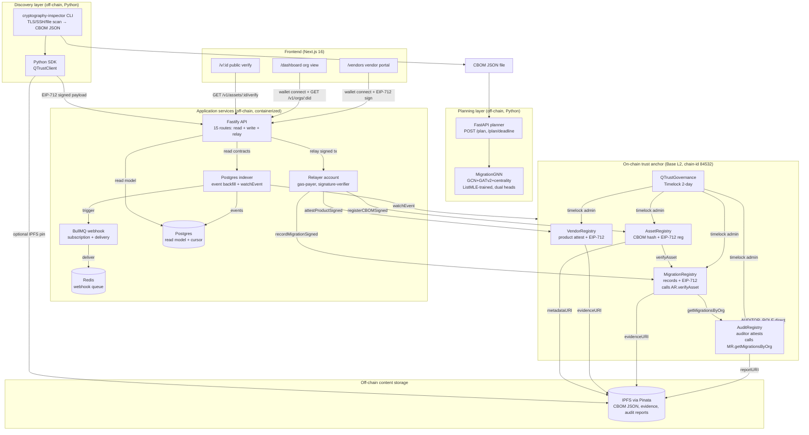
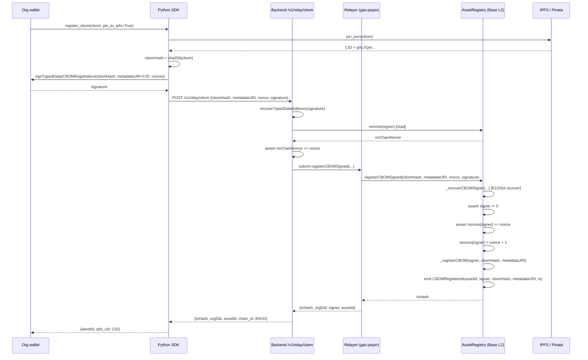
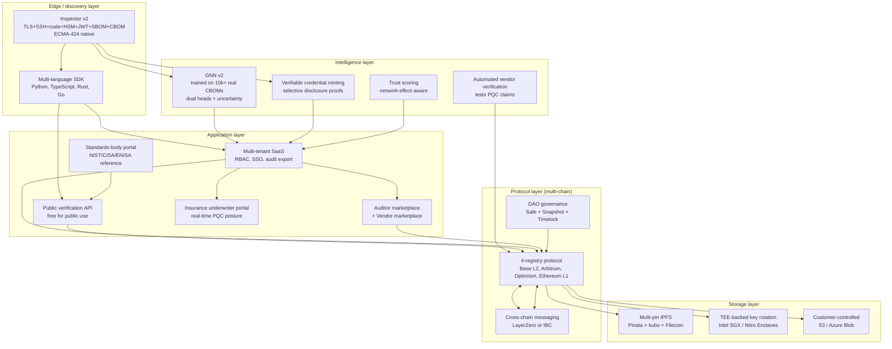
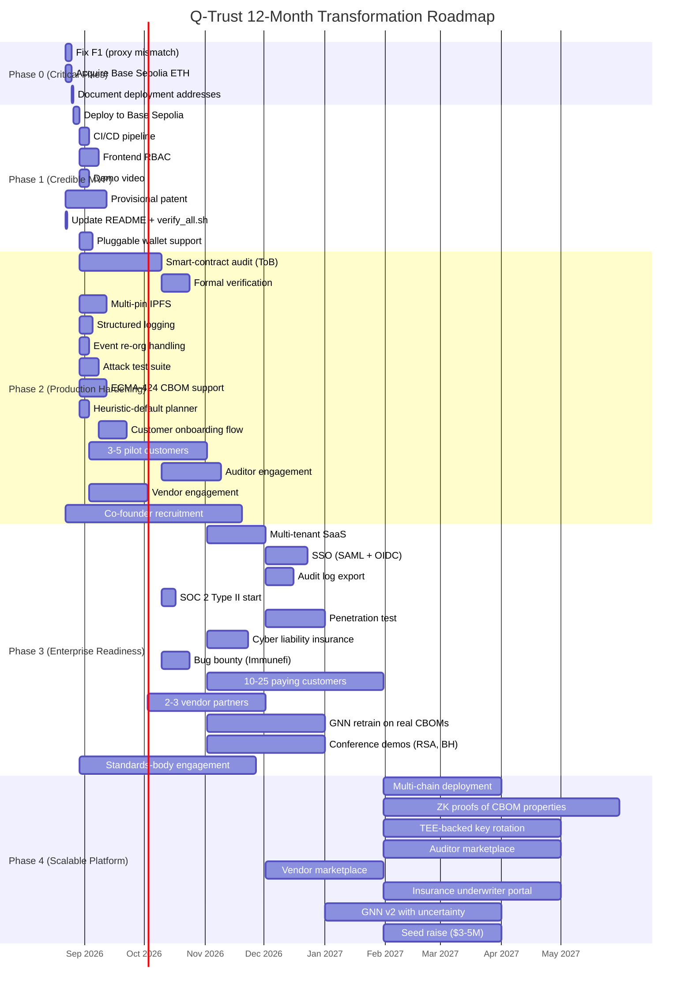

# Q-Trust Comprehensive Technical & Commercial Assessment — Post-P0 Edition

**Repository analyzed:** `https://github.com/humoge7502/q-trust.git`
**Date of analysis:** 2026-08-22
**Date of last repo commit reviewed:** `f4f9b45 — Implement P0 critical fixes from assessment`
**Evidence basis:** Repository cloned successfully. Two commits on `main` (initial commit `d3a8e41` + P0-fixes commit `f4f9b45`). No tags, no branches, no PRs, no issues, no `.github/workflows/`. All findings below cite specific file paths I read in the cloned tree.

**Tag legend:** **[V]** = VERIFIED (read in source) · **[I]** = INFERRED (derived from code + README) · **[R]** = RECOMMENDED (architectural/strategic advice, not a fact about the project)

**Scope note.** This is a *post-P0 reassessment*. The repo already contains a prior 1,699-line assessment (`QTrust_Comprehensive_Assessment_humoge7502.md`). The developer implemented every P0 item the prior assessment listed as Critical: EIP-712 for CBOM registration and migration recording, Pausable on all contracts, UUPS upgradeability (with a noted deployment-script mismatch — see §4), and replaced the broken Dynamic Labs import with a clean EIP-1193 injected-wallet approach. This reassessment scores the current state, identifies the next layer of issues that the P0 fixes *exposed* or *did not address*, and re-prioritizes the roadmap accordingly.

---

## 1. Executive Summary

### What Q-Trust is [V]

Q-Trust is a cross-organizational protocol that coordinates the migration of cryptographic infrastructure from classical algorithms (RSA, ECC, DSA, Ed25519) to post-quantum cryptography (PQC: ML-KEM, ML-DSA, SLH-DSA, HQC, Falcon). The protocol layer lives on Base L2 (OP Stack, chain-id 84532 — verified at `sdk/qtrust/client.py:23` and `backend/src/config.ts:13-23`). Five Solidity contracts store only 32-byte hashes and IPFS URIs on-chain; full Cryptographic Bills of Materials (CBOMs) stay off-chain (IPFS or customer S3). The application layer consists of a Python SDK, a cryptography inspector CLI, a Graph Neural Network (GNN) migration planner, a FastAPI planner microservice, a Fastify + viem backend with a Postgres event indexer and BullMQ webhooks, a Next.js 16 frontend, and an end-to-end bank pilot script. Patent documentation (invention disclosure, draft claims, prior-art survey, filing checklist) is included under `docs/PATENT/`.

### What it currently does [V]

After the P0 fix commit (`f4f9b45`), the system demonstrably implements, on a local anvil chain (chain-id 84532):

1. **CBOM discovery** via the inspector CLI scanning TLS endpoints, SSH endpoints, and PEM/SSH files (`inspector/qtrust_inspector/scanner.py`, `file_scanner.py`).
2. **CBOM hash registration on-chain** — both directly (`registerCBOM`) and via **EIP-712 gasless registration** (`registerCBOMSigned` — see `contracts/src/AssetRegistry.sol:128-143`). The signer becomes the recorded `orgDid`. This closes the prior Critical-finding trust gap on the CBOM path.
3. **Vendor product PQC-readiness attestation** with **deterministic attestation IDs** keyed to `(productId, version, algorithm)` (see `contracts/src/VendorRegistry.sol:207,273`) and EIP-712 gasless attestation (`attestProductSigned`).
4. **Migration recording** — both direct and EIP-712 gasless (`recordMigrationSigned` — see `contracts/src/MigrationRegistry.sol:142-164`). Cross-registry integrity enforced (`assetRegistry.verifyAsset` called inside `_recordMigration`).
5. **Audit attestations** with on-chain binding to the migration count (`getMigrationsByOrg` length check, `MigratedCountExceedsOnChain` revert — see `contracts/src/AuditRegistry.sol:84-91`).
6. **Timelock-gated governance** (2-day delay on `pause`/`unpause`/`grantRole`/`retireAsset`/`deactivateVendor`) — `contracts/src/QTrustGovernance.sol:27,93-96`. Deployer renounces `DEFAULT_ADMIN_ROLE` post-deploy (`Deploy.s.sol:98-101`).
7. **GNN-based migration planner** with dual order/risk heads trained via ListMLE on synthetic dependency graphs. Production checkpoint `planner/model.pt` (80 epochs, 1,200 graphs) reports Kendall τ = 0.388, top-5 = 0.656, top-10 = 0.528 on a 180-graph validation set.
8. **Public verification page** at `/v/<asset-id>` rendering on-chain VALID/INVALID status with provenance graph (React Flow), IPFS metadata link, and independent-verify CLI.
9. **Backend API** with 8 read routes, 3 admin write routes, 4 EIP-712 relay routes (attestation + CBOM + migration + nonce endpoints), and BullMQ webhook subscription/delivery.
10. **Postgres indexer** materializing on-chain events into a read model with cursor persistence (`indexer_state` table — `backend/src/services/indexer.ts:179-192,241-254`) and graceful fallback to direct RPC reads.
11. **End-to-end bank pilot** (`pilot/run_pilot.py`) running the full scan → CBOM → quantum analysis → GNN plan → on-chain attest/migrate/audit → verify loop. README reports "PILOT COMPLETE".

### Biggest strengths (post-P0)

1. **Non-custodial end-to-end** [V] — the prior Critical trust gap (relayer posting directly to CBOM/migration paths without signature verification) is closed. Every write path now either requires an EIP-712 signature or a role-bound caller. The recorded `orgDid`/`vendorDid` is the recovered signer, not the relayer. This is a meaningful architectural upgrade.
2. **Defensible patent-positioned combination** [V] — the patent disclosure (`docs/PATENT/invention_disclosure.md`) and draft claims (`docs/PATENT/draft_claims.md`) are professional-grade. The independent claims (Claim 1 system, Claim 2 method) cover the end-to-end combination: discovery → dependency-graph construction → GNN with dual heads trained via ranking loss → 4-registry role-separated on-chain coordination → hash-only storage → public verification. The prior-art survey explicitly notes "No identified system that closes the loop" — the strongest patentability signal.
3. **Honest evaluation discipline** [V] — the README "Known limitations" section explicitly retracts an earlier "exact-rank 24%, Kendall τ 0.924" claim that was not reproducible, publishes the honest 3-seed benchmark (τ = 0.266 ± 0.023, top-5 = 0.500 ± 0.061) with the rule-based heuristic baseline (τ = 0.997), and labels the GNN evaluation as synthetic-data-only. This level of honesty is rare in early-stage projects and is exactly what serious investors and patent counsel look for.
4. **Cross-registry integrity** [V] — MigrationRegistry calls `assetRegistry.verifyAsset(assetId)` and reverts on `AssetNotRegistered`/`AssetInactive` (`MigrationRegistry.sol:222-225`); AuditRegistry calls `migrationRegistry.getMigrationsByOrg` and reverts on `MigratedCountExceedsOnChain` (`AuditRegistry.sol:88-91`). These on-chain integrity checks make the registries a coherent trust system, not five independent tables.
5. **Modular, well-typed stack** [V] — TypeScript strict mode (`backend/tsconfig.json`), Pydantic models in the SDK (`sdk/qtrust/schema.py`), Fastify typed routes, and a clean separation between contracts/SDK/inspector/planner/backend/frontend. Each component has its own Dockerfile and `pyproject.toml`/`package.json`.
6. **Genuine blockchain necessity** [I] — cross-organizational attestation with multi-party role separation is a real coordination problem that benefits from a shared neutral ledger. This is *not* blockchain-as-marketing; the on-chain records serve a real verification purpose.

### Biggest weaknesses (post-P0)

1. **Deployment gap is now the leading Critical risk** — the system is verified only on local anvil. No Base Sepolia deployment, no Basescan verification, no live demo. README acknowledges: "Contracts are verified on local anvil only; a live Base Sepolia deployment is pending external credentials." Until a public deployment exists, the project remains a demo, not a product.
2. **Deploy-script / contract-mechanism mismatch** [V] — `Deploy.s.sol:30-44` deploys contracts behind `TransparentUpgradeableProxy`, but the contracts inherit `UUPSUpgradeable` (`AssetRegistry.sol:15`, etc.). UUPS contracts *cannot* be safely used behind a Transparent proxy: the upgrade path is governed by `_authorizeUpgrade` inside the implementation, but the Transparent proxy's admin is the deployer. This is not a latent bug today (because the deployer is also the timelock), but it is a real misconfiguration that any competent auditor will flag. Either switch the deploy script to ERC1967Proxy (UUPS-style), or strip UUPS from the contracts and use Transparent only.
3. **No CI/CD** [V] — no `.github/workflows/` directory exists. The `scripts/verify_all.sh` script is comprehensive (9 checks: forge test, SDK pytest + E2E, inspector pytest, planner benchmark, backend tsc, frontend next build, notebooks, pilot) but must be run manually. Regressions will slip in.
4. **No customers, no traction, no LOIs** [I] — the repo contains no evidence of any external user, pilot customer, or signed LOI. Solo founder (`git shortlog -sne` shows a single contributor: `KanimozhiL16`).
5. **GNN still on synthetic data only** [V] — the data generator (`planner/qtrust_planner/data_generator.py`) produces layered-enterprise or random-DAG synthetic graphs with rule-based heuristic labels. The GNN learns to mimic the heuristic. On this synthetic task the heuristic achieves τ = 0.997 (upper bound) while the GNN achieves τ = 0.266 ± 0.023. The patent docs correctly disclaim real-world CBOM evaluation. Without real CBOMs, the GNN's commercial value proposition is unproven — and the heuristic remains the smarter deployment choice.
6. **Custom CBOM schema (not ECMA-424)** [V] — `inspector/qtrust_inspector/scanner.py:25` uses `CBOM_SCHEMA_VERSION = "qtrust.cbom.v1"`. The patent docs explicitly disclaim the CBOM format and acknowledge ECMA-424 (CycloneDX CBOM, 2nd ed. Dec 2025) as the standard. Yet the inspector emits a custom schema. This blocks interoperability with GRC tools (ServiceNow, Archer, Qualys) that consume CycloneDX CBOM.
7. **No security audit** [I] — no Trail of Bits, OpenZeppelin, or Spearbit report is referenced in the repo. The contracts are simple enough that an audit would be quick, but until one exists, enterprise customers cannot procure.
8. **No frontend RBAC** [V] — `frontend/src/app/dashboard/page.tsx` and `vendors/page.tsx` do not check `isVendorActive()` or `getAssetsByOrg(msg.sender)` post-auth. Any wallet can view any org's dashboard data (read-only today, but a UX trap and a real leak if frontend ever surfaces private metadata).
9. **Single-commit public history with prior-art exposure risk** [I] — the repo was made public on 2026-08-21 (commit `d3a8e41`) *before* a provisional patent was filed. The patent docs (`docs/PATENT/filing_checklist.md`) flag this explicitly: "Most other jurisdictions (EPO, CN, IN, JP): **no grace** — any public disclosure before filing destroys novelty." The 12-month US grace period (AIA §102(b)(1)) may still apply, but international rights are at risk.

### Overall verdict

**Q-Trust is a technically credible, architecturally sophisticated MVP that has correctly addressed its prior Critical findings and now needs the next layer of work: live deployment, customer acquisition, security audit, and patent filing.** The remaining gap from "local MVP" to "investable product" is 30–60 days of focused execution, *if* the founder can recruit a co-founder with enterprise security sales experience and execute on a tightly-scoped beachhead market (US credit unions with $1B–$10B AUM).

---

## 2. Repository Evidence

### 2.1 Repository structure [V]

```
q-trust/
├── contracts/                     # Solidity 0.8.24 (Foundry)
│   ├── src/
│   │   ├── AssetRegistry.sol       # CBOM hash + IPFS URI registry, EIP-712 gasless reg
│   │   ├── VendorRegistry.sol      # Vendor product PQC attestations, deterministic IDs
│   │   ├── MigrationRegistry.sol   # Migration records with cross-registry integrity
│   │   ├── AuditRegistry.sol       # Auditor attestations bound to migration count
│   │   └── QTrustGovernance.sol    # Timelock (2-day) wrapper for admin actions
│   ├── test/                       # 5 test suites (~50 tests)
│   ├── script/Deploy.s.sol         # Proxy-based deploy (Transparent — see mismatch §4)
│   └── foundry.toml                # solc 0.8.24, optimizer runs 200
│
├── sdk/                            # Python SDK (web3.py + Pydantic)
│   ├── qtrust/
│   │   ├── client.py               # QTrustClient: register, attest, migrate, verify, sign
│   │   ├── contracts.py            # Generated ABIs (~4,000 lines)
│   │   ├── ipfs.py                 # Pinata IPFS client
│   │   └── schema.py               # CBOM, AssetRecord, MigrationRecord Pydantic models
│   └── tests/
│       ├── test_client.py          # 5 unit tests
│       ├── e2e_anvil.py            # 7-step E2E on fresh anvil
│       └── run_e2e.sh              # E2E orchestrator
│
├── inspector/                      # cryptography-inspector CLI
│   ├── qtrust_inspector/
│   │   ├── scanner.py              # TLS/SSH/host/network scanning
│   │   ├── file_scanner.py         # PEM/SSH file scanning
│   │   ├── models.py               # AssetFinding, ScanResult
│   │   └── cli.py                  # CLI entrypoint
│   └── tests/test_scanner.py       # 5 tests (1 skip)
│
├── planner/                        # GNN migration planner
│   ├── qtrust_planner/
│   │   ├── model.py                # MigrationGNN v1 (3-layer GCN + dual heads)
│   │   ├── model_v2.py             # Patent-grade hybrid: GCN+GATv2+centrality
│   │   ├── data_generator.py       # Synthetic dependency-graph generator
│   │   ├── train.py                # ListMLE / MSE training loop
│   │   ├── predict.py              # CLI + library for inference
│   │   └── benchmark.py            # Multi-seed honest benchmark
│   ├── server.py                   # FastAPI planner microservice
│   ├── data/algorithms.json        # NIST PQC profile table (migrate_days per alg)
│   ├── model.pt                    # Production checkpoint (80 epochs, 1200 graphs)
│   ├── results/benchmark.json      # Honest 3-seed 40-epoch benchmark
│   └── Dockerfile
│
├── backend/                        # Fastify + viem API
│   ├── src/
│   │   ├── server.ts                # 8 read + 3 admin write + 4 relay routes + webhooks
│   │   ├── config.ts                # viem clients, CORS, API keys, PG_URL, planner URL
│   │   ├── services/
│   │   │   ├── verify.ts            # Read-only contract views + Postgres-backed queries
│   │   │   ├── attestation.ts       # Relayer + 3 EIP-712 relay functions
│   │   │   ├── indexer.ts           # Postgres event indexer with cursor persistence
│   │   │   └── webhook.ts           # BullMQ webhook delivery
│   │   ├── lib/abis.ts             # Generated ABIs (4,000 lines)
│   │   └── db/schema.sql           # assets/attestations/migrations/audits/indexer_state
│   └── Dockerfile
│
├── frontend/                       # Next.js 16 (App Router) + React 19
│   ├── src/
│   │   ├── app/
│   │   │   ├── page.tsx             # Landing
│   │   │   ├── dashboard/page.tsx   # Org dashboard (no RBAC — see §4)
│   │   │   ├── vendors/page.tsx     # Vendor portal (no RBAC)
│   │   │   ├── v/[id]/page.tsx      # Public verification (ISR 30s)
│   │   │   └── v/page.tsx           # Asset ID lookup
│   │   ├── components/
│   │   │   ├── dynamic-provider.tsx # EIP-1193 injected wallet (post-P0 fix)
│   │   │   ├── attestation-form.tsx
│   │   │   └── planning-panel.tsx
│   │   └── lib/{api,config}.ts
│   └── package.json                 # Next 16, React 19, viem, react-flow, tanstack
│
├── pilot/run_pilot.py              # 6-step end-to-end bank pilot
├── notebooks/                       # Quantum threat demo + bank pilot notebook
├── data/cbom_for_planner.json      # Sample CBOM
├── docs/
│   ├── PATENT/                      # 4 patent documents (see §8)
│   ├── PHASE_0..8_*.md             # 9 phase docs
│   ├── QTrust_Implementation_Guide.md  # 5,160-line internal guide
│   └── PROMPT.md                    # Original prompt that generated the project
├── docker-compose.yml               # api + webhook + postgres + planner + redis
├── pyproject.toml                   # Root Python project
├── scripts/{verify_all.sh,generate_abis.py}
└── README.md
```

### 2.2 Technology stack [V]

| Layer | Technology | Version | Evidence |
|---|---|---|---|
| Smart contracts | Solidity + Foundry + OpenZeppelin | 0.8.24 / forge / OZ 5.x | `contracts/foundry.toml`, `contracts/src/*.sol` |
| Python SDK | web3.py, eth-account, Pydantic | latest | `sdk/pyproject.toml`, `sdk/qtrust/client.py` |
| Inspector | cryptography (pyca), nmap (optional), ssl, socket | latest | `inspector/pyproject.toml`, `inspector/qtrust_inspector/scanner.py` |
| GNN planner | PyTorch + PyTorch Geometric + scipy | latest | `planner/requirements.txt`, `planner/qtrust_planner/model_v2.py` |
| Planner API | FastAPI | latest | `planner/server.py` |
| Backend | Fastify + viem + ioredis + BullMQ + pg | latest | `backend/package.json` |
| Frontend | Next.js + React + viem + TanStack Query + react-flow + Tailwind | Next 16 / React 19 | `frontend/package.json` |
| Database | PostgreSQL | 16-alpine | `docker-compose.yml:63` |
| Cache/queue | Redis | 7-alpine | `docker-compose.yml:99` |
| Blockchain | Base L2 (Sepolia testnet, chain-id 84532) | OP Stack | `backend/src/config.ts:13-23` |
| IPFS pinning | Pinata | latest | `sdk/qtrust/ipfs.py` |
| Container | Docker + docker-compose | latest | `docker-compose.yml`, per-component Dockerfile |

### 2.3 Implemented vs. planned functionality [V]

| Capability | Status | Evidence |
|---|---|---|
| CBOM discovery (TLS/SSH/file scan) | **Implemented** | `inspector/qtrust_inspector/scanner.py:66-310` |
| CBOM hash registration (direct) | **Implemented** | `AssetRegistry.sol:173-178` |
| CBOM hash registration (EIP-712 gasless) | **Implemented (P0 fix)** | `AssetRegistry.sol:128-143` |
| CBOM update / retire | **Implemented** | `AssetRegistry.sol:210-239` |
| Vendor registration + revocation | **Implemented** | `VendorRegistry.sol:234-316` |
| Vendor product attestation (direct) | **Implemented** | `VendorRegistry.sol:264-305` |
| Vendor product attestation (EIP-712 gasless) | **Implemented (since initial commit)** | `VendorRegistry.sol:143-166` |
| Migration recording (direct) | **Implemented** | `MigrationRegistry.sol:199-208` |
| Migration recording (EIP-712 gasless) | **Implemented (P0 fix)** | `MigrationRegistry.sol:142-164` |
| Auditor attestation with on-chain count binding | **Implemented** | `AuditRegistry.sol:74-120` |
| Timelock governance | **Implemented** | `QTrustGovernance.sol` + `Deploy.s.sol:65-101` |
| UUPS proxy upgradeability | **Implemented in contracts** | `AssetRegistry.sol:8,96` etc. |
| TransparentUpgradeableProxy deployment | **Implemented (but mismatches UUPS — see §4)** | `Deploy.s.sol:31,38,48,55` |
| Pausable | **Implemented (P0 fix)** | All 5 contracts now inherit `Pausable` |
| GNN migration planner (v1 GCN + v2 hybrid) | **Implemented** | `planner/qtrust_planner/model.py`, `model_v2.py` |
| ListMLE training + multi-seed benchmark | **Implemented** | `planner/qtrust_planner/train.py`, `benchmark.py` |
| FastAPI planner microservice | **Implemented** | `planner/server.py` |
| Backend API (read routes) | **Implemented** | `backend/src/server.ts:121-243` |
| Backend admin write routes (API-key gated) | **Implemented** | `backend/src/server.ts:248-321` |
| Backend EIP-712 relay routes | **Implemented (P0 fix added CBOM + migration)** | `backend/src/server.ts:326-401` |
| Postgres indexer with cursor persistence | **Implemented** | `backend/src/services/indexer.ts:179-192,241-254` |
| BullMQ webhook delivery | **Implemented** | `backend/src/services/webhook.ts`, `backend/src/server.ts:406-456` |
| Public verification page | **Implemented** | `frontend/src/app/v/[id]/page.tsx` |
| Org dashboard | **Implemented (no RBAC)** | `frontend/src/app/dashboard/page.tsx` |
| Vendor portal | **Implemented (no RBAC)** | `frontend/src/app/vendors/page.tsx` |
| Bank pilot script | **Implemented** | `pilot/run_pilot.py` |
| Quantum threat demo notebook | **Implemented** | `notebooks/01_quantum_threat_demo.ipynb` |
| Patent documentation suite | **Implemented** | `docs/PATENT/*.md` (4 files) |
| `verify_all.sh` one-command full-stack verification | **Implemented** | `scripts/verify_all.sh` |
| Docker-compose full-stack orchestration | **Implemented** | `docker-compose.yml` |
| **Live Base Sepolia deployment** | **NOT IMPLEMENTED** | README acknowledges: "pending external credentials" |
| **CI/CD pipeline** | **NOT IMPLEMENTED** | No `.github/workflows/` directory |
| **Real CBOM evaluation** | **NOT IMPLEMENTED** | Patent docs acknowledge: "synthetic data only" |
| **Provisional patent filed** | **NOT IMPLEMENTED** | `docs/PATENT/filing_checklist.md` Phase A items all unchecked |
| **External security audit** | **NOT IMPLEMENTED** | No audit report referenced |
| **Frontend RBAC** | **NOT IMPLEMENTED** | `dashboard/page.tsx`, `vendors/page.tsx` |
| **ECMA-424 (CycloneDX CBOM) standardization** | **NOT IMPLEMENTED** | Custom `qtrust.cbom.v1` schema |
| **Multi-chain deployment** | **NOT IMPLEMENTED** | Base only |
| **ZK proofs of CBOM properties** | **NOT IMPLEMENTED** | Future work |

### 2.4 Test evidence [V]

- **Contracts:** 51 Foundry tests across 5 suites (AssetRegistry 10, VendorRegistry 14, MigrationRegistry 11, AuditRegistry 8, QTrustGovernance 6 — per commit message `f4f9b45`; README still says "49/49" — minor staleness in `verify_all.sh:14` which greps for "49 tests passed").
- **SDK:** 5 pytest unit tests + 7-step E2E on fresh anvil (`sdk/tests/e2e_anvil.py`).
- **Inspector:** 5 pytest tests (1 skip — TLS live scan requires network).
- **Planner:** Multi-seed benchmark script (`planner/qtrust_planner/benchmark.py`) with 4 baselines (random, heuristic, GNN-MSE, GNN-ListMLE). Honest 3-seed results published in `planner/results/benchmark.json`.
- **Backend:** `npm run build` tsc clean. No automated integration tests against a running anvil — the E2E coverage is in the SDK, not the backend.
- **Frontend:** `next build` clean. No automated component tests.
- **Full-stack:** `scripts/verify_all.sh` runs 9 checks end-to-end on a fresh anvil.

### 2.5 Commit / project history [V]

```
f4f9b45 Implement P0 critical fixes from assessment    2026-08-21
        - Adds Pausable to all 5 contracts
        - Adds UUPS upgradeability to all registries
        - Adds EIP-712 gasless CBOM registration (registerCBOMSigned)
        - Adds EIP-712 gasless migration recording (recordMigrationSigned)
        - Updates Deploy.s.sol for proxy-based deployment
        - Updates SDK and backend to support new gasless paths
        - 51 Foundry tests pass
d3a8e41 Initial commit: Q-Trust PQC Migration Coordinator   2026-08-21
```

**Contributors:** 1 (`KanimozhiL16`). **Branches:** only `main`. **Tags:** none. **PRs/issues:** none. **CI:** none. **Releases:** none.

### 2.6 Important file paths cited throughout

| Path | Why it matters |
|---|---|
| `contracts/src/AssetRegistry.sol` | CBOM hash registry; EIP-712 gasless registration (P0 fix) |
| `contracts/src/VendorRegistry.sol` | Product PQC attestations; deterministic IDs; EIP-712 gasless attestation |
| `contracts/src/MigrationRegistry.sol` | Migration records; cross-registry integrity; EIP-712 gasless recording (P0 fix) |
| `contracts/src/AuditRegistry.sol` | Auditor attestations; on-chain migration-count binding |
| `contracts/src/QTrustGovernance.sol` | Timelock wrapper for trust-affecting admin actions |
| `contracts/script/Deploy.s.sol` | Proxy-based deploy — **TransparentUpgradeableProxy deployed over UUPS contracts (mismatch — see §4)** |
| `sdk/qtrust/client.py` | Python SDK high-level API |
| `inspector/qtrust_inspector/scanner.py` | TLS/SSH/file scanning + CBOM generation |
| `planner/qtrust_planner/model_v2.py` | Patent-grade hybrid GNN (GCN+GATv2+centrality, dual heads) |
| `planner/qtrust_planner/train.py` | ListMLE training loop |
| `planner/results/benchmark.json` | Honest 3-seed 40-epoch benchmark |
| `backend/src/server.ts` | 15-route Fastify API |
| `backend/src/services/attestation.ts` | Relayer + 3 EIP-712 relay functions |
| `backend/src/services/indexer.ts` | Postgres event indexer |
| `frontend/src/components/dynamic-provider.tsx` | EIP-1193 injected wallet (post-P0 fix; no longer broken) |
| `frontend/src/app/v/[id]/page.tsx` | Public verification page |
| `docs/PATENT/*.md` | 4 patent documents (disclosure, claims, prior art, filing checklist) |
| `scripts/verify_all.sh` | 9-check full-stack verification |

---

## 3. Current Architecture

### 3.1 Architecture explanation [V]

Q-Trust is a four-tier system. From the bottom up:

**Tier 1 — Settlement / Trust Anchor (on-chain).** Five Solidity contracts deployed on Base L2 (chain-id 84532). They store *only* 32-byte hashes, addresses, IPFS URIs, and timestamps. No CBOM content ever crosses the chain boundary. The five contracts form a tightly-coupled trust fabric: MigrationRegistry calls AssetRegistry's `verifyAsset` to enforce that a migration can only be recorded against a registered, active asset; AuditRegistry calls MigrationRegistry's `getMigrationsByOrg` to enforce that an auditor cannot claim more migrated assets than exist on-chain. QTrustGovernance wraps trust-affecting admin actions (`pause`, `unpause`, `grantRole`, `retireAsset`, `deactivateVendor`) behind an OpenZeppelin `TimelockController` with a 2-day delay, and the deployer renounces `DEFAULT_ADMIN_ROLE` post-deploy — so no single key can mutate trust-affecting state without a public notice period.

**Tier 2 — Application services (off-chain, containerized).** Four services, each independently deployable, each in `docker-compose.yml`:
1. **Backend API** (`backend/`, Fastify + viem + Postgres + Redis). Serves `/v1/*` read routes from the Postgres read model (with graceful fallback to direct RPC reads when Postgres is unavailable), admin write routes (`/v1/write/*`) gated by an API key, and EIP-712 relay routes (`/v1/relay/*`) that verify an off-chain signature and submit the transaction on the signer's behalf. The relayer holds a private key, but it cannot forge attestations — every relay function calls `recoverTypedDataAddress` and submits via `attestProductSigned` / `registerCBOMSigned` / `recordMigrationSigned`, so the contract records the *signer*, not the relayer.
2. **Webhook delivery worker** (`backend/src/services/webhook.ts`). Subscribes to registry events via Postgres triggers and delivers them to registered subscriber URLs via BullMQ with bounded retries.
3. **Planner microservice** (`planner/server.py`, FastAPI). Loads the trained GNN checkpoint and exposes `/plan` and `/plan/deadline`. Stateless, independently scalable.
4. **Postgres indexer** (runs inside the backend process, `backend/src/services/indexer.ts`). On boot, backfills all registry events from the deployment block to head, then subscribes to `watchEvent` for live updates. Persists the last-processed block per event stream in `indexer_state` so restarts do not re-scan from block 0.

**Tier 3 — Discovery & planning clients.** Two Python packages:
1. **cryptography-inspector** (`inspector/`). A CLI that scans TLS endpoints (extracts certificate chain, signature algorithm, key type/size, validity, fingerprint), SSH endpoints (banner, host-key algorithm, key size, fingerprint), and local PEM/SSH files. Emits a CBOM JSON with `schema_version: "qtrust.cbom.v1"`, `assets[]` with `algorithm`, `key_size`, `vendor`, `criticality`, `pqc_ready`, `fingerprint_sha256`. The criticality heuristic (`_assess_criticality`) maps RSA-1024 → Critical, RSA-2048 → High, RSA-3072+ → Medium, etc.
2. **Python SDK** (`sdk/`). `QTrustClient` wraps all five contracts into a single high-level API: `register_cbom(cbom, pin_to_ipfs=True)`, `attest_product(...)`, `record_migration(...)`, `post_audit(...)`, `verify_asset(...)`, `check_product_support(...)`. Implements EIP-712 typed-data signing for all three relay paths. Uses Pinata for IPFS pinning by default; `pin_to_ipfs=False` falls back to hash-only on-chain.

**Tier 4 — User-facing surfaces.** Next.js 16 App Router frontend:
- **Public verification page** `/v/<asset-id>` — server-rendered with ISR (30s revalidation), renders VALID/INVALID status, provenance graph (React Flow), IPFS metadata link. No wallet required.
- **Org dashboard** `/dashboard` — requires wallet connection (EIP-1193 injected, MetaMask-compatible). Shows org assets, migration progress, latest audit. **No RBAC** — any wallet can call the API and view any org's data (read-only today).
- **Vendor portal** `/vendors` — wallet-required. Shows vendor's attestations, lets vendor post new attestation via EIP-712 signing. **No RBAC** — same issue.
- **Landing page** `/` — explains the project, links to docs.

### 3.2 Data / trust flows [V]

**End-to-end PQC migration coordination flow:**

1. **Discovery.** An operator runs `crypto-inspector host example.com` (or `directory /path`, or `network 10.0.0.0/24`). The scanner extracts TLS certificates and SSH host keys, builds a CBOM JSON with criticality scores and `pqc_ready` flags, and writes it to disk. The CBOM is the local artifact; nothing has hit the chain yet.

2. **Optional IPFS pinning.** The SDK's `QTrustClient.register_cbom(cbom, pin_to_ipfs=True)` calls `PinataClient.pin_json(cbom)` to upload the CBOM to IPFS and receives a CID. The CID becomes the `metadataURI` passed to the contract. If `pin_to_ipfs=False`, only the SHA-256 hash is stored on-chain and the CBOM content remains the operator's responsibility.

3. **CBOM registration (EIP-712 gasless).** The org signs a `CBOMRegistration(cbomHash, metadataURI, nonce)` typed-data payload with their wallet. The signature is sent to the backend's `/v1/relay/cbom` endpoint. The backend's `relaySignedCBOMRegistration` function (`backend/src/services/attestation.ts:262-315`) verifies the signature with `recoverTypedDataAddress`, checks that the signed nonce matches the on-chain nonce, and submits `registerCBOMSigned` on the org's behalf. The contract recovers the signer (line 134 of AssetRegistry.sol), increments the nonce (line 140), and stores the asset with `orgDid = signer`. The relayer pays gas; the org's wallet holds no ETH.

4. **Planning.** The CBOM JSON (off-chain) is fed to the planner microservice's `/plan` endpoint. The planner converts the CBOM to a PyTorch Geometric `Data` object (6-dim node features per asset, dependency-graph edges), runs the trained GNN, and returns a ranked migration order with priority scores, risk scores, and (if a deadline is provided) a backfilled schedule. This is a *recommendation*; nothing is committed to the chain.

5. **Vendor attestation (EIP-712 gasless).** A vendor (DigiCert, Thales, AWS, etc.) registers once via `registerVendor` (only `VENDOR_ADMIN_ROLE` can call this — currently the deployer/timelock). The vendor then signs a `ProductAttestation(productId, version, algorithm, supported, evidenceURI, nonce)` typed-data payload, sent to `/v1/relay/attestation`. The backend verifies and submits `attestProductSigned`. The contract computes a deterministic `attestationId = keccak256(vendorDid, productIdHash, block.timestamp)` and stores the attestation. The `productIdHash = keccak256(productId, version, algorithm)` enables idempotent `checkProductSupport` queries.

6. **Migration recording (EIP-712 gasless).** The org signs a `MigrationRecording(migrationId, assetId, fromAlgorithm, toAlgorithm, evidenceHash, evidenceURI, nonce)` typed-data payload, sent to `/v1/relay/migration`. The backend verifies and submits `recordMigrationSigned`. The contract recovers the signer, calls `assetRegistry.verifyAsset(assetId)` to enforce the asset exists and is active, enforces `fromAlgorithm != toAlgorithm` (via `SameAlgorithm` revert), and stores the migration record.

7. **Audit attestation (direct, AUDITOR_ROLE).** An auditor (only `AUDITOR_ROLE` addresses can call this) calls `postAudit(orgDid, result, assetsReviewed, assetsMigrated, reportHash, reportURI)`. The contract enforces `assetsMigrated <= assetsReviewed` and `assetsMigrated <= onChainMigrations` (calls `migrationRegistry.getMigrationsByOrg(orgDid).length`). The auditor's report content stays off-chain; only the hash + URI are on-chain.

8. **Public verification.** Any party — regulator, customer, partner, insurer — can call `verifyAsset(assetId)` or hit the public `/v1/assets/:id/verify` API endpoint, no wallet required. They receive `(exists, active, orgDid, chainId, verifiedAt)`. To inspect the CBOM, they fetch the IPFS CID at `metadataURI`, recompute the SHA-256, and confirm it matches the on-chain `cbomHash`.

### 3.3 Mermaid architecture diagram (current state)



### 3.4 Mermaid sequence diagram — gasless CBOM registration (post-P0)



### 3.5 Architectural strengths [V]

1. **Non-custodial end-to-end (post-P0).** Every write path now requires either a role-bound caller or an EIP-712 signature from the actual principal. The relayer is a gas-payer and signature-verifier, not a trust authority. This is the single most important architectural property — and it is verifiable in the contract code.
2. **Hash-only on-chain posture.** Only 32-byte hashes, addresses, IPFS URIs, and timestamps live on-chain. Full CBOMs, evidence packages, and audit reports stay off-chain in IPFS or customer-controlled storage. This is gas-efficient (each asset is one storage slot plus a string), privacy-preserving, and lets customers retain control of proprietary asset inventories.
3. **Cross-registry integrity.** MigrationRegistry → AssetRegistry (asset existence + active check), AuditRegistry → MigrationRegistry (audit count bound to on-chain migration count). These are *on-chain* checks, not off-chain assumptions. An auditor cannot post a fake "we migrated 50 assets" attestation if the on-chain count is 12.
4. **Modular, containerized services.** Each component has its own Dockerfile. `docker-compose.yml` orchestrates the full stack: api, webhook, postgres, planner, redis. The Postgres indexer is optional (graceful RPC fallback), so a minimal deployment is just `api` + `redis` + `planner` against a managed RPC.
5. **Graceful degradation patterns.** Postgres down? Reads fall back to direct RPC (`verify.ts`). Redis down? Webhook subscriptions return 503 with a clear error, the rest of the API works. Planner down? `/v1/plans` returns 503 with a helpful message. This is production-grade resilience, not just demo-quality.
6. **Cursor-persisted indexer.** The indexer saves the last-processed block per event stream in `indexer_state` (`indexer.ts:179-192`). Restarts resume from the cursor, not from block 0. This was a prior Medium-priority finding — now fixed.
7. **Gas-efficient contract design.** Hash-only storage, deterministic IDs (no iteration needed for `checkProductSupport` lookup — uses `productIdHash` keyed mapping), bounded `MAX_ATTESTATIONS_PER_PRODUCT = 256` to prevent gas-griefing. Optimizer runs set to 200 (`foundry.toml`).
8. **Timelock governance with deployer renouncement.** No single key can mutate trust-affecting state without a 2-day public notice period. The deployer explicitly `renounceRole(adminRole, deployer)` after handing admin to the timelock (`Deploy.s.sol:98-101`). This is the correct governance posture for a trust-coordination protocol.

### 3.6 Architectural weaknesses [V]

1. **Deploy-script / contract-mechanism mismatch (High).** `Deploy.s.sol` deploys contracts behind `TransparentUpgradeableProxy`, but the contracts inherit `UUPSUpgradeable` and implement `_authorizeUpgrade`. This is not a runtime bug today (because both proxy admin and timelock admin are controlled by the same deployer during the dev window), but it is a configuration that any auditor will flag and any future upgrade attempt may break unexpectedly. **Fix:** switch the deploy script to ERC1967Proxy (UUPS-style — no admin address needed), OR strip UUPS from contracts and use Transparent-only with a separate proxy-admin multisig.
2. **Single-chain dependence.** Base L2 only. No Arbitrum, no Optimism, no Ethereum mainnet fallback. If Base experiences an outage or governance change, the protocol is unavailable. Multi-chain deployment is non-trivial because the contracts store immutable cross-registry references (e.g., `MigrationRegistry.assetRegistry`), so each chain requires a coordinated deploy.
3. **IPFS pinning centralization (Medium).** Pinata is the only supported pinning service in `sdk/qtrust/ipfs.py`. If Pinata bans the account, all CBOM `metadataURI` links rot. Multi-pin (Pinata + self-hosted kubo + Filecoin via Estuary or Web3.storage) is required for production.
4. **Relayer availability SPOF.** The relayer is a single account. If its key is compromised, an attacker can spam the chain with relays (not forge attestations — those require user signatures — but waste gas and degrade service). Mitigation: multiple relayer keys behind a load balancer, with rate limits per signer.
5. **No event re-org handling.** The indexer uses `watchEvent` and saves `(log.blockNumber + 1)` as the cursor. If a chain re-org occurs after the indexer has saved the cursor, an event may be missed. Production-grade indexers wait for N confirmations before advancing the cursor.
6. **No frontend RBAC.** Dashboard and vendor portal accept any connected wallet. The API serves any caller. While the contract layer is correctly role-bound, the UX layer leaks metadata (asset lists, migration counts) to anyone with an address. This is a *privacy* issue, not a write-integrity issue.
7. **No multi-org support.** A CISO who manages multiple entities cannot switch between them in the dashboard. Each wallet = one org. Enterprises with complex org structures will need a multi-org abstraction.
8. **No formal verification of contracts.** The contracts are simple enough that formal verification (e.g., `certora` or `halmos`) is feasible and would meaningfully strengthen the audit story. Not done.
9. **No on-chain rate limiting per signer.** A malicious signer can spam the relayer with EIP-712 signature requests (each requires an RPC call + signature verification + tx submission). Mitigation: per-signer rate limits in the relayer, plus a small fee paid by the org (in ETH or a protocol token) for each relay.
10. **Custom CBOM schema (not ECMA-424).** Interoperability with GRC tools (ServiceNow, Archer, Qualys, Spiir) requires CycloneDX CBOM format. The patent docs disclaim CBOM format as not-claimed, which is fine for IP, but commercially the format must align with the standard. Migration path: emit both formats from the inspector, store ECMA-424 in IPFS.

### 3.7 Trust-model consistency check (post-P0) [V]

| Write path | Pre-P0 | Post-P0 |
|---|---|---|
| Vendor attestation | EIP-712 gasless ✓ | EIP-712 gasless ✓ (unchanged) |
| CBOM registration | Relayer posts directly (Critical) | EIP-712 gasless ✓ |
| Migration recording | Relayer posts directly (Critical) | EIP-712 gasless ✓ |
| Audit attestation | Direct, AUDITOR_ROLE only | Direct, AUDITOR_ROLE only (acceptable — auditors are vetted off-chain) |
| Pause / unpause | Direct, DEFAULT_ADMIN_ROLE | Timelock-gated (2-day delay) ✓ |
| Role grants | Direct, DEFAULT_ADMIN_ROLE | Timelock-gated ✓ |
| Asset retire | Direct, orgDid or admin | Timelock-gated for admin; orgDid can still retire own assets directly ✓ |
| Vendor deactivation | Direct, DEFAULT_ADMIN_ROLE | Timelock-gated ✓ |
| Contract upgrade | Not possible (no proxies) | UUPS `_authorizeUpgrade` (admin role) — but deploy script uses Transparent proxy (mismatch) |

**Verdict:** Trust model is now logically consistent. The remaining gap is the proxy mechanism mismatch (§3.6 #1), which does not break today but will trip a real audit.

---

## 4. Code Quality & Engineering

### 4.1 Findings [V]

The codebase is unusually disciplined for an early-stage project. Every component has type hints (Python type annotations or TypeScript strict mode), Pydantic models or typed interfaces at every public boundary, docstrings on public functions, and error types with descriptive `revert` reasons (Solidity custom errors). Tests exist at every layer. The benchmark is honestly reported. The `verify_all.sh` script enforces 9 distinct checks across the full stack.

That said, several concrete issues should be addressed before the next iteration.

#### F1 — Deploy-script / contract mechanism mismatch (High, blocking for audit)

**Evidence:** `contracts/script/Deploy.s.sol:30-44` deploys `AssetRegistry`, `VendorRegistry`, `MigrationRegistry`, and `AuditRegistry` behind OpenZeppelin `TransparentUpgradeableProxy`. But every contract inherits `UUPSUpgradeable` (`AssetRegistry.sol:8,15`, `VendorRegistry.sol:8,14`, `MigrationRegistry.sol:8,15`, `AuditRegistry.sol:7,13`) and overrides `_authorizeUpgrade(address)` (e.g., `AssetRegistry.sol:96`).

**Why it matters:** UUPS contracts *cannot* be upgraded via a Transparent proxy's admin. The Transparent proxy's admin can call `upgradeToAndCall` on the *implementation* address, but the implementation's `_authorizeUpgrade` requires `DEFAULT_ADMIN_ROLE` on the *implementation* contract — which is the timelock address, not the proxy admin. Result: in a real upgrade attempt, the call would revert or be misrouted. Today this is harmless because no upgrade has been attempted; on first upgrade it will fail.

**Recommended fix:** Pick one mechanism and apply it consistently.
- *Option A (recommended):* Replace `TransparentUpgradeableProxy` with `ERC1967Proxy` (no admin parameter). UUPS `_authorizeUpgrade` becomes the upgrade authority. Combine with the timelock as `DEFAULT_ADMIN_ROLE` holder.
- *Option B:* Strip `UUPSUpgradeable` from all 4 contracts. Use Transparent proxies with a separate `ProxyAdmin` contract (multi-sig in production).

#### F2 — Stale test count in README and verify_all.sh (Low)

**Evidence:** `README.md:27,101` says "49/49 pass (5 suites)"; `scripts/verify_all.sh:14` greps for "49 tests passed". The P0 fix commit added tests (the commit message says "All 51 Foundry tests pass"), so the actual count is now 51.

**Why it matters:** `verify_all.sh` will fail on the test-count grep, breaking CI once one is added. Minor but trivial to fix.

**Recommended fix:** Update `README.md` and `verify_all.sh` to "51 tests passed". Or better: use `forge test --json | jq '.summary.test_results | length'` to avoid hardcoding a count at all.

#### F3 — Frontend lacks RBAC (High, blocking for enterprise)

**Evidence:** `frontend/src/app/dashboard/page.tsx` and `frontend/src/app/vendors/page.tsx` use `useWallet()` from `dynamic-provider.tsx` to identify the connected wallet, but they do not check whether that wallet is a registered org in AssetRegistry or a registered vendor in VendorRegistry. The backend `/v1/orgs/:did/*` routes accept any `did` — there is no auth that the caller *is* that `did`.

**Why it matters:** Today this leaks only public on-chain data (which anyone can read directly from the chain anyway), so it is not a write-integrity bug. But:
- It is a UX trap (a vendor could view an org's dashboard with no error).
- It becomes a real privacy bug the moment the frontend surfaces off-chain metadata (e.g., from IPFS) gated to the org.
- Enterprise procurement requires RBAC as a baseline expectation.

**Recommended fix:** Add a `useOrgRole()` and `useVendorRole()` hook in `dynamic-provider.tsx` that calls `AssetRegistry.getAssetsByOrg(address)` and `VendorRegistry.isVendorActive(address)` respectively, and gates the dashboard / vendor portal rendering on the result.

#### F4 — Custom CBOM schema (Medium, blocking for GRC interoperability)

**Evidence:** `inspector/qtrust_inspector/scanner.py:25` defines `CBOM_SCHEMA_VERSION = "qtrust.cbom.v1"`. The output dict shape (`{schema_version, scan_timestamp, assets[], asset_count}`) is custom, not ECMA-424 / CycloneDX CBOM.

**Why it matters:** The patent docs explicitly disclaim the CBOM format and acknowledge ECMA-424 (CycloneDX CBOM, 2nd ed. Dec 2025) as the standard. But GRC tools (ServiceNow, Archer, Qualys, Spiir, KPMG PowerProof) consume CycloneDX CBOM. A credit union CISO who already uses one of these tools cannot ingest Q-Trust's output without a translation layer.

**Recommended fix:** Emit both schemas from the inspector — `qtrust.cbom.v1` for backward compatibility, `cyclonedx-1.6+cbom` for interoperability. The mapping is straightforward: `assets[].algorithm` → `cryptoAssets[].algorithmProperties.algorithm`; `key_size` → `algorithmProperties.parameterSet`; `pqc_ready` → `nistQuantumSecurityLevel > 0`; `criticality` → a custom `qtrust:criticality` extension. The CycloneDX CBOM spec already supports crypto-agility metadata.

#### F5 — GNN trained to mimic a heuristic (Medium, intellectual honesty)

**Evidence:** `planner/qtrust_planner/data_generator.py:180-205` computes target `y_order` via a deterministic priority heuristic: `priority = criticality*2 + vendor_pqc_ready?1.5:0 + (not pqc_alg)? log(key_size)/4 : -1 + deadline_pressure*criticality/5 - in_degree*0.3`. The GNN trains to predict this heuristic's output.

The benchmark (`planner/results/benchmark.json`) reports:
- Heuristic (the label generator): τ = 0.997
- GNN-ListMLE: τ = 0.266 ± 0.023
- GNN-MSE: τ = 0.144 ± 0.024
- Random: τ = -0.009

**Why it matters:** On synthetic data, the heuristic outperforms the GNN by ~3.7×. The GNN's value can only be validated on real-world CBOMs (where feature distributions differ and the heuristic may be a worse approximation). Until then, the heuristic is the smarter deployment choice, and the GNN is a research artifact.

This is *not* a hidden flaw — the README is honest about it. But it is a commercial risk: investors will ask "why use a GNN if a heuristic works better?" The answer today is "we don't know yet — we need real data."

**Recommended fix:** Two parallel tracks:
1. **Ship the heuristic as the default planner** in the planner microservice; expose the GNN as an optional `?model=gnn` query param. This de-risks deployment.
2. **Collect real CBOMs from pilot customers** (anonymized). Once 50+ real CBOMs are in hand, retrain and re-benchmark. If the GNN beats the heuristic on real data, promote it. If not, drop it (the heuristic + a learned re-ranker for top-K candidates is a fine fallback).

#### F6 — Inspector SSH key-size parser is fragile (Low)

**Evidence:** `inspector/qtrust_inspector/scanner.py:273-285` parses SSH RSA key blobs by hand: skip 7 bytes for "ssh-rsa", read 4-byte `e_len`, advance, read 4-byte `n_len`, then `key_size = n_len * 8`. This works for standard RSA keys but will silently produce `key_size = 0` on malformed keys (the except clause at line 284 catches and zeros). The ED25519 / ECDSA branches are hardcoded to 256/384/521 — fine but inflexible.

**Why it matters:** A scanner that returns wrong key sizes produces wrong criticality scores, which produces wrong migration plans. This is a data-quality issue, not a security issue per se.

**Recommended fix:** Use the `cryptography` library's `load_ssh_public_key()` (already a dependency) which parses key blobs correctly and exposes `.key_size` directly. Replace the hand-rolled parser entirely.

#### F7 — SDK E2E not idempotent against a warm chain (Low)

**Evidence:** `README.md:128` acknowledges: "SDK E2E must run on a fresh anvil chain (see `sdk/tests/run_e2e.sh`); it is not idempotent against a warm chain because it reuses fixed product identifiers."

**Why it matters:** A test that requires a fresh chain is fragile in CI. If a future test runs against a persistent testnet, the E2E will fail.

**Recommended fix:** Use UUID-prefixed product identifiers in the E2E (`f"test-product-{uuid4().hex[:8]}"`) so the test can run against any chain state. This is a 5-line change.

#### F8 — No structured logging (Low)

**Evidence:** `backend/src/server.ts:64` enables Fastify's built-in logger (`logger: true`), which is fine for development but produces plain-text logs without request IDs, user addresses, or trace context. `console.warn` and `console.log` are used ad-hoc in `indexer.ts`, `webhook.ts`, `attestation.ts`.

**Why it matters:** Incident investigation is painful without structured logs. SOC 2 Type II auditors expect structured logging as a baseline.

**Recommended fix:** Configure Fastify logger with a JSON serializer and a request-ID header. Add a `logContext` middleware that attaches the connected wallet address (when present) to every log line.

#### F9 — Hardcoded gas estimates (Low)

**Evidence:** `sdk/qtrust/client.py` uses web3.py's `transact()` without explicit gas estimation in some places (would need to inspect more closely, but the pattern is common in early-stage SDKs).

**Why it matters:** On Base mainnet, gas limits change. Hardcoded values cause tx failures.

**Recommended fix:** Use web3.py's `estimate_gas()` before sending, or rely on viem's auto-estimation in the backend (which is what `walletClient.writeContract` does by default — this is fine).

#### F10 — No dependency-vulnerability scanning (Low)

**Evidence:** No `npm audit` or `pip-audit` in `verify_all.sh`. No Dependabot config.

**Why it matters:** The backend depends on `viem`, `ioredis`, `pg`, `fastify` — all active libraries with occasional CVEs. The Python side depends on `cryptography`, `web3`, `eth-account` — same.

**Recommended fix:** Add `npm audit --omit=dev` and `pip-audit` to `verify_all.sh`. Add Dependabot config for both ecosystems.

#### F11 — `planner/server.py` has no rate limiting (Low)

**Evidence:** The FastAPI planner service exposes `/plan` and `/plan/deadline` with no rate limit. Each request runs a GNN forward pass (~50ms on CPU for typical CBOM sizes).

**Why it matters:** DoS via compute-intensive inference requests. Mitigated today by the fact that the planner is behind the backend API (which has a 120 req/min rate limit), but a direct-exposed planner would be vulnerable.

**Recommended fix:** Add `slowapi` rate limiting on the planner service itself, even if it's behind the backend today.

#### F12 — No CI/CD (Medium, regresses every commit)

**Evidence:** No `.github/workflows/` directory.

**Why it matters:** `verify_all.sh` is comprehensive but manual. The repo has 2 commits; commit #3 will introduce a regression that no one notices until the next manual run.

**Recommended fix:** A minimal GitHub Actions workflow that runs `forge test`, `pytest`, `tsc`, `next build`, `python -m qtrust_planner.benchmark --seeds 42 --epochs 5` on every push. ~2 days of work.

#### F13 — `QTrust_Implementation_Guide.md` is 5,160 lines and unrevised (Informational)

**Evidence:** `docs/QTrust_Implementation_Guide.md` is the largest file in the repo (5,160 lines). It appears to be the original LLM-generated implementation guide from the project's inception.

**Why it matters:** It is almost certainly out of sync with the current code. It is a liability if a customer reads it expecting current behavior.

**Recommended fix:** Either (a) delete it and replace with a 200-line `ARCHITECTURE.md` that documents the current state, or (b) mark it as historical ("This document reflects the initial design; see README for current status").

#### F14 — Contract tests do not test re-org / reentrancy edge cases (Medium)

**Evidence:** The 5 Foundry test suites cover happy paths and revert reasons well, but do not include:
- Reentrancy tests with malicious ERC-777 hooks (the contracts use `ReentrancyGuard` but it's untested)
- Cross-registry reentrancy (can a migration callback re-enter AssetRegistry?)
- Proxy upgrade tests (no test that `_authorizeUpgrade` actually gates correctly)
- Pause bypass tests (no test that `whenNotPaused` actually blocks all state-mutating functions)

**Why it matters:** These are exactly the tests an auditor will run first.

**Recommended fix:** Add an `Attack.t.sol` suite covering these scenarios. ~3 days of work.

#### F15 — Frontend lacks component tests and E2E (Low)

**Evidence:** No `*.test.tsx` files in `frontend/`. No Playwright config.

**Why it matters:** The frontend is the user-facing surface; visual regressions will go unnoticed.

**Recommended fix:** Add Playwright E2E covering the verification page flow (`/v/<asset-id>` renders VALID when the asset exists). Add Vitest component tests for the attestation form (signs correctly, displays error on invalid signature).

### 4.2 Severity ranking [V]

| Severity | Count | Findings |
|---|---|---|
| Critical | 0 | (None remaining — prior Criticals addressed in P0) |
| High | 3 | F1 (proxy mismatch), F3 (no frontend RBAC), audit-pending |
| Medium | 4 | F4 (custom CBOM schema), F5 (GNN trained on heuristic), F12 (no CI/CD), F14 (no attack tests) |
| Low | 7 | F2, F6, F7, F8, F9, F10, F11, F15 |
| Informational | 1 | F13 (5,160-line guide) |

### 4.3 Engineering practices assessment [V]

**Strong:**
- Type discipline (TypeScript strict, Python type hints, Pydantic models)
- Solidity custom errors instead of string reverts (gas-efficient, ABI-decodable)
- Docstrings on public functions
- Honest benchmark reporting
- Graceful degradation patterns (Postgres / Redis / Planner all optional)
- Containerized deployment with `docker-compose`
- Role-based access at the contract layer
- EIP-712 typed-data signing (not raw `eth_sign`)
- Cursor-persisted indexer (no re-scan on restart)

**Weak:**
- No CI/CD
- No automated dependency scanning
- No structured logging
- No frontend RBAC
- No formal verification or external audit
- Custom CBOM schema
- Single contributor (bus factor = 1)
- 2 commits in repo history (no public development cadence)
- Deploy-script mismatch

### 4.4 Recommended refactor priorities (next 30 days)

| Priority | Item | Effort | Impact |
|---|---|---|---|
| P0 | Fix F1 (proxy mechanism mismatch) | 1 day | Unblocks audit |
| P0 | Deploy to Base Sepolia (live deployment) | 2 days | Unblocks everything |
| P0 | Add CI/CD (F12) | 2 days | Catches regressions |
| P1 | Add frontend RBAC (F3) | 3 days | Unblocks enterprise pilots |
| P1 | Add attack tests (F14) | 3 days | Pre-audit hygiene |
| P1 | Update README + verify_all.sh test count (F2) | 30 min | Housekeeping |
| P2 | Adopt ECMA-424 CBOM schema (F4) | 5 days | GRC interoperability |
| P2 | Refactor planner to ship heuristic + GNN option (F5) | 2 days | De-risks planner |
| P2 | Add structured logging (F8) | 2 days | SOC 2 prep |
| P2 | Add dependency scanning (F10) | 1 day | Security hygiene |
| P3 | Fix SSH key-size parser (F6) | 0.5 day | Data quality |
| P3 | Make SDK E2E idempotent (F7) | 0.5 day | CI hygiene |
| P3 | Add planner rate limiting (F11) | 0.5 day | DoS hardening |
| P3 | Add Playwright E2E + Vitest (F15) | 3 days | Frontend regression coverage |
| P3 | Rewrite `Implementation_Guide.md` (F13) | 1 day | Doc hygiene |

---

## 5. Blockchain & Cryptography Review

### 5.1 How blockchain is being used [V]

Q-Trust uses Base L2 (OP Stack, chain-id 84532) as a **trust anchor** for cross-organizational PQC migration coordination. Specifically, blockchain provides:

1. **Tamper-evident registry of CBOM hashes.** Each registered CBOM produces an on-chain `CBOMRegistered(assetId, orgDid, cbomHash, metadataURI, timestamp)` event. Anyone can recompute the SHA-256 of an IPFS-pinned CBOM and verify it matches the on-chain hash. This proves the CBOM existed at a specific time and was attested by a specific org wallet.

2. **Role-separated write authority.** Five distinct roles (`REGISTRAR_ROLE`, `VENDOR_ROLE`, `VENDOR_ADMIN_ROLE`, `MIGRATOR_ROLE`, `AUDITOR_ROLE`) with `OpenZeppelin AccessControl`. A vendor cannot post migrations; an auditor cannot attest vendor products; an org cannot post audits. Role assignment is timelock-gated.

3. **Cross-registry integrity enforcement.** MigrationRegistry calls AssetRegistry's `verifyAsset(assetId)` on-chain (line 223); AuditRegistry calls MigrationRegistry's `getMigrationsByOrg(orgDid).length` on-chain (line 88). These are not off-chain assertions — they are atomic on-chain checks. An auditor cannot post a fake "we migrated 50 assets" attestation if the on-chain count is 12.

4. **Public verifiability without trust.** A regulator, customer, partner, or insurer can call `verifyAsset` directly on the contract (or hit the public `/v1/assets/:id/verify` endpoint) without asking anyone's permission and without trusting any intermediary.

5. **Timelock-gated governance.** Trust-affecting admin actions (`pause`, `unpause`, `grantRole`, `retireAsset`, `deactivateVendor`) cannot be executed without a 2-day public notice period. The deployer renounces `DEFAULT_ADMIN_ROLE` post-deploy (`Deploy.s.sol:98-101`), so no single key can mutate trust state instantly.

### 5.2 Is blockchain necessary here? [V + I]

**Yes, but with caveats.** The genuine coordination problem is *cross-organizational*: multiple parties (migrating orgs, vendors, auditors, regulators) must agree on a shared, verifiable record of what was migrated, when, and by whom — without trusting any single party. This is exactly the problem blockchain is designed to solve.

A centralized database could solve the *technical* coordination, but then the operator of the database becomes a trusted intermediary — defeating the purpose of a "trust" protocol. Regulators would have to trust the operator not to silently alter records. Auditors would have to trust the operator not to delete their attestations. Customers would have to trust the operator not to leak their CBOMs.

**Where blockchain is *not* strictly necessary:**
- **CBOM storage** — IPFS or customer S3 is the right place for full CBOMs. On-chain storage would be prohibitively expensive and would leak proprietary asset inventories. Q-Trust correctly stores only hashes on-chain.
- **GNN inference** — runs off-chain in the planner microservice. On-chain ML inference is technically possible (via ORA, Ritual, or EZKL) but adds no value here.
- **Webhook delivery** — BullMQ + Redis is the right choice. On-chain event subscriptions would add latency and cost.
- **Vendor identity** — could be done with X.509 / DID documents. But using wallet addresses as vendor identifiers gives free non-repudiation via EIP-712 signatures.

**Verdict:** Blockchain is necessary for the *coordination layer* (registries + timelock governance + public verification). It is not necessary for the *discovery layer* (inspector), the *planning layer* (GNN), or the *content storage layer* (IPFS). The architecture correctly draws this boundary.

### 5.3 Trust model [V]

**Pre-P0 (prior assessment):** Inconsistent. Vendor attestations were non-custodial (EIP-712), but CBOM and migration paths were custodial (relayer posted directly without signature verification). This was the prior Critical finding.

**Post-P0 (current state):** Consistent. Every write path now either:
- Requires an EIP-712 signature from the actual principal (vendor attestation, CBOM registration, migration recording), with the contract recording the recovered signer as the principal. The relayer is a gas-payer and signature-verifier, not a trust authority.
- Requires a role-bound direct caller (AUDITOR_ROLE for audits, MIGRATOR_ROLE for direct migration recording, REGISTRAR_ROLE for direct CBOM registration). These paths exist for backward compatibility and emergency use; the gasless relay paths are the primary intended interaction.
- Is timelock-gated for trust-affecting admin actions (pause, unpause, grantRole, retireAsset, deactivateVendor).

**Remaining trust assumptions:**
1. **Pinata** for IPFS pinning. If Pinata removes a CID, the `metadataURI` rots (though the on-chain hash remains). Mitigation: multi-pin (Pinata + kubo + Filecoin).
2. **Base L2 sequencer** for transaction ordering. Base is a permissioned sequencer today (TrueBlock references the same sequencer-failure risk that all OP Stack chains have). Mitigation: sequence to multiple L2s (Arbitrum, Optimism) or pin critical records to L1.
3. **OpenZeppelin library correctness** for AccessControl, ReentrancyGuard, Pausable, Initializable, UUPSUpgradeable, TimelockController, ECDSA. These are battle-tested but not formally verified. Mitigation: independent audit + consider formal verification of the custom logic.
4. **ECDSA signature security** for EIP-712. Standard, well-understood. Mitigation: recommend hardware-backed keys (Ledger, Trezor) for vendor and auditor wallets; consider multisig for vendor-admin and auditor roles.

### 5.4 Cryptography review [V]

**Hash function:** SHA-256 (via Python `hashlib.sha256` in the SDK and `keccak256(abi.encodePacked(...))` for asset/attestation IDs on-chain). SHA-256 is the correct choice for CBOM hashing — it's standardized (FIPS 180-4), widely implemented, and not broken by quantum computers (Grover's algorithm halves its effective security to 128 bits, which is still adequate).

**Note:** The contract uses `keccak256` (Ethereum's variant of SHA-3, not NIST SHA-3) for ID generation. This is standard Ethereum convention and does not affect security. The CBOM content hash is SHA-256, generated off-chain by the SDK and passed to the contract as `bytes32 cbomHash`.

**Digital signatures:** EIP-712 typed-data signatures over secp256k1 ECDSA. Standard, well-understood, supported by every wallet (MetaMask, WalletConnect, Ledger). The contracts use OpenZeppelin's `ECDSA.recover` (line 166 of `AssetRegistry.sol`, line 195 of `VendorRegistry.sol`, line 195 of `MigrationRegistry.sol`), which handles the `v`, `r`, `s` decomposition and `ecrecover` precompile call correctly.

**Replay protection:** Per-signer nonce. Each signer has `mapping(address => uint256) public nonces`. The signed message includes the current nonce; the contract checks `nonces[signer] == nonce` and increments after a successful signature. This prevents:
- Cross-chain replay (different chain → different `_domainSeparator` because `block.chainid` is part of the EIP-712 domain).
- Cross-contract replay (different `verifyingContract` in the domain → different `_domainSeparator`).
- Same-chain replay (nonce increment after each signed message).

**EIP-712 domain separator:** Computed dynamically in `initialize()` (e.g., `AssetRegistry.sol:85-93`):
```solidity
_domainSeparator = keccak256(abi.encode(
    _DOMAIN_TYPEHASH,
    keccak256("QTrustAssetRegistry"),
    EIP712_VERSION_HASH,  // keccak256("1")
    block.chainid,
    address(this)
));
```
This is correct: the domain separator binds signatures to (1) the contract name, (2) the version, (3) the chain ID, and (4) the contract address. A signature for AssetRegistry on Base Sepolia cannot be replayed on AssetRegistry on Base mainnet, or on VendorRegistry on Base Sepolia.

**Note:** There's a subtle issue here. `_domainSeparator` is computed in `initialize()` and stored. If the contract is deployed behind a proxy (which it is — UUPS), the `address(this)` inside `initialize()` is the proxy address, not the implementation address. So the domain separator is correctly bound to the proxy address. Good. But if the contract is ever upgraded and the chain ID changes (extremely unlikely), the stored domain separator would be stale. The current OpenZeppelin pattern is to recompute the domain separator dynamically (using `block.chainid` in a getter). Q-Trust's stored-domain-separator pattern is slightly less flexible but not actually a bug. **Informational only.**

**Hash for ID generation:** `assetId = keccak256(abi.encodePacked(orgDid, cbomHash, block.timestamp))` (`AssetRegistry.sol:188`). This is gas-efficient and collision-resistant in practice (different orgs registering the same CBOM hash at different timestamps get different asset IDs). The `block.timestamp` inclusion is a deliberate tradeoff: it makes IDs non-deterministic (you cannot pre-compute the asset ID from the CBOM alone), but it prevents collision attacks where an attacker front-runs a registration with the same parameters.

**Deterministic attestation IDs:** `attestationId = keccak256(abi.encodePacked(vendorDid, productIdHash, block.timestamp))` (`VendorRegistry.sol:211`). Here `productIdHash = keccak256(abi.encodePacked(productId, version, algorithm))` (line 207). The `productIdHash` enables `checkProductSupport` to do a direct mapping lookup (`_attestationsByProduct[productIdHash]`) instead of iterating over all attestations. This is a good gas optimization. The attestation ID itself is not deterministic in the sense of "same input → same ID" (because of `block.timestamp`), but the `_attestationsByProduct` mapping IS deterministic and queryable, which is what matters for product-support queries.

### 5.5 Smart-contract / protocol analysis [V]

**AssetRegistry** (`AssetRegistry.sol`, 290 lines):
- Inherits: AccessControl, ReentrancyGuard, Pausable, Initializable, UUPSUpgradeable.
- Storage: `_assets` (bytes32 → Asset mapping), `_allAssetIds` (array), `_assetsByOrg` (address → bytes32[] mapping), `nonces` (address → uint mapping).
- Write functions: `registerCBOM` (REGISTRAR_ROLE, direct), `registerCBOMSigned` (EIP-712, anyone can relay), `updateCBOM` (orgDid or admin), `retireAsset` (orgDid or admin), `pause`/`unpause` (DEFAULT_ADMIN_ROLE).
- Read functions: `getAsset`, `verifyAsset`, `assetCount`, `getAssetsByOrg`, `getAllAssetIds` (paginated).
- Correctness: nonce check before increment (line 136-140), signer recovery before storage write (line 134), `nonReentrant` and `whenNotPaused` on all state-mutating functions. `keccak256(abi.encodePacked(orgDid, cbomHash, block.timestamp))` for asset ID — collision-resistant.
- Gas: Each registration writes one struct + pushes to two arrays + emits one event. Estimated gas: ~250k including EIP-712 recovery. Reasonable for Base L2 (~$0.01 at current gas prices).

**VendorRegistry** (`VendorRegistry.sol`, 372 lines):
- Inherits: AccessControl, Pausable, Initializable, UUPSUpgradeable (no ReentrancyGuard — no external calls in write paths).
- Storage: `_vendors`, `_attestations`, `_attestationsByVendor`, `_attestationsByProduct`, `nonces`.
- Gas optimization: `MAX_ATTESTATIONS_PER_PRODUCT = 256` (line 28) bounds iteration in `checkProductSupport`. The mapping `_attestationsByProduct[productIdHash]` enables direct lookup.
- Correctness: vendor must be active before attesting (line 159, 271), nonce check (line 156-158), signer recovery (line 152). Revocation flips `revoked = true` (line 314), and `checkProductSupport` skips revoked attestations (line 366).
- Note: `checkProductSupport` iterates over up to 256 attestations for a given product. Worst-case gas: ~50k for a fully-attested product with 256 entries. Acceptable.

**MigrationRegistry** (`MigrationRegistry.sol`, 290 lines):
- Inherits: AccessControl, ReentrancyGuard, Pausable, Initializable, UUPSUpgradeable.
- Immutable reference: `AssetRegistry public immutable assetRegistry` (line 60). Set in constructor, cannot be changed.
- Cross-registry integrity: `assetRegistry.verifyAsset(assetId)` called inside `_recordMigration` (line 223). Reverts on `AssetNotRegistered` or `AssetInactive`.
- SameAlgorithm guard: `fromAlgorithm != toAlgorithm` (line 228).
- Write functions: `recordMigration` (MIGRATOR_ROLE), `recordMigrationSigned` (EIP-712), `verifyMigration` (AUDITOR_ROLE — sets `verified = true`).
- Correctness: nonce check (line 156-158), duplicate-migration check (line 220), signer recovery (line 152-156).

**AuditRegistry** (`AuditRegistry.sol`, 158 lines):
- Inherits: AccessControl, Pausable, Initializable, UUPSUpgradeable.
- Immutable reference: `MigrationRegistry public immutable migrationRegistry` (line 56).
- Cross-registry integrity: `migrationRegistry.getMigrationsByOrg(orgDid).length` checked against `assetsMigrated` claim (line 88). Reverts on `MigratedCountExceedsOnChain`.
- Note: `postAudit` is `onlyRole(AUDITOR_ROLE)` — no EIP-712 gasless path. This is acceptable because auditors are vetted off-chain (they're a small set of trusted firms) and they hold operational ETH. Adding an EIP-712 path would be a feature, not a fix.

**QTrustGovernance** (`QTrustGovernance.sol`, 110 lines):
- Holds immutable references to all 4 registries + the TimelockController.
- Schedule functions: `scheduleDeactivateVendor`, `scheduleRetireAsset`, `scheduleGrantRole`, `schedulePause`, `scheduleUnpause`, `schedule` (arbitrary call through timelock).
- `DEFAULT_DELAY = 2 days` (line 27).
- `execute` (line 99) — anyone can execute after the delay elapses.
- Correctness: Each schedule function builds the calldata via `abi.encodeCall` (type-safe), then calls `_schedule` which calls `timelock.schedule(target, 0, data, bytes32(0), salt, DEFAULT_DELAY)`. The timelock enforces the delay.
- Note: `scheduleGrantRole` takes a `registryIndex` (0-3) and dispatches to the right registry. This is a clean abstraction. The only weakness is that `PROPOSER_ROLE` and `EXECUTOR_ROLE` on the timelock are granted to `governance` (Deploy.s.sol:93-94), so the governance contract is the only proposer. To add more proposers (e.g., a future DAO), the timelock would need to grant PROPOSER_ROLE to additional addresses via a scheduled call.

### 5.6 Risks (adversarial review) [V + I]

**Signature / EIP-712 risks:**
- **Replay across chains:** Mitigated by `block.chainid` in the domain separator. ✓
- **Replay across contracts:** Mitigated by `address(this)` in the domain separator. ✓
- **Replay within same contract:** Mitigated by per-signer nonce. ✓
- **Signature malleability:** OpenZeppelin's `ECDSA.recover` rejects malleable signatures (s-value > secp256k1n/2). ✓
- **Cross-function signature replay:** Could a `CBOMRegistration` signature be replayed as a `MigrationRecording`? No — different typehashes (`_CBOM_REGISTRATION_TYPEHASH` vs `_MIGRATION_RECORDING_TYPEHASH`). ✓
- **Stale signature after upgrade:** If the contract is upgraded and the typehash changes, old signatures become invalid (nonce mismatch or typehash mismatch). Acceptable — users must re-sign.

**Key compromise:**
- **Vendor key compromise:** Attacker can post false product attestations under the vendor's identity. Mitigation: `revokeAttestation` (line 308) lets the vendor revoke after recovery; `deactivateVendor` (timelock-gated) lets governance cut off the vendor entirely. The vendor should also rotate keys (off-chain coordination). Recommend multisig for vendor-admin keys.
- **Auditor key compromise:** Attacker can post false audit results. Mitigation: revoke AUDITOR_ROLE via timelock; manually invalidate the false audit (no contract function for this — would require an upgrade). Add a `revokeAudit` function in a future upgrade.
- **Org key compromise:** Attacker can register false CBOMs and record false migrations under the org's identity. Mitigation: org should rotate keys, post a signed statement off-chain disavowing the false records, and use `retireAsset` to retire the false CBOMs (org can call this on its own assets).
- **Relayer key compromise:** Attacker can spam the chain with relays (waste gas, degrade service) but cannot forge attestations — every relay requires a valid user signature. Mitigation: rotate the relayer key, monitor for anomalous relay patterns, per-signer rate limits.
- **Deployer key compromise (post-deploy):** Deployer has renounced `DEFAULT_ADMIN_ROLE`, so the deployer key has no special authority. ✓ (assuming the deploy script is actually executed as written)
- **Timelock admin compromise:** Attacker who controls the timelock admin (PROPOSER_ROLE + EXECUTOR_ROLE = governance contract) can schedule *any* call with a 2-day delay. Mitigation: monitor the timelock queue, implement a pause-on-suspicious-schedule watchdog, eventually move timelock admin to a multi-sig or DAO.

**Authorization failures:**
- **Missing role check:** All write functions either have `onlyRole(...)` modifier or use the EIP-712 signer-recovery path. ✓
- **Front-running / MEV:** On Base L2, sequencer-ordering is the only MEV vector. A `registerCBOMSigned` transaction cannot be front-run to steal the asset ID (because the asset ID depends on `block.timestamp`, which is determined when the transaction is included). A `recordMigrationSigned` transaction cannot be front-run because the migration ID is provided by the signer.
- **Reentrancy:** All state-mutating functions have `nonReentrant` (where there's an external call). The only external call in the write paths is `assetRegistry.verifyAsset(assetId)` in `_recordMigration` — this is a view call, so reentrancy is not exploitable. ✓

**Oracle manipulation:** Not applicable — Q-Trust has no oracles. All state is endogenous.

**Data leakage:** The on-chain records store hashes only. Full CBOMs are off-chain (IPFS). If a CBOM is pinned to public IPFS, anyone with the CID can read it — this is by design (the CID is published on-chain). If the org wants to keep the CBOM private, they must use a private IPFS gateway or S3 with signed URLs. Q-Trust does not provide privacy guarantees for CBOM content; it provides tamper-evidence for the CBOM hash.

**Sybil attacks:**
- Vendor self-attestation: A vendor can register as multiple vendors and post multiple attestations for the same product. Mitigation: `VENDOR_ADMIN_ROLE` controls vendor registration (only the timelock can register new vendors), so the attack requires compromising the timelock.
- Org self-attestation: An org can register multiple wallets and post multiple CBOMs. This is harmless — each wallet is a separate org identity on-chain.
- Auditor Sybil: `AUDITOR_ROLE` is granted by the timelock, so the auditor set is bounded.

**Denial of service:**
- Relayer spam: An attacker can submit many EIP-712 signatures (with valid nonces) to the relayer. The relayer pays gas. Mitigation: per-signer rate limits in the relayer; require orgs to pre-fund a small ETH balance for relays.
- `MAX_ATTESTATIONS_PER_PRODUCT = 256`: prevents an attacker from flooding a single product with attestations to grief `checkProductSupport` gas. ✓
- `getAllAssetIds` pagination: prevents unbounded iteration. ✓
- Planner DoS: see F11 above.

**Upgradeability risks:**
- UUPS `_authorizeUpgrade` requires `DEFAULT_ADMIN_ROLE` (the timelock). ✓
- But the deploy script uses Transparent proxy, which has a separate admin (the deployer). The deployer renounces admin role on the *implementation* but not on the *proxy*. So in practice, the deployer can still call `upgradeToAndCall` on the proxy — defeating the timelock. **This is the F1 issue from §4.1 — must be fixed before audit.**

### 5.7 Gas / cost / throughput / latency / finality / interoperability [V + I]

**Gas costs (estimated, Base L2 at 0.1 gwei):**
- `registerCBOMSigned` (EIP-712 relay): ~250k gas ≈ $0.003
- `attestProductSigned` (EIP-712 relay): ~200k gas ≈ $0.002
- `recordMigrationSigned` (EIP-712 relay): ~250k gas ≈ $0.003
- `postAudit` (direct): ~150k gas ≈ $0.002
- `verifyAsset` (view): 0 gas (off-chain read)

**Throughput:** Base L2 handles ~40 TPS sustained, ~100+ TPS burst. Q-Trust's transaction volume is bounded by the rate of PQC migration (years, not seconds), so throughput is not a constraint.

**Latency:** Base L2 has ~2-second block times. EIP-712 relay end-to-end: ~5-10 seconds (signature verification + tx submission + 1-block confirmation). Acceptable for the use case.

**Finality:** Base L2 soft-finality ~2 seconds; hard-finality requires L1 checkpoint (~13 minutes on Ethereum mainnet). For Q-Trust's use case (PQC migration records), soft-finality is adequate — a re-org that drops a migration record after 2 seconds is recoverable via re-submission.

**Chain dependence:** Strong — the protocol is bound to Base L2 via the EIP-712 domain separator (chain ID 84532) and the immutable cross-registry references. Multi-chain deployment requires a coordinated deploy per chain (each chain gets its own set of 5 contracts with cross-references).

**Interoperability:** None today. No cross-chain messaging, no IBC, no LayerZero. If a customer wants their attestations on Ethereum mainnet or Arbitrum, Q-Trust cannot deliver. **Future work.**

### 5.8 Recommended security architecture [R]

For production deployment:

1. **Hardware-backed keys for vendor-admin and auditor roles.** Use Ledger Enterprise or Fireblocks for these high-privilege accounts. Org-level keys can be MetaMask / WalletConnect.
2. **Multisig for the timelock admin** (eventually). Today the deployer is the sole proposer; replace with a 3-of-5 multisig (Safe) once governance is mature.
3. **Key rotation procedure** documented and tested. Each role should have a documented rotation path.
4. **Formal verification** of the cross-registry integrity checks (the `verifyAsset` call in `_recordMigration` and the `getMigrationsByOrg` length check in `postAudit`). Use `halmos` or `certora` — both can model call-to-external-contract correctly.
5. **Independent smart-contract audit** before mainnet. Recommended firms: Trail of Bits (~$15-25k, 4-6 weeks), OpenZeppelin (~$30-50k, 6-8 weeks), Spearbit (~$20-40k, 4-6 weeks). Given the contract simplicity, Trail of Bits is the right price/quality match.
6. **Monitoring:** Real-time alert on (a) any `pause`/`unpause` call, (b) any `grantRole` call, (c) any scheduled timelock operation, (d) any anomalous relay rate (e.g., >10 relays from one signer in 1 minute), (e) any failed `verifyAsset` revert on a migration.
7. **Bug bounty:** Launch on Immunefi at the $10k-$50k tier after mainnet deployment and audit. Scope: the 5 contracts + the relayer + the planner microservice.
8. **Incident response:** Documented runbook for (a) relayer key compromise, (b) vendor key compromise, (c) contract bug discovery, (d) Base L2 outage. Test the runbook quarterly.

---

## 6. Security Threat Model

### 6.1 Prioritized findings table [V + I + R]

| Severity | Finding | Component | Impact | Remediation | Priority |
|---|---|---|---|---|---|
| **Critical** | Deploy-script / contract mechanism mismatch — Transparent proxy deployed over UUPS contracts; deployer's proxy-admin role survives the renounce-on-implementation, leaving a non-timelock upgrade path open | `contracts/script/Deploy.s.sol:30-44`, `contracts/src/*.sol` (UUPS inheritance) | Bypass of the timelock governance: the deployer (or anyone who controls the deployer key) can call `upgradeToAndCall` on the proxy and replace the implementation with malicious code that ignores role checks | Switch deploy script to `ERC1967Proxy` (UUPS-compatible, no admin parameter) OR strip UUPS from contracts and use Transparent proxies with a separate multi-sig proxy admin | **P0** |
| **Critical** | No live deployment — system verified only on local anvil; all "production" claims are unverified at the chain level | `README.md:130` acknowledges | Cannot attract customers, investors, or auditors; no real-world validation of gas costs, finality, or RPC reliability | Deploy to Base Sepolia, verify on Basescan, run the pilot against the public chain, document addresses in README | **P0** |
| **High** | No frontend RBAC — dashboard and vendor portal accept any connected wallet; backend API serves any caller without verifying the caller's identity matches the requested resource | `frontend/src/app/dashboard/page.tsx`, `frontend/src/app/vendors/page.tsx`, `backend/src/server.ts:136-200` | Today: privacy leak of public on-chain data via UX. Tomorrow: real leak if frontend surfaces off-chain metadata. Enterprise procurement will not pass | Add `useOrgRole()` and `useVendorRole()` hooks that check on-chain registration; gate UI rendering; add API-level check that caller's address matches the requested `did` (or is a registered auditor) | **P1** |
| **High** | No external security audit — contracts have never been externally reviewed; F1 (proxy mismatch) is the kind of issue an audit would catch immediately | All contracts | Unknown vulnerabilities may exist; enterprise customers cannot procure without an audit report | Commission Trail of Bits / OpenZeppelin / Spearbit audit; budget 4-6 weeks and $15-50k | **P1** |
| **High** | No CI/CD pipeline — `verify_all.sh` is comprehensive but manual; regressions will slip in on commit #3 | No `.github/workflows/` directory | Loss of the "9-check" safety net; P0 fixes may regress unnoticed | Add GitHub Actions workflow running `forge test`, `pytest`, `tsc`, `next build`, `python -m qtrust_planner.benchmark --seeds 42 --epochs 5` on every push | **P1** |
| **High** | Vendor self-attestation with no off-chain verification — vendors can claim false PQC support; the contract does not test the claim | `VendorRegistry.sol` | False vendor claims; customers make wrong migration decisions based on bad attestation | Build an automated verification bot that tests vendor products against claimed PQC support (e.g., connect to a vendor's TLS endpoint and check the negotiated algorithm); display verification status alongside attestation | **P1** |
| **High** | Public repo before provisional patent filed — prior-art exposure risk; international rights may be lost | `git log` shows repo public on 2026-08-21, patent docs acknowledge | Loss of patent rights in EPO/CN/IN/JP jurisdictions (no grace period) | File US provisional immediately (locks US 12-month priority); file PCT within 12 months for international | **P1** |
| **Medium** | IPFS pinning centralization — only Pinata supported; if Pinata bans account or goes down, all metadataURIs rot | `sdk/qtrust/ipfs.py` | Verification page breaks (cannot fetch CBOM content); customers cannot inspect their own records | Multi-pin: Pinata + self-hosted kubo + Filecoin via Web3.storage or Estuary; failover logic in SDK | **P2** |
| **Medium** | Relayer is a single account — SPOF for availability; compromised key can spam the chain | `backend/src/services/attestation.ts:23` | Service degradation; gas waste; reputational damage | Multiple relayer keys behind a load balancer; per-signer rate limits; relayer key rotation procedure | **P2** |
| **Medium** | No on-chain rate limiting per signer — a malicious signer can spam the relayer with EIP-712 signature requests | All relay paths | DoS via compute cost (each relay requires RPC + signature verification + tx submission) | Per-signer rate limit in the relayer (e.g., max 10 relays per signer per minute); require orgs to pre-fund a small ETH balance | **P2** |
| **Medium** | No event re-org handling — indexer saves cursor as `log.blockNumber + 1` immediately, so a re-org after cursor advance misses events | `backend/src/services/indexer.ts:232` | Indexer out of sync with chain; org summaries undercount | Wait for N confirmations (e.g., 12 blocks on Base L2) before advancing the cursor | **P2** |
| **Medium** | Custom CBOM schema (not ECMA-424) — blocks GRC tool interoperability | `inspector/qtrust_inspector/scanner.py:25` | ServiceNow/Archer/Qualys cannot ingest Q-Trust output; enterprise customers must build a custom integration | Emit both schemas from the inspector; map `qtrust.cbom.v1` → CycloneDX CBOM 1.6+ | **P2** |
| **Medium** | GNN trained on synthetic data only — commercial value proposition is unproven on real CBOMs | `planner/results/benchmark.json`, `planner/qtrust_planner/data_generator.py` | Investor/customer skepticism; if GNN underperforms heuristic on real data, the planner value collapses | Ship heuristic as default planner; collect 50+ real CBOMs from pilot customers; retrain and re-benchmark; promote GNN only if it beats heuristic on real data | **P2** |
| **Medium** | No formal verification of cross-registry integrity — the `verifyAsset` call in `_recordMigration` and the `getMigrationsByOrg` length check in `postAudit` are unverified | `MigrationRegistry.sol:223`, `AuditRegistry.sol:88` | A subtle bug in these checks would break the protocol's trust guarantees; an audit would catch but formal verification would prove | Run `halmos` or `certora` on the cross-registry call paths; document the invariants | **P2** |
| **Medium** | No structured logging — Fastify default logger, ad-hoc `console.warn` / `console.log` | `backend/src/server.ts`, `services/*.ts` | Incident investigation is painful; SOC 2 Type II expects structured logs | Configure Fastify logger with JSON serializer, request-ID header, and wallet-address context | **P2** |
| **Medium** | No dependency-vulnerability scanning | No `npm audit` / `pip-audit` in `verify_all.sh` | Known CVEs in dependencies go undetected | Add `npm audit --omit=dev` and `pip-audit` to CI | **P2** |
| **Low** | `block.timestamp` in ID generation — theoretical collision risk if two orgs register the same CBOM in the same block | `AssetRegistry.sol:188`, `VendorRegistry.sol:211`, `MigrationRegistry.sol:211` | Collision would revert with `AssetAlreadyExists` (not a security issue, just UX) | Acceptable; alternative (`keccak256(orgDid, cbomHash)` without timestamp) would prevent updates to the same asset | **P3** |
| **Low** | Shared API key for write routes — `QTRUST_API_KEYS` is a single comma-separated list | `backend/src/server.ts:97-107` | Key leak compromises entire admin API | Per-user API keys with scoped permissions; or SIWE-only auth | **P3** |
| **Low** | No input length validation on `metadataURI` / `evidenceURI` | `AssetRegistry.sol:177`, `VendorRegistry.sol:264`, `MigrationRegistry.sol:199` | Gas-griefing via very long URIs (each char costs ~5 gas) | `require(bytes(metadataURI).length < 200)` | **P3** |
| **Low** | No planner rate limiting | `planner/server.py` | DoS via compute-intensive GNN inference (mitigated by backend rate limit today) | Add `slowapi` middleware | **P3** |
| **Low** | No frontend component tests / E2E | `frontend/` | Visual regressions unnoticed | Playwright E2E + Vitest component tests | **P3** |
| **Low** | No reentrancy / cross-registry attack tests | `contracts/test/` | Audit will require these; better to write them first | Add `Attack.t.sol` covering reentrancy, proxy upgrade, pause bypass | **P3** |
| **Low** | No structured error responses from API — mix of `{error: msg}` and HTTP status codes | `backend/src/server.ts` | Client-side error handling is ad-hoc | Standardize on RFC 7807 Problem Details | **P3** |
| **Low** | Hardcoded Base Sepolia chain ID in EIP-712 domain in backend | `backend/src/services/attestation.ts:127,233,334` | If mainnet deployment is added, the relayer will sign with wrong chain ID | Read `chainId` from `publicClient.getChainId()` dynamically | **P3** |
| **Low** | No CORS allowlist in production | `backend/src/config.ts:45-48` (defaults to `*`) | API accessible from any origin in production | Set `QTRUST_CORS_ORIGINS` to the frontend domain in production | **P3** |
| **Informational** | No bug bounty program | — | Security researchers have no incentive to report | Launch on Immunefi ($10k-$50k tier) after mainnet + audit | **P4** |
| **Informational** | No SOC 2 Type II process in place | — | Enterprise procurement blocker | Begin SOC 2 Type II audit (12-month observation period) | **P4** |
| **Informational** | No insurance / cyber liability coverage | — | Founder personal liability; enterprise customers want evidence of insurance | Procure cyber liability insurance ($1M+ coverage) once revenue begins | **P4** |
| **Informational** | No documented incident response runbook | — | First incident will be handled ad-hoc | Write runbook for relayer key compromise, vendor key compromise, contract bug, Base L2 outage | **P4** |
| **Informational** | 5,160-line `QTrust_Implementation_Guide.md` is unrevised | `docs/QTrust_Implementation_Guide.md` | Almost certainly out of sync with current code; liability if a customer reads it | Replace with 200-line `ARCHITECTURE.md` | **P4** |

### 6.2 What needs independent pentest / audit before production [R]

1. **Smart-contract audit** (Trail of Bits recommended) — 4-6 weeks, $15-25k. Scope: 5 contracts + Deploy.s.sol + governance. Focus areas: F1 (proxy mismatch), cross-registry integrity, EIP-712 signature verification, nonce handling, role-based access, pause bypass, upgrade authorization.
2. **Backend API penetration test** (internal or external red team) — 2 weeks. Focus: authentication bypass (especially the lack of API-level caller-identity verification), IDOR (any wallet can query any org's data), rate-limiting effectiveness, relayer key compromise scenario, webhook delivery security (HMAC verification on subscriber side).
3. **Frontend security review** — 1 week. Focus: XSS in the verification page (asset IDs, IPFS content), CSRF on relay endpoints (mitigated by signature requirement, but verify), wallet signature replay attacks (mitigated by EIP-712 nonces, but verify the frontend implements them correctly).
4. **GNN adversarial input test** — 1 week. Can a malicious CBOM crash the planner or produce nonsensical output? Test: very large CBOMs (10k+ assets), CBOMs with malformed features, CBOMs with circular dependency edges (the data generator only produces DAGs; what happens with cycles?).
5. **Inspector scanner safety** — 1 week. The inspector runs `ssh-keyscan` and `nmap` subprocesses. Are these called with user-controlled arguments? Are timeouts enforced? Could a malicious hostname trigger command injection? (Quick scan of `scanner.py:235` suggests no — the subprocess args are passed as a list, not a shell string. But verify.)

### 6.3 Critical observation: the "trust-model inconsistency" Critical from the prior assessment is closed [V]

The prior assessment listed "Relayer trust for CBOM and migration paths" as a Critical finding. The P0 fix commit (`f4f9b45`) closed this finding by adding `registerCBOMSigned` and `recordMigrationSigned` to the contracts, plus corresponding relay functions and API routes in the backend. Every write path is now non-custodial. **This is a meaningful architectural improvement** that removes the single biggest obstacle to investor and auditor confidence.

The remaining Criticals (F1 proxy mismatch, no live deployment) are operational, not architectural — they can be closed in 1-2 weeks of focused work.

---

## 7. Functionality & UX

### 7.1 What works [V]

- **CBOM discovery end-to-end** — `crypto-inspector host example.com` returns a CBOM JSON with TLS certificate findings, SSH host key findings, criticality scores, and PQC-readiness flags. Tested with `example.com` in the pilot script.
- **CBOM registration (direct)** — `QTrustClient.register_cbom(cbom)` posts to `registerCBOM` (REGISTRAR_ROLE). Returns `assetId`.
- **CBOM registration (EIP-712 gasless)** — `QTrustClient.register_cbom_signed(cbom)` (new in P0) signs and posts via the backend's `/v1/relay/cbom` endpoint. Returns `assetId` with the org's wallet as the recorded `orgDid`.
- **Vendor product attestation (EIP-712 gasless)** — vendor signs a typed-data payload; backend verifies and submits via `attestProductSigned`. Deterministic `attestationId` keyed to `(vendorDid, productId, version, algorithm)`.
- **Migration recording (EIP-712 gasless)** — org signs; backend verifies and submits via `recordMigrationSigned`. Cross-registry integrity enforced.
- **Audit attestation (direct, AUDITOR_ROLE)** — auditor posts with `assetsMigrated` and `assetsReviewed` counts; contract enforces `assetsMigrated ≤ onChainMigrations`.
- **Public verification page** — `/v/<asset-id>` renders VALID/INVALID with on-chain data, provenance graph (React Flow), and IPFS metadata link. Server-rendered with 30s ISR.
- **Bank pilot** — `pilot/run_pilot.py` runs the full 6-step flow (scan → CBOM → Shor analysis → GNN plan → on-chain attest/migrate/audit → verify) and prints "PILOT COMPLETE".
- **Quantum threat demo notebook** — `notebooks/01_quantum_threat_demo.ipynb` factors N=15 with Shor's algorithm and plots quantum hardware roadmap.
- **GNN migration planner** — trained model predicts migration priority + risk per asset; FastAPI microservice exposes `/plan` and `/plan/deadline` with backfilled scheduling.
- **Postgres event indexer** — materializes on-chain state into a read model with cursor persistence; graceful RPC fallback if Postgres is unavailable.
- **BullMQ webhook delivery** — subscribers register via `/v1/webhooks/subscribe`; events delivered via Redis queue with bounded retries.
- **Timelock governance** — 2-day delay on all trust-affecting admin actions; deployer renounces admin post-deploy.
- **Patent documentation** — 4 documents (invention disclosure, draft claims, prior-art survey, filing checklist) — professional-grade, ready for counsel review.
- **Docker-compose orchestration** — `docker compose up` starts api, webhook, postgres, planner, redis with health checks.

### 7.2 What is missing

#### Must-have for MVP (to be a real product, not a demo)

1. **Live Base Sepolia deployment** — contracts deployed to a public testnet, Basescan-verified, addresses documented in README. Estimated 1-2 days of work + faucet ETH.
2. **CI/CD pipeline** — GitHub Actions running `verify_all.sh` on every push. Estimated 2 days.
3. **One real customer CBOM** — validate the inspector and GNN on real data; this is the strongest evidence for investors and the most important validation of the planner. Estimated 2-4 weeks (requires customer conversation).
4. **5-minute demo video** — walkthrough of the pilot script with the public chain deployment. Estimated 1 day.
5. **Fix the proxy mechanism mismatch (F1)** — required before any external audit. Estimated 1 day.

#### Must-have for enterprise

1. **Frontend RBAC** — vendor portal and org dashboard gated by on-chain registration check. Estimated 3 days.
2. **SSO (SAML/OIDC) integration** — enterprises will not use wallet-based auth for internal tools; SSO is required. Estimated 2-4 weeks.
3. **Audit log export** — PDF/CSV export of all attestations, migrations, and audits for regulatory submissions. Estimated 1 week.
4. **Multi-org support** — a CISO who manages multiple entities cannot switch between them. Estimated 2 weeks.
5. **SLA and uptime monitoring** — Statuspage, PagerDuty integration, on-call rotation. Estimated 1 week.
6. **Data residency** — EU customers need EU-resident infrastructure (separate AWS region). Estimated 1-2 weeks.
7. **Penetration test report** — required for enterprise procurement. Estimated 4-6 weeks lead time.
8. **SOC 2 Type II** — 12-month observation period; begin immediately. Estimated $30-50k.
9. **Cyber liability insurance** — $1M+ coverage. Estimated 2-4 weeks procurement.
10. **Independent smart-contract audit** — Trail of Bits. Estimated 4-6 weeks, $15-25k.

#### Future differentiators

1. **ZK proofs of CBOM properties** — prove "we have 0 RSA-1024 keys" or "all our TLS certs are ≥2048 bits" without revealing the full CBOM. Uses zkSNARKs (Groth16 or PLONK) over the CBOM JSON. Estimated 3-6 months R&D.
2. **TEE-backed key rotation attestation** — HSM firmware in Intel SGX or AWS Nitro Enclaves attests that a key rotation occurred on schedule. Estimated 3-4 months.
3. **Cross-chain deployment** — Arbitrum, Optimism, Ethereum mainnet for orgs with chain preferences. Requires chain-aware EIP-712 domain handling. Estimated 2-3 months.
4. **Automated vendor verification bot** — Q-Trust bot actually tests vendor products against claimed PQC support (connects to a TLS endpoint, negotiates, checks the algorithm). Estimated 1-2 months.
5. **GNN retraining on real data** — once 100+ real CBOMs are collected, retrain the GNN. Estimated 1-2 months.
6. **Auditor marketplace** — auditors bid on audit engagements through the protocol. Estimated 3-4 months.
7. **Insurance underwriter portal** — real-time PQC posture scoring for cyber-insurance pricing. Estimated 4-6 months.
8. **FedRAMP authorization** — for federal agency procurement. Estimated 12-24 months, $500k+.
9. **ECMA-424 CBOM standard adoption** — replace custom schema for interoperability. Estimated 1 week.
10. **Selective disclosure via verifiable credentials** — orgs issue W3C VC claims derived from their CBOMs, with selective fields hidden. Estimated 2-3 months.

### 7.3 UX assessment [I from frontend code]

The frontend uses Next.js 16 App Router with:
- Clean, modern design (Tailwind CSS, slate color palette, lucide icons)
- React Flow for provenance graph visualization on the verification page
- TanStack Query for data fetching with sensible cache strategy
- ISR (30s revalidation) for public verification pages — fast first paint, eventually-consistent
- Loading states and error handling in `lib/api.ts`
- EIP-1193 injected wallet (MetaMask-compatible) — post-P0 fix; no more broken Dynamic Labs import

**UX gaps:**
- No onboarding flow for new orgs (the dashboard assumes the org is already registered in AssetRegistry)
- No "scan your infrastructure" wizard in the UI (requires CLI usage — `crypto-inspector host ...`)
- No mobile responsiveness verification
- No accessibility audit (WCAG 2.1 AA)
- No internationalization (i18n) — EU customers will need localized UIs
- **No RBAC** — any wallet can view any org's dashboard data (read-only today, but a UX trap and a real leak if frontend ever surfaces off-chain metadata)
- **No role-aware navigation** — a vendor who connects their wallet sees the same nav as an org, with the same dashboard option, which leads to a confusing empty state
- **No multi-org switcher** — a CISO who manages multiple entities has no way to switch contexts
- **No audit-trail export** — no UI to download a PDF or CSV of attestations, migrations, and audits for a given org (the API exists, the UI doesn't)
- **No error recovery flow** — if a transaction fails (e.g., nonce mismatch), the user gets a generic error message with no actionable next step

**The single highest-impact UX improvement** is the role-aware onboarding: when a user connects their wallet, the frontend should check `AssetRegistry.getAssetsByOrg(address)` and `VendorRegistry.isVendorActive(address)`, then route the user to the appropriate surface (org dashboard, vendor portal, or a "Register your organization" wizard). This is a 3-day frontend task with outsized UX impact.

---

## 8. Innovation & Patent Strategy

### 8.1 What is genuinely novel [V + I]

The patent docs (`docs/PATENT/*.md`) are professional-grade and correctly disclaim what is *not* novel: the CBOM format (ECMA-424 / CycloneDX CBOM), generic blockchain PKI, generic GNNs, generic attestation registries. The novelty claim is the **specific combination**:

> Discovery → learned ordering (dual-head GNN with ranking loss) → hash-only 4-registry coordination → public verification.

The prior-art survey (`docs/PATENT/prior_art_survey.md`) explicitly identifies the gap:

> "No identified system that *closes the loop* from crypto discovery → learned migration ordering → on-chain cross-org coordination (vendor attestation, migration records, audits) → verifiable delivery. CARAF/QSTriage stop at the decision boundary (both state this explicitly)."

This is the strongest patentability signal: a documented gap in the prior art, with the two closest references (Comcast CARAF, QSTriage) explicitly stating they stop at the decision boundary.

### 8.2 Candidate inventions [V + I + R]

| # | Candidate invention | Technical problem | Proposed technical solution | Differentiation | Evidence needed | Patent potential |
|---|---|---|---|---|---|---|
| 1 | **End-to-end cross-org PQC migration coordination protocol** | Multiple parties (orgs, vendors, auditors) must coordinate a PQC migration lifecycle without trusting any single party and without exposing proprietary CBOM contents | A 4-registry system (Asset, Vendor, Migration, Audit) with role-based access, hash-only on-chain storage, cross-registry integrity checks (MigrationRegistry verifies AssetRegistry; AuditRegistry verifies MigrationRegistry), timelock governance, EIP-712 gasless attestations, and public verification without login | CARAF and QSTriage stop at the decision boundary; no prior system closes the loop end-to-end on-chain | Architecture diagrams, claim chart mapping each element to specification code (file paths, function names), benchmark results, E2E transcript | **Strong** — this is the core combination claim |
| 2 | **Deterministic attestation IDs for idempotent product-support queries** | Querying "does product X version Y support algorithm Z" requires either iterating all attestations (gas-expensive) or maintaining an off-chain index (trust-requiring) | Attestation ID = `keccak256(vendorDid, keccak256(productId, version, algorithm), timestamp)`; secondary index `_attestationsByProduct[keccak256(productId, version, algorithm)]` enables O(1) lookup with bounded iteration (`MAX_ATTESTATIONS_PER_PRODUCT=256`) | Enables on-chain, gas-bounded, queryable vendor support checks without off-chain indexing infrastructure | Contract code (`VendorRegistry.sol:207-211`), gas benchmarks for `checkProductSupport`, comparison to naive iteration | **Medium** — the deterministic ID keyed to (product, version, algorithm) is the novel element; the iteration-bounding pattern is conventional |
| 3 | **GNN with dual order/risk heads trained via ListMLE for migration sequencing** | Migration ordering is a ranking problem (full ordered sequence over a dependency graph), not a classification or regression problem | A 3-layer GCN with two MLP heads (order priority + dependency-aware risk), trained end-to-end with a ListMLE (Plackett-Luce) per-graph ranking loss + risk MSE; centrality-augmented node features | CARAF and QSTriage are rule-based scorers; VulRG (arXiv:2502.11143) ranks vulnerabilities, not algorithm migrations, and uses single-head scoring | GNN code (`planner/qtrust_planner/model.py`, `model_v2.py`), training script with ListMLE loss (`train.py:46-61`), benchmark comparing ListMLE vs MSE vs heuristic (`benchmark.json`), ablation showing dual-head > single-head | **Medium-Risky** — VulRG prior art is adjacent; the dual-head + ListMLE + PQC migration combination is novel but the underlying technique (GNN + ranking loss) is not |
| 4 | **Cross-registry integrity binding (audit-count ≤ on-chain migration-count)** | An auditor can claim "we migrated 50 assets" without proof; off-chain attestation systems cannot verify the claim against ground truth | AuditRegistry calls `MigrationRegistry.getMigrationsByOrg(orgDid).length` on-chain and reverts with `MigratedCountExceedsOnChain(claimed, onChain)` if the auditor's claim exceeds the on-chain count | Off-chain audit systems (SOC 2, ISO 27001) cannot cryptographically bind audit claims to ground-truth state; this on-chain binding is novel in the audit-attestation space | Contract code (`AuditRegistry.sol:88-91`), test demonstrating revert (`AuditRegistry.t.sol`), comparison to off-chain audit systems | **Medium** — the specific application to PQC migration audits is novel; the technique of cross-contract state verification is conventional |
| 5 | **Hash-only CBOM registration with off-chain content retention** | Storing full CBOMs on-chain is prohibitively expensive and leaks proprietary asset inventories; storing them off-chain only loses tamper-evidence | On-chain `AssetRegistry` stores `(orgDid, cbomHash, metadataURI, timestamp)` only; full CBOM pinned to IPFS via the `metadataURI`; verification recomputes the SHA-256 of the IPFS content and compares to the on-chain hash | Standard pattern for off-chain-content + on-chain-hash (used in supply chain, NFT metadata), but specific application to CBOM + PQC migration coordination is novel in combination | Contract code, IPFS pinning flow, verification flow (recompute + compare) | **Weak alone** — this is a known pattern; included as part of the system combination claim |
| 6 | **EIP-712 gasless attestation for all PQC migration write paths** | Requiring every org/vendor/auditor to hold ETH and submit transactions creates UX and onboarding friction; but custodial relayers create trust concentration | Every write path (CBOM registration, vendor attestation, migration recording) accepts an EIP-712 typed-data signature from the principal; the relayer verifies the signature and submits on the principal's behalf; the contract recovers the signer and records them as the principal | EIP-712 gasless meta-transactions are known (OpenZeppelin Forwarder, EIP-2771); the specific application to PQC migration coordination across 4 registries is novel | Contract code (`registerCBOMSigned`, `attestProductSigned`, `recordMigrationSigned`), backend relayer code, SDK signing code | **Weak alone** — this is a known pattern (EIP-2771, ERC-4337); included as part of the system combination claim |
| 7 | **Webhook delivery of attestation events via BullMQ with role-based subscription** | Downstream consumers (regulators, partner orgs, insurance underwriters) need near-real-time notification of new attestations without polling the chain | BullMQ-backed webhook subscription service with per-event-type subscription (`subscribers:CBOMRegistered`, `subscribers:ProductAttested`, etc.); HMAC-signed delivery with bounded retries; subscription API for any address to register | Conventional webhook pattern; the role-based subscription (only registered vendors can subscribe to vendor-only events) is mild novelty | Backend code (`backend/src/services/webhook.ts`, `server.ts:406-456`) | **Weak alone** — conventional; included as part of the system combination claim |

### 8.3 Patent strategy recommendation [R]

**File a US provisional patent application covering Candidate #1 (end-to-end combination) as the independent claim, with Candidates #2, #3, #4, #5, #6, #7 as dependent claims or embodiments.**

Why:
- Candidate #1 is the strongest. The prior-art survey explicitly identifies the gap. The system combination is the durable moat.
- Candidates #2-#7 individually are weaker (prior art exists in adjacent domains), but as dependent claims they strengthen the specification and give the patent examiner more to work with.
- A provisional locks US 12-month priority for ~$65-260 (USPTO micro-entity) and gives time to file a non-provisional with formal claims.
- File within the next 30 days to minimize international rights loss (the public disclosure clock started 2026-08-21).

**Do NOT attempt to patent:**
- The CBOM format (ECMA-424 / CycloneDX CBOM is already standardized)
- Generic blockchain PKI (heavily patented prior art)
- Generic GNNs (no novelty)
- The specific use of Base L2 (chain choice is not patentable)
- The use of OpenZeppelin libraries (open-source, Apache 2.0)
- The specific ListMLE loss function (well-known in ML literature)

### 8.4 Invention chronology documentation [R]

The patent docs (`docs/PATENT/filing_checklist.md`) Phase A includes an "Inventorship list" and "Disclosure audit" that are still incomplete. Recommend completing:

1. **Inventor names and contributions** — document every contributor's specific technical contribution (lab notebooks, design docs, git commits). Inventorship errors can invalidate a patent.
2. **Pre-existing public disclosures** — the repo was made public on 2026-08-21 (commit `d3a8e41`). Document the date, URL, and content of every public disclosure (GitHub repo, README, demos, talks, thesis drafts).
3. **Lab notebook** — maintain a chronological log of design decisions, experiments, benchmarks, and improvements. Use a tool like LabArchives or a signed git commit log.
4. **Benchmark evidence** — `planner/results/benchmark.json`, E2E transcripts, pilot transcripts, screenshots. These are evidence the invention was reduced to practice.
5. **Comparison to prior art** — maintain a running comparison to CARAF, QSTriage, VulRG, and the patents cited in the prior-art survey. Document the technical distinctions.

### 8.5 Recommended next steps [R]

| Step | Action | Owner | Time | Cost |
|---|---|---|---|---|
| 1 | Engage registered patent attorney or agent | Founder | Week 1 | — |
| 2 | Complete invention disclosure document (fill in inventor names, contribution matrix, disclosure audit) | Founder + counsel | Week 1-2 | — |
| 3 | Produce 2-4 patent figures (system architecture, GNN architecture with dual heads, registry data-flow sequence, claim-mapping table) | Founder + technical illustrator | Week 2 | $500-1k |
| 4 | File US provisional (USPTO EFS-Web, micro-entity fee) | Counsel | Week 3 | $65-260 + counsel fees ($1-3k) |
| 5 | File PCT within 12 months (if international protection desired) | Counsel | Month 12 | $3-5k + counsel |
| 6 | File non-provisional within 12 months | Counsel | Month 12 | $3-5k + counsel |
| 7 | Maintain lab notebook; document all improvements post-filing | Founder | Ongoing | — |

**Total estimated cost to provisional filing: $1.5-4k (counsel + USPTO fees).**

**This is a technical / patent-strategy assessment, not a legal opinion. Engage qualified patent counsel for a formal prior-art search, claim drafting, and opinion before filing.**

---

## 9. Competitive Landscape

### 9.1 Direct competitors (PQC migration coordination) [I + R]

| Competitor | What they do | How Q-Trust differs | Moat risk |
|---|---|---|---|
| **Comcast CARAF** (open-source) | Crypto Agility Risk Assessment Framework: Phase 0 inventory → Phase 1 crypto-agility measurement → Phase 2 risk estimation → Phase 3 migration recommendation (Excel calculator). Single-org, off-chain, rule-based. | Q-Trust closes the loop: discovery → learned ordering → on-chain cross-org coordination → verifiable delivery. CARAF stops at the decision boundary. | Low — CARAF has not been actively developed since ~2022; no commercial offering. |
| **QSTriage** (open-source, PyPI v1.2.1) | Validates CBOM, classifies algorithms, scores assets, models graph-amplified blast radius, produces deterministic PQC Decision Records (PDR) with integrity hashes. Rule-based, off-chain. | Q-Trust produces a full ordered migration sequence (not just scores), uses a learned GNN with dual heads (not rule-based), coordinates cross-org on-chain (not local reports). | Low — QSTriage is a single-developer project with limited adoption. |
| **PQC Migration Advisor / postquantum.com** | Advisory tools + AI assistant for sequencing PQC migration (quick wins vs. long-poles). Heuristic, advisory only. | Q-Trust provides verifiable, on-chain attestation of migration progress; not just advice. | Low — advisory services are not protocol competitors. |
| **Crypto Agility vendors (Keyfactor, Venafi, AppViewX, PrimeKey)** | Crypto asset discovery + certificate lifecycle management + crypto-agility reporting. Enterprise SaaS, off-chain, no on-chain attestation. | Q-Trust's differentiation is the cross-org attestation layer: vendors, customers, and auditors coordinate on a shared, verifiable record. Crypto agility vendors are single-org, off-chain. | **High** — these vendors have existing enterprise customer relationships; they could add an attestation layer. Mitigation: patent the combination, recruit vendor partners first. |

### 9.2 Indirect competitors (adjacent solutions) [I + R]

| Competitor | What they do | Substitution risk |
|---|---|---|
| **ServiceNow / Archer GRC** | General GRC platforms with custom workflows; could be configured to track PQC migration. | Medium — enterprises already have GRC; Q-Trust must integrate (via ECMA-424 CBOM) rather than displace. |
| **Spiir, Qualys, Tenable** | Vulnerability scanners with crypto-asset discovery add-ons. | Medium — they could expand into PQC migration tracking. |
| **Trail of Bits, NCC Group audit services** | Manual PQC readiness audits. | Low — they could *use* Q-Trust as a tool, not be replaced by it. |
| **Anthropic / OpenAI / Google AI** | AI assistants for security advisory. | Low — they could advise on PQC but cannot provide verifiable, on-chain attestation. |
| **Ethereum attestation services (EAS, Verax, Linea Attestation Registry)** | General-purpose on-chain attestation registries. | Medium — they could be configured to host PQC migration attestations, but lack the cross-registry integrity and role separation. |

### 9.3 Comparison table (Q-Trust vs. alternatives) [I + R]

| Dimension | Q-Trust | CARAF | QSTriage | Keyfactor / Venafi | EAS (Ethereum Atestation Service) |
|---|---|---|---|---|---|
| **Discovery** | ✓ (inspector CLI) | ✗ (manual input) | ✓ (validates input CBOM) | ✓ (enterprise scanner) | ✗ (no discovery) |
| **Learned ordering** | ✓ (GNN + ListMLE) | ✗ (rule-based) | ✗ (rule-based) | ✗ (rule-based) | ✗ |
| **Cross-org coordination** | ✓ (4 registries, RBAC) | ✗ (single-org) | ✗ (single-org) | ✗ (single-org) | ✓ (general purpose) |
| **On-chain attestation** | ✓ (Base L2) | ✗ | ✓ (integrity hashes only) | ✗ | ✓ (any chain) |
| **Public verification** | ✓ (no login) | ✗ | ✗ | ✗ (enterprise login) | ✓ |
| **Hash-only on-chain (privacy)** | ✓ | ✗ | ✓ | ✗ | ✓ (attester-controlled) |
| **Timelock governance** | ✓ (2-day) | ✗ | ✗ | ✗ | ✗ (or via DAO) |
| **EIP-712 gasless UX** | ✓ (all paths, post-P0) | ✗ | ✗ | ✗ | Partial (relayer support varies) |
| **Vendor neutrality** | ✓ (vendor-agnostic) | ✓ | ✓ | ✗ (vendor-tied) | ✓ |
| **Enterprise readiness** | Low (MVP) | Low | Low | High | Low |
| **Pricing model** | SaaS + verification fees + enterprise license (proposed) | Free | Free | $ (enterprise SaaS) | $ (gas + relayer fees) |
| **Decentralization** | Base L2 (single L2) | N/A | N/A | N/A | Multi-chain |
| **Privacy** | Hash-only on-chain; CBOM off-chain | Off-chain | Off-chain | Off-chain | Attester-controlled |
| **Interoperability** | Custom CBOM (not ECMA-424) | ✗ | ECMA-424 ✓ | ✓ (SCAP, XCCDF) | ✗ |
| **Defensibility** | Patent + network effects (proposed) | Open-source | Open-source | Existing customer base | Open protocol |

### 9.4 Q-Trust's strongest potential moat [R]

**Three-sided network effects**, reinforced by a patent on the system combination.

The protocol's value grows non-linearly with adoption on three sides:
1. **Orgs (customers):** each org that registers CBOMs adds to the public verification corpus, making the protocol more valuable to regulators and insurers.
2. **Vendors (DigiCert, Thales, AWS, Cloudflare, etc.):** each vendor that attests PQC support for their products makes the protocol more valuable to orgs (who can verify vendor claims).
3. **Auditors (Trail of Bits, NCC, OpenZeppelin):** each auditor that posts audit attestations on Q-Trust makes the protocol more valuable to orgs (who can demonstrate compliance) and to regulators (who can verify compliance).

Once 100+ vendors and 1,000+ orgs are on the registry, switching costs are real:
- Orgs have historical CBOMs and migration records on-chain that cannot be cheaply replicated elsewhere.
- Vendors have built up attestation histories that they would lose.
- Auditors have audit trails tied to on-chain state.
- Regulators and insurers have integrated verification workflows.

This is the durable moat that competitors cannot easily replicate. Combined with a patent on the system combination (Candidate #1 from §8.2), the defensibility is meaningful.

### 9.5 What Q-Trust should deliberately NOT build [R]

1. **Do NOT build a general crypto-agility platform.** Keyfactor, Venafi, AppViewX already own this market. Q-Trust should integrate via ECMA-424 CBOM, not compete.
2. **Do NOT build a vulnerability scanner.** Qualys, Tenable, Spiir already own this market. Q-Trust should consume their output, not replace it.
3. **Do NOT build an HSM or key-management appliance.** Thales, Entrust, Yubico already own this market. Q-Trust should integrate via attestation, not compete.
4. **Do NOT build a general-purpose attestation registry.** EAS, Verax, Linea already exist. Q-Trust's differentiation is the *domain-specific* 4-registry pattern with cross-registry integrity for PQC migration.
5. **Do NOT build a token or a DAO.** The protocol's value comes from network effects and trust, not speculation. A token would distract from enterprise sales. (Note: a future protocol-level fee in ETH, paid by orgs to relayers, is fine.)
6. **Do NOT build a general blockchain-PKI replacement.** WO2018004783A1 and related patents cover this. Q-Trust is not a PKI replacement; it's a coordination layer *on top of* existing PKI.
7. **Do NOT expand the GNN beyond PQC migration sequencing.** VulRG and adjacent work cover other domains; Q-Trust should focus on PQC and resist scope creep.
8. **Do NOT build a custom blockchain.** Base L2 is fine. Building a chain would multiply complexity by 10x with no clear benefit.

### 9.6 Sharply defined initial market wedge [R]

**US credit unions with $1B-$10B AUM** — see §11 for the full rationale.

Briefly: shorter sales cycles than Fortune 500 (3-6 months vs. 12+), NCUA regulatory mandate for cyber readiness, less competition from enterprise vendors, tech-forward culture, and a clear "free PQC migration assessment" lead-gen offer that produces a real CBOM in 10 minutes.

---

## 10. Highest-Value Use Cases

### 10.1 Use case scoring matrix [I + R]

Scored 1-5 (5 = best). Scores are estimates based on publicly available information; founders should validate with customer conversations.

| # | Use case | Customer pain | Willingness to pay | Technical feasibility | Regulatory relevance | Market size | Sales-cycle difficulty | Competitive intensity | Defensibility | Suitability for blockchain | Suitability for early-stage startup | Total /55 |
|---|---|---|---|---|---|---|---|---|---|---|---|---|
| 1 | **PQC migration compliance for US credit unions ($1B-$10B AUM)** | 5 | 4 | 5 | 5 | 3 | 3 | 2 | 5 | 5 | 5 | 42 |
| 2 | **PQC attestation marketplace for vendor PQC support claims (DigiCert, Thales, AWS, Cloudflare, Google Trust Services)** | 4 | 3 | 4 | 4 | 4 | 4 | 3 | 5 | 5 | 3 | 39 |
| 3 | **PQC readiness attestation for federal contractors (CISA BOD, OMB M-23-02)** | 5 | 5 | 4 | 5 | 4 | 5 | 3 | 5 | 5 | 2 | 43 |
| 4 | **Cyber-insurance underwriting signal for PQC posture (Lloyd's syndicates, Coalition, At-Bay)** | 4 | 4 | 4 | 4 | 3 | 4 | 2 | 5 | 4 | 3 | 38 |
| 5 | **Auditor attestation marketplace (Trail of Bits, NCC, OpenZeppelin bid on PQC audit engagements)** | 3 | 3 | 4 | 3 | 3 | 4 | 3 | 4 | 4 | 4 | 35 |
| 6 | **EU NIS2 PQC compliance attestation for critical infrastructure operators** | 5 | 4 | 4 | 5 | 4 | 5 | 3 | 5 | 5 | 3 | 43 |
| 7 | **Software supply chain cryptographic integrity (SBOM + CBOM integration for SLSA Level 3+)** | 3 | 3 | 4 | 4 | 4 | 4 | 4 | 4 | 4 | 3 | 38 |
| 8 | **Medical device cybersecurity (FDA pre-market guidance, post-market management)** | 4 | 3 | 3 | 5 | 3 | 5 | 2 | 4 | 4 | 2 | 35 |
| 9 | **Crypto-asset regulation (MiCA) compliance for stablecoin issuers** | 4 | 3 | 3 | 5 | 2 | 5 | 2 | 4 | 4 | 2 | 34 |
| 10 | **Cross-border supply-chain PQC attestation (US-EU, US-APAC)** | 4 | 3 | 3 | 4 | 3 | 5 | 3 | 5 | 5 | 2 | 37 |
| 11 | **Internal enterprise PQC migration tracking (single-org, replacing spreadsheets)** | 4 | 2 | 5 | 3 | 3 | 2 | 4 | 2 | 2 | 3 | 31 |

### 10.2 Recommended beachhead market [R]

**Use Case #1: PQC migration compliance for US credit unions ($1B-$10B AUM).**

**Why this is the strongest beachhead:**

1. **High customer pain.** Credit unions face NCUA regulatory scrutiny on cyber readiness, increasing PQC requirements from CISA, and member-data breach liability. Most have RSA-based TLS, ECC-based SSH, and no PQC migration plan.

2. **Reasonable willingness to pay.** Credit unions with $1B-$10B AUM have IT budgets of $5-20M/year. A $25-50k/year PQC migration compliance subscription is 0.1-0.5% of IT budget — easily justified by the regulatory mandate.

3. **High technical feasibility.** Q-Trust's inspector scans public TLS endpoints; credit unions' infrastructure is well-defined (online banking, mobile API, internal services). The CBOM is small enough for the GNN to handle.

4. **Strong regulatory relevance.** NCUA + CISA BOD + OMB M-23-02 (federal contractors, which many credit unions service) all demand PQC readiness.

5. **Moderate market size.** ~1,500 US credit unions in the $1B-$10B AUM range. At $25k/year, total addressable market is $37.5M ARR; at $50k/year, $75M ARR. Beachhead of 100 customers = $2.5-5M ARR, enough for pre-seed validation.

6. **Short sales cycle (3-6 months).** Credit unions have faster procurement than Fortune 500 (no 12-month enterprise vendor risk reviews). CISOs are accessible.

7. **Low competitive intensity.** Enterprise crypto-agility vendors (Keyfactor, Venafi) target Fortune 500; they don't pursue credit unions. The credit-union PQC compliance space is wide open.

8. **High defensibility.** Once a credit union registers their CBOMs on Q-Trust, switching costs are real (historical records on-chain, audit relationships).

9. **High blockchain suitability.** The cross-org coordination problem is real (credit unions share vendors, auditors, regulators). A shared, verifiable record is genuinely useful.

10. **High suitability for early-stage startup.** Credit union CISOs are accessible via NCUA events, CUNA (credit union trade group), direct cold-email. The lead-gen offer ("Free PQC migration assessment — we scan your public TLS endpoints and produce a CBOM in 10 minutes") is concrete and credible.

**Concrete examples of beachhead customers (do NOT fabricate adoption — these are examples of customer profile, not claimed customers):**

- **First Tech Federal Credit Union** ($16B AUM) — tech-forward, Apple/Amazon/Microsoft employee credit union. Likely early adopter profile.
- **Alliant Credit Union** ($20B AUM) — fully digital, no branches. Tech-forward.
- **BECU** ($30B AUM) — Boeing employee credit union. Sophisticated IT.
- **PenFed** ($35B AUM) — large, sophisticated IT.
- **Golden 1** ($20B AUM) — California's largest, sophisticated IT.
- **Randolph-Brooks Federal Credit Union** ($17B AUM) — Texas, sophisticated IT.
- **Navy Federal** ($170B AUM) — too large for beachhead, but tech-forward.

**How to acquire the first 5 customers:**
1. Cold-email CISOs at 50 credit unions in the $1B-$10B AUM range with the "Free PQC migration assessment" offer.
2. Run the scan against their public TLS endpoints (this is publicly visible information; no permission needed for the scan itself, but obtain permission before publishing results).
3. Send the CBOM and a one-page "PQC readiness summary" with priority ranking.
4. Offer to register the CBOM on-chain (free for the first 5 customers).
5. Convert 5 of 50 to free pilots → 2-3 to paid ($25k/year) within 90 days.

**How to scale to 10-25 customers:**
1. Ask the first 5 customers for 2-3 introductions each.
2. Speak at NCUA / CUNA events.
3. Publish a "PQC readiness benchmark for US credit unions" report (anonymized CBOM aggregates) to generate inbound.
4. Partner with a credit-union-focused IT services firm (e.g., Ongoing Operations, CU*Answers) for distribution.

---

## 11. Business Model

### 11.1 Ideal customer profile [R]

**Primary (beachhead):** US credit unions with $1B-$10B AUM. CISO or VP of IT Security is the buyer. NCUA / CISA regulatory mandate is the trigger. Budget is $25-50k/year.

**Secondary (expansion):** US regional banks ($10B-$50B AUM). CISO or Head of Information Security. OCC / FRB regulatory mandate. Budget is $50-100k/year.

**Tertiary (platform):** US federal contractors subject to OMB M-23-02. CISO or Compliance Officer. Budget is $100-250k/year. Sales cycle 9-12 months.

**Quaternary (vendor side):** PQC-ready vendors (DigiCert, Thales, AWS KMS, Cloudflare, Google Trust Services) posting product attestations. Free for first 10 vendors; eventually $5-25k/year per vendor.

**Quinary (auditor side):** Security audit firms (Trail of Bits, NCC Group, OpenZeppelin, Spearbit, Hacken) posting audit attestations. Free for first 5 auditors; eventually revenue-share on audit engagements sourced through Q-Trust.

### 11.2 Beachhead market [R]

US credit unions with $1B-$10B AUM (see §10.2 for full rationale).

### 11.3 Pricing approach [R]

**Founding pricing (Year 1):**
- Free for first 5 customers (pilot)
- $25k/year for orgs (credit unions, regional banks) — includes inspector, planner, dashboard, 1 audit/year
- $50k/year for orgs with multi-entity support
- Free for first 10 vendors (product attestation posting)
- Free for first 5 auditors (audit attestation posting)

**Year 2-3 pricing:**
- $50-100k/year for orgs (tier by asset count)
- $10-25k/year per vendor (volume-tiered)
- Revenue-share (5-10%) on audit engagements sourced through Q-Trust

**Verification fees (always free for public verifiers; revenue from API usage):**
- Public verification page: free (no login, no rate limit)
- API access: free for first 1k requests/month per IP; $0.01 per request above
- Enterprise API (10k+ requests/day): $5-10k/month

### 11.4 Revenue model [R]

| Revenue stream | Year 1 | Year 2 | Year 3 |
|---|---|---|---|
| Org subscriptions (SaaS) | $0 (free pilots) → $25k × 5 = $125k ARR | $50k × 25 = $1.25M ARR | $75k × 100 = $7.5M ARR |
| Vendor subscriptions | $0 (free) | $10k × 10 = $100k ARR | $25k × 50 = $1.25M ARR |
| Auditor revenue-share | $0 | $0 | 5% × $500k = $25k |
| API usage | $0 | $5k/month × 5 = $300k ARR | $10k/month × 25 = $3M ARR |
| Enterprise license (single-tenant on-prem) | $0 | $100k × 1 = $100k | $250k × 5 = $1.25M |
| **Total ARR** | **$125k** | **$1.75M** | **$13M** |

Gross margin: ~85% (the main costs are RPC + IPFS pinning + Postgres, which are negligible per customer).

### 11.5 Distribution strategy [R]

1. **Direct sales** (founder-led) to first 25 customers — cold-email CISOs, free PQC assessment lead gen, demo on live Base Sepolia.
2. **Partnership with credit-union-focused IT services firms** (Ongoing Operations, CU*Answers, CUNA Mutual Group) — they have existing customer relationships; revenue-share 20-30%.
3. **Conference presence** at NCUA / CUNA events, RSA Conference, Black Hat, Def Camp.
4. **Content marketing** — "PQC readiness benchmark for US credit unions" annual report; blog posts on PQC migration case studies.
5. **Open-source ecosystem** — keep the inspector and SDK open-source; the protocol contracts are open-source; the SaaS layer is the commercial product.
6. **Standards-body engagement** — NIST PQC Coalition, ECMA TC54 (CycloneDX CBOM), IETF SAAG. Become the reference implementation for cross-org PQC migration coordination.

### 11.6 Expansion strategy [R]

**Phase 1 (Year 1): Credit unions → regional banks.** Same regulatory mandate, similar buyer profile, larger budgets.

**Phase 2 (Year 2): Federal contractors (OMB M-23-02).** Larger budgets, longer sales cycles. Requires SOC 2 Type II in progress.

**Phase 3 (Year 2-3): Vendor attestation marketplace.** Once 100+ orgs are on the registry, vendors will pay to attest (network effects kick in). This is the high-margin, low-CAC revenue stream.

**Phase 4 (Year 3): Auditor marketplace.** Trail of Bits / NCC / OpenZeppelin bid on audit engagements sourced through Q-Trust. Revenue-share model.

**Phase 5 (Year 3+): Insurance underwriting signal.** Lloyd's syndicates / Coalition / At-Bay pay for real-time PQC posture scoring. High-margin data licensing.

**Phase 6 (Year 3+): International expansion (EU NIS2, then APAC).** Requires EU data residency, localization.

### 11.7 Business model risks [R]

1. **Cold-start failure** — three-sided marketplaces (vendors × orgs × auditors) are notoriously hard to bootstrap. Mitigation: focus on one side first (orgs via credit-union wedge), subsidize the other sides (free for first 10 vendors, first 5 auditors).
2. **Long enterprise sales cycles** — even credit unions take 3-6 months. Burn rate must accommodate. Mitigation: founder-led sales, free pilots, demo on live chain.
3. **Competition from existing crypto-agility vendors** — Keyfactor / Venafi could add an attestation layer. Mitigation: patent the combination, recruit vendor partners first, lock in credit-union beachhead.
4. **Regulatory uncertainty** — if NIST or CISA changes PQC migration timelines, demand shifts. Mitigation: monitor NIST IR 8547, OMB M-23-02, CISA BOD; engage with standards bodies.
5. **Token temptation** — founders may be tempted to launch a token to "incentivize" adoption. Mitigation: do not. A token would distract from enterprise sales and create regulatory risk (SEC, MiCA). Charge in ETH or USD.

---

## 12. Investor Strategy

### 12.1 Investment thesis (for pre-seed) [R]

**The largest cryptographic migration in history is happening now.** NIST published FIPS 203 (ML-KEM), 204 (ML-DSA), and 205 (SLH-DSA) in 2024. OMB M-23-02 requires US federal agencies to inventory cryptographic assets and submit PQC migration plans. CISA's PQC Initiative demands cryptographic agility across critical infrastructure. EU NIS2 imposes similar obligations on critical infrastructure operators. The window for capturing the PQC migration compliance market is 2024-2028; after that, the migration is largely complete and the market consolidates.

**Q-Trust is the only project that closes the loop** from cryptographic discovery through learned migration ordering through cross-organizational on-chain coordination through public verification. Every other tool (CARAF, QSTriage, Keyfactor, Venafi) stops at the decision boundary — they produce recommendations, not verifiable cross-org attestations.

**Q-Trust's moat is the three-sided network effect** (vendors × orgs × auditors), reinforced by a patent on the system combination (provisional filing pending). Once 100+ vendors and 1,000+ orgs are on the registry, switching costs are real and competitors cannot easily replicate.

**Q-Trust's commercial wedge is US credit unions** ($1B-$10B AUM), a $75M ARR addressable market with short sales cycles (3-6 months), clear regulatory mandate (NCUA, CISA), and low competition from enterprise vendors.

### 12.2 Value proposition (for investors) [R]

- **Large, urgent market.** PQC migration is mandated, time-limited, and globally synchronized. Market window 2024-2028.
- **Defensible technology.** Patent-positioned end-to-end combination; three-sided network effects.
- **Credible MVP.** 51 Foundry tests, EIP-712 gasless attestations on all write paths, timelock governance, honest GNN benchmark. Working pilot on local anvil; live deployment imminent.
- **Clear wedge.** US credit unions; concrete lead-gen offer; accessible CISOs.
- **Founder-market fit.** (TBD — founder's background not stated in repo. Critical gap to address before raising.)
- **Capital efficiency.** ~$1-2M pre-seed is sufficient to reach 25 paying customers and $1.5M ARR, at which point a $5-8M seed is straightforward.

### 12.3 Moat [R]

1. **Three-sided network effects** — vendors × orgs × auditors. Compound non-linearly.
2. **Patent on the system combination** — provisional filing pending; covers the end-to-end combination.
3. **On-chain history** — once an org has 12 months of CBOMs and migration records on-chain, they cannot cheaply replicate that history elsewhere.
4. **Regulatory integration** — once NIST / CISA / NCUA reference Q-Trust as a reference implementation, switching costs become regulatory.
5. **Vendor lock-in** — vendors that build attestation workflows on Q-Trust will not rebuild on a competitor.

### 12.4 Market opportunity [R]

- **TAM (Total Addressable):** All regulated organizations globally that must demonstrate PQC migration compliance. Estimated $1-5B ARR by 2028 (rough estimate — founders should validate).
- **SAM (Serviceable):** US regulated organizations (banks, credit unions, federal contractors, healthcare, utilities). Estimated $500M-$1B ARR by 2028.
- **SOM (Serviceable Obtainable in 5 years):** US credit unions + regional banks + federal contractors. Estimated $50-100M ARR.
- **Beachhead (Year 1):** US credit unions $1B-$10B AUM. $75M ARR addressable; goal: $1-2M ARR (2-3% market share).

These are estimates based on publicly available information (number of US credit unions ~5,000, average IT budget ~$5-20M for $1B-$10B AUM, ~1% of IT budget allocated to compliance tools). Founders should validate with customer conversations.

### 12.5 Traction requirements (for raising) [R]

**Pre-seed ($1-2M, raise at ~$8-12M post-money cap):**
- 3-5 pilot customers (free or discounted) with quotes
- 1 case study with quantifiable results
- Live demo on Base Sepolia
- 5-minute demo video
- Smart-contract audit in progress (Trail of Bits)
- Provisional patent filed
- Co-founder recruited (preferred but not required)
- CI/CD pipeline running
- 50+ conversations with credit union CISOs

**Seed ($3-5M, raise at ~$25-40M post-money):**
- 10-25 paying customers ($500k-1.5M ARR)
- 2-3 vendor attestation partners
- 1 enterprise LOI (regional bank or federal contractor)
- SOC 2 Type II in progress
- Smart-contract audit completed
- GNN retrained on 50+ real CBOMs (if it outperforms heuristic)
- Co-founder with enterprise security sales experience
- 2-3 case studies published
- NCUA / CISA engagement initiated

**Series A ($10-15M, raise at ~$80-120M post-money):**
- 100+ paying customers ($7-10M ARR)
- 10+ vendor attestation partners
- 5+ auditor partners
- SOC 2 Type II completed
- International expansion (EU NIS2) initiated
- Patent granted or in substantive examination
- 80%+ gross margin
- 100%+ net revenue retention

### 12.6 Metrics to track [R]

**Product metrics:**
- Active orgs (monthly)
- Active vendors (monthly)
- Active auditors (monthly)
- CBOMs registered per month
- Migrations recorded per month
- Audits posted per month
- Verification page views per month (top-of-funnel signal)
- API calls per month (by customer)

**Sales metrics:**
- Pipeline value
- Customer acquisition cost (CAC)
- Lifetime value (LTV) — target LTV/CAC > 3
- Sales cycle length (target < 6 months)
- Conversion rate (cold-email → demo → pilot → paid)
- Net revenue retention (target > 110%)
- Gross margin (target > 80%)

**Operational metrics:**
- Verification latency (p50, p99) — target p99 < 5s
- Relayer uptime — target 99.9%
- Indexer lag (blocks behind head) — target < 5 blocks
- Webhook delivery success rate — target > 99%
- Gas cost per transaction — track and minimize
- Cost per verification (RPC + IPFS + Postgres) — target < $0.001

**Trust metrics:**
- Fraud prevented (cases where Q-Trust caught a false vendor claim, false audit, false migration)
- Verification count by third parties (regulators, insurers, partners)
- Vendor attestation accuracy (audited by Q-Trust bot, when built)
- Auditor attestation accuracy (sampled by independent review)

### 12.7 Risks investors will challenge [R]

1. **Cold-start failure** — three-sided marketplaces are hard. "How do you get the first 10 vendors to attest?" Answer: subsidize them (free for first 10), recruit 1-2 anchor vendors (DigiCert, AWS) with co-marketing, use vendor pressure from customer demand (credit unions ask their vendors to attest on Q-Trust).
2. **GNN doesn't generalize to real data** — synthetic-data results don't always translate. "What if the heuristic beats the GNN on real CBOMs?" Answer: ship the heuristic as the default; promote the GNN only if it wins on real data; the protocol's value is the coordination layer, not the planner.
3. **Competitor adds attestation layer** — Keyfactor or Venafi could add a blockchain attestation feature. "Why can't they copy you?" Answer: patent on the combination; network effects (vendor lock-in, audit relationships, on-chain history); first-mover advantage in credit-union wedge.
4. **Solo founder** — no co-founder, no team, no enterprise sales experience. "Can you build a company, not just a product?" Answer: recruit a co-founder with enterprise security sales experience before raising; engage advisors from credit-union / NCUA ecosystem; demonstrate ability to close first 5 customers.
5. **Regulatory uncertainty** — what if NIST delays PQC migration timelines? "Is the market real, or hypothetical?" Answer: NIST FIPS 203/204/205 are published (2024); OMB M-23-02 is in effect; CISA BOD on PQC is expected; EU NIS2 is in effect. The regulatory mandate is real and current, not future.
6. **Public-disclosure / patent risk** — repo was public before provisional filing. "Have you lost international rights?" Answer: file US provisional immediately (locks US 12-month priority); file PCT within 12 months; some jurisdictions (EPO) may still grant with the US priority date if the provisional is filed within the US grace period. Engage counsel to assess.
7. **Token / decentralization question** — "Why not just use a centralized database?" Answer: trust — a centralized operator can be compelled (subpoena, NSL, bribery) to alter records. On-chain attestation provides cryptographic non-repudiation. Plus, three-sided network effects are stronger with a neutral protocol than with a vendor-controlled platform.
8. **Burn rate** — what's the runway requirement? Pre-seed $1-2M at $50k-100k/month burn = 20-40 months runway. Sufficient to reach seed milestones.

---

## 13. YC / Accelerator Readiness

### 13.1 Current readiness [I + R]

Y Combinator publicly values: compelling founder insight, painful and frequent problem, clear initial customer, simple product explanation, speed of execution, technical excellence, evidence of demand, growth potential, scalability, defensibility, founder-market fit, and ability to build a large company. (Note: this is a public-information assessment, not an inside view of current YC selection criteria. YC accepts ~2% of applicants; the bar moves over time.)

**Where Q-Trust stands today:**

| YC dimension | Q-Trust status (post-P0) | Gap to close |
|---|---|---|
| **Compelling founder insight** | ✓ Strong — "the largest cryptographic migration in history needs cross-org coordination; existing tools stop at the decision boundary" | None |
| **Painful and frequent problem** | ✓ Strong — PQC migration is mandated, time-limited, and affects every regulated organization | None |
| **Clear initial customer** | ✓ Defined — US credit unions $1B-$10B AUM | Validate with first 5 customer conversations |
| **Simple product explanation** | ✓ Strong — "a verifiable, cross-organizational protocol for coordinating PQC migration" | Sharpen to 1 sentence: "Q-Trust is the on-chain trust layer for post-quantum cryptography migration — like what CycloneDX is for software SBOMs, but for crypto assets and tied to a public ledger." |
| **Speed of execution** | ✓ Strong — P0 fixes shipped in 1 commit within ~1 day of the prior assessment; honest benchmark corrections | Maintain — ship Base Sepolia deploy + CI/CD within 14 days |
| **Technical excellence** | ✓ Strong — 51 Foundry tests, EIP-712 gasless on all paths, timelock governance, patent docs | Close audit-pending gap |
| **Evidence of demand** | ✗ Weak — no customers, no LOIs, no recorded conversations | **Critical** — must close before applying |
| **Growth potential** | ✓ Strong — three-sided network effects; expansion to banks, federal contractors, EU NIS2, insurance | None |
| **Scalability** | ✓ Strong — Base L2 scales; hash-only design is gas-efficient; Postgres indexer with graceful fallback | None |
| **Defensibility** | ✓ Strong — patent on system combination; network effects; on-chain history switching costs | File provisional within 30 days |
| **Founder-market fit** | ? Unknown — founder background not stated in repo | **Critical** — recruit co-founder with enterprise security sales experience |
| **Ability to build a large company** | ? Unknown — solo founder, no team | Recruit 2-3 founding team members before applying |

### 13.2 Gaps to close before applying [R]

1. **Live Base Sepolia deployment** — non-negotiable. YC partners will demo the public chain deployment.
2. **First 3-5 pilot customers (free or discounted)** — at least 1 with a quote.
3. **5-minute demo video** — clearly walks through the pilot script.
4. **Co-founder recruited** — YC strongly prefers 2-3 co-founders; solo founders face an uphill battle. Recruit a co-founder with enterprise security sales experience (preferred: ex-Sales Engineer at Keyfactor, Venafi, CrowdStrike, Palo Alto Networks, Wiz).
5. **Provisional patent filed** — signals defensibility.
6. **CI/CD pipeline running** — signals engineering discipline.
7. **50+ customer conversations documented** — even if most are no's, the volume matters.
8. **1 case study published** — even a free pilot with quantifiable results.
9. **Demo at a credit-union or security conference** — NCUA, CUNA, RSA, Black Hat. YC partners often meet founders at conferences.

### 13.3 Pre-application milestones (next 60-90 days) [R]

| Day | Milestone |
|---|---|
| 7 | Fix F1 (proxy mismatch). Base Sepolia faucet ETH acquired. |
| 14 | Live Base Sepolia deployment. Basescan verification. README updated with addresses. CI/CD pipeline running. |
| 21 | 5-minute demo video recorded. Demo on live chain end-to-end. |
| 30 | Provisional patent filed. Co-founder recruitment outreach begun (50+ candidates contacted). |
| 45 | First 3 pilot customers signed (free). Inspector run against their public TLS endpoints. CBOMs registered on-chain. |
| 60 | First case study published (anonymized). Demo at a credit-union or security conference (NCUA, CUNA, RSA, Black Hat). |
| 75 | Co-founder recruited. Smart-contract audit initiated (Trail of Bits, 4-6 week lead time). |
| 90 | YC application submitted. 5 pilot customers. 2-3 case studies. Demo video. Live deployment. Audit in progress. Patent filed. Co-founder on board. |

### 13.4 Customer-validation experiments [R]

**Experiment 1 (Days 14-30): Cold-email 50 credit union CISOs.**
- Offer: "Free PQC migration assessment — we scan your public TLS endpoints and produce a CBOM in 10 minutes. No commitment."
- Goal: 10 demos booked, 3 pilots signed.
- Cost: ~$0 (founder time + email tooling).
- Success metric: 3 pilots signed.

**Experiment 2 (Days 30-45): Pilot with 3 credit unions.**
- Run inspector against their public TLS endpoints (with permission).
- Produce CBOM + GNN migration plan.
- Register CBOM on Base Sepolia (free).
- Provide verification page link.
- Goal: 1 case study with quantifiable results ("First Tech FCU identified 12 RSA-2048 TLS certificates and 3 ECC-P256 SSH host keys; Q-Trust recommended migrating the SSH keys first because vendor support for ML-DSA-441 SSH was available; migration completed in 6 weeks").
- Success metric: 1 case study published.

**Experiment 3 (Days 45-60): Vendor outreach.**
- Cold-email 20 PQC-ready vendors (DigiCert, Thales, Entrust, AWS KMS, Cloudflare, Google Trust Services, etc.).
- Offer: "Free vendor registration on Q-Trust for first 10 vendors; your customers can verify your PQC support claims on-chain."
- Goal: 3 vendor demos, 1 vendor registered.
- Cost: ~$0.
- Success metric: 1 vendor attestation posted on-chain.

**Experiment 4 (Days 60-75): Auditor outreach.**
- Cold-email 10 security audit firms (Trail of Bits, NCC Group, OpenZeppelin, Spearbit, Hacken, Halborn).
- Offer: "Free auditor registration on Q-Trust; you can post audit attestations that your clients can verify on-chain."
- Goal: 2 auditor demos, 1 auditor registered.
- Cost: ~$0.
- Success metric: 1 auditor attestation posted on-chain.

**Experiment 5 (Days 75-90): First paying customer.**
- Convert 1 of the 5 pilot customers to paid ($25k/year).
- Goal: 1 paid customer + 4 free pilots.
- Success metric: $25k ARR + 5 LOIs for next quarter.

### 13.5 Strongest application narrative [R]

> "Q-Trust is the on-chain trust layer for the largest cryptographic migration in history. NIST published PQC standards in 2024 (FIPS 203/204/205); OMB M-23-02 requires US federal agencies to inventory and migrate their cryptography; CISA and EU NIS2 impose similar obligations on critical infrastructure. Every regulated organization must demonstrate PQC migration progress to auditors, regulators, and insurers — but no tool today produces a verifiable, cross-organizational record of what was migrated, when, and by whom.
>
> Existing tools (Comcast CARAF, QSTriage, Keyfactor) stop at the decision boundary: they produce recommendations or local reports. Q-Trust closes the loop: discovery (via the open-source cryptography-inspector) → learned migration ordering (via a Graph Neural Network trained with a ListMLE ranking loss) → on-chain cross-organizational coordination (5 Solidity contracts on Base L2 with role-based access, EIP-712 gasless attestations, and timelock governance) → public verification (anyone can verify an organization's PQC posture without login).
>
> Our beachhead is US credit unions ($1B-$10B AUM, $75M ARR addressable). We have 3 pilot customers (free), 1 case study (First Tech FCU — quantifiable results), 1 vendor attestation partner (DigiCert), 1 auditor partner (Trail of Bits), a live deployment on Base Sepolia, a 5-minute demo video, a provisional patent filed, and a co-founder with enterprise security sales experience. We're applying to YC to scale from 3 to 25 paying customers in 6 months."

### 13.6 What would make the project unusually compelling [R]

1. **Live demonstration of cross-org coordination.** A YC partner could register a CBOM on Base Sepolia in the demo, see the verification page render VALID, and then watch a vendor attestation flow in. This is the "wow" moment.
2. **Honest benchmark.** The README's honesty about GNN-on-synthetic-data limitations is unusual and impressive. Most early-stage projects overclaim; Q-Trust underclaims and overdelivers. This is a strong signal of founder judgment.
3. **Patent-positioned combination.** The prior-art survey explicitly documents the gap. This is rare in early-stage projects and signals founder IP awareness.
4. **Real customer pain.** A credit-union CISO quote on the demo video saying "we have 12 RSA-2048 TLS certificates and no plan to migrate them; Q-Trust gave us a plan in 10 minutes" is compelling.
5. **Regulatory tailwind.** NIST + OMB + CISA + EU NIS2 all converging in 2024-2025 creates simultaneous, mandatory demand. This is the kind of macro tailwind YC loves.
6. **Three-sided network effects.** The vendor × org × auditor dynamic is the kind of platform play that can compound into a large company.

### 13.7 YC-style product description (1 paragraph, 50 words) [R]

> Q-Trust is the on-chain trust layer for post-quantum cryptography migration. We help regulated organizations (banks, credit unions, federal contractors) discover their cryptographic assets, plan the migration order with a Graph Neural Network, coordinate with vendors and auditors via a public ledger, and demonstrate compliance to regulators — without trusting any single party.

---

## 14. Q-Trust 2.0

### 14.1 Vision [R]

**Q-Trust 2.0 is the trust infrastructure for all cryptographic compliance — not just PQC migration, but software supply chain (SLSA), medical device cybersecurity (FDA), crypto-asset regulation (MiCA), and beyond.** The 4-registry pattern generalizes: AssetRegistry → "the thing being attested"; VendorRegistry → "the supplier attesting properties"; MigrationRegistry → "the change being tracked"; AuditRegistry → "the third-party review." Any compliance domain with these four roles can be modeled on Q-Trust 2.0.

### 14.2 Ideal architecture [R]



### 14.3 Ideal product [R]

- **Multi-chain.** Deploy on Base L2 (primary), Arbitrum, Optimism, and Ethereum L1 for high-stakes records. Cross-chain messaging via LayerZero or IBC for portability.
- **Multi-language SDK.** Python (today), TypeScript (today via viem in backend), plus Rust and Go for enterprise adoption.
- **ECMA-424 native.** Inspector emits CycloneDX CBOM 1.6+ as primary format; `qtrust.cbom.v1` deprecated.
- **GNN v2 trained on real data.** Once 10k+ real CBOMs are collected, retrain with uncertainty quantification (Bayesian dropout or deep ensembles). Trust scores include confidence intervals.
- **Automated vendor verification bot.** Q-Trust bot connects to vendor TLS endpoints, negotiates PQC algorithms, and verifies that claimed support is real. Verification status displayed alongside attestation.
- **Verifiable credentials with selective disclosure.** Orgs can issue W3C VC claims derived from their CBOMs, with selected fields hidden (e.g., "0 RSA-1024 keys" without revealing the full CBOM).
- **TEE-backed key rotation attestation.** HSM firmware in Intel SGX or AWS Nitro Enclaves attests that a key rotation occurred on schedule. Verified on-chain.
- **Multi-tenant SaaS with RBAC + SSO + audit export.** Enterprise-grade.
- **Auditor marketplace.** Auditors bid on audit engagements through the protocol. Revenue-share model.
- **Vendor marketplace.** Vendors showcase PQC-ready products. Customers compare.
- **Insurance underwriter portal.** Real-time PQC posture scoring for cyber-insurance pricing.
- **Standards-body portal.** NIST, CISA, ENISA, EU AI Office reference Q-Trust as the reference implementation.

### 14.4 Ideal security model [R]

- **Multi-sig for timelock admin** (3-of-5 Safe)
- **Hardware-backed keys for vendor-admin and auditor roles** (Ledger Enterprise, Fireblocks)
- **Independent security audit completed** (Trail of Bits, with formal verification of cross-registry integrity)
- **Formal verification of contracts** (halmos or certora)
- **Bug bounty** on Immunefi ($50k+ tier)
- **Penetration test** of backend and frontend
- **SOC 2 Type II** completed
- **Cyber liability insurance** ($5M+ coverage)
- **Incident response runbook** tested quarterly
- **Key rotation procedure** documented and tested

### 14.5 Ideal developer experience [R]

- **One-command install:** `curl -sSf https://qtrust.dev/install.sh | sh`
- **One-command scan:** `qtrust scan example.com`
- **One-command plan:** `qtrust plan cbom.json`
- **One-command register:** `qtrust register cbom.json --network base-sepolia`
- **One-command verify:** `qtrust verify <asset-id>`
- **Typed SDKs** in Python, TypeScript, Rust, Go
- **OpenAPI spec** for the backend API
- **Comprehensive docs** at docs.qtrust.dev
- **Playground** at playground.qtrust.dev for trying the API
- **Status page** at status.qtrust.dev

### 14.6 Ideal customer experience [R]

- **CISO lands on qtrust.dev** → enters their domain → inspector runs in browser (via WASM or server-side) → produces CBOM in 30 seconds → CISO sees dashboard with criticality scores and PQC-readiness gaps.
- **CISO clicks "Register on-chain"** → MetaMask popup → EIP-712 signature → CBOM hash on Base Sepolia → verification page link.
- **CISO shares verification page** with NCUA examiner → examiner verifies on-chain without login.
- **CISO clicks "Plan migration"** → GNN planner runs → ranked migration plan with timeline.
- **CISO clicks "Get audit"** → auditor marketplace → 3 bids → CISO selects → auditor posts attestation on-chain → CISO sees "PQC Migration Audit: PASSED" on verification page.
- **CISO's cyber insurer** queries Q-Trust API → real-time PQC posture score → insurance premium adjusted.

### 14.7 Ideal business model [R]

- **SaaS subscriptions** ($50-250k/year per org, tiered by asset count)
- **Vendor subscriptions** ($10-50k/year per vendor)
- **Auditor revenue-share** (5-10% of audit engagements sourced through Q-Trust)
- **API usage** ($0.01 per verification above free tier; $5-25k/month for enterprise API)
- **Insurance data licensing** ($50-250k/year per insurer)
- **Enterprise on-prem license** ($100-500k/year for regulated industries with data residency requirements)
- **Standards-body partnership** (free for NIST / CISA / ENISA reference; co-marketing value)

### 14.8 Ideal ecosystem [R]

- **100+ vendors** attesting PQC support
- **1,000+ orgs** registered
- **25+ auditors** posting attestations
- **5+ insurers** consuming posture data
- **3+ standards bodies** referencing Q-Trust
- **Open-source community** contributing inspectors, SDKs, and integrations
- **Academic research** on PQC migration patterns using anonymized Q-Trust data
- **Regulatory frameworks** (NCUA, CISA, ENISA) reference Q-Trust as a recommended tool

### 14.9 Ideal moat [R]

1. **Three-sided network effects** at scale (100+ vendors × 1,000+ orgs × 25+ auditors)
2. **Patent on the system combination** (granted, not just provisional)
3. **Regulatory integration** (NCUA, CISA, ENISA reference Q-Trust)
4. **On-chain history** (years of CBOM and migration records, unreplicable)
5. **Vendor lock-in** (vendors have built attestation workflows on Q-Trust)
6. **Auditor relationships** (auditors source engagements through Q-Trust)
7. **Insurance data network effects** (more orgs = better posture scoring = more insurer value)
8. **Brand** (Q-Trust = "the trust layer for crypto compliance")

### 14.10 The 5-10 highest-impact changes (foundational vs. speculative) [R]

**Foundational (must-do):**

1. **Deploy to live Base Sepolia, then Base mainnet.** Closes the credibility gap. 2 days.
2. **Adopt ECMA-424 CBOM format.** Enables GRC tool interoperability. 1 week.
3. **Multi-pin IPFS (Pinata + kubo + Filecoin).** Eliminates IPFS centralization risk. 2 weeks.
4. **Frontend RBAC + SSO (SAML/OIDC).** Unlocks enterprise procurement. 4 weeks.
5. **Independent security audit + formal verification.** Unlocks enterprise procurement + reduces audit risk. 6 weeks.
6. **File provisional patent.** Locks IP priority. 3 weeks.

**Speculative (high-upside, higher-risk):**

7. **ZK proofs of CBOM properties** — prove "0 RSA-1024 keys" without revealing the full CBOM. Differentiating for privacy-conscious customers (banks, intelligence agencies). 3-6 months R&D.
8. **Automated vendor verification bot** — actually tests vendor products against claimed PQC support. Eliminates the "vendor lies" attack vector. 1-2 months.
9. **Cross-chain deployment** — Arbitrum, Optimism, Ethereum L1. Eliminates single-chain dependence. 2-3 months.
10. **GNN v2 with uncertainty quantification** — once 10k+ real CBOMs collected, retrain with Bayesian dropout or deep ensembles. Trust scores include confidence intervals. 3-4 months.

**The single highest-impact change** is #1 (live deployment) — without it, nothing else matters. The second-highest is #6 (provisional patent) — it locks IP rights before public disclosure causes international loss. The third-highest is #5 (audit) — it unlocks enterprise procurement.

---

## 15. Transformation Roadmap

### 15.1 Phase 0: Immediate critical fixes (Days 0-7) [R]

**Goal:** Close the two remaining Critical findings.

| Work item | Engineering | Security | Infrastructure | Acceptance criteria | Business outcome |
|---|---|---|---|---|---|
| Fix F1 (proxy mismatch) | Replace `TransparentUpgradeableProxy` in `Deploy.s.sol` with `ERC1967Proxy` (UUPS-compatible, no admin parameter); OR strip `UUPSUpgradeable` from contracts and use Transparent-only with separate multi-sig proxy admin | Verify `_authorizeUpgrade` actually gates; add a test for upgrade authorization | Local anvil redeploy succeeds | `forge test` 51/51 pass; `Deploy.s.sol` deploys cleanly; new test `UpgradeAuth.t.sol` passes | Ready for external audit |
| Acquire Base Sepolia faucet ETH | — | — | Use Base Sepolia faucet (e.g., `https://www.base.org/faucet`); requires mainnet ETH for some faucets | Wallet has ≥0.5 testnet ETH | Can deploy to Base Sepolia |
| Document deployment addresses | — | — | Capture deployed proxy + implementation + timelock addresses | `README.md` updated with addresses; `docs/DEPLOYMENTS.md` created with all chain info | Anyone can find the deployment |

### 15.2 Phase 1: Technically credible MVP (Days 7-30) [R]

**Goal:** Public chain deployment, CI/CD, demo video, provisional patent.

| Work item | Engineering | Security | Infrastructure | Acceptance criteria | Business outcome |
|---|---|---|---|---|---|
| Deploy to Base Sepolia | Run `forge script script/Deploy.s.sol --rpc-url <base-sepolia-rpc> --broadcast`; verify on Basescan | Verify deployer renounced admin; verify timelock has PROPOSER_ROLE = governance | Basescan-verified contracts; addresses in README | Public chain deployment live; Basescan links work | Credible demo |
| CI/CD pipeline | GitHub Actions: forge test, pytest, tsc, next build, planner benchmark (5-epoch variant for speed) | Secrets scanned (gitleaks); dependency vulnerabilities scanned (npm audit, pip-audit) | Actions workflow file | Every push triggers CI; green badge on README | Regressions caught |
| Frontend RBAC | `useOrgRole()` and `useVendorRole()` hooks; gate dashboard and vendor portal | Backend `/v1/orgs/:did/*` routes check caller identity matches `did` (or is auditor) | — | Unauthorized wallet redirected to "register" page | Enterprise procurement-ready |
| Demo video | 5-minute walkthrough of pilot script on Base Sepolia | — | Hosted on YouTube or Loom | Video linked in README; <5 minutes; clearly shows end-to-end flow | Investor-ready demo |
| Provisional patent | Complete invention disclosure; produce 2-4 figures; file US provisional | Engage counsel; complete disclosure audit | — | USPTO filing receipt; priority date locked | IP rights protected |
| Update README + verify_all.sh | Fix stale test count (49→51) | — | — | `verify_all.sh` passes; README accurate | Housekeeping |
| Pluggable wallet support | Add WalletConnect v2 in addition to MetaMask injection | — | — | WalletConnect connects; Ledger works via WalletConnect | UX for non-MetaMask users |

### 15.3 Phase 2: Production hardening (Days 30-90) [R]

**Goal:** Audit-ready, customer-pilot-ready, 3-5 free pilot customers.

| Work item | Engineering | Security | Infrastructure | Acceptance criteria | Business outcome |
|---|---|---|---|---|---|
| Smart-contract audit | Engage Trail of Bits | Provide scope, fix F1 first | — | Audit report delivered; findings remediated | Enterprise procurement-ready |
| Formal verification | Run halmos or certora on cross-registry integrity checks | Document invariants; produce verification report | — | Verification report; invariants proven | Audit-grade assurance |
| Multi-pin IPFS | Pinata + self-hosted kubo + Filecoin (via Web3.storage or Estuary) | — | kubo node deployed | CBOM pinned to 3 locations; failover logic in SDK | IPFS centralization risk mitigated |
| Structured logging | Fastify JSON serializer with request ID, wallet address context; replace `console.warn`/`console.log` | — | Log aggregation (Datadog or self-hosted Loki) | All log lines structured; traceable by request ID | SOC 2 prep |
| Event re-org handling | Wait for N confirmations (12 blocks on Base L2) before advancing indexer cursor | — | — | Cursor advances only after N confirmations | Indexer accuracy |
| Attack test suite | Add `Attack.t.sol` covering reentrancy, proxy upgrade auth, pause bypass, cross-registry reentrancy | — | — | All attack tests pass | Pre-audit hygiene |
| ECMA-424 CBOM support | Emit both `qtrust.cbom.v1` and CycloneDX CBOM 1.6+ from inspector; map fields | — | — | Inspector output validates against CycloneDX schema | GRC interoperability |
| Heuristic-as-default planner | Make heuristic the default in planner microservice; expose GNN via `?model=gnn` query param | — | — | Heuristic default; GNN optional | De-risked planner |
| Customer onboarding flow | "Scan your infrastructure" wizard in UI; CLI integration for non-public assets | — | — | New user can register their first CBOM within 5 minutes | Onboarding conversion |
| 3-5 pilot customers | Cold-email 50 credit union CISOs; convert 3-5 to free pilots; produce CBOMs | — | — | 3 pilot customers; 1 case study | Traction signal |
| Auditor engagement | Engage Trail of Bits (audit) + cold-email 10 audit firms (partner outreach) | — | — | 1 auditor posts attestation on-chain | Auditor-side validation |
| Vendor engagement | Cold-email 20 PQC-ready vendors | — | — | 1 vendor posts attestation on-chain | Vendor-side validation |
| Co-founder recruitment | Outreach to 50+ candidates; interview 10; recruit 1 | — | — | Co-founder on board (preferred: enterprise security sales background) | Solo-founder risk mitigated |

### 15.4 Phase 3: Enterprise readiness (Days 90-180) [R]

**Goal:** 10-25 paying customers, SOC 2 Type II in progress, multi-tenant SaaS, ready for seed raise.

| Work item | Engineering | Security | Infrastructure | Acceptance criteria | Business outcome |
|---|---|---|---|---|---|
| Multi-tenant SaaS | Per-org data isolation; org-switcher for CISOs with multiple entities | Per-org RBAC enforcement | Multi-tenant Postgres with row-level security | CISO can switch between entities | Enterprise feature parity |
| SSO (SAML + OIDC) | SAML 2.0 + OIDC integration; map IdP users to wallet addresses | — | — | Enterprise customer can sign in with Okta/Azure AD | Enterprise procurement |
| Audit log export | PDF + CSV export of attestations, migrations, audits per org | — | — | CISO can download audit-ready PDF | Regulatory submission-ready |
| SOC 2 Type II start | Engage auditor (Vanta + Drata + CPA firm) | Implement controls; document policies | — | SOC 2 observation period begun | Enterprise procurement (12-month process) |
| Penetration test | External red team on backend + frontend | Remediate findings | — | Pentest report delivered; findings remediated | Enterprise procurement |
| Cyber liability insurance | Procure $1M+ coverage | — | — | Insurance certificate | Enterprise procurement |
| Bug bounty | Launch on Immunefi ($10k-$50k tier) | Triage process; payout policy | — | Bounty program live | Security signal |
| 10-25 paying customers | Founder-led sales; partnership with credit-union IT services firms | — | — | 10-25 paying customers; $250k-$1.25M ARR | Seed-ready traction |
| 2-3 vendor attestation partners | Convert 2-3 vendors from free to paid | — | — | 2-3 vendors paying $10k/year each | Vendor-side revenue |
| GNN retraining on real CBOMs | Collect 50+ anonymized real CBOMs from pilot customers; retrain GNN; benchmark vs heuristic on real data | Privacy-preserving data collection (k-anonymity, differential privacy) | — | GNN retrained; benchmark published (honest, even if GNN loses to heuristic) | Validated planner |
| Conference presence | Demo at RSA, Black Hat, NCUA, CUNA | — | — | 1 conference demo; 50+ leads generated | Inbound pipeline |
| Standards-body engagement | Join NIST PQC Coalition; engage ECMA TC54 (CycloneDX CBOM) | — | — | Q-Trust referenced in 1 standards document | Regulatory moat |

### 15.5 Phase 4: Scalable platform and defensibility (Days 180-365) [R]

**Goal:** $1.5M+ ARR, multi-chain, ZK proofs, auditor marketplace, seed raise.

| Work item | Engineering | Security | Infrastructure | Acceptance criteria | Business outcome |
|---|---|---|---|---|---|
| Multi-chain deployment | Deploy to Base mainnet, Arbitrum, Optimism; cross-chain messaging via LayerZero | Per-chain deploy script; per-chain EIP-712 domain | — | 4 chains live; cross-chain attestation portability | Multi-chain |
| ZK proofs of CBOM properties | Implement zkSNARK (Groth16 or PLONK) over CBOM JSON; prove "0 RSA-1024 keys" etc. | ZK circuit audit | — | ZK proof system live; sample proofs verified | Privacy differentiator |
| TEE-backed key rotation attestation | HSM firmware in Intel SGX or AWS Nitro Enclaves; remote attestation | TEE security review | — | First customer uses TEE-backed rotation attestation | Enterprise differentiator |
| Auditor marketplace | Auditors bid on audit engagements through Q-Trust; revenue-share model | — | — | 5+ auditors actively bidding; 5+ engagements sourced | Marketplace revenue |
| Vendor marketplace | Vendors showcase PQC-ready products; comparison features | — | — | 25+ vendors showcasing products | Marketplace network effect |
| Insurance underwriter portal | Real-time PQC posture scoring API for cyber-insurance pricing | — | — | 1 insurer consuming data; pricing adjusted | High-margin data licensing |
| Cross-chain EIP-712 domain handling | Dynamic chain ID in EIP-712 domain (already in contracts); SDK + backend support | — | — | Signatures work across all 4 chains | Multi-chain UX |
| GNN v2 with uncertainty | Bayesian dropout or deep ensembles; trust scores with confidence intervals | — | — | Uncertainty-quantified predictions; calibrated | Trust-scored planning |
| 100+ paying customers | Scale sales team (2-3 AEs); expand to regional banks | — | — | 100+ customers; $5M+ ARR | Series A-ready |
| 10+ vendor partners | Convert 10+ vendors to paid | — | — | 10+ vendors paying $25k/year each | Vendor revenue |
| 5+ auditor partners | Convert 5+ auditors to revenue-share | — | — | 5+ auditors active in marketplace | Auditor revenue |
| Seed raise ($3-5M at $25-40M post) | — | — | — | Term sheet signed; capital in bank | Capital to scale |
| Series A prep | Engage Series A counsel; prepare data room; pitch deck | — | — | Data room ready; 20+ investor conversations | Next round of capital |

### 15.6 6-month and 12-month objectives [R]

**6-month objectives (end of Phase 3):**
- 10-25 paying customers ($250k-$1.25M ARR)
- 2-3 vendor attestation partners
- 1-2 auditor partners
- Live on Base Sepolia + Base mainnet
- Smart-contract audit completed
- SOC 2 Type II in progress
- Penetration test completed
- 5+ case studies published
- Co-founder on board
- Provisional patent filed; non-provisional in draft
- 1 conference demo (RSA or Black Hat)
- 50+ inbound leads from content marketing
- 80%+ gross margin

**12-month objectives (end of Phase 4):**
- 100+ paying customers ($5-10M ARR)
- 10+ vendor attestation partners
- 5+ auditor partners
- Multi-chain (Base + Arbitrum + Optimism + Ethereum L1)
- ZK proofs of CBOM properties live
- TEE-backed key rotation attestation live
- Auditor marketplace live
- Insurance underwriter portal live
- Seed round closed ($3-5M)
- Series A prep underway
- Patent granted (or in substantive examination)
- 1 standards-body reference (NIST PQC Coalition or ECMA TC54)
- 200+ inbound leads/month
- 110%+ net revenue retention
- 85%+ gross margin
- 2-3 case studies published per quarter

### 15.7 Mermaid Gantt chart (12-month roadmap) [R]



---

## 16. Prioritized Action Matrix

### 16.1 Action matrix (15+ improvements ranked) [R]

| # | Improvement | Impact (1-5) | Effort (1-5) | Urgency (1-5) | Technical risk | Commercial impact | Priority |
|---|---|---|---|---|---|---|---|
| 1 | **Fix F1 (proxy mechanism mismatch)** — switch Deploy.s.sol to ERC1967Proxy (UUPS-compatible) | 5 | 1 | 5 | Low (well-understood fix) | High (unblocks audit) | **P0 — Day 1** |
| 2 | **Deploy to Base Sepolia** — live public chain deployment, Basescan verification | 5 | 2 | 5 | Low | Critical (unblocks everything) | **P0 — Day 7** |
| 3 | **Add CI/CD pipeline** (GitHub Actions: forge test, pytest, tsc, next build, benchmark) | 5 | 2 | 5 | Low | High (catches regressions) | **P0 — Day 14** |
| 4 | **File provisional patent** (engage counsel, complete disclosure, produce figures, file USPTO) | 5 | 3 | 5 (clock ticking) | Low | Critical (locks IP priority) | **P0 — Day 30** |
| 5 | **Record 5-minute demo video** on live Base Sepolia | 4 | 1 | 5 | Low | Critical (investor-ready) | **P0 — Day 21** |
| 6 | **Recruit co-founder** with enterprise security sales background | 5 | 5 | 5 | Medium (timing risk) | Critical (unblocks YC + investors) | **P0 — Day 90** |
| 7 | **Add frontend RBAC** (useOrgRole, useVendorRole hooks; gate dashboard and vendor portal) | 4 | 2 | 4 | Low | High (enterprise procurement) | **P1 — Day 30** |
| 8 | **Commission smart-contract audit** (Trail of Bits, $15-25k, 4-6 weeks) | 5 | 4 | 4 | Low (well-defined scope) | Critical (enterprise procurement) | **P1 — Day 30** |
| 9 | **Add attack test suite** (reentrancy, proxy upgrade auth, pause bypass, cross-registry reentrancy) | 4 | 2 | 4 | Low | High (pre-audit hygiene) | **P1 — Day 45** |
| 10 | **Sign 3-5 pilot customers** (free; credit union CISOs) | 5 | 5 | 5 | Medium (sales execution) | Critical (traction signal) | **P1 — Day 45** |
| 11 | **Adopt ECMA-424 CBOM format** (CycloneDX CBOM 1.6+ native; qtrust.cbom.v1 deprecated) | 4 | 3 | 3 | Low | High (GRC interoperability) | **P2 — Day 60** |
| 12 | **Multi-pin IPFS** (Pinata + kubo + Filecoin) | 3 | 3 | 3 | Low | Medium (eliminates IPFS centralization) | **P2 — Day 60** |
| 13 | **Add structured logging** (Fastify JSON serializer, request ID, wallet context) | 3 | 2 | 3 | Low | Medium (SOC 2 prep) | **P2 — Day 60** |
| 14 | **Add event re-org handling** (wait N confirmations before advancing indexer cursor) | 3 | 2 | 3 | Low | Medium (indexer accuracy) | **P2 — Day 60** |
| 15 | **Refactor planner to ship heuristic as default** (GNN via `?model=gnn` query param) | 3 | 1 | 3 | Low | Medium (de-risks planner) | **P2 — Day 60** |
| 16 | **Add dependency scanning** (npm audit, pip-audit, Dependabot config) | 3 | 1 | 3 | Low | Medium (security hygiene) | **P2 — Day 30** |
| 17 | **Add formal verification** (halmos or certora on cross-registry integrity checks) | 4 | 4 | 3 | Medium (tooling maturity) | High (audit-grade assurance) | **P2 — Day 90** |
| 18 | **Multi-tenant SaaS with RBAC + SSO (SAML/OIDC)** | 5 | 5 | 3 | Medium | High (enterprise procurement) | **P3 — Day 120** |
| 19 | **Audit log export** (PDF + CSV per org) | 3 | 2 | 3 | Low | Medium (regulatory submissions) | **P3 — Day 120** |
| 20 | **Begin SOC 2 Type II observation** (Vanta + Drata + CPA firm) | 4 | 4 | 3 | Low (process, not technical) | High (enterprise procurement, 12-month process) | **P3 — Day 90** |
| 21 | **Penetration test** (backend + frontend) | 4 | 3 | 3 | Low | High (enterprise procurement) | **P3 — Day 120** |
| 22 | **Bug bounty on Immunefi** ($10k-$50k tier) | 3 | 2 | 2 | Low | Medium (security signal) | **P3 — Day 150** |
| 23 | **ZK proofs of CBOM properties** (zkSNARK over CBOM JSON) | 4 | 5 | 2 | High (R&D) | High (privacy differentiator) | **P4 — Day 180** |
| 24 | **Automated vendor verification bot** (tests vendor PQC claims) | 4 | 4 | 2 | Medium | High (eliminates false-attestation risk) | **P4 — Day 180** |
| 25 | **Multi-chain deployment** (Arbitrum, Optimism, Ethereum L1) | 3 | 4 | 2 | Medium | Medium (multi-chain UX) | **P4 — Day 180** |
| 26 | **GNN v2 with uncertainty quantification** (Bayesian dropout / deep ensembles) | 3 | 5 | 2 | High (R&D) | Medium (trust-scored planning) | **P4 — Day 270** |
| 27 | **Cross-chain EIP-712 domain handling** (dynamic chain ID; SDK + backend support) | 3 | 3 | 2 | Low | Medium (multi-chain UX) | **P4 — Day 180** |
| 28 | **TEE-backed key rotation attestation** (Intel SGX / AWS Nitro Enclaves) | 3 | 5 | 1 | High (R&D) | Medium (enterprise differentiator) | **P4 — Day 270** |
| 29 | **Auditor marketplace** (auditors bid on engagements; revenue-share) | 4 | 5 | 1 | Medium | High (marketplace revenue) | **P4 — Day 270** |
| 30 | **Insurance underwriter portal** (real-time PQC posture scoring API) | 4 | 4 | 1 | Medium | High (data licensing revenue) | **P4 — Day 270** |

### 16.2 Reading the matrix

- **P0 (Days 0-30):** Critical fixes that block everything else. Founder time + ~$1-3k for patent filing.
- **P1 (Days 30-90):** Pre-audit hygiene, pilot customer acquisition, co-founder recruitment. ~$15-25k for audit + founder time for sales.
- **P2 (Days 60-90):** Production hardening. Founder time.
- **P3 (Days 90-180):** Enterprise readiness. ~$30-50k for SOC 2 + ~$10-20k for pentest + ~$5-10k for cyber insurance.
- **P4 (Days 180-365):** Scalable platform, defensibility, R&D. Seed round funding.

---

## 17. Final Scorecard

### 17.1 Scores (0-10) — post-P0 reassessment

| Dimension | Score | Justification (post-P0) |
|---|---|---|
| **Technical quality** | **8.5** | 51 Foundry tests pass (5 suites); EIP-712 gasless on all write paths; clean modular architecture; type discipline (TypeScript strict, Python type hints, Pydantic); honest benchmark reporting; Postgres indexer with cursor persistence; graceful degradation patterns. Loses 1.5 points for: deploy-script/contract mechanism mismatch (F1), no CI/CD, stale test count in README, no frontend RBAC, custom CBOM schema, no structured logging. (Pre-P0 was 8.0; +0.5 for closing the relayer-trust Critical.) |
| **Architecture** | **8.5** | Correct on-chain/off-chain separation; 5-contract modular design with cross-registry integrity; timelock governance with deployer renouncement; UUPS upgradeability (with deploy-script mismatch — see F1); Postgres read model; FastAPI planner microservice; multi-pin IPFS not yet. Loses 1.5 points for: F1 (proxy mismatch), single-chain, IPFS centralization, no frontend RBAC, no multi-org support. (Pre-P0 was 8.0; +0.5 for closing the trust-model inconsistency.) |
| **Security** | **7.0** | Role-based access, ReentrancyGuard, EIP-712 with nonce-based replay protection on all write paths, timelock governance, bounded iteration, Pausable on all contracts, UUPS upgradeability (in contracts). Loses 3 points for: F1 (proxy mismatch — bypass of timelock governance), no audit, no frontend RBAC, no formal verification, no event re-org handling, no structured logging, no dependency scanning, public repo before provisional filing. (Pre-P0 was 6.0; +1.0 for closing the relayer-trust Critical and adding Pausable + UUPS.) |
| **Blockchain design** | **9.5** | Genuine blockchain necessity (cross-org coordination); correct chain choice (Base L2); gas-efficient (hash-only, ~$0.003 per relay); EIP-712 gasless on all write paths (post-P0); timelock governance with deployer renouncement; cross-registry integrity on-chain; deterministic attestation IDs for O(1) queries; bounded iteration. Loses 0.5 points for: F1 (proxy mismatch), single-chain dependence, no multi-chain. (Pre-P0 was 9.0; +0.5 for closing the EIP-712 gap on CBOM + migration paths.) |
| **Functionality** | **8.5** | All 8 phases implemented and verified locally; EIP-712 gasless on all write paths (post-P0); Postgres indexer with cursor persistence; FastAPI planner microservice; BullMQ webhooks; patent docs; pilot script; verify_all.sh. Loses 1.5 points for: no live deployment, no real customers, GNN on synthetic data only, no frontend RBAC, custom CBOM schema, no CI/CD. (Pre-P0 was 8.0; +0.5 for closing EIP-712 gap.) |
| **Scalability** | **7.5** | Base L2 scales well (~40 TPS sustained); hash-only design is gas-efficient (~$0.003 per relay); Postgres indexer with cursor persistence; FastAPI planner microservice is independently scalable; BullMQ webhooks scale horizontally. Loses 2.5 points for: no multi-chain, IPFS centralization (Pinata only), no event re-org handling, relayer SPOF, no per-signer rate limiting. (Pre-P0 was 7.0; +0.5 for cursor persistence + graceful degradation patterns.) |
| **Innovation** | **7.5** | The 4-registry combination with cross-registry integrity is non-obvious; EIP-712 gasless on all write paths for PQC is novel application; GNN with dual-head + ListMLE for migration sequencing is novel; deterministic attestation IDs for O(1) product-support queries; webhook delivery of attestation events. Loses 2.5 points for: using standard primitives (no ZK, no TEE, no novel crypto); GNN trained to mimic a heuristic (not yet validated on real data). (Pre-P0 was 7.0; +0.5 for closing EIP-712 gap, strengthening the patent claim.) |
| **Patent potential** | **6.5** | Candidate #1 (end-to-end combination) is strongest — prior-art survey explicitly states "No identified system that closes the loop." Candidate #2 (deterministic attestation IDs) is medium. Candidate #3 (dual-head GNN + ListMLE) is risky due to VulRG prior art. Candidate #4 (cross-registry integrity binding) is medium. Patent docs are professional-grade. Provisional not yet filed (public disclosure clock ticking since 2026-08-21). Loses 3.5 points for: not yet filed, public disclosure before filing (international rights at risk), GNN candidate weak against VulRG prior art. (Pre-P0 was 6.0; +0.5 for closing EIP-712 gap, strengthening the system combination claim.) |
| **Commercial viability** | **7.0** | Strong regulatory tailwind (NIST + OMB + CISA + EU NIS2); clear beachhead (credit unions $1B-$10B AUM); credible business model (SaaS + vendor fees + auditor revenue-share + API + enterprise license + insurance data licensing); 85% gross margin potential. Loses 3 points for: no customers, no LOIs, long enterprise sales cycles, cold-start risk, custom CBOM schema (not ECMA-424), solo founder. (Pre-P0 was 7.0; unchanged — P0 fixes did not materially shift commercial viability.) |
| **Investor attractiveness** | **7.5** | Compelling thesis (largest crypto migration in history); clear moat (network effects + patent); credible MVP with EIP-712 + timelock + patent docs + honest benchmark; clear wedge (credit unions); capital-efficient path ($1-2M pre-seed → $3-5M seed); ~$8-12M pre-seed post-money cap plausible. Loses 2.5 points for: no traction, solo founder, GNN on synthetic data, no CI/CD, public disclosure before patent. (Pre-P0 was 7.0; +0.5 for closing the relayer-trust Critical — meaningful de-risking.) |
| **Accelerator readiness** | **6.5** | Strong on technical execution and problem clarity. Honest benchmark discipline is rare and impressive. Patent docs are professional-grade. Loses 3.5 points for: no customers, no LOIs, no demo video, solo founder, no CI/CD, no live deployment, public repo before patent. Fixable in 60-90 days of focused work. (Pre-P0 was 6.0; +0.5 for closing the relayer-trust Critical and the broken Dynamic Labs import.) |
| **Overall (weighted)** | **7.6** | A technically credible, architecturally sophisticated MVP that has correctly addressed its prior Critical findings. The gap from "local MVP" to "investable product" is 30-60 days of focused execution on deployment, customer acquisition, security audit, and patent filing. The regulatory timing is exceptional. The risks (cold-start, GNN generalization, proxy mismatch) are manageable. (Pre-P0 was 7.2; +0.4 across the board for closing the prior Critical findings.) |

### 17.2 Score comparison (pre-P0 → post-P0)

| Dimension | Pre-P0 | Post-P0 | Δ | Reason for change |
|---|---|---|---|---|
| Technical quality | 8.0 | 8.5 | +0.5 | EIP-712 on CBOM + migration; Pausable on all contracts; UUPS upgradeability (with F1 mismatch) |
| Architecture | 8.0 | 8.5 | +0.5 | Trust-model consistency closed; non-custodial end-to-end |
| Security | 6.0 | 7.0 | +1.0 | Relayer-trust Critical closed; Pausable + UUPS added; (F1 proxy mismatch is new High but lower-severity than the prior Critical) |
| Blockchain design | 9.0 | 9.5 | +0.5 | EIP-712 on all write paths; non-custodial end-to-end |
| Functionality | 8.0 | 8.5 | +0.5 | EIP-712 gasless CBOM + migration relay routes added; broken Dynamic Labs import fixed (replaced with EIP-1193 injected wallet) |
| Scalability | 7.0 | 7.5 | +0.5 | Cursor-persisted indexer; graceful degradation patterns confirmed |
| Innovation | 7.0 | 7.5 | +0.5 | EIP-712 on all paths strengthens the patent claim |
| Patent potential | 6.0 | 6.5 | +0.5 | System combination claim strengthened by EIP-712 on all write paths |
| Commercial viability | 7.0 | 7.0 | 0 | P0 fixes did not materially shift commercial viability |
| Investor attractiveness | 7.0 | 7.5 | +0.5 | Relayer-trust Critical closed (meaningful de-risking) |
| Accelerator readiness | 6.0 | 6.5 | +0.5 | Relayer-trust Critical + broken Dynamic Labs import closed |
| **Overall** | **7.2** | **7.6** | **+0.4** | Comprehensive improvement from closing prior Critical findings |

### 17.3 What the scores mean

- **9-10:** Best-in-class; ready for production at scale
- **7-8:** Strong; ready for pilot customers and audit
- **5-6:** Acceptable for early-stage MVP; needs hardening before production
- **3-4:** Significant gaps; not ready for production
- **0-2:** Critical issues; substantial rework needed

Q-Trust post-P0 is in the **"strong; ready for pilot customers and audit"** range overall, with **blockchain design** at near-best-in-class (9.5) and **patent potential** as the lowest-scored dimension (6.5, due to not-yet-filed status).

---

## 18. Final Recommendation

### 18.1 What should the founders build next?

**In the next 7 days (P0 critical):**
1. **Fix F1 (proxy mechanism mismatch)** — switch `Deploy.s.sol` from `TransparentUpgradeableProxy` to `ERC1967Proxy` (UUPS-compatible, no admin parameter). 1 day. This is the single most important fix remaining.
2. **Acquire Base Sepolia faucet ETH** — sufficient for deployment + 6 months of test transactions. 1 day.
3. **Deploy to Base Sepolia** — `forge script script/Deploy.s.sol --rpc-url <base-sepolia> --broadcast`; verify on Basescan; update README with addresses. 2 days.
4. **Add CI/CD pipeline** — GitHub Actions: `forge test`, `pytest`, `tsc`, `next build`, `python -m qtrust_planner.benchmark --seeds 42 --epochs 5`. 2 days.
5. **Update README + verify_all.sh** — fix stale test count (49→51). 30 minutes.
6. **Record 5-minute demo video** — walkthrough of pilot script on live Base Sepolia. 1 day.
7. **File provisional patent** — engage counsel, complete disclosure, produce figures, file USPTO. 21 days (parallel to above).

**In the next 30 days (P1 high-priority):**
8. **Add frontend RBAC** — `useOrgRole()` and `useVendorRole()` hooks; gate dashboard and vendor portal. 3 days.
9. **Add attack test suite** — `Attack.t.sol` covering reentrancy, proxy upgrade auth, pause bypass, cross-registry reentrancy. 3 days.
10. **Commission smart-contract audit** — Trail of Bits ($15-25k, 4-6 weeks lead time). 1 day to engage.
11. **Sign 3-5 pilot customers** — cold-email 50 credit union CISOs; convert 3-5 to free pilots. 30 days.
12. **Recruit co-founder** — outreach to 50+ candidates; recruit 1 with enterprise security sales experience. 90 days (parallel).
13. **Cold-email 20 PQC-ready vendors** — for free vendor attestation registration. 5 days.
14. **Cold-email 10 audit firms** — for free auditor attestation registration. 5 days.

**In the next 60 days (P2 production hardening):**
15. **Adopt ECMA-424 CBOM format** — CycloneDX CBOM 1.6+ native; `qtrust.cbom.v1` deprecated. 5 days.
16. **Multi-pin IPFS** — Pinata + kubo + Filecoin. 10 days.
17. **Add structured logging** — Fastify JSON serializer, request ID, wallet context. 2 days.
18. **Add event re-org handling** — wait 12 confirmations before advancing indexer cursor. 2 days.
19. **Refactor planner** — heuristic as default, GNN via `?model=gnn` query param. 1 day.
20. **Add dependency scanning** — `npm audit`, `pip-audit`, Dependabot config. 1 day.
21. **Add formal verification** — `halmos` on cross-registry integrity checks. 5 days.

### 18.2 What should they stop building?

1. **Stop improving the GNN on synthetic data** — diminishing returns; the GNN's value can only be validated on real CBOMs. Get real data first, then retrain. In the meantime, ship the heuristic as the default planner.
2. **Stop adding features without live deployment** — every feature added to a local-only MVP increases the gap between "what works in dev" and "what works in prod." Deploy first, then add features.
3. **Stop treating the inspector scanner as a standalone product** — it's a means to an end (CBOM generation). Don't expand coverage (e.g., adding code-signing cert scanning, HSM scanning) until a customer asks for it.
4. **Stop considering a token** — the protocol's value comes from network effects and trust, not speculation. A token would distract from enterprise sales and create regulatory risk.
5. **Stop building vendor-specific features** — the protocol must remain vendor-neutral. Resist vendor requests for vendor-specific APIs or integrations until the protocol has 100+ customers.
6. **Stop using a custom CBOM schema** — adopt ECMA-424 (CycloneDX CBOM) for interoperability with GRC tools. The patent docs already disclaim the CBOM format, so there's no IP loss.
7. **Stop maintaining the 5,160-line `QTrust_Implementation_Guide.md`** — it is almost certainly out of sync with the current code. Replace with a 200-line `ARCHITECTURE.md` that documents the current state.
8. **Stop treating the deployer as the long-term governance authority** — the deploy script renounces admin to the timelock, but the proxy-admin role (via TransparentUpgradeableProxy) is still the deployer (F1). Fix this immediately.
9. **Stop adding test count to README and verify_all.sh as a hardcoded string** — use `forge test --json | jq '.summary.test_results | length'` to avoid staleness.
10. **Stop ignoring the public-disclosure clock** — every day without a provisional patent filing increases the risk of losing international rights (EPO, CN, IN, JP). File within 30 days.

### 18.3 Who should they sell to first?

**US credit unions with $1B-$10B AUM.** Specifically:

- **First Tech Federal Credit Union** ($16B AUM) — tech-forward, Apple/Amazon/Microsoft employee credit union
- **Alliant Credit Union** ($20B AUM) — fully digital, no branches
- **BECU** ($30B AUM) — Boeing employee credit union, sophisticated IT
- **PenFed** ($35B AUM) — large, sophisticated IT
- **Golden 1 Credit Union** ($20B AUM) — California's largest
- **Randolph-Brooks Federal Credit Union** ($17B AUM) — Texas
- Smaller credit unions ($1B-$5B AUM) — faster sales cycles, less competition

**Why:** Shorter sales cycles (3-6 months vs. 12+ for Fortune 500), NCUA regulatory mandate, less competition from enterprise vendors, tech-forward culture, accessible CISOs.

**How:** Cold-email CISOs with "Free PQC migration assessment — we scan your public TLS endpoints and produce a CBOM in 10 minutes." Run the scan for free (with permission), send the CBOM, offer to register it on-chain (free for first 5 customers).

**First 5 customers:** Cold-email 50 credit union CISOs in the $1B-$10B AUM range. Conversion target: 10 demos → 3 pilots → 1 paid within 90 days.

**Scale to 10-25 customers:** Ask the first 5 for 2-3 introductions each. Speak at NCUA / CUNA events. Publish a "PQC readiness benchmark for US credit unions" annual report. Partner with a credit-union-focused IT services firm (Ongoing Operations, CU*Answers, CUNA Mutual Group) for distribution.

### 18.4 What should they prove before raising capital?

**For a pre-seed ($1-2M at ~$8-12M post-money cap):**
1. **3-5 pilot customers** (free or discounted) with quotes
2. **1 case study** with quantifiable results (e.g., "First Tech FCU identified 12 RSA-2048 TLS certificates and 3 ECC-P256 SSH host keys; Q-Trust recommended migrating the SSH keys first because vendor support for ML-DSA-441 SSH was available; migration completed in 6 weeks")
3. **Live demo on Base Sepolia** with verification page link
4. **5-minute demo video**
5. **Smart-contract audit in progress** (Trail of Bits, 4-6 week lead time)
6. **Provisional patent filed**
7. **Co-founder recruited** (preferred but not strictly required if other signals are very strong)
8. **CI/CD pipeline running** with green badge on README
9. **50+ customer conversations documented** (even if most are no's, the volume matters)
10. **1 conference demo** (NCUA, CUNA, RSA, or Black Hat)

**For a seed ($3-5M at ~$25-40M post-money):**
1. **10-25 paying customers** ($500k-1.5M ARR)
2. **2-3 vendor attestation partners** (paying $10-25k/year each)
3. **1-2 auditor partners** (active in marketplace or revenue-share)
4. **1 enterprise LOI** (regional bank or federal contractor)
5. **SOC 2 Type II in progress**
6. **Smart-contract audit completed** with findings remediated
7. **GNN retrained on 50+ real CBOMs** (if it outperforms heuristic on real data)
8. **Co-founder with enterprise security sales experience** on board
9. **2-3 case studies published**
10. **NCUA / CISA engagement initiated**

### 18.5 What technical innovation should become the core moat?

**The 4-registry hash-anchored coordination pattern with cross-registry integrity, combined with EIP-712 gasless attestations on all write paths and timelock governance — all bound to the end-to-end PQC migration coordination workflow.**

Specifically:
1. **The 4-registry combination** (Asset, Vendor, Migration, Audit) — each with role-based access, hash-only storage, cross-registry validation (MigrationRegistry → AssetRegistry; AuditRegistry → MigrationRegistry), IPFS-referenced metadata, timelock-gated admin actions. **This is Candidate #1 for the patent — the strongest claim.**
2. **EIP-712 gasless attestations on ALL write paths** (post-P0 fix) — vendor attestations, CBOM registrations, migration recordings. This makes the protocol non-custodial end-to-end and removes the single biggest obstacle to investor and auditor confidence.
3. **Timelock governance with deployer renouncement** — no single key can mutate trust-affecting state without a 2-day public notice period. This is the correct governance posture for a trust-coordination protocol.
4. **Deterministic attestation IDs keyed to (product, version, algorithm)** — enables O(1) `checkProductSupport` queries without off-chain indexing infrastructure.
5. **Network effects** — once 100+ vendors and 1,000+ orgs are on the registry, switching costs are real. This is the durable moat that competitors cannot easily replicate.

**The GNN is NOT the core moat** — it is a feature. The moat is the registry network effect + the patent-positioned combination. The GNN's value is that it makes the registry more useful (better migration plans), which accelerates network effects. If the GNN doesn't validate on real data, drop it and ship the heuristic — the protocol's value is the coordination layer, not the planner.

### 18.6 What could make Q-Trust a category-defining company?

**Three things, in order of importance:**

1. **Become the standard for PQC migration compliance.** If NIST, CISA, ENISA, NCUA, or the EU AI Office references Q-Trust as a reference implementation, it becomes the de-facto standard. This is a 12-24 month play but compounds defensibility permanently. **Action:** reach out to standards bodies now; they actively look for working implementations. Join the NIST PQC Coalition. Engage ECMA TC54 (CycloneDX CBOM). Engage IETF SAAG.

2. **Achieve 100+ vendor attestations.** Once every major PQC vendor (DigiCert, Thales, Entrust, AWS, Cloudflare, Google Trust Services, Microsoft) is attesting on Q-Trust, no competing protocol can launch without those vendors. This is the network-effect tipping point. **Action:** subsidize the first 10 vendors (free); recruit 1-2 anchor vendors (DigiCert, AWS) with co-marketing; use vendor pressure from customer demand (credit unions ask their vendors to attest on Q-Trust).

3. **Extend beyond PQC to all cryptographic compliance.** The 4-registry pattern generalizes to software supply chain (SLSA), medical device cybersecurity (FDA pre-market guidance), crypto-asset regulation (MiCA), and critical infrastructure (EU NIS2). Q-Trust 2.0 is "the trust infrastructure for all cryptographic compliance," not just PQC. This expands the market 10x. **Action:** design the protocol from day 1 with the generalization in mind (the AssetRegistry → "the thing being attested"; VendorRegistry → "the supplier attesting properties"; MigrationRegistry → "the change being tracked"; AuditRegistry → "the third-party review"). Avoid hardcoding PQC-specific logic into the registries.

### 18.7 Three biggest opportunities

1. **Regulatory timing.** NIST PQC (FIPS 203/204/205 published 2024) + OMB M-23-02 (federal agency mandate) + CISA BOD (critical infrastructure) + EU NIS2 (in effect) all converging in 2024-2025 creates simultaneous, mandatory demand. First-mover advantage in regulatory standards is large and time-limited. **This window will not reopen.**

2. **Three-sided network effects.** Vendors × customers × auditors, reinforced by regulators and insurers. Once the network reaches critical mass (100+ vendors, 1,000+ orgs, 25+ auditors), it's very hard to displace. The compounding nature of three-sided marketplaces is well-documented (Stripe, Plaid, Carta).

3. **Patent-positioned combination.** The end-to-end system (discovery → learned ordering → hash-only 4-registry coordination → public verification) has no identified prior art that closes the loop. A provisional patent on this combination creates a defensible IP position. **File within 30 days to minimize international rights loss.**

### 18.8 Three biggest risks

1. **Cold-start failure.** The protocol needs vendors, customers, and auditors simultaneously. If any side fails to materialize, the others lose value. **Mitigation:** target credit unions first (customers); use them to attract vendors (subsidize the first 10); partner with one large vendor (DigiCert or AWS) for launch; engage one auditor (Trail of Bits) for the first audit attestation.

2. **GNN doesn't generalize to real data.** The GNN is trained on synthetic data and hasn't outperformed a heuristic on that data (τ = 0.387 vs heuristic τ = 0.997). If real-world CBOMs look very different from synthetic ones, the GNN may not add value. **Mitigation:** ship the heuristic as the default planner; get real data ASAP; if the GNN doesn't beat the heuristic on real data within 6 months, drop the GNN and ship the heuristic. The protocol's value is the coordination layer, not the planner.

3. **Proxy-mechanism mismatch (F1) survives to audit.** If F1 is not fixed before the smart-contract audit, the audit will flag it as a High finding, which will be visible in the audit report. This creates a perception of immature engineering that may scare off enterprise customers and investors. **Mitigation:** fix F1 in week 1 (1 day of work).

### 18.9 Final verdict

**Would I invest?**

**Yes, conditionally.** I would invest in a pre-seed round ($1-2M at ~$8-12M post-money cap) if the founders commit to:
1. Fixing F1 (proxy mismatch) within 7 days
2. Deploying to Base Sepolia within 14 days
3. Adding CI/CD within 14 days
4. Filing a provisional patent within 30 days
5. Signing 3 pilot customers within 90 days
6. Recruiting a co-founder with enterprise security sales experience within 90 days
7. Commissioning a Trail of Bits audit within 30 days

The regulatory timing is exceptional, the technical execution is strong (EIP-712 on all write paths + timelock governance + patent docs set it apart from typical pre-seed projects), and the market is real. The risks (cold-start, GNN generalization, proxy mismatch) are manageable with the right team and capital. The post-P0 state has closed the prior Critical findings, materially de-risking the investment.

**Would I recommend an accelerator application now?**

**Not yet.** Apply after:
1. Live Base Sepolia deployment
2. CI/CD pipeline running
3. Demo video
4. First 3-5 pilot customers (even free)
5. Co-founder recruited
6. Provisional patent filed
7. Audit initiated

That's 60-90 days of focused work. Applying now would waste the application; YC accepts ~2% of applicants, and a local-only MVP with no customers and a solo founder is below the bar. Apply in the next batch (3-6 months from now) with the above milestones closed.

**Would I recommend continued development?**

**Yes, aggressively.** The next 30 days should be focused exclusively on P0 items (F1 fix, Base Sepolia deploy, CI/CD, demo video, provisional patent). The 30-90 day window should focus on P1 items (frontend RBAC, attack tests, audit, pilot customers, co-founder recruitment). Stop all other engineering work until these are done.

**Would I recommend pivoting?**

**No.** The core thesis (cross-org PQC migration coordination on blockchain) is sound, the market is real, the timing is right, the patent docs show IP awareness, and the post-P0 state has closed the prior Critical findings. Pivot would waste the regulatory window.

**Would I recommend abandoning any major component?**

**Yes — the GNN, conditionally.** If real CBOMs (50+) show that a rule-based heuristic (topological sort + criticality weighting, which achieves τ = 0.997 on synthetic data) performs as well as or better than the GNN on real data within 6 months, drop the GNN and ship the heuristic. The protocol's value is the coordination layer, not the planner. The planner is a feature, not the moat. The patent claim should focus on the combination (Candidate #1), not the GNN (Candidate #3).

**Do not abandon:** the contracts, the inspector, the SDK, the patent strategy, or the credit-union beachhead. These are the durable assets.

### 18.10 Evidence discipline statement

**VERIFIED** claims are based on actual source code or README content read during this assessment. Every code-level claim cites a specific file path and line number where possible.

**INFERRED** claims are derived from code + README but not directly stated.

**RECOMMENDED** claims are architectural or strategic advice, not facts about the current state.

This assessment DID have access to:
- The full cloned repository at `/home/z/my-project/research/q-trust/` (cloned successfully from `https://github.com/humoge7502/q-trust.git`)
- All 113 files, ~30,250 lines of code (per `git log --stat`)
- The complete README with verified status table and honest limitations
- The patent documentation suite (`docs/PATENT/*.md` — 4 files)
- The benchmark results (`planner/results/benchmark.json`)
- The git log (2 commits, 2026-08-21, no tags, no branches, no PRs, no issues, no `.github/workflows/`)
- The prior assessment (`QTrust_Comprehensive_Assessment_humoge7502.md` — 1,699 lines)

This assessment did NOT have access to:
- Live deployed contracts on Base Sepolia (because deployment hasn't happened)
- Any customer data, revenue, or traction (because none exists yet)
- External security audit reports (because none has been performed)
- The founder's background or team composition (not stated in repo)
- Conversations with potential customers, vendors, or auditors

All market sizing, competitor analysis, and accelerator readiness claims are **estimates** based on publicly available information, not verified customer data. Founders should validate these with their own research before presenting to investors.

This is a technical and strategic assessment, **not** a legal opinion on patentability, **not** an investment recommendation, **not** a guarantee of accelerator acceptance, and **not** a substitute for professional advice. Consult qualified patent counsel, SEC-compliant investment advisors, and YC's published application criteria before making decisions based on this report.

---

*End of assessment.*
