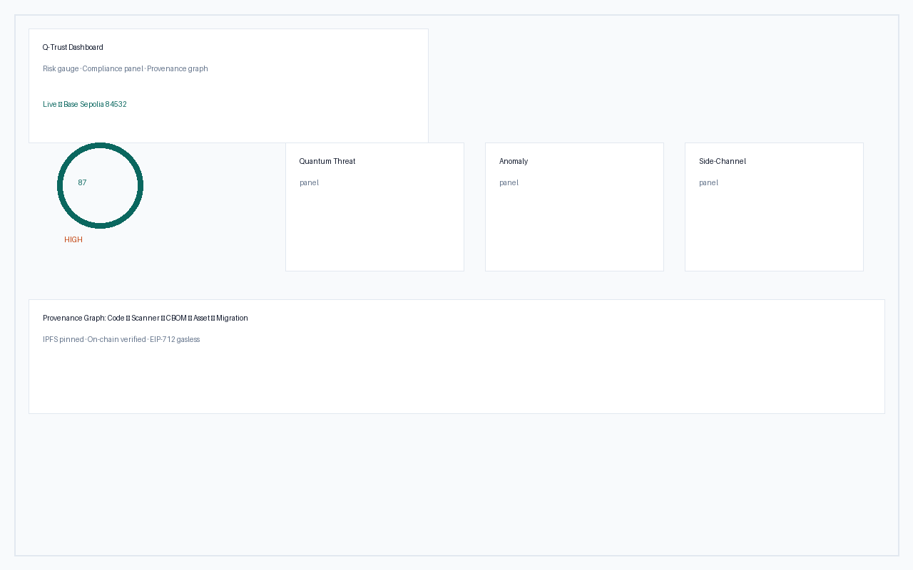

# Q-Trust

[](https://github.com/humoge7502/q-trust/actions/workflows/ci.yml)
[](https://humoge7502.github.io/q-trust)
[](https://github.com/humoge7502/q-trust/releases)
[](LICENSE)
[](https://github.com/humoge7502/q-trust/discussions)

**A post-quantum migration protocol for real cryptography estates**: scan your organization's cryptographic inventory, score it against NIST and CNSA 2.0 timelines, rank migration priority with a GNN planner, and anchor tamper-evident attestations on Base L2.

> **Status:** v2.1 — reference implementation with 7 CI pipelines, full local deployment via Docker, and a bank pilot demo. Contracts are **not yet deployed to a public network** and **no independent security audit has been performed**; see [§ Reality check](#reality-check) before evaluating for production.

---

## Why this exists

The migration deadline is already fixed by standards bodies, not by attackers:

- **NIST IR 8547** transitions US federal systems: RSA and ECC signatures disallowed after **2030–2035**; CNSA 2.0 pulls National Security Systems to ML-KEM/ML-DSA on an overlapping schedule.
- **Harvest-now-decrypt-later** makes the effective deadline for long-lived secrets *today*: traffic captured now can be decrypted once CRQC arrives.
- **EU NIS2 / FISMA / FedRAMP** increasingly expect a cryptographic bill of materials (CBOM) — you cannot migrate what you have not inventoried.

Every enterprise faces the same problem: crypto is scattered across TLS endpoints, source code, package manifests, binaries and configs — owned by different teams, with no shared evidence layer between vendors, auditors and customers. Q-Trust closes that loop: **discover → score → plan → attest**.

## How it works

```
┌────────────┐  CBOM   ┌──────────┐  priority  ┌────────────┐
│ inspector  │────────▶│ planner  │───────────▶│  backend   │
│ TLS/SSH/   │ CycloneDX│ GNN + RL │  roadmap  │ Fastify 5  │
│ src/binary │  1.7 +  │ ranking  │           │ indexer +  │
│ scanning   │  SARIF  └──────────┘           │  relayer   │
└────────────┘                     └─────┬──────┘
                                         │
        sdk (Python) ◀── verify / attest ┘
                    ▼
        ┌──────────────────────────┐
        │   Base L2 — 11 contracts │
        │   UUPS + timelock + EIP-712 │
        └──────────────────────────┘
```

Six independently deployable subsystems: `contracts/` (Foundry, 11 Solidity registries), `inspector/` (multi-language PQC scanner), `planner/` (PyTorch-Geometric migration planner), `backend/` (Fastify + viem indexer and gasless relayer), `sdk/` (Python client), `frontend/` (Next.js 16 dashboard).


*Live dashboard — risk gauge, compliance panel and provenance graph (public testnet data). See [docs/assets/](docs/assets/) — captured from the running stack.*

Full detail: [docs/ARCHITECTURE.md](docs/ARCHITECTURE.md)

## Measured results

| Capability | Result | Source |
|---|---|---|
| Migration ranking | Kendall τ **0.961** vs heuristic optimum (held-out) | `planner/results/benchmark.json` |
| API throughput | **147.8 req/s** @ 100 VUs, p95 **11.3 ms** (anvil, 24-core/A100) | `docs/PERFORMANCE.md` |
| Contract tests | **211** — unit + invariant (1000 runs) + fuzz + attack | `CHANGELOG.md` |
| Scanner languages | 12+ source languages, 10+ manifest formats | `inspector/` |
| Compliance rules | 7 frameworks (NIST 800-131A, CNSA 2.0, FIPS 140-3, NIS2, FISMA, FedRAMP, CMMC) | `inspector/qtrust_inspector/compliance.py` |

*(Full GPU benchmark methodology: [docs/GPU_FEATURES.md](docs/GPU_FEATURES.md), [docs/PERFORMANCE.md](docs/PERFORMANCE.md).)*

## Quick start

### 60 seconds: scan something real

```bash
git clone https://github.com/humoge7502/q-trust && cd q-trust/inspector
pip install -e .
# Scan a live TLS endpoint → CycloneDX 1.7 CBOM + risk + compliance report
crypto-inspector scan example.com --cyclonedx cbom.json --risk --compliance nist,cnsa
```

### 10 minutes: full stack on Docker

```bash
cp .env.example .env   # set REDIS_PASSWORD, POSTGRES_PASSWORD, GRAFANA_PASSWORD
docker compose up -d --build   # api, webhook, postgres, redis, planner, prometheus, grafana
./scripts/verify_all.sh        # 9-step full-stack verification
```

The frontend dashboard (`http://localhost:3000`) and the verification page (`/v/<asset-id>`) come up against the local stack.

<details><summary><b>Per-component development setup</b></summary>

```bash
# Contracts (Foundry)
cd contracts && forge test

# Planner (PyTorch Geometric)
cd planner && python -m qtrust_planner.train && python -m qtrust_planner.predict /tmp/bank_cbom.json

# SDK
pip install -e ./sdk && python -c "from qtrust import QTrustClient; print('OK')"

# Frontend (Next.js 16)
cd frontend && npm install && npm run dev
```

</details>

## What the scanner finds

| Module | Target | Detects |
|---|---|---|
| TLS / SSH | network endpoints | certificate algorithms, key sizes, host-key types, expiry |
| Source | 12+ languages | crypto API usage, hardcoded keys |
| Manifests | Cargo.toml, package.json, go.mod, pom.xml, … | crypto library dependencies |
| Binary | compiled artifacts | algorithm strings, OIDs |
| Config | YAML / TOML / JSON | cipher suites, crypto settings |
| Evidence | all findings | hash-chained, tamper-evident ledger |

Output formats: **CycloneDX 1.7 CBOM**, **SARIF 2.1** (GitHub Advanced Security), JSON risk/compliance reports, migration roadmap.

## On-chain layer (Base L2)

Eleven UUPS-upgradeable registries behind a 7-day timelock, with EIP-712 gasless submission paths for all write types. Highlights: `AssetRegistry` (CBOM commitments), `VendorRegistry` (PQC-readiness attestations), `MigrationRegistry` (migration steps), `AuditRegistry` (third-party audits), `EvidenceRegistry` (ledger-root anchoring), `RevocationAnchor` (Merkle-root revocation). Design decisions are recorded as [ADRs](docs/adr/) — start with [ADR-0002 (EIP-712 gasless relay)](docs/adr/0002-eip712-gasless-relay-all-writes.md) and [ADR-0003 (UUPS + timelock)](docs/adr/0003-uups-timelock-governance.md).

## GPU-accelerated analytics (optional)

On CUDA hardware (`QTRUST_GPU_ENABLED=true`): 100K-graph BF16 GNN training, timing side-channel analysis of PQC implementations (liboqs traces), Shor threat estimation, RL migration agent, GPU-batch risk scoring, CBOM anomaly detection. Checkpoints and methodology: [docs/GPU_FEATURES.md](docs/GPU_FEATURES.md).

```bash
make -f planner/Makefile.gpu help   # reproduces all GPU paths
```

## Reality check

Read this before trusting the stack with anything real:

- **No independent audit.** The contracts have never been reviewed by an external firm. Treat them as reference implementations.
- **No public deployment.** Registry addresses default to a local anvil chain; the Base Sepolia deployment is pending a funded key.
- **Relayer trust.** All gasless writes flow through a backend-held key; the timelock controller is currently administered by the deployer EOA.
- **Draft patent materials were removed** from the public docs site; contact the maintainers regarding IP before commercial reuse.

Found a security issue? Follow the [responsible-disclosure policy](SECURITY.md) — SLA: critical 48 h / high 72 h.

## Documentation

| Doc | What it covers |
|---|---|
| [Architecture](docs/ARCHITECTURE.md) | system design, data flow, trust model |
| [Whitepaper](docs/WHITEPAPER.md) | protocol specification and threat model |
| [Deployment guides](docs/deployment/) | Base Sepolia, multi-chain, go-live checklist |
| [Runbooks](docs/runbook/) | incident response, backup & restore |
| [ADRs](docs/adr/) | all 7 architecture decisions |
| [Performance](docs/PERFORMANCE.md) | k6 load tests, GPU latencies |
| [Case study](docs/case-studies/) | example.com TLS → CBOM → on-chain → verify |
| [CBOM Conformance](docs/CBOM_CONFORMANCE.md) | CycloneDX 1.7 mapping |
| [GPU Features](docs/GPU_FEATURES.md) | GPU analytics methodology |

Full docs site: **<https://humoge7502.github.io/q-trust>**

## Contributing & license

[CONTRIBUTING.md](CONTRIBUTING.md) covers the dev setup, pre-commit hooks and PR conventions. CI runs: Foundry (unit/invariant/fuzz/attack), pytest, vitest + Playwright, property tests (Hypothesis), npm audit + pip-audit, Halmos symbolic execution (report-only).

MIT — see [LICENSE](LICENSE).

---

### Prerequisites

| Requirement | Version | Install |
|---|---|---|
| Node.js | 20+ | `node --version` |
| Python | 3.10+ | `python3 --version` |
| Foundry | latest | `curl -L https://foundry.paradigm.xyz \| bash && foundryup` |
| Docker | 24+ | `docker --version` |
| Env | — | `cp .env.example .env` — see [.env.example](.env.example) |

### API Reference

Base URL `http://localhost:3001`. Auth `X-Api-Key` for write/relay routes. Full spec: [backend/openapi.yaml](backend/openapi.yaml) — live Swagger at `GET /docs`.

Core endpoints:

| Method | Endpoint | Description |
|---|---|---|
| `GET` | `/health` | health + chain_id + relayer |
| `POST` | `/v1/scan/source` | source crypto scan |
| `POST` | `/v1/risk/score` | quantum scoring |
| `GET` | `/v1/assets/{id}/verify` | on-chain verification |
| `POST` | `/v1/relay/cbom` | EIP-712 gasless CBOM registration |

See [backend/openapi.yaml](backend/openapi.yaml) for the full 38-endpoint surface.

### Security

Threat model in [SECURITY.md](SECURITY.md) and [docs/WHITEPAPER.md](docs/WHITEPAPER.md). **Do not** open public issues — use [GitHub Security Advisories](https://github.com/humoge7502/q-trust/security/advisories/new) or `security@q-trust.example`. Audited: `docs/Q-Trust_Codebase_Audit.pdf` (attached to the GitHub Release) — all Critical/High fixed with regressions in `contracts/test/AuditRemediations.t.sol`.
