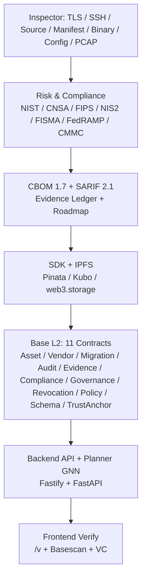
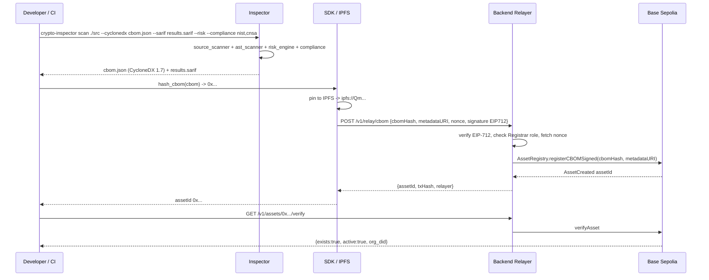

# Q-Trust — Enterprise PQC Migration Protocol

[](https://github.com/humoge7502/q-trust/actions/workflows/ci.yml)
[](https://humoge7502.github.io/q-trust)
[](https://github.com/humoge7502/q-trust/actions/workflows/security.yml)
[](https://github.com/humoge7502/q-trust/actions/workflows/pqc-scan.yml)
[](https://codecov.io/gh/humoge7502/q-trust)
[](https://sepolia.basescan.org/)
[](https://pypi.org/project/qtrust-sdk/)
[](backend/package.json)
[](LICENSE)
[](https://sepolia.base.org)

Audited · 211 Foundry tests · τ 0.961 GNN · 12 languages · Base L2

Enterprise scanning, risk scoring, compliance verification, GNN planning, and on-chain attestation for the post-quantum migration.

## Table of Contents

- [Overview](#overview)
- [Architecture](#architecture)
- [Prerequisites](#prerequisites)
- [Quick Start](#quick-start)
- [Usage](#usage)
- [On-Chain Contracts](#on-chain-contracts)
- [API Reference](#api-reference)
- [Security](#security)
- [Quality & Tests](#quality--tests)
- [Contributing](#contributing)
- [FAQ & Support](#faq--support)
- [License](#license)

## Overview

Q-Trust coordinates PQC migration across organizations: discover crypto assets, score quantum risk, check compliance, plan remediation, anchor evidence on Base L2, and verify with CycloneDX CBOM + W3C VCs. See [WHITEPAPER.md](docs/WHITEPAPER.md) for the full spec.

| Capability | Detail |
|---|---|
| Languages scanned | 12+ — Python, JS/TS, Go, Java, Rust, C/C++, C#, Ruby, PHP, Swift, Kotlin, Scala |
| Manifest formats | 10+ — `package.json`, `requirements.txt`, `Cargo.toml`, `go.mod`, `pom.xml`, `build.gradle`, `Gemfile`, `composer.json`, `pubspec.yaml`, `Package.swift`, `.csproj` |
| Compliance | NIST SP 800-131A, CNSA 2.0, FIPS 140-3, EU NIS2, FISMA, FedRAMP, CMMC |
| Outputs | CycloneDX 1.7 CBOM, SARIF 2.1, risk JSON, evidence ledger (hash-chained), roadmap |
| GNN planner | GCN+GAT, ListMLE, Kendall τ **0.961** (canonical held-out; see [planner/results/benchmark.json](planner/results/benchmark.json)) |
| Chain | Base Sepolia `84532` / Base Mainnet `8453` — 11 UUPS upgradeable contracts |

## Architecture

Five-layer design — full detail in [docs/ARCHITECTURE.md](docs/ARCHITECTURE.md).

| Layer | Components | Interface |
|---|---|---|
| 1. Inspector | TLS/SSH/source/manifest/binary/config/PCAP scanners, AST + regex | `qtrust_inspector` → `ScanResult` |
| 2. Risk & Compliance | `risk_engine`, `compliance` (7 frameworks), `conformance` (FIPS 203/204/205) | `RiskScore`, `ComplianceReport` |
| 3. Evidence & Output | `cyclonedx`, `sarif`, `evidence` (SHA-256 chain), `roadmap`, `remediation`, `k8s_policy` | CBOM JSON, SARIF, ledger |
| 4. SDK / Storage | `qtrust` Python SDK, `QTrustClient`, IPFS (Pinata/Kubo/web3.storage) | `hash_cbom` → `registerCBOMSigned` |
| 5. Base L2 + Frontend | 11 contracts + Fastify API + FastAPI planner + Next.js verifier | EIP-712 relay, Swagger `/docs` |





Dataflow: `crypto-inspector scan` → `ScanResult` → `cyclonedx`/`sarif`/`evidence` → `QTrustClient.hash_cbom` → IPFS → `POST /v1/relay/cbom` (EIP-712) → `AssetRegistry` → `planner /v1/plans` → `POST /v1/relay/migration` → `AuditRegistry` → `GET /v/:id` verify.

## Prerequisites

| Requirement | Version | Install |
|---|---|---|
| Node.js | 20+ | `node --version` |
| Python | 3.10+ | `python3 --version` |
| Foundry | latest | `curl -L https://foundry.paradigm.xyz \| bash && foundryup` |
| Docker | 24+ | `docker --version` |
| Env | — | `cp .env.example .env` — see [.env.example](.env.example) |

> Production requires `QTRUST_API_KEYS`, `QTRUST_BASE_SEPOLIA_RPC` (https), `QTRUST_RELAYER_PRIVATE_KEY`, contract addresses, `QTRUST_PG_URL`, `QTRUST_REDIS_URL`. Fail-closed defaults; see [SECURITY.md](SECURITY.md).

## Quick Start

### One-liner (compose — api + webhook + postgres + redis + planner + prometheus + grafana)

```bash
cp .env.example .env   # fill RPC, private key, POSTGRES_PASSWORD, REDIS_PASSWORD
docker compose up -d --build
# API http://127.0.0.1:3001  Swagger http://127.0.0.1:3001/docs  Frontend http://127.0.0.1:3000
# Planner http://127.0.0.1:8000  Prometheus http://127.0.0.1:9090  Grafana http://127.0.0.1:3002
docker compose logs -f api
```

`docker-compose.yml:14-38` binds Postgres/Redis to `127.0.0.1` only; healthchecks gate startup.

### Per-component fallback

```bash
# Contracts — 211 tests (invariant runs=1000, depth=100, fail_on_revert=true)
cd contracts && forge test -vvv           # forge coverage --report lcov --ir-minimum

# Inspector
cd inspector && pip install -e ".[dev,ml]" && pytest -v --cov=qtrust_inspector

# SDK
pip install -e ./sdk[dev] && pytest sdk/tests/ -v --cov=qtrust --hypothesis-profile ci

# Backend
cd backend && npm ci && npm run typecheck && npm run build && npm test

# Frontend
cd frontend && npm ci && npm run build   # NEXT_PUBLIC_QTRUST_API_URL=http://localhost:3001 npm start

# Planner
cd planner && pip install torch --index-url https://download.pytorch.org/whl/cpu -r requirements.txt
python -m qtrust_planner.benchmark --seeds 42 43 44   # writes planner/results/benchmark.json
python -m qtrust_planner.train && python -m qtrust_planner.predict /tmp/bank_cbom.json
```

## Usage

### CLI — scan with flags

```bash
# Universal: auto-detects host / directory / CIDR
crypto-inspector scan /path/to/project --cyclonedx cbom.json --sarif results.sarif --risk --compliance nist,cnsa --evidence ledger.json --roadmap plan.json
crypto-inspector scan example.com --cyclonedx host_cbom.json --evidence ledger.json --roadmap plan.json
crypto-inspector host example.com --ports 443,8443 --risk --compliance nist,cnsa,fips --cyclonedx out.json --sarif out.sarif
crypto-inspector directory ./src --source --manifests --binaries --ast --risk --cyclonedx cbom.json
crypto-inspector scan-source ./src -l python -f sarif -o findings.sarif --risk --compliance nist,cnsa
crypto-inspector pcap-scan capture.pcap --format auto --deep --top 10 -o pcap.json
crypto-inspector risk-score scan.json
crypto-inspector compliance-check scan.json -f nist,cnsa,fips
crypto-inspector evidence-verify ledger.json
```

| Flag | Effect |
|---|---|
| `--cyclonedx FILE` | CycloneDX 1.7 CBOM |
| `--sarif FILE` | SARIF 2.1 for GitHub code scanning |
| `--risk / --no-risk` | per-finding quantum/HNDL/risk_level |
| `--compliance LIST` | `nist,cnsa,fips,nis2,fisma,fedramp,cmmc,pci,bsi,ncsc,asd` |
| `--evidence FILE` | hash-chained ledger (SHA-256) |
| `--roadmap FILE` | 5-phase plan + cost (`--daily-rate 1500`) |
| `--source/--no-source --manifests/--no-manifests --binaries/--no-binaries --ast/--no-ast` | toggle detectors |
| `--detectors` | print `qtrust_inspector.ast_scanner.DETECTOR_CAPABILITIES` as JSON |

### CBOM 1.7 excerpt (`inspector/qtrust_inspector/cyclonedx.py:128`)

```json
{
  "bomFormat": "CycloneDX",
  "specVersion": "1.7",
  "serialNumber": "urn:uuid:3e2a...",
  "components": [{
    "type": "cryptographic-asset",
    "name": "tls_certificate:example.com:443",
    "quantumSafe": false,
    "cryptoProperties": {
      "assetType": "certificate",
      "algorithmProperties": { "name": "RSA", "scheme": "RSA-PKCS1-v1_5", "strength": "2048" }
    },
    "properties": [{ "name": "qtrust:criticality", "value": "high" }],
    "hashes": [{ "alg": "SHA-256", "content": "a3f5..." }]
  }]
}
```

### SARIF 2.1 snippet (`inspector/qtrust_inspector/sarif.py`)

```json
{
  "$schema": "https://json.schemastore.org/sarif-2.1.0.json",
  "version": "2.1.0",
  "runs": [{
    "tool": { "driver": { "name": "qtrust-inspector", "rules": [{ "id": "QC-CRYPTO-001", "name": "WeakAlgorithm" }] } },
    "results": [{ "ruleId": "QC-CRYPTO-001", "level": "error",
      "message": { "text": "RSA-1024 at src/auth.py:42 — BROKEN (Shor)" },
      "locations": [{ "physicalLocation": { "artifactLocation": { "uri": "src/auth.py" } } }] }]
  }]
}
```
Upload via `crypto-inspector scan-source . -f sarif -o results.sarif` → GitHub code scanning.

### SDK — registerCBOM + verify (`sdk/qtrust/client.py:147,225`)

```python
import json
from qtrust import QTrustClient
from qtrust.schema import CBOM

client = QTrustClient()  # reads QTRUST_BASE_SEPOLIA_RPC, QTRUST_DEPLOYER_PRIVATE_KEY, registry addrs

cbom = CBOM.model_validate(json.load(open("cbom.json")))
cbom_hash = QTrustClient.hash_cbom(cbom)          # deterministic SHA-256 over canonical JSON
asset_id = client.register_cbom_hash(cbom_hash, metadata_uri="ipfs://Qm...")  # direct (needs relayer key)
print(f"asset_id={asset_id}")

# Gasless (no gas needed — relayer submits):
# 1) GET /v1/relay/cbom-nonce/<yourAddr> -> nonce
# 2) client.sign_cbom_registration(cbom_hash, metadata_uri, nonce) -> EIP-712 sig
# 3) POST /v1/relay/cbom {cbomHash, metadataURI, nonce, signature}

exists, active, org_did = client.verify_asset(asset_id)
assert exists and active
rec = client.get_asset(asset_id)
print(rec.cbom_hash, rec.metadata_uri)

# Risk & compliance locally
from qtrust_inspector.risk_engine import calculate_risk_score
from qtrust_inspector.compliance import ComplianceEngine, ComplianceFramework
# calculate_risk_score(finding) -> {quantum_vulnerability, nist_800_131a_compliant, hndl_exposure_score, risk_level}
```

### GNN Planner (`planner/qtrust_planner`)

```bash
# Train (CPU; GPU auto when QTRUST_DEVICE=auto + nvidia runtime)
python -m qtrust_planner.train              # writes planner/model.pt
python -m qtrust_planner.benchmark --seeds 42 43 44   # -> planner/results/benchmark.json
python -m qtrust_planner.benchmark_v3       # -> planner/results/benchmark_v3.json (v2 vs v3)

# Predict locally
python -m qtrust_planner.predict /tmp/bank_cbom.json
# {"plan":[{"asset":"tls:rsa2048","priority":1,"risk":92,"action":"replace with ML-KEM-768"}]}

# Via backend proxy (requires QTRUST_PLANNER_API_KEY in prod)
curl -s http://localhost:3001/v1/plans \
  -H "Content-Type: application/json" \
  -H "X-Api-Key: $QTRUST_API_KEYS" \
  -d '{"cbom":{"assets":[{"algorithm":"RSA","key_size":2048,"criticality":"high"}]}}' | jq
```

Measured on A100-SXM4-80GB — see [docs/PERFORMANCE.md](docs/PERFORMANCE.md) and [docs/GPU_FEATURES.md](docs/GPU_FEATURES.md):

| Checkpoint | τ (canonical) | Scale |
|---|---|---|
| GNN v2 `planner/model.pt` | **0.961** | held-out Kendall (ListMLE) |
| GNN v3 `planner/model_gpu_v3.pt` | 0.898 | 100K graphs, BF16 |
| RL `planner/rl_agent.pt` | +6.24 mean reward (10K eps, vs −8.6 untrained) | — |
| Side-channel | clean 0.05 `VERIFIED` → leaky 0.95 `HIGH_RISK` | calibrated |
| `make -f Makefile.gpu help` reproduces all GPU paths. |

Ranking uses corrected per-node Kendall (see [CHANGELOG.md](CHANGELOG.md) Unreleased — prior ~0.5 understated due to index-correlation bug; heuristic upper bound 1.00).

## On-Chain Contracts

11 Solidity 0.8.24, UUPS (`ERC1967Proxy`), `AccessControl`, 2-day `TimelockController` via `QTrustGovernance`. EIP-712 domain per `block.chainid`, sequential nonces, `whenNotPaused` on all writes. See `contracts/src/`.

| Contract | Purpose | Explorer (Base Sepolia `84532`) |
|---|---|---|
| AssetRegistry | CBOM hash registration, `registerCBOMSigned` | `https://sepolia.basescan.org/address/<QTRUST_ASSET_REGISTRY_ADDRESS>` |
| VendorRegistry | PQC attestations per product/version/algorithm | `…/<QTRUST_VENDOR_REGISTRY_ADDRESS>` |
| MigrationRegistry | `fromAlgo→toAlgo` steps, asset-existence check | `…/<QTRUST_MIGRATION_REGISTRY_ADDRESS>` |
| AuditRegistry | auditor attestations (Pass/Fail/Conditional) | `…/<QTRUST_AUDIT_REGISTRY_ADDRESS>` |
| EvidenceRegistry | evidence batch-root anchoring | `…/<QTRUST_EVIDENCE_REGISTRY_ADDRESS>` |
| ComplianceAttestation | compliance score attestation (O(1) latest pointer) | `…/<QTRUST_COMPLIANCE_ATTESTATION_ADDRESS>` |
| TrustAnchorRegistry | issuer accreditation | `…/<QTRUST_TRUST_ANCHOR_REGISTRY_ADDRESS>` |
| RevocationAnchor | Merkle revocation roots | `…/<QTRUST_REVOCATION_ANCHOR_ADDRESS>` |
| PolicyCommitment | versioned policy hashes | `…/<QTRUST_POLICY_COMMITMENT_ADDRESS>` |
| SchemaRegistry | CBOM/VC schemas + equivalence | `…/<QTRUST_SCHEMA_REGISTRY_ADDRESS>` |
| QTrustGovernance | timelock admin, `schedule*On` for all 10 registries | `…/<QTRUST_GOVERNANCE_ADDRESS>` |

Deploy: `forge script script/Deploy.s.sol --rpc-url $QTRUST_BASE_SEPOLIA_RPC --broadcast` then fill addresses in [.env.example](.env.example). Verify: `forge verify-contract --chain-id 84532 --verifier etherscan --verifier-url https://api-sepolia.basescan.org/api <addr> src/<Name>.sol:<Name>` (CI does this on `push` to `main` when `DEPLOYED_PROXY_ADDRESSES` is set — `.github/workflows/ci.yml:34`).

## API Reference

Base URL `http://localhost:3001` (prod via `QTRUST_BASE_SEPOLIA_RPC`). Auth `X-Api-Key: <key>` for all `/v1/write/*`, `/v1/relay/*`, `/v1/credentials/issue`, `/v1/webhooks/*` (fail-closed in prod when `QTRUST_API_KEYS` unset). Pagination `?offset=0&limit=50` (max 200) on list endpoints. Full spec: [backend/openapi.yaml](backend/openapi.yaml) — live Swagger at `GET /docs` (`/docs/json`).

| Method | Endpoint | Description | Auth |
|---|---|---|---|
| `GET` | `/health` | health + `chain_id` + `relayer` | — |
| `POST` | `/v1/scan/source` | source crypto scan | — |
| `POST` | `/v1/scan/full` | full target scan (all probes) | — |
| `POST` | `/v1/risk/score` | per-finding quantum/HNDL scoring | — |
| `POST` | `/v1/compliance/evaluate` | single-framework check | — |
| `GET` | `/v1/assets/{id}` | CBOM asset by `0x`32-byte id | — |
| `GET` | `/v1/assets/{id}/verify` | on-chain existence/active/chain | — |
| `GET` | `/v1/orgs/{did}/summary` | indexer-backed org summary | — |
| `POST` | `/v1/write/assets` | admin `registerCBOM` (relayer) | `X-Api-Key` |
| `POST` | `/v1/relay/cbom` | EIP-712 gasless CBOM registration | `X-Api-Key` |
| `GET` | `/v1/relay/cbom-nonce/{did}` | org nonce for EIP-712 | — |
| `POST` | `/v1/evaluate` | policy-based PQC readiness (`confidence` 0–1) | — |

Additional endpoints (38 total): `POST /v1/scan/manifests`, `/v1/risk/summary`, `/v1/compliance/full-report`, `/v1/evidence/create` (API-key, 5/min), `/v1/evidence/verify`, `/v1/roadmap/generate`, `/v1/stats`, `/v1/orgs/{did}/assets|migrations|audit`, `/v1/migrations/{id}`, `/v1/vendors/{did}/attestations`, `/v1/products/{id}/support`, `POST /v1/plans`, `GET /v1/plans/{did}`, `/v1/write/attestations|migrations`, `/v1/relay/attestation|migration|audit` (+ nonce reads), `/v1/credentials/issue|verify`, `/v1/revocation/{issuer}`, `/v1/policies/{policyId}/versions/{version}`, `/v1/schemas/{schemaId}`, `/v1/trust-anchors/{issuer}`, `/v1/webhooks/subscribe|unsubscribe|subscribers` — see [backend/openapi.yaml](backend/openapi.yaml) + `backend/src/server.ts:1-60`.

Example — gasless CBOM via API:

```bash
NONCE=$(curl -s http://localhost:3001/v1/relay/cbom-nonce/0xYourAddr | jq -r .nonce)
# sign EIP-712 typed data with eth_account (domain: Q-Trust, chainId 84532) -> $SIG
curl -s http://localhost:3001/v1/relay/cbom \
  -H "Content-Type: application/json" -H "X-Api-Key: $QTRUST_API_KEYS" \
  -d "{\"cbomHash\":\"0x...\",\"metadataURI\":\"ipfs://Qm...\",\"nonce\":$NONCE,\"signature\":\"$SIG\"}" | jq
```

Rate limits: global 120/min/IP (env `QTRUST_RATE_LIMIT_MAX`; see [docs/PERFORMANCE.md](docs/PERFORMANCE.md) — 147.8 req/s @100 VUs, p95 11.3 ms), per-route 30/min on writes, planner `POST /v1/plans` proxied with `X-Api-Key: QTRUST_PLANNER_API_KEY`.

## Security

Threat model (see [SECURITY.md](SECURITY.md) and [docs/WHITEPAPER.md:10](docs/WHITEPAPER.md)):

| Adversary | Capability | Mitigation |
|---|---|---|
| Quantum | Shor breaks RSA/ECC | crypto classifier + CNSA 2.0 / NIST scoring, HNDL exposure |
| Malicious CBOM | false inventory | canonical JSON hash, IPFS pinning, on-chain CBOM hash |
| Registry compromise | mutate state | UUPS + 2-day timelock (`QTrustGovernance`), `AccessControl`, pausable |
| Relayer griefing | waste gas | API-key gate on `/v1/relay/*`, on-chain role pre-check, per-route rate limit |
| Replay | reuse EIP-712 sig | domain-separated typed hash + per-address sequential nonce |
| Reorg | orphaned events | indexer reorg detection + backfill |
| Secret leak | exfiltrate keys | Sentry `beforeSend` scrubs `x-api-key`/cookies/bodies/64-hex keys, webhook secrets encrypted at rest (`QTRUST_WEBHOOK_ENC_KEY`), SSRF DNS pinning |

Audited: external audit `docs/Q-Trust_Codebase_Audit.pdf` — all Critical/High fixed with regressions in `contracts/test/AuditRemediations.t.sol`; Slither (`--filter-paths lib/openzeppelin-contracts`, `fail-on: high`), Semgrep, CodeQL, `pip-audit` in `.github/workflows/security.yml`; `forge verify-contract` on main.

Disclosure: **do not** open public issues. Use [GitHub Security Advisories](https://github.com/security/advisories/new) or email `security@q-trust.example` (encrypt via `/.well-known/security.txt`). SLAs: Critical 48h triage / 7d fix, High 72h / 14d — per [SECURITY.md](SECURITY.md).

## Quality & Tests

```bash
./scripts/verify_all.sh              # full stack
forge test -vvv                       # contracts (211)
pytest sdk/tests/ -v --hypothesis-profile ci
pytest inspector/tests/ -v
pytest planner/tests/ -v              # GNN + RL + benchmark protocol regression
npm --prefix backend test             # vitest (scanner, relay, gpu, indexer)
npm --prefix frontend exec -- npx playwright test --project=desktop-chromium
```

| Suite | Runner | Coverage / Gate |
|---|---|---|
| Contracts | `forge test` — 211 tests, `runs=1000 depth=100 fail_on_revert=true` invariants + Hypothesis | `forge coverage --report lcov --ir-minimum` → Codecov |
| SDK | `pytest sdk/tests/` — 19 Hypothesis property tests (CBOM determinism, VC tamper, DID grammar) | `pytest-cov` → Codecov |
| Inspector | `pytest inspector/tests/` — benchmark corpus precision/recall gate, Hypothesis | `pytest-cov` → Codecov |
| Planner | `pytest planner/tests/` — `test_benchmark_protocol.py` cross-validates `benchmark.score_order` vs `train_gpu.compute_metrics` | — |
| Backend | `vitest run` — scanner, `indexer.test.ts` (H-6 unsubscription), `secret-box.test.ts` (H-5 fail-closed) | `vitest --coverage` |
| Frontend | Playwright + axe-core wcag2a/2aa | — |

Coverage and verified contracts: Codecov badge above (contracts + SDK + inspector lcov), Basescan verification job `.github/workflows/ci.yml:34`, ABI drift gate `abi-drift` (`python3 scripts/generate_abis.py` + `git diff --exit-code backend/src/lib/abis.ts sdk/qtrust/contracts.py`), model integrity `models.sha256` + `scripts/verify_models.sh`.

## Contributing

See [CONTRIBUTING.md](CONTRIBUTING.md) and [CODEOWNERS](.github/CODEOWNERS). Prerequisites in [Prerequisites](#prerequisites).

```bash
git checkout -b feature/my-feature
# ... edit, add tests ...
ruff check . && forge build && npm run typecheck
git commit -m "feat: ..." && gh pr create
```

ADRs `docs/adr/`, runbooks `docs/runbook/`, go-live checklist `docs/GO_LIVE_CHECKLIST.md`.

Maintainers: Q-Trust Protocol (`dev@qtrust.dev`) — see `pyproject.toml` authors.

## FAQ & Support

**Which CBOM spec?** CycloneDX 1.7 with `cryptoProperties` — conformance mapping in [docs/CBOM_CONFORMANCE.md](docs/CBOM_CONFORMANCE.md), honest `detector` labels (`ast-python`/`tree-sitter`/`regex-fallback`).

**Does it need a wallet?** No for reads/verification. Writes use EIP-712 gasless relay — vendors sign off-chain, relayer pays gas. Direct writes require `X-Api-Key`.

**Planner without GPU?** Yes — heuristic fallback when `model.pt` missing. GPU (`QTRUST_GPU_ENABLED=true`, `/v1/gpu/*`, `make -f Makefile.gpu help`) adds large-scale GNN BF16, side-channel CNN, anomaly VAE, RL agent.

**Benchmark numbers?** `planner/results/benchmark.json` (canonical) and `planner/results/benchmark_v3.json` (v2 vs v3) — refreshed 2026-08-26 after Kendall fix; see [CHANGELOG.md](CHANGELOG.md).

**Docs site?** `mkdocs.yml` (Material) at https://humoge7502.github.io/q-trust — `.github/workflows/docs.yml`.

Support: [Discussions](https://github.com/humoge7502/q-trust/discussions) · [Issues](https://github.com/humoge7502/q-trust/issues) · [CHANGELOG.md](CHANGELOG.md) · `docs/case-studies/CASE_STUDY_EXAMPLE_COM.md` (scan→CBOM→on-chain→verify on local chain 84532).

## License

MIT — Copyright (c) 2024 Q-Trust Contributors. See [LICENSE](LICENSE).

